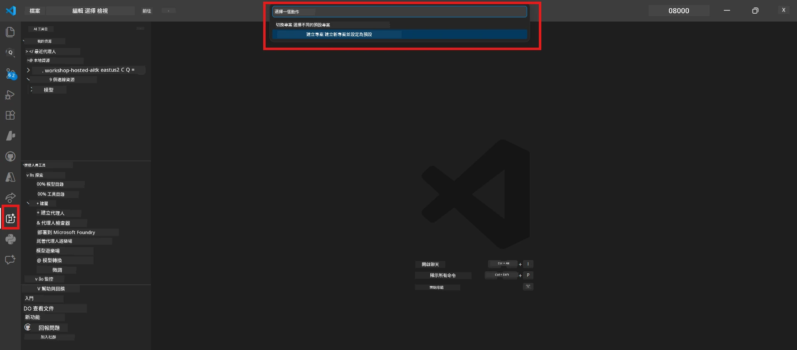

# 模組 0 - 預備條件

在開始實驗室 02 之前，請確認您已完成以下事項。本實驗室直接建立在實驗室 01 之上，請勿跳過。

---

## 1. 完成實驗室 01

實驗室 02 假設您已經：

- [x] 完成 [實驗室 01 - 單一代理](../../lab01-single-agent/README.md) 的所有 8 個模組
- [x] 成功將單一代理部署到 Foundry 代理服務
- [x] 驗證代理在本機代理檢查器和 Foundry 操作台均可運作

如果您尚未完成實驗室 01，請返回並完成它：[實驗室 01 文件](../../lab01-single-agent/docs/00-prerequisites.md)

---

## 2. 驗證現有設定

實驗室 01 的所有工具應仍已安裝並正常運作。請執行下列快速檢查：

### 2.1 Azure CLI

```powershell
az account show --query "{name:name, id:id}" --output table
```

預期結果：顯示您的訂閱名稱和 ID。如果失敗，請執行 [`az login`](https://learn.microsoft.com/cli/azure/authenticate-azure-cli-interactively)。

### 2.2 VS Code 擴充功能

1. 按 `Ctrl+Shift+P` → 輸入 **"Microsoft Foundry"** → 確認您看到命令（例如 `Microsoft Foundry: Create a New Hosted Agent`）。
2. 按 `Ctrl+Shift+P` → 輸入 **"Foundry Toolkit"** → 確認您看到命令（例如 `Foundry Toolkit: Open Agent Inspector`）。

### 2.3 Foundry 專案與模型

1. 點擊 VS Code 側邊欄的 **Microsoft Foundry** 圖示。
2. 確認您的專案已列出（例如 `workshop-agents`）。
3. 展開專案 → 驗證有已部署的模型（例如 `gpt-4.1-mini`），狀態為 **Succeeded**。

> **如果您的模型部署已過期：** 部分免費層部署會自動過期。請從 [模型目錄](https://learn.microsoft.com/azure/foundry/foundry-models/concepts/models-sold-directly-by-azure) 重新部署（`Ctrl+Shift+P` → **Microsoft Foundry: Open Model Catalog**）。



### 2.4 RBAC 角色

確認您在 Foundry 專案中擁有 **Azure AI User** 角色：

1. 進入 [Azure 入口網站](https://portal.azure.com) → 您的 Foundry <strong>專案</strong> 資源 → **存取控制 (IAM)** → **[角色指派](https://learn.microsoft.com/azure/foundry/concepts/rbac-foundry)** 標籤。
2. 搜尋您的名稱 → 確認已列出 **[Azure AI User](https://aka.ms/foundry-ext-project-role)**。

---

## 3. 瞭解多代理概念（實驗室 02 新增）

實驗室 02 引入了在實驗室 01 未涵蓋的概念。請先閱讀以下內容：

### 3.1 什麼是多代理工作流程？

不是由單一代理處理所有事務，<strong>多代理工作流程</strong> 將工作分配給多個專門的代理。每個代理都有：

- 自己的 <strong>指令</strong>（系統提示）
- 自己的 <strong>角色</strong>（負責的職責）
- 可選的 <strong>工具</strong>（可調用的函數）

這些代理透過一個定義資料流動方式的 <strong>編排圖</strong> 來溝通。

### 3.2 WorkflowBuilder

`agent_framework` 中的 [`WorkflowBuilder`](https://learn.microsoft.com/agent-framework/workflows/agents-in-workflows) 類別是連接代理的 SDK 組件：

```python
from agent_framework import WorkflowBuilder

workflow = (
    WorkflowBuilder(
        name="MyWorkflow",
        start_executor=agent_a,
        output_executors=[agent_d],
    )
    .add_edge(agent_a, agent_b)
    .add_edge(agent_a, agent_c)
    .add_edge(agent_b, agent_d)
    .add_edge(agent_c, agent_d)
    .build()
)
```

- **`start_executor`** - 接收用戶輸入的首個代理
- **`output_executors`** - 輸出作為最終回應的代理
- **`add_edge(source, target)`** - 定義 `target` 接收 `source` 的輸出

### 3.3 MCP（模型上下文協議）工具

實驗室 02 使用一個 **MCP 工具**，該工具調用 Microsoft Learn API 以獲取學習資源。[MCP（模型上下文協議）](https://modelcontextprotocol.io/introduction) 是一個用於讓 AI 模型連接外部數據源和工具的標準化協議。

| 術語 | 定義 |
|------|-----------|
| **MCP 伺服器** | 透過 [MCP 協議](https://learn.microsoft.com/azure/foundry/agents/how-to/tools/model-context-protocol) 提供工具/資源的服務 |
| **MCP 用戶端** | 連接 MCP 伺服器並調用其工具的代理代碼 |
| **[可串流 HTTP](https://learn.microsoft.com/agent-framework/agents/tools/hosted-mcp-tools)** | 用於與 MCP 伺服器通訊的傳輸方式 |

### 3.4 實驗室 02 與實驗室 01 的差異

| 方面 | 實驗室 01（單一代理） | 實驗室 02（多代理） |
|--------|----------------------|---------------------|
| 代理數量 | 1 | 4（專門角色） |
| 編排 | 無 | WorkflowBuilder（並行 + 順序） |
| 工具 | 選用的 `@tool` 函數 | MCP 工具（外部 API 調用） |
| 複雜度 | 簡單提示 → 回應 | 履歷 + 職位說明 → 適合度評分 → 路線圖 |
| 上下文流 | 直接 | 代理間接續傳遞 |

---

## 4. Lab 02 的工作坊倉庫結構

確保您知道 Lab 02 文件的位置：

```
workshop/
└── lab02-multi-agent/
    ├── README.md                       ← Lab overview
    ├── docs/                           ← You are here
    │   ├── README.md                   ← Learning path index
    │   ├── 00-prerequisites.md         ← This file
    │   ├── 01-understand-multi-agent.md
    │   ├── ...
    │   └── 08-troubleshooting.md
    └── PersonalCareerCopilot/          ← The agent project
        ├── agent.yaml                  ← Agent definition
        ├── main.py                     ← 4-agent workflow code
        ├── Dockerfile                  ← Container configuration
        └── requirements.txt            ← Python dependencies
```

---

### 檢查點

- [ ] 實驗室 01 完全完成（所有 8 個模組，代理已部署且驗證）
- [ ] `az account show` 回傳您的訂閱
- [ ] 已安裝並啟用 Microsoft Foundry 與 Foundry Toolkit 擴充功能
- [ ] Foundry 專案有已部署的模型（例如 `gpt-4.1-mini`）
- [ ] 您在專案上擁有 **Azure AI User** 角色
- [ ] 已閱讀以上多代理概念章節，並理解 WorkflowBuilder、MCP 及代理編排

---

**下一步：** [01 - 瞭解多代理架構 →](01-understand-multi-agent.md)

---

<!-- CO-OP TRANSLATOR DISCLAIMER START -->
**免責聲明**：  
本文件已使用 AI 翻譯服務 [Co-op Translator](https://github.com/Azure/co-op-translator) 進行翻譯。雖然我們努力追求準確性，但請注意自動翻譯可能包含錯誤或不準確之處。原始文件的原文版本應被視為權威來源。對於重要資訊，建議採用專業人工翻譯。我們不對因使用本翻譯而引起的任何誤解或誤譯承擔責任。
<!-- CO-OP TRANSLATOR DISCLAIMER END -->