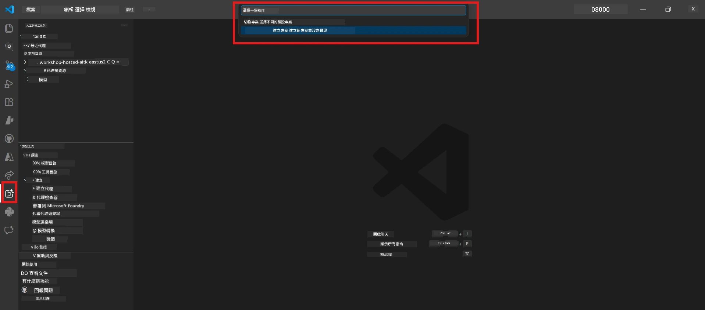

# 模組 0 - 介紹

⏱️ 約 10 分鐘

> [!WARNING]
> **預覽版及限制：** [Hosted Agents](https://learn.microsoft.com/azure/foundry/agents/concepts/hosted-agents) 目前處於 <strong>公開預覽</strong> 階段，不建議用於生產工作負載。本工作坊展示的部分功能，可能會隨服務走向 GA 時有所變動。

## 你將建立的內容

在這個實驗中，你將從實驗 01 的單代理技能擴展，建構一個 <strong>多代理工作流程</strong> — 簡歷 → 職位適配評估器。

你貼上 <strong>簡歷</strong> 和 <strong>職務描述</strong>。四個專門代理依序處理輸入，然後返回：
- 適配分數（0–100，含分數細項）
- 技能與證照差距清單
- 針對每項差距提供包含真實 Microsoft Learn 連結的個人化學習路線圖

**工作流程使用：**
- **Microsoft Agent Framework** - 使用 `WorkflowBuilder` 進行順序管線編排
- **Foundry Toolkit for VS Code** - 建置骨架、本機測試、部署
- **一個 AI 模型**（例如：`gpt-4.1-mini`） - 由四個代理共用
- **Microsoft Learn MCP 服務器** - 為每個技能差距提供真實的學習資源連結

---

## 選擇你的路徑

> ⚠️ **請繼續使用你在實驗 01 中所選的路徑。**

<details open>
<summary><strong>🅰️ 路徑 A - Azure 雲端（需要 Azure 訂閱）</strong></summary>

| | 詳情 |
|---|---|
| **適合對象？** | 你已使用 Azure 訂閱完成實驗 01 |
| <strong>模型</strong> | 透過 Foundry 使用 Azure OpenAI (如 `gpt-4.1-mini`) |
| <strong>涵蓋模組</strong> | 全部模組（00–09） |
| **部署至雲端？** | ✅ 是 - 完整端到端部署 |

</details>

<details open>
<summary><strong>🅱️ 路徑 B - Foundry 本地端（不需 Azure 訂閱）</strong></summary>

| | 詳情 |
|---|---|
| **適合對象？** | 你已使用 Foundry Local 完成實驗 01 |
| <strong>模型</strong> | Foundry Local（免費，運行於你電腦上） |
| <strong>涵蓋模組</strong> | 模組 00–05（跳過 06–07：部署與雲端確認） |
| **部署至雲端？** | ❌ 不 - 僅透過代理檢查器本地測試 |

</details>

---

## 實驗 01 檢查

實驗 02 直接建構於實驗 01。請先完成實驗 01 再從這裡開始。

還沒做過實驗 01 嗎？從這裡開始：[Lab 01 - Introduction](../../lab01-single-agent/docs/00-prerequisites.md)

<details open>
<summary><strong>🅰️ 路徑 A - Azure 雲端</strong></summary>

```powershell
az account show --query "{name:name, id:id}" --output table
```

若失敗，請執行 `az login`。再於 VS Code 確認：

1. 按 `Ctrl+Shift+P` → 輸入 **Foundry Toolkit** → 確認有出現相關命令。
2. 點擊 **Foundry Toolkit** 圖示 → 確認你的專案和已部署模型顯示 **Succeeded**。



> **RBAC:** 你在實驗 01 內已指定 **Foundry User**。若需重新指派，請參考 [Lab 01, Module 1](../../lab01-single-agent/docs/01-setup.md#deploy-a-model--assign-rbac)。此角色之前名為 **Azure AI User**，權限相同。

</details>

<details open>
<summary><strong>🅱️ 路徑 B - Foundry 本地端</strong></summary>

```powershell
Invoke-WebRequest -Uri "http://localhost:5273/v1/health" -UseBasicParsing | Select-Object StatusCode
```

預期結果：`StatusCode: 200`。若否，請從 Foundry Toolkit 側欄重新啟動 Foundry Local。

> 所有推論均在你的機器上執行。唯一外呼為 MCP 工具至 `https://learn.microsoft.com/api/mcp`。

</details>

---

## 實驗 02 新功能

| | 實驗 01 | 實驗 02 |
|--|--------|--------|
| 代理數量 | 1 | 4 （用 WorkflowBuilder 鏈接） |
| 骨架範本 | 基本 - Agent Framework | 工作流程 - Agent Framework |
| 新套件 | - | `mcp` |
| 編排方式 | 單一對話代理 | 順序管線（WorkflowBuilder） |
| 新工具 | - | `search_microsoft_learn_for_plan`（MCP） |

---

**下一步：** [01 - 了解架構 →](01-understand-multi-agent.md)

---

<!-- CO-OP TRANSLATOR DISCLAIMER START -->
**免責聲明**：
本文件使用 AI 翻譯服務 [Co-op Translator](https://github.com/Azure/co-op-translator) 進行翻譯。雖然我們力求準確，但請注意，自動翻譯可能包含錯誤或不準確之處。原始文件的母語版本應被視為權威來源。對於重要資訊，建議尋求專業人工翻譯。我們不對因使用本翻譯而引起的任何誤解或曲解承擔責任。
<!-- CO-OP TRANSLATOR DISCLAIMER END -->