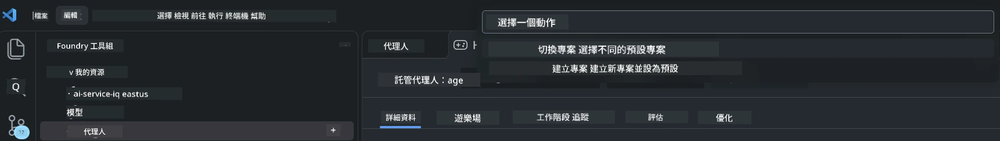

# 模組 0 - 介紹

⏱️ 約 10 分鐘

> [!WARNING]
> **預覽與限制：** [Hosted Agents](https://learn.microsoft.com/azure/foundry/agents/concepts/hosted-agents) 目前處於 <strong>公開預覽</strong> 階段 - 不建議用於生產工作負載。本工作坊中展示的某些功能可能會隨服務邁向正式發布而改變。

## 你將建構的內容

在本實驗中，你將擴展 Lab 01 中的單一代理技能，打造一個 <strong>多代理工作流程</strong> - 履歷表 → 職位適配評估器。

你將貼上 <strong>履歷表</strong> 及 <strong>職位描述</strong>。四個專門的代理將依序處理輸入，然後回傳：
- 一個適配分數（0–100 分，包含分數明細）
- 技能及認證缺口清單
- 針對每項缺口的個人化學習路線圖，附上 Microsoft Learn 的實際連結

**工作流程會使用：**
- **Microsoft 代理框架** - `WorkflowBuilder` 用以執行順序管線協調
- **Foundry Toolkit for VS Code** - 建立框架、在本機測試與部署
- **一個 AI 模型** (例如 `gpt-4.1-mini`) - 由所有四個代理使用
- **Microsoft Learn MCP 伺服器** - 為每個技能差距提供真實的學習資源連結

---

## 選擇你的路徑

> ⚠️ **請繼續使用你在實驗 01 中使用的路徑。**

<details open>
<summary><strong>🅰️ 路徑 A - Azure 雲端 (需要 Azure 訂閱)</strong></summary>

| | 詳細資料 |
|---|---|
| **適合誰？** | 你完成了使用 Azure 訂閱的實驗 01 |
| <strong>模型</strong> | 透過 Foundry 使用 Azure OpenAI (例如 `gpt-4.1-mini`) |
| <strong>涵蓋模組</strong> | 全部模組 (00–09) |
| **部署到雲端？** | ✅ 是 - 完整端到端部署 |

</details>

<details open>
<summary><strong>🅱️ 路徑 B - Foundry Local (不需要 Azure 訂閱)</strong></summary>

| | 詳細資料 |
|---|---|
| **適合誰？** | 你完成了使用 Foundry Local 的實驗 01 |
| <strong>模型</strong> | Foundry Local (免費，在你的機器上執行) |
| <strong>涵蓋模組</strong> | 模組 00–05 (跳過 06–07 - 部署及雲端驗證) |
| **部署到雲端？** | ❌ 否 - 僅限於透過 Agent Inspector 進行本地測試 |

</details>

---

## 實驗 01 檢查

實驗 02 是直接建立在實驗 01 之上。請先完成實驗 01 再從這開始。

還沒做過實驗 01？從這裡開始：[實驗 01 - 介紹](../../lab01-single-agent/docs/00-prerequisites.md)

<details open>
<summary><strong>🅰️ 路徑 A - Azure 雲端</strong></summary>

```powershell
az account show --query "{name:name, id:id}" --output table
```

如果失敗，請執行 `az login`。然後在 VS Code 中驗證：

1. `Ctrl+Shift+P` → 輸入 **Foundry Toolkit** → 確認命令出現。
2. 點擊 **Foundry Toolkit** 圖標 → 你的專案及已部署模型顯示 **Succeeded**。



> **RBAC:** 你在實驗 01 中指派了 **Foundry User**。如果需要重新指派，請參閱 [實驗 01，模組 1](../../lab01-single-agent/docs/01-setup.md#deploy-a-model--assign-rbac)。該角色之前稱為 **Azure AI User** - 擁有相同權限。

</details>

<details open>
<summary><strong>🅱️ 路徑 B - Foundry Local</strong></summary>

```powershell
Invoke-WebRequest -Uri "http://localhost:5273/v1/health" -UseBasicParsing | Select-Object StatusCode
```

預期輸出：`StatusCode: 200`。如果不是，請從 Foundry Toolkit 側邊欄重新啟動 Foundry Local。

> 所有推論均在你的機器上執行。唯一的外發呼叫是 MCP 工具至 `https://learn.microsoft.com/api/mcp`。

</details>

---

## 實驗 02 有什麼新東西

| | 實驗 01 | 實驗 02 |
|--|--------|--------|
| 代理 | 1 | 4 (透過 WorkflowBuilder 鏈接) |
| 骨架範本 | 基本 - 代理框架 | 工作流程 - 代理框架 |
| 新套件 | - | `mcp` |
| 編排 | 單一會話代理 | 連續管線 (WorkflowBuilder) |
| 新工具 | - | `search_microsoft_learn_for_plan` (MCP) |

---

**下一步：** [01 - 了解架構 →](01-understand-multi-agent.md)

---

<!-- CO-OP TRANSLATOR DISCLAIMER START -->
**免責聲明**：
本文件使用 AI 翻譯服務 [Co-op Translator](https://github.com/Azure/co-op-translator) 進行翻譯。雖然我們力求準確，但請注意，自動翻譯可能包含錯誤或不準確之處。原始文件的母語版本應被視為權威來源。對於重要資訊，建議尋求專業人工翻譯。我們不對因使用本翻譯而引起的任何誤解或曲解承擔責任。
<!-- CO-OP TRANSLATOR DISCLAIMER END -->