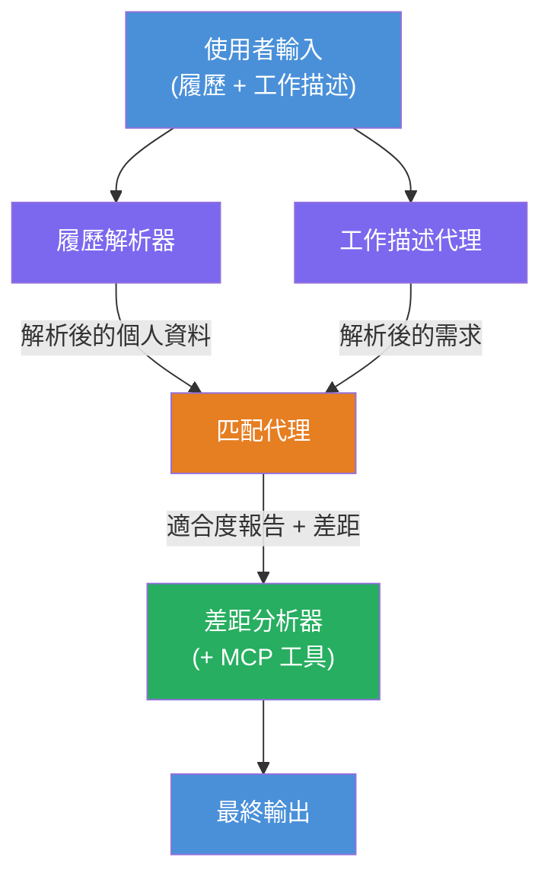
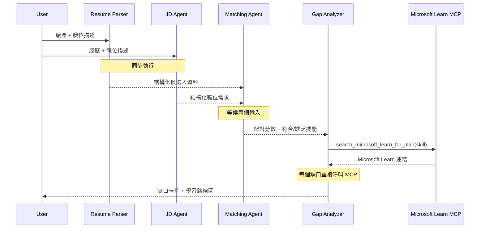
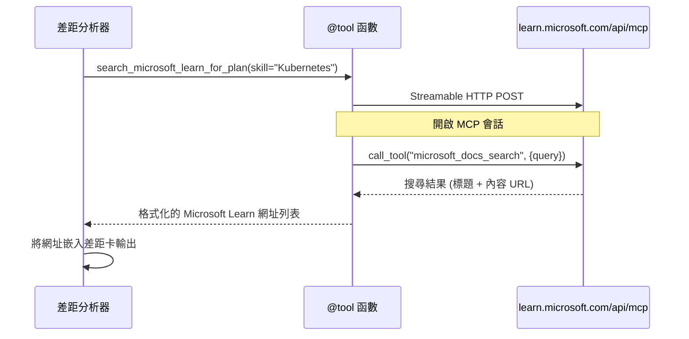

# Module 1 - 理解多代理架構

在這個模組中，您將在撰寫任何程式碼之前，了解履歷 → 職位匹配評估器的架構。理解協調圖、代理角色和資料流對於除錯和擴展[多代理工作流程](https://learn.microsoft.com/azure/architecture/ai-ml/idea/multiple-agent-workflow-automation)至關重要。

---

## 這個問題的解決方案

將履歷與職位描述匹配涉及多種不同技能：

1. <strong>解析</strong> - 從非結構化文本（履歷）中提取結構化資料
2. <strong>分析</strong> - 從職位描述提取需求
3. <strong>比較</strong> - 評分兩者的匹配度
4. <strong>規劃</strong> - 建立學習路徑以彌補差距

一個代理在一次提示中完成所有四個任務通常會產生：
- 不完整的提取（急於解析，以便評分）
- 浅顯的評分（缺乏基於證據的分析）
- 通用的學習路線圖（未針對特定差距量身定制）

透過將任務拆分為<strong>四個專業代理</strong>，每個代理專注於其任務並具備專用指令，可在每個階段產出更高品質的結果。

---

## 四個代理

每個代理都是透過 `AzureAIAgentClient.as_agent()` 建立的完整[Microsoft Foundry](https://learn.microsoft.com/azure/foundry/agents/concepts/hosted-agents)代理。它們共享相同的模型部署，但具有不同的指令和（選擇性）不同的工具。

| # | 代理名稱 | 角色 | 輸入 | 輸出 |
|---|-----------|------|-------|--------|
| 1 | **ResumeParser** | 從履歷文本中提取結構化個人資料 | 原始履歷文本（用戶提供） | 候選人資料、技術技能、軟技能、證書、領域經驗、成就 |
| 2 | **JobDescriptionAgent** | 從職位描述中提取結構化需求 | 原始職位描述文本（用戶提供，經 ResumeParser 轉發） | 職位概覽、必需技能、優先技能、經驗、證書、教育、職責 |
| 3 | **MatchingAgent** | 計算基於證據的匹配分數 | 來自 ResumeParser + JobDescriptionAgent 的輸出 | 匹配分數（0-100 並附細分）、匹配技能、缺失技能、差距 |
| 4 | **GapAnalyzer** | 建立個性化學習路線圖 | 來自 MatchingAgent 的輸出 | 差距卡（每項技能）、學習順序、時間線、Microsoft Learn 資源 |

---

## 協調圖

工作流程使用<strong>並行扇出</strong>，接著是<strong>序列聚合</strong>：


> **圖例：** 紫色 = 並行代理，橙色 = 聚合點，綠色 = 最終代理（配備工具）

### 資料如何流動


1. <strong>用戶發送</strong> 含有履歷和職位描述的訊息。
2. **ResumeParser** 接收完整用戶輸入並提取結構化候選人資料。
3. **JobDescriptionAgent** 並行接收用戶輸入並提取結構化需求。
4. **MatchingAgent** 接收來自 ResumeParser 和 JobDescriptionAgent 的輸出（框架會等待兩者皆完成後才執行 MatchingAgent）。
5. **GapAnalyzer** 接收 MatchingAgent 的輸出並呼叫 **Microsoft Learn MCP 工具** 以獲取每項差距的真實學習資源。
6. <strong>最終輸出</strong> 是 GapAnalyzer 的回應，包含匹配分數、差距卡片及完整的學習路線圖。

### 為何並行扇出很重要

ResumeParser 與 JobDescriptionAgent 是<strong>並行執行</strong>，因為兩者互不依賴。這樣可：
- 降低總延遲（兩者同時運行，而非序列執行）
- 是自然而合理的拆分（履歷解析與職位描述解析是獨立任務）
- 展示常見的多代理模式：**扇出 → 聚合 → 行動**

---

## WorkflowBuilder 程式碼範例

以下是上述圖示如何對應到 `main.py` 中 [`WorkflowBuilder`](https://learn.microsoft.com/agent-framework/workflows/agents-in-workflows) API 呼叫：

```python
from agent_framework import WorkflowBuilder

workflow = (
    WorkflowBuilder(
        name="ResumeJobFitEvaluator",
        start_executor=resume_parser,       # 第一個接收用戶輸入的代理
        output_executors=[gap_analyzer],     # 輸出結果最終返回的代理
    )
    .add_edge(resume_parser, jd_agent)      # ResumeParser → 招聘描述代理
    .add_edge(resume_parser, matching_agent) # ResumeParser → 匹配代理
    .add_edge(jd_agent, matching_agent)      # 招聘描述代理 → 匹配代理
    .add_edge(matching_agent, gap_analyzer)  # 匹配代理 → 差距分析器
    .build()
)
```

**理解邊的含義：**

| 邊 | 意義 |
|------|--------------|
| `resume_parser → jd_agent` | JD Agent 接收 ResumeParser 輸出 |
| `resume_parser → matching_agent` | MatchingAgent 接收 ResumeParser 輸出 |
| `jd_agent → matching_agent` | MatchingAgent 也接收 JD Agent 輸出（須等待兩者） |
| `matching_agent → gap_analyzer` | GapAnalyzer 接收 MatchingAgent 輸出 |

因為 `matching_agent` 有<strong>兩個輸入邊</strong>（來自 `resume_parser` 和 `jd_agent`），框架會自動等待兩者皆完成後才執行 MatchingAgent。

---

## MCP 工具

GapAnalyzer 代理有一個工具：`search_microsoft_learn_for_plan`。這是個<strong>[MCP 工具](https://learn.microsoft.com/agent-framework/agents/tools/hosted-mcp-tools)</strong>，透過呼叫 Microsoft Learn API 抓取精選學習資源。

### 運作方式

```python
@tool
async def search_microsoft_learn_for_plan(
    skill: str, role: str = "", max_results: int = 5
) -> str:
    """Search Microsoft Learn MCP and return curated official links."""
    # 通過可串流的 HTTP 連接到 https://learn.microsoft.com/api/mcp
    # 在 MCP 伺服器上調用 'microsoft_docs_search' 工具
    # 返回格式化的 Microsoft Learn URL 列表
```

### MCP 呼叫流程


1. GapAnalyzer 判定需要某項技能（例如 "Kubernetes"）的學習資源
2. 框架呼叫 `search_microsoft_learn_for_plan(skill="Kubernetes")`
3. 該函數開啟一個指向 `https://learn.microsoft.com/api/mcp` 的[Streamable HTTP](https://learn.microsoft.com/agent-framework/agents/tools/hosted-mcp-tools)連線
4. 在[MCP 伺服器](https://learn.microsoft.com/azure/foundry/agents/how-to/tools/model-context-protocol)上呼叫 `microsoft_docs_search` 工具
5. MCP 伺服器回傳搜尋結果（標題+URL）
6. 函數格式化結果並以字串形式回傳
7. GapAnalyzer 在其差距卡輸出中使用回傳的 URL

### 預期的 MCP 日誌

當工具運作時，您會看到類似的日誌條目：

```
GET https://learn.microsoft.com/api/mcp → 405 (Method Not Allowed)
POST https://learn.microsoft.com/api/mcp → 200
DELETE https://learn.microsoft.com/api/mcp → 405 (Method Not Allowed)
```

**這是正常現象。** MCP 用戶端在初始化階段會以 GET 和 DELETE 探查伺服器，返回 405 是預期行為。真正的工具呼叫使用 POST 並返回 200。只有 POST 呼叫失敗時才需擔心。

---

## 代理建立模式

每個代理都使用**[`AzureAIAgentClient.as_agent()`](https://learn.microsoft.com/python/api/overview/azure/ai-agents-readme) 非同步上下文管理器**建立。這是 Foundry SDK 建立會自動清理代理的慣用模式：

```python
async with (
    get_credential() as credential,
    AzureAIAgentClient(
        project_endpoint=PROJECT_ENDPOINT,
        model_deployment_name=MODEL_DEPLOYMENT_NAME,
        credential=credential,
    ).as_agent(
        name="ResumeParser",
        instructions=RESUME_PARSER_INSTRUCTIONS,
    ) as resume_parser,
    # ... 為每個代理重複 ...
):
    # 所有 4 個代理都存在這裡
    workflow = create_workflow(resume_parser, jd_agent, matching_agent, gap_analyzer)
```

**重點說明：**
- 每個代理都擁有自己的 `AzureAIAgentClient` 實例（SDK 要求代理名稱唯一且屬於該客戶端）
- 所有代理共用相同的 `credential`、`PROJECT_ENDPOINT` 和 `MODEL_DEPLOYMENT_NAME`
- `async with` 區塊確保所有代理在伺服器關閉時被清理
- GapAnalyzer 額外接收 `tools=[search_microsoft_learn_for_plan]`

---

## 伺服器啟動

建立代理並建構工作流程後，伺服器啟動：

```python
from azure.ai.agentserver.agentframework import from_agent_framework

agent = create_workflow(resume_parser, jd_agent, matching_agent, gap_analyzer)
await from_agent_framework(agent).run_async()
```

`from_agent_framework()` 將工作流程包裝為 HTTP 伺服器，並在 8088 埠開放 `/responses` 端點。這與 Lab 01 的模式相同，但現在的「代理」是整個[工作流程圖](https://learn.microsoft.com/agent-framework/workflows/as-agents)。

---

### 檢查點

- [ ] 理解 4 代理架構與各代理角色
- [ ] 可以追蹤資料流：用戶 → ResumeParser →（並行）JD Agent + MatchingAgent → GapAnalyzer → 輸出
- [ ] 知道為什麼 MatchingAgent 需要等待 ResumeParser 和 JD Agent（兩個輸入邊）
- [ ] 明白 MCP 工具：用途、呼叫方式，以及 GET 405 日誌是正常
- [ ] 理解 `AzureAIAgentClient.as_agent()` 模式以及為何每個代理有自己的 client 實例
- [ ] 能閱讀 `WorkflowBuilder` 程式碼並映射到視覺圖示

---

**上一課：** [00 - 先決條件](00-prerequisites.md) · **下一課：** [02 - 鋪建多代理專案 →](02-scaffold-multi-agent.md)

---

<!-- CO-OP TRANSLATOR DISCLAIMER START -->
**免責聲明**：  
本文件使用人工智能翻譯服務[Co-op Translator](https://github.com/Azure/co-op-translator)進行翻譯。雖然我們努力確保準確性，但請注意，自動翻譯可能包含錯誤或不準確之處。原始文件的本地語言版本應被視為權威來源。對於關鍵資訊，建議使用專業人工翻譯。本公司不對因使用此翻譯而引起的任何誤解或誤釋負責。
<!-- CO-OP TRANSLATOR DISCLAIMER END -->