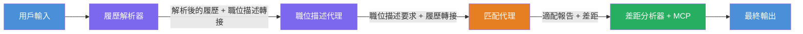

# 模組 1 - 理解架構

⏱️ 約 5 分鐘

在撰寫任何程式碼之前，這裡有一個快速概述，解釋你正在建構的內容以及它如何運作。

---

## 你正在建構的內容

你會貼上一份 <strong>履歷表</strong> 和一份 <strong>工作說明書</strong>。工作流程會回傳：

- 一個匹配分數（0–100，並有細項分解）
- 技能和證書差距清單
- 一個個人化學習路線圖，包含每個差距的 Microsoft Learn 連結

---

## 四個代理人

單一代理人嘗試同時解析、評分和規劃，往往會倉促且產出淺薄。將工作拆分成四個專門代理人能帶來更佳效果：

| 代理人 | 功能 |
|-------|-------------|
| **ResumeParser** | 解析履歷表；將工作說明書原封不動複製到 `[JOB DESCRIPTION PASS-THROUGH]` 供後續代理人使用 |
| **JobDescriptionAgent** | 從傳遞資料中提取工作說明書要求；將 `[PARSED RESUME]` 轉發為 `[PARSED RESUME PASS-THROUGH]` |
| **MatchingAgent** | 對比標記的兩個區塊；產生 0–100 的匹配分數與差距清單 |
| **GapAnalyzer** | 建立學習路線圖；為每個缺口搜尋 Microsoft Learn |

---

## 編排圖

工作流程是一個 <strong>順序管線</strong>—每個代理人將輸出送給下一個代理人：


```mermaid
flowchart LR
    A["用戶輸入"] --> B["履歷解析器"]
    B -- "解析後的履歷 + 職位描述轉接" --> C["職位描述代理"]
    C -- "職位描述要求 + 履歷轉接" --> D["匹配代理"]
    D -- "適配報告 + 差距" --> E["差距分析器 + MCP"]
    E --> F["最終輸出"]

    style A fill:#4A90D9,color:#fff
    style B fill:#7B68EE,color:#fff
    style C fill:#7B68EE,color:#fff
    style D fill:#E67E22,color:#fff
    style E fill:#27AE60,color:#fff
    style F fill:#4A90D9,color:#fff
```

1. **ResumeParser** 接收使用者輸入，解析履歷表，並將工作說明書複製到 `[JOB DESCRIPTION PASS-THROUGH]`。
2. **JD Agent** 提取結構化要求並轉發 `[PARSED RESUME PASS-THROUGH]`。
3. **MatchingAgent** 對比兩個區塊，產生匹配分數與差距清單。
4. **GapAnalyzer** 建立路線圖，並針對每個差距呼叫 Microsoft Learn MCP 工具。

---

## 這如何映射到程式碼

在 `main.py` 中，你透過 `WorkflowBuilder` 描述此圖：

```python
workflow_agent = (
    WorkflowBuilder(
        start_executor=resume_executor,       # 第一個接收使用者輸入的代理
        output_executors=[gap_executor],      # 最後一個代理 - 它的輸出即是回應
    )
    .add_edge(resume_executor, jd_executor)       # 履歷解析器 → 職位代理
    .add_edge(jd_executor, matching_executor)     # 職位代理 → 配對代理
    .add_edge(matching_executor, gap_executor)    # 配對代理 → 差距分析器
    .build()
    .as_agent()
)
```

每個 `Agent` 都包裹在 `AgentExecutor` 中。`add_edge()` 呼叫定義了一個嚴格的順序管線—每個代理人只接收其前一個代理人的輸出。

> `context_mode="last_agent"` 表示每個執行器只看到其直接前任的輸出。ResumeParser 和 JD Agent 在標記區塊中轉發資料，確保後續每個代理人拿到它所需的準確資訊。

---

## MCP 工具

GapAnalyzer 有一個工具：`search_microsoft_learn_for_plan`。它會連接至 `https://learn.microsoft.com/api/mcp`，並回傳每個技能差距的真正 Microsoft Learn 連結。

當工具執行時你會看到這些日誌—全屬預期：

```
GET  https://learn.microsoft.com/api/mcp → 405   ← connection probe, normal
POST https://learn.microsoft.com/api/mcp → 200   ← actual tool call
DELETE https://learn.microsoft.com/api/mcp → 405 ← cleanup probe, normal
```

只有當 `POST` 返回錯誤時才需要擔心。

---

**上一節：** [00 - 先決條件](00-prerequisites.md) · **下一節：** [02 - 建立專案框架 →](02-scaffold-multi-agent.md)

---

<!-- CO-OP TRANSLATOR DISCLAIMER START -->
**免責聲明**：
本文件使用 AI 翻譯服務 [Co-op Translator](https://github.com/Azure/co-op-translator) 進行翻譯。雖然我們力求準確，但請注意，自動翻譯可能包含錯誤或不準確之處。原始文件的母語版本應被視為權威來源。對於重要資訊，建議尋求專業人工翻譯。我們不對因使用本翻譯而引起的任何誤解或曲解承擔責任。
<!-- CO-OP TRANSLATOR DISCLAIMER END -->