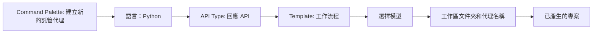
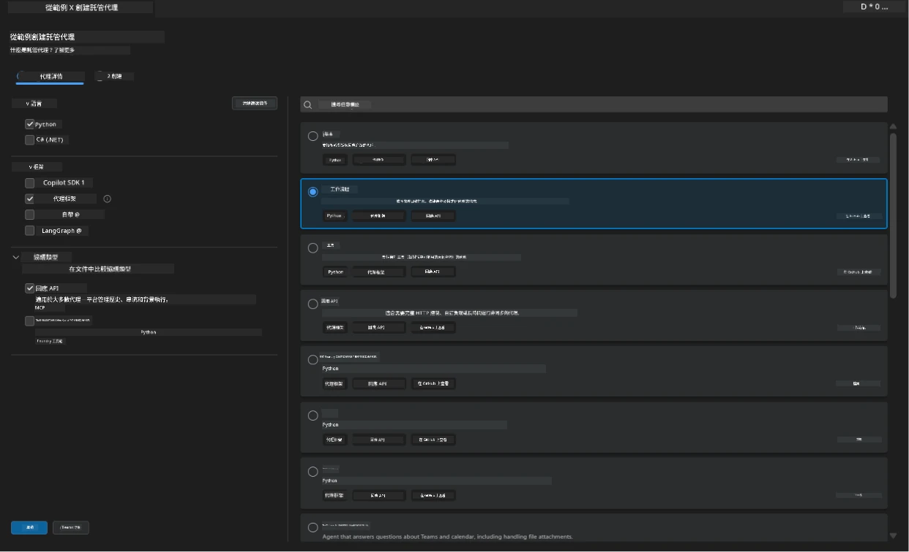
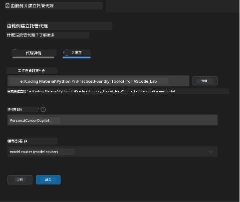

# 模組 2 - 搭建多智能體項目架構

⏱️ 約 5 分鐘

在本模組中，您將使用 [Foundry Toolkit for VS Code](https://aka.ms/foundrytk) 來<strong>搭建多智能體項目架構</strong>。向導會生成 `agent.yaml`、`main.py`、`Dockerfile`、`requirements.txt`、`.env` 和 VS Code 調試配置，讓您可以專注於模組 3 中的四智能體工作流程連接。

> **關鍵概念：** 搭建架構為一個可運行的樣板，包含一個智能體。您將在模組 3 中用 `WorkflowBuilder` 圖形替換此佔位邏輯。無需從頭撰寫樣板代碼。

> **參考實作：** [`PersonalCareerCopilot/`](../../../../../workshop/lab02-multi-agent/PersonalCareerCopilot) 是完整的可運行範例。可用作比對您的進度。

### 搭建向導流程


```mermaid
flowchart LR
    A[Command Palette: 建立新的託管代理] --> B[語言：Python]
    B --> C[API Type: 回應 API]
    C --> D[Template: 工作流程]
    D --> E[選擇模型]
    E --> F[工作區文件夾和代理名稱]
    F --> G[已產生的專案]
```

---

## 第一步：打開「建立託管智能體」向導

1. 按 `Ctrl+Shift+P` 開啟 <strong>命令選擇器</strong>。
2. 輸入：**Foundry Toolkit: Create a New Hosted Agent**，然後選擇它。
3. 向導會開啟在 <strong>智能體詳情</strong> 標籤頁。

> **替代方法：** 點擊工作列的 **Foundry Toolkit** 圖示 → 點擊 **Hosted Agents** 旁的 **+** 圖示 → 選擇 **Create New Hosted Agent**。

---

## 第二步：選擇設定



1. 在左邊的導航和選項區選擇以下：

| 選單 | 選擇 | 備註 |
|--------|-----------|-------|
| <strong>語言</strong> | Python | 亦支援 C# (.NET) |
| <strong>框架</strong> | Agent Framework | 提供 `Agent`、`AgentExecutor`、`WorkflowBuilder` |
| **API 類型** | 回應 API | `POST /responses` - 平台管理歷史記錄，支援串流 |
| <strong>範本</strong> | **Workflows** | 透過多智能體順序處理請求 |

2. 選擇完成後，點擊 <strong>下一步</strong>



3. 在下一個視窗，選擇以下：

| 選單 | 選擇 | 備註 |
|--------|-----------|-------|
| <strong>工作區資料夾</strong> | 瀏覽至目標資料夾 | 例如本存放庫的 `workshop/lab02-multi-agent/` |
| <strong>智能體名稱</strong> | `PersonalCareerCopilot` | 這將成為專案資料夾名稱 |
| <strong>模型部署</strong> | 選擇您部署的模型 | 例如來自模組 01 的 `gpt-4.1-mini` |

4. 點擊 <strong>建立</strong> 以搭建專案。VS Code 將生成檔案並開啟資料夾。

> **提示：** [`gpt-4.1-mini`](https://learn.microsoft.com/azure/foundry/foundry-models/concepts/models-sold-directly-by-azure#gpt-41-series) 在多智能體開發中提供速度與品質的良好平衡。

---

## 第三步：檢視生成的專案

搭建完成後，請在檔案總管 (`Ctrl+Shift+E`) 中確認下列檔案：

```
📂 <your-agent-name>/
├── .azdignore          ← Files excluded from Azure Developer CLI deployments
├── .dockerignore       ← Files excluded from Docker builds
├── .env                ← Environment variables (placeholders - fill in Module 3)
├── .vscode/
│   ├── launch.json     ← Debug config (F5 → run + Agent Inspector)
│   └── tasks.json      ← VS Code task definitions
├── agent.yaml          ← Agent definition (kind: hosted, protocol: responses)
├── Dockerfile          ← Container config for deployment
├── main.py             ← Stub agent entry point (replace with WorkflowBuilder in Module 3)
└── requirements.txt    ← Python dependencies
```

> **重要：** 請直接在 VS Code 中開啟此搭建好的資料夾，以確保 `.vscode/launch.json` 和 `tasks.json` 正確應用 F5 調試。

### 主要檔案說明

| 檔案 | 作用 |
|------|---------|
| `agent.yaml` | 宣告 `kind: hosted`，映射環境變數，定義 `/responses` 協定 |
| `main.py` | 樣板：一個 `FoundryChatClient` → `Agent` → `ResponsesHostServer`。模組 3 您將用 4 個智能體加上 `WorkflowBuilder` 取代 |
| `Dockerfile` | 使用 `python:3.12-slim`，安裝 `requirements.txt`，開放 8088 端口，執行 `python main.py` |
| `requirements.txt` | 包含 `agent-framework-foundry`、`agent-framework-foundry-hosting`、`mcp<2,>=1.24.0`、`debugpy` |

> **參考：** 請查看 [`PersonalCareerCopilot/agent.yaml`](../../../../../workshop/lab02-multi-agent/PersonalCareerCopilot/agent.yaml) 和 [`PersonalCareerCopilot/requirements.txt`](../../../../../workshop/lab02-multi-agent/PersonalCareerCopilot/requirements.txt) 得知完整生成內容。

---

### ✅ 檢查點

- [ ] 完成搭建向導 - Explorer 中可見新專案資料夾
- [ ] 所有預期檔案齊全：`agent.yaml`、`main.py`、`Dockerfile`、`requirements.txt`、`.env`
- [ ] `agent.yaml` 顯示 `kind: hosted` 和 `protocol: responses`
- [ ] `main.py` 匯入了 `Agent`、`FoundryChatClient`、`ResponsesHostServer`
- [ ] 搭建好的資料夾已作為 VS Code 工作區根目錄開啟
- [ ] 您理解 `main.py` 是樣板檔 - `WorkflowBuilder` 將於模組 3 新增

---

**上一節：** [01 - 理解多智能體架構](01-understand-multi-agent.md) · **下一節：** [03 - 配置智能體與環境 →](03-configure-agents.md)

---

<!-- CO-OP TRANSLATOR DISCLAIMER START -->
**免責聲明**：
本文件使用 AI 翻譯服務 [Co-op Translator](https://github.com/Azure/co-op-translator) 進行翻譯。雖然我們力求準確，但請注意，自動翻譯可能包含錯誤或不準確之處。原始文件的母語版本應被視為權威來源。對於重要資訊，建議尋求專業人工翻譯。我們不對因使用本翻譯而引起的任何誤解或曲解承擔責任。
<!-- CO-OP TRANSLATOR DISCLAIMER END -->