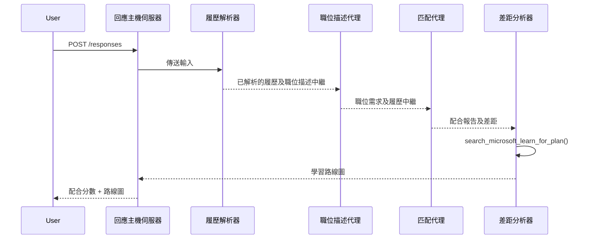

# 模組 3 - 配置指令、環境及安裝依賴

⏱️ 約 15 分鐘

在本模組中，您將把搭建的骨架存根轉變為<strong>您自己的</strong>多代理工作流程－通過設定環境變數、撰寫代理指令、加入MCP工具、連接工作流程圖及安裝依賴。

> **參考：** 完整可運行的程式碼位於 [`PersonalCareerCopilot/main.py`](../../../../../workshop/lab02-multi-agent/PersonalCareerCopilot/main.py)。請在建立您自己的工作流程圖和提示區塊時作為參考。

---

## 四個代理的配合方式



---

## 步驟 1：配置環境變數

1. 打開您專案根目錄下的 **`.env`** 檔案（由搭建精靈創建）。
2. 將佔位符替換成您在實驗室 01 中的實際數值。

<details open>
<summary><strong>🅰️ 路徑 A - Foundry 訂閱</strong></summary>

```env
FOUNDRY_PROJECT_ENDPOINT=https://<your-account>.services.ai.azure.com/api/projects/<your-project>
AZURE_AI_MODEL_DEPLOYMENT_NAME=gpt-4.1-mini
```

> **數值取得位置：** 請參見 [Lab 01, Module 1](../../lab01-single-agent/docs/01-setup.md#deploy-a-model--assign-rbac)。

</details>

<details open>
<summary><strong>🅱️ 路徑 B - Foundry Local</strong></summary>

```env
FOUNDRY_PROJECT_ENDPOINT=http://localhost:5273/v1
AZURE_AI_MODEL_DEPLOYMENT_NAME=phi-4-mini
```

> 所有推論均在本機上運行－資料不會離開您的裝置。執行 `foundry model list` 以確認確切的模型別名。唯一的外部請求是 MCP 工具訪問 `https://learn.microsoft.com/api/mcp`。

> **數值取得位置：** 請參見 [Lab 01, Module 1 - local path](../../lab01-single-agent/docs/01-setup.md#step-2-set-up-based-on-your-access)。

</details>

> **安全性提示：** 千萬不要將 `.env` 提交到版本控制。它應該已經被加入 `.gitignore`。

---

## 步驟 2：撰寫代理指令

指令定義每個代理的角色、輸出格式和規則。打開 `main.py` 並定義（或替換）四個指令常數－完整字串位於 [`PersonalCareerCopilot/main.py`](../../../../../workshop/lab02-multi-agent/PersonalCareerCopilot/main.py)。

### 2.1 `RESUME_PARSER_INSTRUCTIONS`
將履歷解析為結構化的候選者資料，<strong>並且</strong>將職務描述逐字複製到 `[JOB DESCRIPTION PASS-THROUGH]`。輸出中必須包含這兩個標籤的區段。

> **為何需要通過？** 使用 `context_mode="last_agent"` 時，ResumeParser 是<strong>唯一</strong>能看到原始用戶訊息的代理。如果它不把職務描述複製下去，下游代理就不會看到它。

### 2.2 `JOB_DESCRIPTION_INSTRUCTIONS`
從 ResumeParser 輸出中讀取 `[PARSED RESUME]` 和 `[JOB DESCRIPTION PASS-THROUGH]`。輸出 `[JD REQUIREMENTS]`（結構化需求）和 `[PARSED RESUME PASS-THROUGH]`（逐字履歷複製，供 MatchingAgent 使用）。

### 2.3 `MATCHING_AGENT_INSTRUCTIONS`
讀取 `[JD REQUIREMENTS]` 和 `[PARSED RESUME PASS-THROUGH]`。產生分數適配度報告（0–100）及明細計算、匹配技能、缺失技能，以及經驗對齊度。

### 2.4 `GAP_ANALYZER_INSTRUCTIONS`
讀取適配度報告。對<strong>每一</strong>缺失技能，呼叫 `search_microsoft_learn_for_plan` 以獲取 Microsoft Learn 資源。為每項技能產出詳細差距卡片及逐週學習路線圖。

---

## 步驟 3：加入 MCP 工具

GapAnalyzer 呼叫 [Microsoft Learn MCP 伺服器](https://learn.microsoft.com/azure/foundry/agents/how-to/tools/model-context-protocol)，以取得每個技能缺口的真實學習資源。完整的 `search_microsoft_learn_for_plan` 函數位於 [`PersonalCareerCopilot/main.py`](../../../../../workshop/lab02-multi-agent/PersonalCareerCopilot/main.py)。

創建 GapAnalyzer 代理時註冊該工具：

```python
gap_analyzer = Agent(
    client=client,
    instructions=GAP_ANALYZER_INSTRUCTIONS,
    name="GapAnalyzer",
    tools=[search_microsoft_learn_for_plan],
)
```

> 請參見 [`PersonalCareerCopilot/main.py`](../../../../../workshop/lab02-multi-agent/PersonalCareerCopilot/main.py)，完整的 `WorkflowBuilder` 圖含 `FoundryChatClient`、`AgentExecutor` 以及全部 `add_edge()` 呼叫。

---

## 步驟 4：建立虛擬環境並安裝依賴

> ⚠️ **請勿跳過此步驟。** 未安裝依賴會導致 F5 偵錯失敗。

### 4.1 建立虛擬環境

```powershell
python -m venv .venv
```

### 4.2 啟動虛擬環境

| 作業系統 | 指令 |
|----|---------|
| **Windows (PowerShell)** | `.\.venv\Scripts\Activate.ps1` |
| **Windows (CMD)** | `.venv\Scripts\activate.bat` |
| **macOS / Linux** | `source .venv/bin/activate` |

您應該會在終端機提示字元看到 `(.venv)`。

### 4.3 安裝依賴

```powershell
pip install -r requirements.txt
```

### 4.4 驗證

```powershell
pip list | Select-String "agent-framework|mcp|debugpy"
```

預期結果：列表中顯示 `agent-framework-foundry`、`agent-framework-foundry-hosting`、`mcp` 與 `debugpy`。

---

## 步驟 5：驗證認證

<details open>
<summary><strong>🅰️ 路徑 A - Azure 認證</strong></summary>

```powershell
az account show --query "{name:name, id:id}" --output table
```

若失敗，請執行 [`az login`](https://learn.microsoft.com/cli/azure/authenticate-azure-cli-interactively)。

四個代理共用一個 `FoundryChatClient` 及一個 `DefaultAzureCredential`。若一個代理認證成功，即全部成功。

</details>

<details open>
<summary><strong>🅱️ 路徑 B - Foundry Local</strong></summary>

本地測試無需認證。

</details>

---

### ✅ 檢查點

> 在以下條件達成前，<strong>不要</strong>繼續進入模組 04：**(1)** 提示字元顯示 `(.venv)` 且 **(2)** `pip install -r requirements.txt` 成功完成。

- [ ] `.env` 有有效端點及模型部署名稱（非佔位符）
- [ ] 四個代理指令常數已在 `main.py` 定義（ResumeParser、JD Agent、MatchingAgent、GapAnalyzer）
- [ ] `search_microsoft_learn_for_plan` MCP 工具已定義並在 GapAnalyzer 上註冊
- [ ] 在 `main()` 中建立了 `FoundryChatClient` + 4 個 `Agent` + 4 個 `AgentExecutor` 物件
- [ ] `WorkflowBuilder` 建立正確的序列圖並完成全部三個 `add_edge()` 呼叫
- [ ] 虛擬環境已建立且啟動（提示字元顯示 `(.venv)`）
- [ ] `pip install -r requirements.txt` 無錯誤完成
- [ ] **路徑 A:** `az account show` 成功或 VS Code 帳戶圖示顯示已登入帳號

---

**上一頁:** [02 - 搭建多代理專案](02-scaffold-multi-agent.md) · **下一頁:** [04 - 編排模式 →](04-orchestration-patterns.md)

---

<!-- CO-OP TRANSLATOR DISCLAIMER START -->
**免責聲明**：
本文件使用 AI 翻譯服務 [Co-op Translator](https://github.com/Azure/co-op-translator) 進行翻譯。雖然我們力求準確，但請注意，自動翻譯可能包含錯誤或不準確之處。原始文件的母語版本應被視為權威來源。對於重要資訊，建議尋求專業人工翻譯。我們不對因使用本翻譯而引起的任何誤解或曲解承擔責任。
<!-- CO-OP TRANSLATOR DISCLAIMER END -->