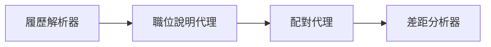
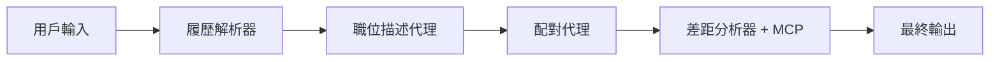

# 模組 4 - 編排模式

⏱️ 約10 分鐘

在本模組中，您將探索在履歷工作匹配評估器中使用的編排模式，並學習如何閱讀、修改和擴展工作流程圖。了解這些模式對於調試數據流問題和構建您自己的 [多代理工作流程](https://learn.microsoft.com/agent-framework/workflows/) 至關重要。

---

## 模式 1：順序鏈

工作流程中的基本模式是一個<strong>順序鏈</strong>——每個代理的輸出直接作為下一個代理的輸入。


```mermaid
flowchart LR
    RP[履歷解析器] --> JD[職位說明代理]
    JD --> MA[配對代理]
    MA --> GA[差距分析器]
```

在程式碼中，每個 `add_edge()` 調用建立鏈中的一個步驟：

```python
.add_edge(resume_executor, jd_executor)       # 簡歷解析器輸出 → JD代理
.add_edge(jd_executor, matching_executor)     # JD代理輸出 → 匹配代理
.add_edge(matching_executor, gap_executor)    # 匹配代理輸出 → 差距分析器
```

> **為什麼是順序，而非分叉/合併？** `WorkflowBuilder` 對進入邊使用 **OR 語義**：只要 <strong>任何</strong> 前置者完成，下游執行器就會觸發。如果 `matching_executor` 有兩條進入邊（來自 `resume_executor` 和 `jd_executor`），它會觸發兩次——一次在 ResumeParser 完成時，另一次在 JD Agent 完成時——導致 GapAnalyzer 也運行兩次，並且輸出會重複出現。順序管道完全避免了這個問題。

## 模式 2：內容傳遞

由於 `context_mode="last_agent"` 意味著每個執行器只能看到其<strong>直接前置者的輸出</strong>，順序鏈中的代理必須明確將下游需要的任何資料向前傳遞。

在這個工作流程中：
- **ResumeParser** 將 JD 原文複製到 `[JOB DESCRIPTION PASS-THROUGH]`（以便 JD Agent 可以找到）。
- **JD Agent** 將 `[PARSED RESUME]` 原文複製到 `[PARSED RESUME PASS-THROUGH]`（以便 MatchingAgent 可以比較兩個檔案）。

```
ResumeParser output
└─ [PARSED RESUME]               ← extracted by JD Agent
└─ [JOB DESCRIPTION PASS-THROUGH] ← extracted by JD Agent

JD Agent output
└─ [JD REQUIREMENTS]             ← extracted by MatchingAgent
└─ [PARSED RESUME PASS-THROUGH]  ← extracted by MatchingAgent
```

每個傳遞部分必須<strong>逐字複製</strong>——總結或改寫會破壞依賴它的下游代理。

---

## 完整圖形

結合順序鏈與內容傳遞模式便產生完整工作流程：


```mermaid
flowchart LR
    U[用戶輸入] --> RP[履歷解析器]
    RP --> JD[職位描述代理]
    JD --> MA[配對代理]
    MA --> GA[差距分析器 + MCP]
    GA --> O[最終輸出]
```

當代理在本地運行時，代理檢查器顯示相同的圖形結構。請參閱 [模組 5 - 本地測試](05-test-locally.md) 的截圖。

---

## 閱讀 WorkflowBuilder 程式碼

完整的 `create_workflow()` 函數位於 [`PersonalCareerCopilot/main.py`](../../../../../workshop/lab02-multi-agent/PersonalCareerCopilot/main.py)。三個 `add_edge()` 調用建立了順序管道：

| # | 邊 | 效果 |
|---|----|------|
| 1 | `resume_executor → jd_executor` | JD Agent 收到 `[PARSED RESUME]` + `[JOB DESCRIPTION PASS-THROUGH]` |
| 2 | `jd_executor → matching_executor` | MatchingAgent 收到 `[JD REQUIREMENTS]` + `[PARSED RESUME PASS-THROUGH]` |
| 3 | `matching_executor → gap_executor` | GapAnalyzer 收到符合度報告 + 缺口清單 |

---

## 修改圖形

### 新增代理

若要新增第五個代理（例如 GapAnalyzer 後的 **InterviewPrepAgent**）：

1. 定義 `INTERVIEW_PREP_INSTRUCTIONS` 常數。
2. 建立 `Agent` + `AgentExecutor` 物件（與現有四個的模式相同）。
3. 在 `WorkflowBuilder` 中加入 `.add_edge(gap_executor, interview_exec)`。
4. 更新 `output_executors=[interview_exec]`。

> **重要：** 只有 `start_executor` 接收原始使用者輸入，其他所有代理都是接收其上游邊的輸出。

---

## 常見圖形錯誤

| 錯誤 | 症狀 | 解決方案 |
|------|------|---------|
| 缺少指向 `output_executors` 的邊 | 代理運行但輸出為空 | 確保從 `start_executor` 有路徑到 `output_executors` 中的每個代理 |
| 環路依賴 | 無限迴圈或超時 | 檢查沒有代理反饋給上游代理 |
| `output_executors` 中代理沒有進入邊 | 輸出為空 | 至少新增一條 `add_edge(source, that_agent)` |
| 多個 `output_executors` 無合併 | 輸出只包含單一代理回應 | 使用一個集成輸出的代理，或接受多個輸出 |
| 缺少 `start_executor` | 建構時出現 `ValueError` | 在 `WorkflowBuilder()` 中始終指定 `start_executor` |

---

## 調試圖形

### 使用代理檢查器

1. 按 F5 在本地啟動代理。
2. 開啟代理檢查器（`Ctrl+Shift+P` → **Foundry Toolkit: Open Agent Inspector**）。
3. 發送測試訊息。
4. 在檢查器的回應面板中查看 <strong>串流輸出</strong>——它按順序顯示每個代理的貢獻。


### 使用記錄

在 `main.py` 中增加記錄以追蹤資料流：

```python
import logging
logger = logging.getLogger("resume-job-fit")

# 在 main() 裏，建立工作流程後：
logger.info("Workflow graph built with edges: RP→JD, JD→MA, MA→GA")
```

伺服器日誌呈現代理執行順序和 MCP 工具呼叫：

```
INFO:agent_framework:Executing agent: ResumeParser
INFO:agent_framework:Executing agent: JobDescriptionAgent
INFO:agent_framework:Executing agent: MatchingAgent
INFO:agent_framework:Executing agent: GapAnalyzer
INFO:agent_framework:Tool call: search_microsoft_learn_for_plan(skill="Kubernetes")
POST https://learn.microsoft.com/api/mcp → 200
INFO:agent_framework:Tool call: search_microsoft_learn_for_plan(skill="Terraform")
POST https://learn.microsoft.com/api/mcp → 200
```

---

### 檢查點

- [ ] 您能識別工作流程中的兩種編排模式：順序鏈與內容傳遞
- [ ] 您理解為什麼 `context_mode="last_agent"` 需要代理間明確的資料傳遞
- [ ] 您能閱讀 `WorkflowBuilder` 程式碼並將每個 `add_edge()` 呼叫對應到視覺圖
- [ ] 您知道如何將新代理添加到管道末端
- [ ] 您能識別常見圖形錯誤及其症狀

---

**上一節：** [03 - 設定代理與環境](03-configure-agents.md) · **下一節：** [05 - 本地測試 →](05-test-locally.md)

---

<!-- CO-OP TRANSLATOR DISCLAIMER START -->
**免責聲明**：
本文件使用 AI 翻譯服務 [Co-op Translator](https://github.com/Azure/co-op-translator) 進行翻譯。雖然我們力求準確，但請注意，自動翻譯可能包含錯誤或不準確之處。原始文件的母語版本應被視為權威來源。對於重要資訊，建議尋求專業人工翻譯。我們不對因使用本翻譯而引起的任何誤解或曲解承擔責任。
<!-- CO-OP TRANSLATOR DISCLAIMER END -->