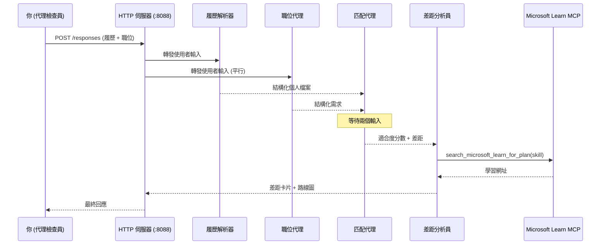
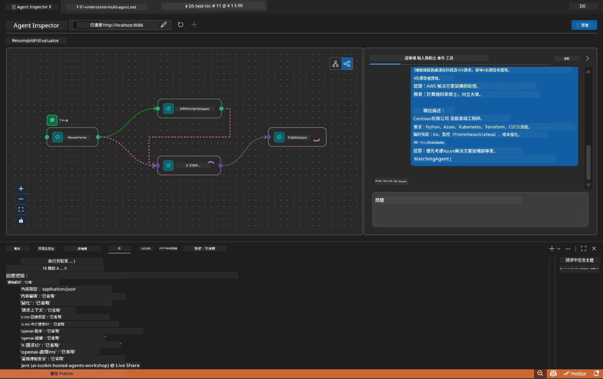

# Module 5 - 本地測試（多代理）

在本模組中，您將本地執行多代理工作流程，使用 Agent Inspector 測試，並驗證所有四個代理和 MCP 工具在部署到 Foundry 之前正常運作。

### 本地測試運行期間發生的事情


---

## 步驟 1：啟動代理伺服器

### 選項 A：使用 VS Code 任務（推薦）

1. 按 `Ctrl+Shift+P` → 輸入 **Tasks: Run Task** → 選擇 **Run Lab02 HTTP Server**。
2. 任務會啟動附加 debugpy 的伺服器（埠號 `5679`），代理埠號為 `8088`。
3. 等待輸出顯示：

```
INFO:resume-job-fit:Starting Resume -> Job Fit Evaluator HTTP server...
INFO:resume-job-fit:Server running on http://localhost:8088
```

### 選項 B：使用終端機手動操作

```powershell
cd workshop\lab02-multi-agent\PersonalCareerCopilot
```

啟動虛擬環境：

**PowerShell（Windows）：**
```powershell
.\.venv\Scripts\Activate.ps1
```

**macOS/Linux：**
```bash
source .venv/bin/activate
```

啟動伺服器：

```powershell
python -m debugpy --listen 127.0.0.1:5679 -m agentdev run main.py --verbose --port 8088
```

### 選項 C：使用 F5（除錯模式）

1. 按 `F5` 或進入 **Run and Debug**（`Ctrl+Shift+D`）。
2. 從下拉選單中選擇 **Lab02 - Multi-Agent** 的啟動配置。
3. 伺服器以完整除錯支援啟動。

> **提示：** 除錯模式可讓您在 `search_microsoft_learn_for_plan()` 中設置斷點，以檢查 MCP 回應，或在代理指令字串中設斷點，查看每個代理收到的內容。

---

## 步驟 2：開啟 Agent Inspector

1. 按 `Ctrl+Shift+P` → 輸入 **Foundry Toolkit: Open Agent Inspector**。
2. Agent Inspector 會在瀏覽器分頁以 `http://localhost:5679` 打開。
3. 您應該會看到代理界面準備接收訊息。

> **如果沒有開啟 Agent Inspector：** 確認伺服器已完全啟動（顯示「Server running」日誌）。若 5679 埠號被佔用，請參閱 [Module 8 - Troubleshooting](08-troubleshooting.md)。

---

## 步驟 3：執行煙霧測試

依序執行以下三個測試。每個測試逐步涵蓋更多工作流程內容。

### 測試 1：基本履歷 + 職位描述

將以下內容貼到 Agent Inspector：

```
Resume:
Jane Doe
Senior Software Engineer with 5 years of experience in Python, Django, and AWS.
Built microservices handling 10K+ requests/second. Led a team of 4 developers.
Certifications: AWS Solutions Architect Associate.
Education: B.S. Computer Science, State University.

Job Description:
Senior Cloud Engineer at Contoso Ltd.
Required: Python, Azure, Kubernetes, Terraform, CI/CD pipelines.
Preferred: Go, monitoring (Prometheus/Grafana), cost optimization.
Experience: 5+ years in cloud infrastructure.
Certifications: Azure Solutions Architect Expert preferred.
```

**預期輸出結構：**

回應應按序包含四個代理的輸出：

1. <strong>履歷解析器輸出</strong> - 按類別分組的結構化應徵者資料
2. **JD 代理輸出** - 按必須與優選技能分開的結構化需求
3. <strong>匹配代理輸出</strong> - 適合度分數（0-100）及分解、匹配技能、缺失技能、差距
4. <strong>差距分析器輸出</strong> - 每個缺失技能的差距卡片，附帶 Microsoft Learn 網址



### 測試 1 驗證要點

| 檢查項目 | 預期結果 | 通過？ |
|----------|----------|--------|
| 回應包含適合度分數 | 數字介於 0-100，含分解 | |
| 列出匹配技能 | Python、CI/CD（部分）、等 | |
| 列出缺失技能 | Azure、Kubernetes、Terraform、等 | |
| 每缺失技能有差距卡片 | 每技能一張卡片 | |
| 差距卡片含 Microsoft Learn 網址 | 真實的 `learn.microsoft.com` 連結 | |
| 無錯誤訊息 | 輸出乾淨結構化 | |

### 測試 2：驗證 MCP 工具執行

執行測試 1 時，檢查 <strong>伺服器終端機</strong> 的 MCP 日誌：

```
GET https://learn.microsoft.com/api/mcp → 405 (Method Not Allowed)
POST https://learn.microsoft.com/api/mcp → 200
DELETE https://learn.microsoft.com/api/mcp → 405 (Method Not Allowed)
```

| 日誌條目 | 含義 | 預期？ |
|----------|-------|--------|
| `GET ... → 405` | MCP 用 GET 探測初始化 | 是 - 正常 |
| `POST ... → 200` | 連線至 Microsoft Learn MCP 伺服器的實際工具呼叫 | 是 - 真正呼叫 |
| `DELETE ... → 405` | MCP 用 DELETE 探測清理 | 是 - 正常 |
| `POST ... → 4xx/5xx` | 工具呼叫失敗 | 否 - 參考[疑難排解](08-troubleshooting.md) |

> **重點：** `GET 405` 和 `DELETE 405` 是 <strong>預期現象</strong>。只要 `POST` 呼叫非 200 狀態碼才需擔心。

### 測試 3：邊界案例 - 高適合度應徵者

貼上與職缺高度匹配的履歷，驗證 GapAnalyzer 處理高適合度情境：

```
Resume:
Alex Chen
Senior Cloud Engineer with 7 years of experience.
Skills: Python, Azure (AKS, Functions, DevOps), Kubernetes, Terraform, CI/CD (GitHub Actions, Azure Pipelines), Go, Prometheus, Grafana, cost optimization.
Certifications: Azure Solutions Architect Expert, Azure DevOps Engineer Expert.
Led infrastructure migration to Azure for 3 enterprise clients.
Education: M.S. Computer Science, Tech University.

Job Description:
Senior Cloud Engineer at Contoso Ltd.
Required: Python, Azure, Kubernetes, Terraform, CI/CD pipelines.
Preferred: Go, monitoring (Prometheus/Grafana), cost optimization.
Experience: 5+ years in cloud infrastructure.
Certifications: Azure Solutions Architect Expert preferred.
```

**預期行為：**
- 適合度分數應在 **80+**（多數技能匹配）
- 差距卡片聚焦於微調/面試準備，而非基礎學習
- GapAnalyzer 指令包含：「若適合度 >= 80，聚焦於微調/面試準備」

---

## 步驟 4：驗證輸出完整性

執行測試後，請確認輸出符合以下標準：

### 輸出結構清單

| 區塊 | 代理 | 是否存在？ |
|-------|-------|------------|
| 應徵者資料 | 履歷解析器 | |
| 技術技能（分組） | 履歷解析器 | |
| 角色概述 | JD 代理 | |
| 必需與優先技能 | JD 代理 | |
| 適合度分數與分解 | 匹配代理 | |
| 匹配 / 缺失 / 部分技能 | 匹配代理 | |
| 每缺失技能一張差距卡片 | 差距分析器 | |
| 差距卡片中的 Microsoft Learn 網址 | 差距分析器（MCP） | |
| 學習順序（編號） | 差距分析器 | |
| 時間軸摘要 | 差距分析器 | |

### 常見問題及解決方案

| 問題 | 原因 | 解決方法 |
|-------|-------|---------|
| 只有 1 張差距卡片（其餘被截斷） | GapAnalyzer 指令缺少 CRITICAL 段落 | 在 `GAP_ANALYZER_INSTRUCTIONS` 加入 `CRITICAL:` 段落，詳見 [Module 3](03-configure-agents.md) |
| 無 Microsoft Learn 網址 | MCP 端點無法連線 | 檢查網路連線，確認 `.env` 中 `MICROSOFT_LEARN_MCP_ENDPOINT` 是 `https://learn.microsoft.com/api/mcp` |
| 空回應 | `PROJECT_ENDPOINT` 或 `MODEL_DEPLOYMENT_NAME` 未設定 | 檢查 `.env` 檔案設定。終端機執行 `echo $env:PROJECT_ENDPOINT` |
| 適合度分數為 0 或缺失 | MatchingAgent 未收到上游資料 | 確認在 `create_workflow()` 中有 `add_edge(resume_parser, matching_agent)` 和 `add_edge(jd_agent, matching_agent)` |
| 代理啟動後立刻退出 | 匯入錯誤或依賴缺失 | 重新執行 `pip install -r requirements.txt`，檢查終端機錯誤堆疊 |
| `validate_configuration` 錯誤 | 缺少環境變數 | 建立 `.env`，填入 `PROJECT_ENDPOINT=<your-endpoint>` 與 `MODEL_DEPLOYMENT_NAME=<your-model>` |

---

## 步驟 5：使用您自己的資料測試（選擇性）

嘗試貼入您自己的履歷和真實職缺描述，用來驗證：

- 代理能處理不同履歷格式（時間順序、功能型、混合型）
- JD 代理能處理不同職缺描述風格（項目符號、段落、結構化）
- MCP 工具提供與真實技能相關的資源
- 差距卡片針對您個人背景做出個人化建議

> **隱私說明：** 本地測試時，資料僅留存於您的機器並只發送至您的 Azure OpenAI 部署，不會被工作坊基礎設施記錄或存儲。如有需要可使用替代名稱（例如用「Jane Doe」替代真實姓名）。

---

### 檢查點

- [ ] 伺服器成功啟動於埠 `8088`（日誌顯示「Server running」）
- [ ] Agent Inspector 開啟且連接代理
- [ ] 測試 1：完整回應含適合度分數、匹配/缺失技能、差距卡片及 Microsoft Learn 網址
- [ ] 測試 2：MCP 日誌顯示 `POST ... → 200`（工具呼叫成功）
- [ ] 測試 3：高適合度應徵者得分 80+，具微調建議
- [ ] 全部差距卡片存在（每缺失技能一張，無截斷）
- [ ] 伺服器終端機無錯誤或錯誤堆疊

---

**前一章：** [04 - Orchestration Patterns](04-orchestration-patterns.md) · **下一章：** [06 - Deploy to Foundry →](06-deploy-to-foundry.md)

---

<!-- CO-OP TRANSLATOR DISCLAIMER START -->
**免責聲明**：  
本文件經由 AI 翻譯服務 [Co-op Translator](https://github.com/Azure/co-op-translator) 翻譯所得。雖然我們致力於確保準確性，但請注意自動翻譯可能包含錯誤或不準確之處。原始文件的原文版本應被視為權威來源。對於重要資訊，建議採用專業人工翻譯。我們不對因使用本翻譯而產生的任何誤解或誤釋承擔責任。
<!-- CO-OP TRANSLATOR DISCLAIMER END -->