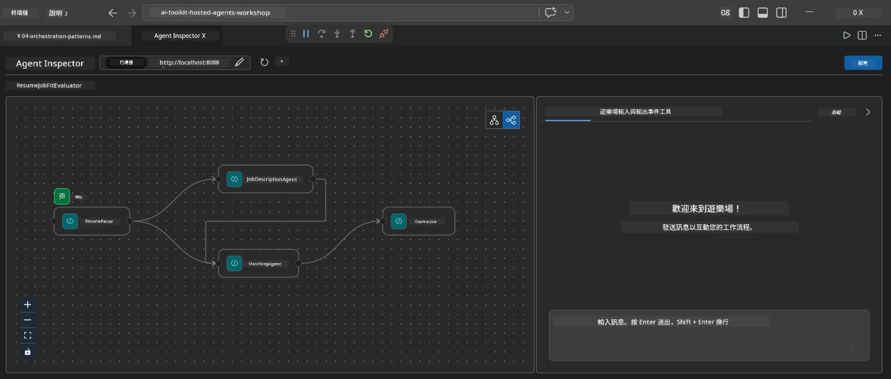
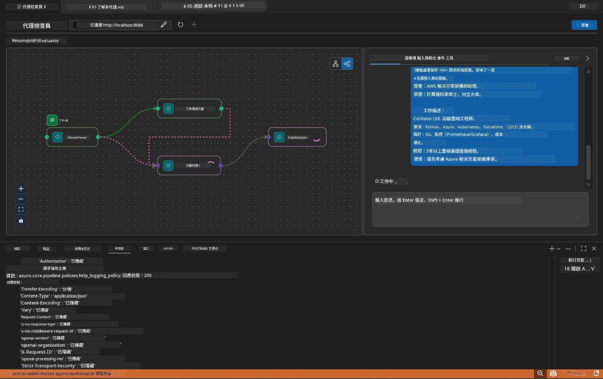
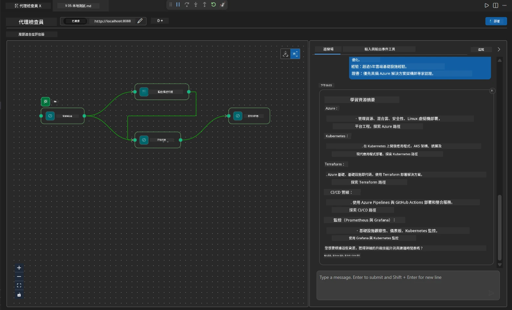

# 模組 5 - 本地測試

⏱️ 約 15 分鐘

在本模組中，您將在本地執行多代理工作流程，使用代理檢查器進行測試，並驗證所有四個代理與 MCP 工具運作正常，然後再進行部署。

---

## 步驟 1：啟動代理服務器

### 選項 A：使用 VS Code 任務（推薦）

1. 打開 `workshop/lab02-multi-agent/PersonalCareerCopilot/` 作為您的 VS Code 資料夾。
2. 按 `Ctrl+Shift+P` → 輸入 **Tasks: Run Task** → 選擇 **Run Agent HTTP Server**。
3. 任務將啟動附加 debugpy 的伺服器，debugpy 埠口為 `5679`，代理埠口為 `8088`。
4. 等待輸出顯示：

```
INFO:resume-job-fit:Starting Resume -> Job Fit Evaluator HTTP server...
INFO:resume-job-fit:Server running on http://localhost:8088
```

### 選項 B：使用 F5（除錯模式）

1. 按 `F5` → 選擇 **Debug Local Agent HTTP Server**。
2. 伺服器啟動並可完全支援斷點，非常適合檢查 MCP 回應或代理輸出。

---

## 步驟 2：打開代理檢查器

1. 按 `Ctrl+Shift+P` → 輸入 **Foundry Toolkit: Open Agent Inspector**。
2. 代理檢查器會以 VS Code 面板形式開啟，並連接至 `http://localhost:8088`。
3. 您應該會看到代理介面準備好接收訊息。



> **如果代理檢查器無法開啟：** 請確定伺服器已完全啟動（您看到「Server running」日誌）。如果埠口 5679 被佔用，請參考 [模組 8 - 疑難排解](08-troubleshooting.md)。

---

## 步驟 2b：（可選）打開工作流程視覺化工具

Foundry Toolkit 包含即時的 <strong>工作流程視覺化工具</strong>，展示代理在圖表執行過程中的互動。這對多代理調試非常有用。

1. 按 `Ctrl+Shift+P` → 輸入 **Foundry Toolkit: Open Visualizer for Hosted Agents**。
2. 會開啟新的 VS Code 分頁，顯示即時執行圖。
3. 當您在代理檢查器中發送訊息時，視覺化工具會自動更新 - 綠色節點表示已完成的代理，動畫邊緣展示數據流動。

> **埠口衝突：** 若視覺化埠口已被使用，可前往 VS Code 設定 → <strong>擴展功能</strong> → **Microsoft Foundry Configuration** → **Hosted Agents: Visualizer Port** 進行更改。

---

## 步驟 3：執行基礎測試

按順序執行以下三個測試。每個測試逐步涵蓋更多工作流程內容。

### 測試 1：基本履歷 + 工作描述

將以下內容貼到代理檢查器：

```
Resume:
Jane Doe
Senior Software Engineer with 5 years of experience in Python, Django, and AWS.
Built microservices handling 10K+ requests/second. Led a team of 4 developers.
Certifications: AWS Solutions Architect Associate.
Education: B.S. Computer Science, State University.

Job Description:
Senior Cloud Engineer at Contoso Ltd.
Required: Python, Azure, Kubernetes, Terraform, CI/CD pipelines.
Preferred: Go, monitoring (Prometheus/Grafana), cost optimization.
Experience: 5+ years in cloud infrastructure.
Certifications: Azure Solutions Architect Expert preferred.
```

**預期輸出結構：**

回應應依序包含所有四個代理的輸出：

1. <strong>履歷分析器輸出</strong> - 兩個標籤分區：`[PARSED RESUME]`（候選人檔案含群組技能）及 `[JOB DESCRIPTION PASS-THROUGH]`（逐字原文的工作描述，供 JD 代理使用）
2. **JD 代理輸出** - 具結構化的需求，分離必要技能與優先技能
3. <strong>匹配代理輸出</strong> - 適配分數（0-100）與細目分析、匹配技能、缺失技能、差距
4. <strong>差距分析器輸出</strong> - 每項缺失技能對應的獨立差距卡片，帶有 Microsoft Learn 網址





### 測試 1 的驗證項目

| 驗證項目 | 預期結果 | 通過？ |
|-------|----------|-------|
| 回應包含適配分數 | 0-100 間的數字及細項分析 | |
| 顯示匹配技能 | Python、CI/CD（部分匹配）等 | |
| 顯示缺失技能 | Azure、Kubernetes、Terraform 等 | |
| 每項缺失技能都有差距卡 | 每項技能一張卡片 | |
| 含 Microsoft Learn 網址 | 真實的 `learn.microsoft.com` 連結 | |
| 回應無錯誤訊息 | 結構乾淨完整的輸出 | |

### 測試 2：邊界案例 - 高適配候選人

貼上一份與工作描述高度匹配的履歷，以驗證差距分析器處理高適配情況：

```
Resume:
Alex Chen
Senior Cloud Engineer with 7 years of experience.
Skills: Python, Azure (AKS, Functions, DevOps), Kubernetes, Terraform, CI/CD (GitHub Actions, Azure Pipelines), Go, Prometheus, Grafana, cost optimization.
Certifications: Azure Solutions Architect Expert, Azure DevOps Engineer Expert.
Led infrastructure migration to Azure for 3 enterprise clients.
Education: M.S. Computer Science, Tech University.

Job Description:
Senior Cloud Engineer at Contoso Ltd.
Required: Python, Azure, Kubernetes, Terraform, CI/CD pipelines.
Preferred: Go, monitoring (Prometheus/Grafana), cost optimization.
Experience: 5+ years in cloud infrastructure.
Certifications: Azure Solutions Architect Expert preferred.
```

**預期行為：**
- 適配分數應為 **80+**（大多數技能匹配）
- 差距卡應著重於潤飾及面試準備，而非基礎學習
- 差距分析器指令顯示：「如果適配分數 >= 80，著重潤飾/面試準備」

---

## 步驟 4：使用您的資料測試（可選）

嘗試將您自己的履歷與真實工作描述貼入，以協助驗證：

- 代理能處理不同履歷格式（年代式、功能式、混合）
- JD 代理能處理不同 JD 風格（項目符號、段落、結構化）
- MCP 工具回傳與實際技能相關的資源
- 差距卡符合您的個人背景

> **隱私 - 路徑 A（Foundry 雲端）：** 履歷和工作描述文字會送到您的 Azure OpenAI 部署進行推理，不會被工作坊基礎架構記錄或儲存。如有需要，請使用替代姓名（例如「Jane Doe」）。
>
> **隱私 - 路徑 B（Foundry 本地）：** 所有四個代理的推理皆在您的裝置上完成。您的履歷和工作描述文字<strong>絕不離開您的機器</strong>。唯一的外部請求是 MCP 工具向 `https://learn.microsoft.com/api/mcp` 取得資源，該查詢只包含技能名稱，不含個人資料。

---

### 檢查點

- [ ] 伺服器成功啟動於埠口 `8088`（日誌顯示「Server running」）
- [ ] 代理檢查器已開啟並連接至代理
- [ ] 測試 1：完整回應，包括適配分數、匹配及缺失技能、差距卡及 Microsoft Learn 連結
- [ ] 測試 2：高適配候選人得分 80+，建議以潤飾為主
- [ ] 所有差距卡齊全（每項缺失技能一張，無截斷）
- [ ] 伺服器終端無錯誤或堆疊追蹤

---

**上一章節：** [04 - Orchestration Patterns](04-orchestration-patterns.md) · **下一章節：** [06 - Deploy to Foundry →](06-deploy-to-foundry.md)

---

<!-- CO-OP TRANSLATOR DISCLAIMER START -->
**免責聲明**：
本文件使用 AI 翻譯服務 [Co-op Translator](https://github.com/Azure/co-op-translator) 進行翻譯。雖然我們力求準確，但請注意，自動翻譯可能包含錯誤或不準確之處。原始文件的母語版本應被視為權威來源。對於重要資訊，建議尋求專業人工翻譯。我們不對因使用本翻譯而引起的任何誤解或曲解承擔責任。
<!-- CO-OP TRANSLATOR DISCLAIMER END -->