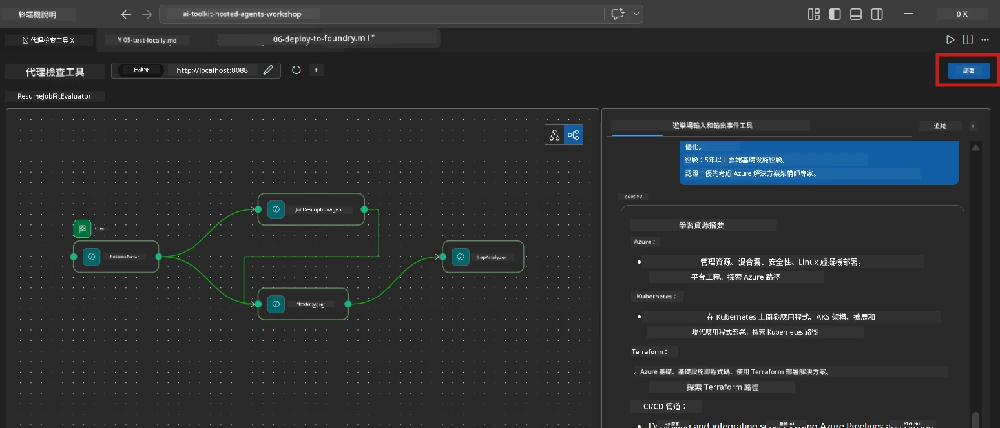
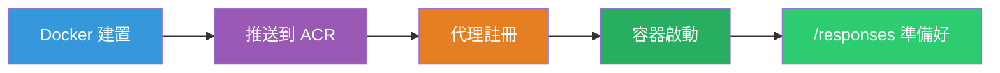
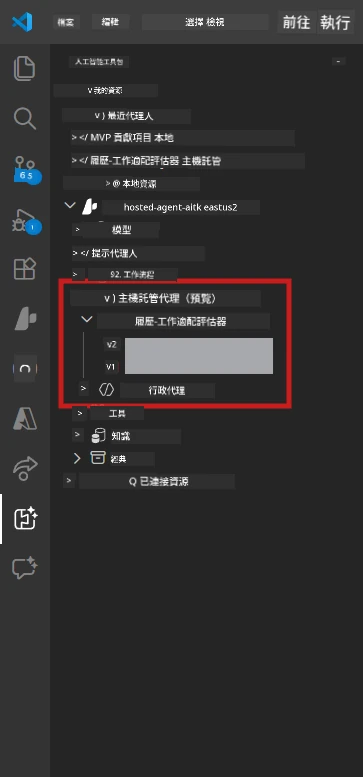

# Module 6 - 部署到 Foundry Agent 服務

在本模組中，您將本地測試過的多代理工作流程部署到 [Microsoft Foundry](https://learn.microsoft.com/azure/foundry/agents/concepts/hosted-agents) 作爲 **Hosted Agent**。部署過程會構建一個 Docker 容器映像，將其推送到 [Azure Container Registry (ACR)](https://learn.microsoft.com/azure/container-registry/container-registry-intro)，並在 [Foundry Agent Service](https://learn.microsoft.com/azure/foundry/agents/how-to/publish-agent) 中創建一個託管代理版本。

> **與實驗室 01 的主要區別：** 部署過程相同。Foundry 將您的多代理工作流程視為單一託管代理——複雜性在於容器內部，但部署界面爲相同的 `/responses` 端點。

---

## 前置條件檢查

部署前，請確認以下每項：

1. **代理通過本地初步測試：**
   - 您已完成 [Module 5](05-test-locally.md) 中所有 3 項測試，且工作流程輸出完整，包含缺口卡片及 Microsoft Learn URL。

2. **您擁有 [Azure AI User](https://learn.microsoft.com/azure/foundry/concepts/rbac-foundry) 角色：**
   - 在 [Lab 01, Module 2](../../lab01-single-agent/docs/02-create-foundry-project.md) 中分配。確認：
   - [Azure Portal](https://portal.azure.com) → 您的 Foundry **project** 資源 → **Access control (IAM)** → **Role assignments** → 確認您的帳戶列有 **[Azure AI User](https://aka.ms/foundry-ext-project-role)**。

3. **您已在 VS Code 中登入 Azure：**
   - 查看 VS Code 左下角帳號圖標，應可見您的帳號名稱。

4. **`agent.yaml` 具有正確的值：**
   - 打開 `PersonalCareerCopilot/agent.yaml` 並確認：
     ```yaml
     environment_variables:
       - name: PROJECT_ENDPOINT
         value: ${PROJECT_ENDPOINT}
       - name: MODEL_DEPLOYMENT_NAME
         value: ${MODEL_DEPLOYMENT_NAME}
     ```
   - 這些必須與您的 `main.py` 所讀取的環境變量相符。

5. **`requirements.txt` 使用正確版本：**
   ```
   agent-framework-azure-ai==1.0.0rc3
   agent-framework-core==1.0.0rc3
   azure-ai-agentserver-agentframework==1.0.0b16
   azure-ai-agentserver-core==1.0.0b16
   debugpy
   agent-dev-cli --pre
   ```

---

## 第 1 步：開始部署

### 選項 A：透過 Agent Inspector 部署（推薦）

如果代理正通過 F5 運行且 Agent Inspector 開啟中：

1. 查看 Agent Inspector 面板右上角。
2. 點擊 **Deploy** 按鈕（雲端圖示，向上箭頭 ↑）。
3. 部署嚮導打開。



### 選項 B：透過命令面板部署

1. 按 `Ctrl+Shift+P` 打開 <strong>命令面板</strong>。
2. 輸入：**Microsoft Foundry: Deploy Hosted Agent** 並選擇它。
3. 部署嚮導打開。

---

## 第 2 步：配置部署參數

### 2.1 選擇目標專案

1. 下拉列表顯示您的 Foundry 專案。
2. 選擇您全程使用的工作坊專案（例如 `workshop-agents`）。

### 2.2 選擇容器代理檔案

1. 系統會請您選擇代理進入點。
2. 瀏覽至 `workshop/lab02-multi-agent/PersonalCareerCopilot/` 並選擇 **`main.py`**。

### 2.3 配置資源

| 設置 | 推薦值 | 備註 |
|---------|------------------|-------|
| **CPU** | `0.25` | 預設值。多代理工作流程不需更多 CPU，因模型調用為 I/O 綁定 |
| <strong>記憶體</strong> | `0.5Gi` | 預設值。如添加大型資料處理工具，可提升至 `1Gi` |

---

## 第 3 步：確認並部署

1. 嚮導會顯示部署摘要。
2. 確認並點擊 **Confirm and Deploy**。
3. 在 VS Code 中查看部署進度。

### 部署期間發生了什麼

觀看 VS Code **Output** 面板（選擇「Microsoft Foundry」下拉選單）：


1. **Docker build** - 從您的 `Dockerfile` 構建容器：
   ```
   Step 1/6 : FROM python:3.14-slim
   Step 2/6 : WORKDIR /app
   ...
   Successfully built abc123def456
   ```

2. **Docker push** - 將映像推送至 ACR（首次部署約 1-3 分鐘）。

3. <strong>代理註冊</strong> - Foundry 使用 `agent.yaml` 中元資料創建託管代理。代理名稱為 `resume-job-fit-evaluator`。

4. <strong>容器啟動</strong> - 容器在 Foundry 的託管基礎設施中啟動，擁有系統管理身份。

> <strong>首次部署較慢</strong>（Docker 推送所有層）。後續部署會重用快取層並加快速度。

### 多代理特別說明

- **所有四個代理都在一個容器內。** Foundry 視為單一託管代理。WorkflowBuilder 圖形在內部運行。
- **MCP 調用為出站。** 容器需連網訪問 `https://learn.microsoft.com/api/mcp`。Foundry 託管基礎設施預設提供此連線。
- **[管理身份](https://learn.microsoft.com/python/api/overview/azure/identity-readme#managed-identity-support)。** 在託管環境中，`main.py` 中的 `get_credential()` 回傳 `ManagedIdentityCredential()`（因設定了 `MSI_ENDPOINT`）。此為自動配置。

---

## 第 4 步：驗證部署狀態

1. 打開 **Microsoft Foundry** 側邊欄（點擊活動欄中的 Foundry 圖標）。
2. 展開您專案下的 **Hosted Agents (Preview)**。
3. 找到 **resume-job-fit-evaluator**（或您的代理名稱）。
4. 點擊代理名稱 → 展開版本（例如 `v1`）。
5. 點擊該版本 → 查看 **Container Details** → **Status**：



| 狀態 | 含義 |
|--------|---------|
| **Started** / **Running** | 容器正在運行，代理已準備就緒 |
| **Pending** | 容器正在啟動（請等待 30-60 秒） |
| **Failed** | 容器啟動失敗（檢查日誌 - 下述說明） |

> <strong>多代理啟動所需時間較長</strong>，因容器啟動時需創建 4 個代理實例。「Pending」持續約 2 分鐘屬正常。

---

## 常見部署錯誤與解決方案

### 錯誤 1：權限被拒 - `agents/write`

```
Error: lacks the required data action 
Microsoft.CognitiveServices/accounts/AIServices/agents/write
```

**解決：** 在 <strong>專案</strong> 級別分配 **[Azure AI User](https://learn.microsoft.com/azure/foundry/concepts/rbac-foundry)** 角色。請參考 [Module 8 - 故障排除](08-troubleshooting.md) 中的詳細步驟。

### 錯誤 2：Docker 未啟動

```
Error: Docker build failed / Cannot connect to Docker daemon
```

**解決：**
1. 啟動 Docker Desktop。
2. 等待顯示「Docker Desktop is running」。
3. 驗證：執行 `docker info`。
4. **Windows：** 確保 Docker Desktop 設定中啟用了 WSL 2 後端。
5. 重試。

### 錯誤 3：Docker 構建期間 pip 安裝失敗

```
Error: Could not find a version that satisfies the requirement agent-dev-cli
```

**解決：** `requirements.txt` 中的 `--pre` 旗標在 Docker 中處理不同。請確保您的 `requirements.txt` 包含：
```
agent-dev-cli --pre
```

如果 Docker 仍然失敗，則創建 `pip.conf` 或透過建構參數傳遞 `--pre`。詳見 [Module 8](08-troubleshooting.md)。

### 錯誤 4：託管代理中 MCP 工具失效

如果缺口分析器（Gap Analyzer）在部署後停止產生 Microsoft Learn URL：

**根本原因：** 網路政策可能阻擋容器的 HTTPS 出站流量。

**解決方案：**
1. Foundry 預設配置通常不會有此問題。
2. 若發生，檢查 Foundry 專案虛擬網路中是否有阻擋 HTTPS 出站的 NSG。
3. MCP 工具內建備援 URL，代理仍會產出結果（但沒有即時 URL）。

---

### 檢查點

- [ ] VS Code 中的部署命令完成且無錯誤
- [ ] 代理在 Foundry 側邊欄的 **Hosted Agents (Preview)** 下出現
- [ ] 代理名稱爲 `resume-job-fit-evaluator`（或您自訂的名稱）
- [ ] 容器狀態顯示 **Started** 或 **Running**
- [ ] （若有錯誤）您已辨識錯誤、套用修正並成功重新部署

---

**上一節：** [05 - 本地測試](05-test-locally.md) · **下一節：** [07 - 在 Playground 驗證 →](07-verify-in-playground.md)

---

<!-- CO-OP TRANSLATOR DISCLAIMER START -->
**免責聲明**：  
本文件使用 AI 翻譯服務 [Co-op Translator](https://github.com/Azure/co-op-translator) 進行翻譯。儘管我們致力於準確性，但請注意，自動翻譯可能包含錯誤或不準確之處。原始語言文件應被視為權威來源。對於關鍵資訊，建議採用專業人工翻譯。我們不對因使用本翻譯而引起的任何誤解或誤釋負責。
<!-- CO-OP TRANSLATOR DISCLAIMER END -->