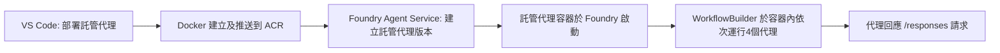
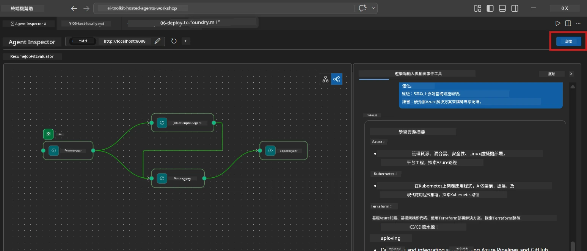
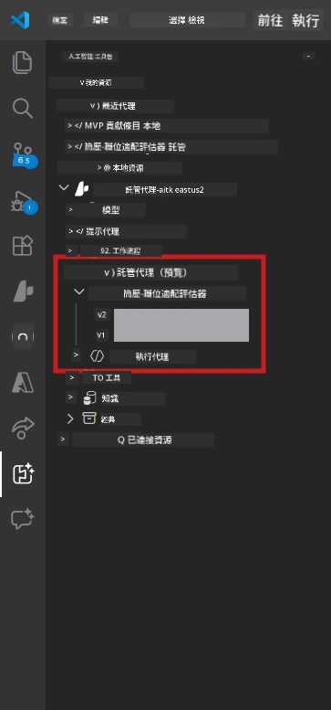

# 模組 6 - 部署到 Foundry Agent 服務

⏱️ 約 10 分鐘

在本模組中，您將本地測試的多代理工作流程部署到 [Microsoft Foundry](https://learn.microsoft.com/azure/foundry/agents/concepts/hosted-agents) 作為 <strong>托管代理</strong>。部署過程會建立 Docker 容器映像，推送至 [Azure Container Registry (ACR)](https://learn.microsoft.com/azure/container-registry/container-registry-intro)，並在 [Foundry Agent Service](https://learn.microsoft.com/azure/foundry/agents/how-to/publish-agent) 中創建托管代理版本。

> **與實驗 01 的主要差異：** 部署過程相同。Foundry 將您的多代理工作流程視為單一托管代理 — 複雜度在容器內，但部署介面相同的 `/responses` 端點。

### 部署流程


```mermaid
flowchart LR
    A[VS Code: 部署託管代理] --> B[Docker 建立及推送到 ACR]
    B --> C[Foundry Agent Service: 建立託管代理版本]
    C --> D[託管代理容器於 Foundry 啟動]
    D --> E[WorkflowBuilder 於容器內依次運行4個代理]
    E --> F[代理回應 /responses 請求]
```

---

## 前置檢查

部署前請確認以下每項：

1. **代理通過本地煙霧測試：**
   - 您已完成 [模組 5](05-test-locally.md) 裡的全部 3 項測試，且工作流程產生完整輸出含差距卡和 Microsoft Learn URL。

2. **您擁有 [Foundry 使用者](https://learn.microsoft.com/azure/foundry/concepts/rbac-foundry) 角色**（部署需至少在專案範圍擁有 **Foundry 專案經理**）：

   > **注意：** Foundry RBAC 角色近期重命名 — **Foundry 使用者**、**Foundry 擁有者** 和 **Foundry 專案經理** 原稱 Azure AI 使用者、Azure AI 擁有者 和 Azure AI 專案經理。角色 ID 與權限不變。

   - 請在 [Azure 入口網站](https://portal.azure.com) → 您的 Foundry <strong>專案</strong> 資源 → **存取控制 (IAM)** → <strong>角色指派</strong> → 確認帳號具備 **Foundry 使用者** (或更高) 角色。

3. **您已在 VS Code 中登入 Azure：**
   - 查看 VS Code 左下角帳戶圖示，應顯示您的帳戶名稱。

4. **`agent.yaml` 填入正確值：**
   - 開啟 `PersonalCareerCopilot/agent.yaml` 並確認：
     ```yaml
     environment_variables:
       - name: AZURE_AI_MODEL_DEPLOYMENT_NAME
         value: ${AZURE_AI_MODEL_DEPLOYMENT_NAME}
     ```
   - 此處不列出 `FOUNDRY_PROJECT_ENDPOINT` — Foundry 執行時注入。只需宣告 `AZURE_AI_MODEL_DEPLOYMENT_NAME`。

5. **`requirements.txt` 指定正確版本：**
   ```
   agent-framework-foundry
   agent-framework-foundry-hosting
   mcp<2,>=1.24.0
   debugpy
   ```

---

## 步驟 1：開始部署

### 選項 A：從代理檢視器部署（推薦）

如果您是用 F5 啟動且代理檢視器已開啟：

1. 查看代理檢視器面板的 <strong>右上角</strong>。
2. 按下 <strong>部署</strong> 按鈕（雲朵圖示帶向上箭頭 ↑）。
3. 部署精靈將開啟。



### 選項 B：從命令面板部署

1. 按 `Ctrl+Shift+P` 開啟 <strong>命令面板</strong>。
2. 輸入：**Foundry Toolkit: Deploy Hosted Agent** 並選擇執行。
3. 部署精靈將開啟。

---

## 步驟 2：設定部署

### 2.1 選擇目標專案

1. 下拉選單會顯示您的 Foundry 專案。
2. 選擇工作坊中使用的專案（例如 `workshop-agents`）。

### 2.2 選擇容器代理檔案

1. 系統會要求您選擇代理的進入點。
2. 導航到 `workshop/lab02-multi-agent/PersonalCareerCopilot/`，選擇 **`main.py`**。

### 2.3 配置資源

| 設定 | 推薦值 | 備註 |
|---------|------------------|-------|
| <strong>部署方式</strong> | <strong>容器</strong> (推薦) 或 <strong>程式碼</strong> | 容器建置 Docker 映像；程式碼會上傳 ZIP 檔 (預覽) |
| <strong>容器登錄</strong> | **預設 ACR** | Foundry 會為您建立並管理一個 |
| **CPU** | `0.25` | 預設。多代理工作流程不需更多 CPU，因模型呼叫是 I/O 綁定 |
| <strong>記憶體</strong> | `0.5Gi` | 預設。如加入大型資料處理工具可增至 `1Gi` |

---

## 步驟 3：確認並部署

1. 精靈會顯示部署摘要。
2. 檢閱後點選 <strong>確認並部署</strong>。
3. 於 VS Code 觀察進度。

### 部署過程中發生什麼

請關注 VS Code 的 <strong>輸出</strong> 面板（選擇「Microsoft Foundry」下拉選單）：

1. **Docker build** - 根據您的 `Dockerfile` 建構容器
   ```
   Step 1/6 : FROM python:3.12-slim
   Step 2/6 : WORKDIR /app
   ...
   Successfully built abc123def456
   ```

2. **Docker push** - 將映像推送到 ACR（首次部署約 1-3 分鐘）。

3. <strong>代理註冊</strong> - Foundry 使用 `agent.yaml` 元資料建立托管代理。代理名稱為 `resume-job-fit-evaluator`。

4. <strong>容器啟動</strong> - 容器在 Foundry 的受管理基礎設施啟動，使用系統管理身分。

> <strong>首次部署較慢</strong>（Docker 會推送所有層）。後續部署會重複使用緩存層而加快。

### 多代理特有注意事項

- **四個代理均置於單一容器。** Foundry 視為一個托管代理。WorkflowBuilder 圖表於內部運行。
- **MCP 呼叫為外部連線。** 容器需上網訪問 `https://learn.microsoft.com/api/mcp`。Foundry 的受管理基礎設施預設提供此網路連通性。
- **[管理身份](https://learn.microsoft.com/azure/foundry/agents/concepts/agent-identity)。** Foundry 在部署時自動為每個托管代理建立 **專用的 per-agent Entra 身份**。在托管環境中，`DefaultAzureCredential` 會自動解決為該代理身份 — 無需手動設置管理身份。

---

## 步驟 4：驗證部署狀態

1. 開啟 **Microsoft Foundry** 側邊欄（點擊活動列上的 Foundry 圖示）。
2. 展開您專案下的 **托管代理 (預覽)**。
3. 找到 **resume-job-fit-evaluator**（或您的代理名稱）。
4. 點擊代理名稱 → 展開版本（如 `v1`）。
5. 點擊版本 → 查看 <strong>容器詳情</strong> → <strong>狀態</strong>：



| 狀態 | 意義 |
|--------|---------|
| **active** | 代理正在運行，準備接受請求 |
| **creating** | 容器啟動中（請等待 30–60 秒） |
| **failed** | 容器啟動失敗（請檢查日誌—見下述） |

> **注意：** VS Code 側邊欄可能顯示「Running」或「Started」標籤，API 狀態使用的是 `active` / `creating`。兩者表示相同狀態。

> <strong>多代理啟動時間較長</strong>，因為容器啟動時會創建 4 個代理實例。`creating` 狀態維持最大 2 分鐘為正常。

---

## 常見部署錯誤與修正

### 錯誤 1：權限拒絕 - `agents/write`

```
Error: lacks the required data action 
Microsoft.CognitiveServices/accounts/AIServices/agents/write
```

**修正：** 在 <strong>專案層級</strong> 指派 **[Foundry 使用者](https://learn.microsoft.com/azure/foundry/concepts/rbac-foundry)** 角色（前稱 **Azure AI 使用者**）。詳見 [模組 8 - 疑難排解](08-troubleshooting.md) 步驟說明。

### 錯誤 2：Docker 未啟動

```
Error: Docker build failed / Cannot connect to Docker daemon
```

**修正：**
1. 啟動 Docker Desktop。
2. 等待顯示「Docker Desktop is running」。
3. 確認：`docker info`
4. **Windows:** 確保 Docker Desktop 設定中啟用 WSL 2 後端。
5. 重新嘗試部署。

### 錯誤 3：Docker 建置時 pip install 失敗

```
Error: Could not find a version that satisfies the requirement agent-framework-foundry
```

**修正：** 確認 `requirements.txt` 與下列相符：
```
agent-framework-foundry
agent-framework-foundry-hosting
mcp<2,>=1.24.0
debugpy
```

若仍建置失敗，可能是 Docker 網路阻擋 PyPI，請檢查 `docker info` 代理設定。

### 錯誤 4：MCP 工具於托管代理中失效

若部署後 Gap Analyzer 停止產生 Microsoft Learn URL：

**根本原因：** 容器的出站 HTTPS 連線可能遭網路政策封鎖。

**修正：**
1. Foundry 預設配置通常不會出現此問題。
2. 若遇此問題，請檢查 Foundry 專案的虛擬網路是否有 NSG 封鎖出站 HTTPS。
3. MCP 工具有內建備用 URL，代理仍會產出結果（無實時 URL）。

---

### 檢查點

- [ ] VS Code 中部署指令無錯誤完成
- [ ] 代理在 Foundry 側邊欄的 **托管代理 (預覽)** 中顯示
- [ ] 代理名稱為 `resume-job-fit-evaluator`（或您選擇的名稱）
- [ ] 容器狀態顯示 **Started** 或 **Running**
- [ ] （若有錯誤）您已辨識錯誤，套用修正並成功重新部署

---

**上一篇：** [05 - 本地測試](05-test-locally.md) · **下一篇：** [07 - 在遊樂場驗證 →](07-verify-in-playground.md)

---

<!-- CO-OP TRANSLATOR DISCLAIMER START -->
**免責聲明**：
本文件使用 AI 翻譯服務 [Co-op Translator](https://github.com/Azure/co-op-translator) 進行翻譯。雖然我們力求準確，但請注意，自動翻譯可能包含錯誤或不準確之處。原始文件的母語版本應被視為權威來源。對於重要資訊，建議尋求專業人工翻譯。我們不對因使用本翻譯而引起的任何誤解或曲解承擔責任。
<!-- CO-OP TRANSLATOR DISCLAIMER END -->