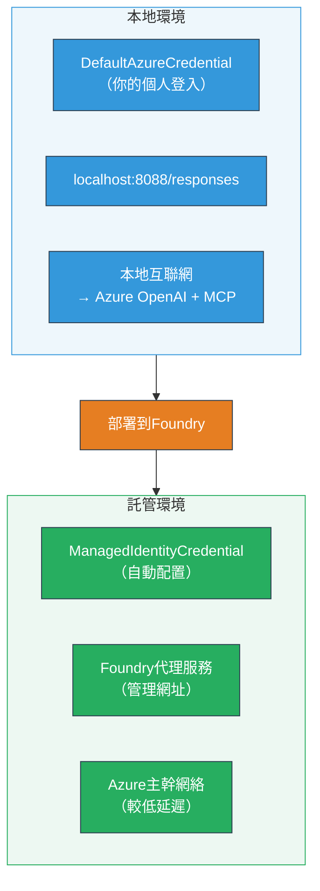

# Module 7 - 在 Playground 中驗證

在本模組中，您將在 **VS Code** 和 **[Foundry Portal](https://ai.azure.com)** 兩者中測試已部署的多代理工作流程，確認代理行為與本地測試一致。

---

## 為什麼部署後還要驗證？

您的多代理工作流程在本地運行完美，為什麼還要再次測試？因為託管環境在多個方面有所不同：


| 差異 | 本地 | 託管 |
|-----------|-------|--------|
| <strong>身份識別</strong> | [`DefaultAzureCredential`](https://learn.microsoft.com/azure/developer/python/sdk/authentication/credential-chains#defaultazurecredential-overview)（您個人的登入） | [`ManagedIdentityCredential`](https://learn.microsoft.com/python/api/overview/azure/identity-readme#managed-identity-support)（自動配置） |
| <strong>端點</strong> | `http://localhost:8088/responses` | [Foundry Agent Service](https://learn.microsoft.com/azure/foundry/agents/concepts/hosted-agents) 端點（管理 URL） |
| <strong>網絡</strong> | 本地機器 → Azure OpenAI + MCP 出站 | Azure 骨幹網（服務間延遲較低） |
| **MCP 連接性** | 本地互聯網 → `learn.microsoft.com/api/mcp` | 容器出站 → `learn.microsoft.com/api/mcp` |

如果有任何環境變數配置錯誤、RBAC 權限不同或被阻擋 MCP 出站流量，都能在此被發現。

---

## 選項 A：在 VS Code Playground 中測試（推薦先做）

[Foundry 擴充功能](https://marketplace.visualstudio.com/items?itemName=TeamsDevApp.vscode-ai-foundry)包含一個整合的 Playground，讓您無需離開 VS Code 即可與已部署的代理聊天。

### 步驟 1：導覽至您的託管代理

1. 點選 VS Code <strong>活動列</strong>（左側邊欄）中的 **Microsoft Foundry** 圖示，以開啟 Foundry 面板。
2. 展開您連接的專案（例如 `workshop-agents`）。
3. 展開 **Hosted Agents (Preview)**。
4. 您應該能看到您的代理名稱（例如 `resume-job-fit-evaluator`）。

### 步驟 2：選擇版本

1. 點選代理名稱以展開其版本。
2. 點選您已部署的版本（例如 `v1`）。
3. 「詳細面板」將打開並顯示容器詳情。
4. 確認狀態為 **Started** 或 **Running**。

### 步驟 3：開啟 Playground

1. 在詳細面板中，點擊 **Playground** 按鈕（或右鍵點擊版本 → **Open in Playground**）。
2. 一個聊天介面將在 VS Code 標籤中打開。

### 步驟 4：執行您的冒煙測試

使用與[模組 5](05-test-locally.md)中相同的 3 個測試。將每個訊息輸入 Playground 輸入框並按 **Send**（或 **Enter**）。

#### 測試 1 - 全履歷＋職務說明（標準流程）

貼上模組 5 中測試 1（Jane Doe + Contoso Ltd 高級雲端工程師）的完整履歷＋職務說明提示。

**預期：**
- 配合度分數與細分計算（100 分制）
- 配對技能區塊
- 缺漏技能區塊
- <strong>每個缺漏技能各有一張差距卡</strong>，附有 Microsoft Learn 連結
- 附帶時間軸的學習路線圖

#### 測試 2 - 快速短測（最少輸入）

```
RESUME: 3 years Python developer, knows Django and PostgreSQL, no cloud experience.

JOB: Cloud DevOps Engineer requiring AWS, Kubernetes, Terraform, CI/CD. 5 years needed.
```

**預期：**
- 配合度分數較低（< 40）
- 誠實評估，附分階段學習路徑
- 多張差距卡（AWS、Kubernetes、Terraform、CI/CD、經驗差距）

#### 測試 3 - 高配合度候選人

```
RESUME:
10 years Azure Cloud Architect. AZ-305 certified. Expert in AKS, Terraform, Azure DevOps, 
Azure Functions, Helm, Prometheus, Grafana, Python, Go. Led platform team of 8.

JOB:
Senior Cloud Engineer. Required: AKS, Terraform, Azure DevOps, Python. Preferred: Helm, Go.
5+ years experience. AZ-305 preferred.
```

**預期：**
- 配合度分數高（≥ 80）
- 以面試準備和完善提昇為主
- 少量或無差距卡
- 短時間軸，專注準備

### 步驟 5：與本地結果比較

打開您模組 5 保存的本地回應筆記或瀏覽器分頁，對每個測試：

- 回應是否具有<strong>相同結構</strong>（配合度分數、差距卡、路線圖）？
- 是否遵循<strong>相同的打分標準</strong>（100 分制細分）？
- 差距卡中是否仍然有<strong>Microsoft Learn 連結</strong>？
- 是否有<strong>每個缺漏技能各一張差距卡</strong>（無截斷）？

> <strong>少許措辭差異屬正常</strong>－模型非確定性，重點是結構、打分一致性與 MCP 工具的使用。

---

## 選項 B：在 Foundry Portal 測試

[Foundry Portal](https://ai.azure.com) 提供基於網頁的 Playground，適合與團隊成員及持份者分享。

### 步驟 1：打開 Foundry Portal

1. 開啟瀏覽器並前往 [https://ai.azure.com](https://ai.azure.com)。
2. 使用您於整個工作坊中相同的 Azure 帳戶登入。

### 步驟 2：導覽至您的專案

1. 首頁的左側邊欄找到 **Recent projects**。
2. 點選您的專案名稱（例如 `workshop-agents`）。
3. 若未找到，點選 **All projects** 並搜尋您的專案。

### 步驟 3：尋找已部署的代理

1. 在專案左側導航，點選 **Build** → **Agents**（或尋找 **Agents** 區塊）。
2. 應能看到代理列表。找到您的已部署代理（例如 `resume-job-fit-evaluator`）。
3. 點選代理名稱以開啟其詳細頁面。

### 步驟 4：開啟 Playground

1. 代理詳細頁面頂端工具列。
2. 點擊 **Open in playground**（或 **Try in playground**）。
3. 開啟聊天介面。

### 步驟 5：執行相同的冒煙測試

重複 VS Code Playground 部分的全部 3 項測試。將回應與本地結果（模組 5）及 VS Code Playground 結果（選項 A）做比較。

---

## 多代理專屬驗證

除了基本正確性，還應驗證以下多代理特有行為：

### MCP 工具執行

| 檢驗項目 | 驗證方式 | 通過條件 |
|-------|---------|---------|
| MCP 調用成功 | 差距卡含有 `learn.microsoft.com` 連結 | 使用真實 URL，而非備用訊息 |
| 多次 MCP 調用 | 各高/中優先差距都有資源 | 不只第一張差距卡有連結 |
| MCP 備援生效 | 若缺少連結，檢查備用文字 | 代理仍產生差距卡（有無 URL 均可） |

### 代理協調

| 檢驗項目 | 驗證方式 | 通過條件 |
|-------|---------|---------|
| 四個代理皆運行 | 輸出含配合度分數及差距卡 | 分數由 MatchingAgent 提供，差距卡由 GapAnalyzer 提供 |
| 並行分流 | 回應時間合理（< 2 分鐘） | 超過 3 分鐘可能並行執行失效 |
| 數據流完整性 | 差距卡參考配對報告中的技能 | 無在職務說明中未出現的幻覺技能 |

---

## 驗證評分標準

使用此評分標準評估您的多代理工作流程託管行為：

| # | 標準 | 通過條件 | 是否通過？ |
|---|-------|----------|------------|
| 1 | <strong>功能正確</strong> | 代理能對履歷＋職務描述回應配合度分數與差距分析 | |
| 2 | <strong>打分一致性</strong> | 配合度分數使用 100 分制並具細分計算 | |
| 3 | <strong>差距卡完整性</strong> | 每個缺漏技能有一張卡（無截斷或合併） | |
| 4 | **MCP 工具整合** | 差距卡包含真實 Microsoft Learn 連結 | |
| 5 | <strong>結構一致性</strong> | 輸出結構與本地及託管執行匹配 | |
| 6 | <strong>回應時間</strong> | 託管代理在 2 分鐘內完成完整評估回應 | |
| 7 | <strong>無錯誤</strong> | 無 HTTP 500 錯誤、逾時或空回應 | |

> 「通過」意指所有 3 項冒煙測試於任一 Playground（VS Code 或 Portal）中全數符合七項標準。

---

## Playground 問題排解

| 症狀 | 可能原因 | 修復方法 |
|---------|-------------|-----|
| Playground 無法載入 | 容器狀態非「Started」 | 回到 [模組 6](06-deploy-to-foundry.md)，確認部署狀態。狀態為「Pending」請稍候 |
| 代理回應空白 | 模型部署名稱不符 | 檢查 `agent.yaml` 中 `environment_variables` 裡的 `MODEL_DEPLOYMENT_NAME` 是否與部署模型吻合 |
| 代理回應錯誤訊息 | 權限缺失 ([RBAC](https://learn.microsoft.com/azure/foundry/concepts/rbac-foundry)) | 在專案範圍內賦予 **[Azure AI User](https://aka.ms/foundry-ext-project-role)** 角色 |
| 差距卡無 Microsoft Learn 連結 | MCP 出站被阻擋或 MCP 服務不可用 | 確認容器能連接 `learn.microsoft.com`。參閱 [模組 8](08-troubleshooting.md) |
| 只出現 1 張差距卡（被截斷） | GapAnalyzer 指示缺少「CRITICAL」區塊 | 回顧 [模組 3，步驟 2.4](03-configure-agents.md) |
| 配合度分數與本地差異巨大 | 部署的模型或指示不同 | 比較 `agent.yaml` 環境變數與本地 `.env`，需要重新部署 |
| Portal 中顯示「Agent not found」 | 部署仍在傳播或失敗 | 等待 2 分鐘並刷新頁面。若仍未出現，從 [模組 6](06-deploy-to-foundry.md) 重新部署 |

---

### 檢查點

- [ ] 已在 VS Code Playground 測試代理，3 項冒煙測試均通過
- [ ] 已在 [Foundry Portal](https://ai.azure.com) Playground 測試代理，3 項冒煙測試均通過
- [ ] 回應結構與本地測試一致（配合度分數、差距卡、路線圖）
- [ ] 差距卡中有 Microsoft Learn 連結（MCP 工具在託管環境中運作正常）
- [ ] 每個缺漏技能有一張獨立差距卡（無截斷）
- [ ] 測試過程中無錯誤或逾時
- [ ] 完成驗證評分標準（七項標準全數通過）

---

**前一章節：** [06 - 部署至 Foundry](06-deploy-to-foundry.md) · **下一章節：** [08 - 疑難排解 →](08-troubleshooting.md)

---

<!-- CO-OP TRANSLATOR DISCLAIMER START -->
**免責聲明**：  
本文件使用 AI 翻譯服務 [Co-op Translator](https://github.com/Azure/co-op-translator) 進行翻譯。雖然我們力求準確，但請注意自動翻譯可能包含錯誤或不準確之處。原文的母語版本應視為權威來源。對於關鍵資訊，建議採用專業人工翻譯。我們不對因使用本翻譯而引起的任何誤解或誤釋承擔責任。
<!-- CO-OP TRANSLATOR DISCLAIMER END -->