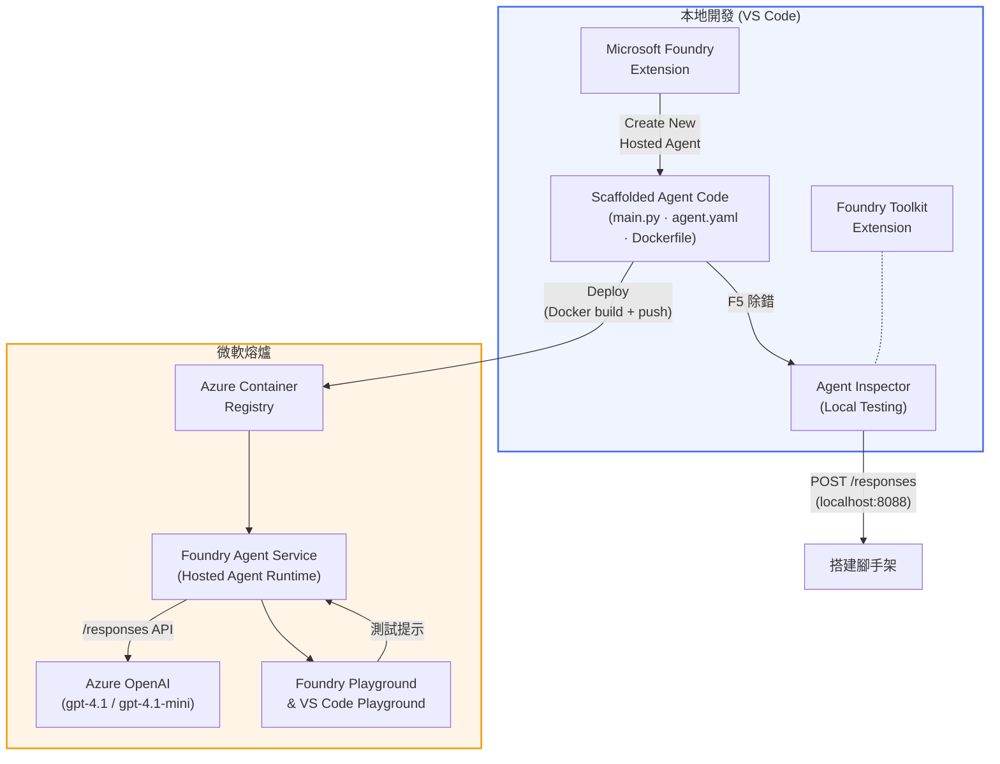

# Foundry 工具包 + Foundry 托管代理工作坊

[](https://www.python.org/)
[](https://github.com/microsoft/agents)
[](https://learn.microsoft.com/azure/foundry/agents/concepts/hosted-agents)
[](https://ai.azure.com/)
[](https://learn.microsoft.com/azure/ai-services/openai/)
[](https://learn.microsoft.com/cli/azure/install-azure-cli)
[](https://learn.microsoft.com/azure/developer/azure-developer-cli/install-azd)
[](https://www.docker.com/)
[](https://marketplace.visualstudio.com/items?itemName=ms-windows-ai-studio.windows-ai-studio)
[](LICENSE)

在 **Microsoft Foundry 代理服務** 以 <strong>托管代理</strong> 方式建立、測試及部署 AI 代理 — 全程在 VS Code 內使用 **Microsoft Foundry 擴充套件** 與 **Foundry 工具包** 完成。

> **托管代理目前處於預覽階段。** 支援的地區有限，詳見 [地區可用性](https://learn.microsoft.com/azure/foundry/agents/concepts/hosted-agents#region-availability)。

> 每個實驗的 `agent/` 資料夾由 Foundry 擴充套件 <strong>自動生成</strong>，你可以自訂程式碼、在本機測試與部署。

### 🌐 多語言支援

#### 透過 GitHub Action 支援（自動且始終保持最新）

<!-- CO-OP TRANSLATOR LANGUAGES TABLE START -->
[阿拉伯文](../ar/README.md) | [孟加拉語](../bn/README.md) | [保加利亞語](../bg/README.md) | [緬甸語 (緬甸)](../my/README.md) | [中文 (簡體)](../zh-CN/README.md) | [中文 (繁體，香港)](../zh-HK/README.md) | [中文 (繁體，澳門)](../zh-MO/README.md) | [中文 (繁體，台灣)](./README.md) | [克羅埃西亞語](../hr/README.md) | [捷克語](../cs/README.md) | [丹麥語](../da/README.md) | [荷蘭語](../nl/README.md) | [愛沙尼亞語](../et/README.md) | [芬蘭語](../fi/README.md) | [法語](../fr/README.md) | [德語](../de/README.md) | [希臘語](../el/README.md) | [希伯來語](../he/README.md) | [印地語](../hi/README.md) | [匈牙利語](../hu/README.md) | [印尼語](../id/README.md) | [義大利語](../it/README.md) | [日語](../ja/README.md) | [坎納達語](../kn/README.md) | [高棉語](../km/README.md) | [韓語](../ko/README.md) | [立陶宛語](../lt/README.md) | [馬來語](../ms/README.md) | [馬拉雅拉姆語](../ml/README.md) | [馬拉地語](../mr/README.md) | [尼泊爾語](../ne/README.md) | [奈及利亞皮欽語](../pcm/README.md) | [挪威語](../no/README.md) | [波斯語 (法爾西語)](../fa/README.md) | [波蘭語](../pl/README.md) | [葡萄牙語 (巴西)](../pt-BR/README.md) | [葡萄牙語 (葡萄牙)](../pt-PT/README.md) | [旁遮普語 (古魯穆奇體)](../pa/README.md) | [羅馬尼亞語](../ro/README.md) | [俄語](../ru/README.md) | [塞爾維亞語 (西里爾字母)](../sr/README.md) | [斯洛伐克語](../sk/README.md) | [斯洛維尼亞語](../sl/README.md) | [西班牙語](../es/README.md) | [斯瓦希里語](../sw/README.md) | [瑞典語](../sv/README.md) | [他加祿語 (菲律賓語)](../tl/README.md) | [泰米爾語](../ta/README.md) | [泰盧固語](../te/README.md) | [泰語](../th/README.md) | [土耳其語](../tr/README.md) | [烏克蘭語](../uk/README.md) | [烏爾都語](../ur/README.md) | [越南語](../vi/README.md)

> **想在本機複製？**
>
> 本儲存庫包含超過 50 種語言的翻譯，會顯著增加下載大小。若想不帶翻譯內容複製，可使用稀疏簽出：
>
> **Bash / macOS / Linux：**
> ```bash
> git clone --filter=blob:none --sparse https://github.com/microsoft-foundry/Foundry_Toolkit_for_VSCode_Lab.git
> cd Foundry_Toolkit_for_VSCode_Lab
> git sparse-checkout set --no-cone '/*' '!translations' '!translated_images'
> ```
>
> **CMD (Windows)：**
> ```cmd
> git clone --filter=blob:none --sparse https://github.com/microsoft-foundry/Foundry_Toolkit_for_VSCode_Lab.git
> cd Foundry_Toolkit_for_VSCode_Lab
> git sparse-checkout set --no-cone "/*" "!translations" "!translated_images"
> ```
>
> 這樣可以讓你以更快速的下載速度取得完成課程所需的全部內容。
<!-- CO-OP TRANSLATOR LANGUAGES TABLE END -->

---

## 架構


```mermaid
flowchart TB
    subgraph Local["本地開發 (VS Code)"]
        direction TB
        FE["Microsoft Foundry
        Extension"]
        FoundryToolkit["Foundry Toolkit
        Extension"]
        Scaffold["Scaffolded Agent Code
        (main.py · agent.yaml · Dockerfile)"]
        Inspector["Agent Inspector
        (Local Testing)"]
        FE -- "Create New
        Hosted Agent" --> Scaffold
        Scaffold -- "F5 除錯" --> Inspector
        FoundryToolkit -.- Inspector
    end

    subgraph Cloud["微軟熔爐"]
        direction TB
        ACR["Azure Container
        Registry"]
        AgentService["Foundry Agent Service
        (Hosted Agent Runtime)"]
        Model["Azure OpenAI
        (gpt-4.1 / gpt-4.1-mini)"]
        Playground["Foundry Playground
        & VS Code Playground"]
        ACR --> AgentService
        AgentService -- "/responses API" --> Model
        AgentService --> Playground
    end

    Scaffold -- "Deploy
    (Docker build + push)" --> ACR
    Inspector -- "POST /responses
    (localhost:8088)" --> 搭建腳手架
    Playground -- "測試提示" --> AgentService

    style Local fill:#f0f4ff,stroke:#4a6cf7,stroke-width:2px
    style Cloud fill:#fff4e6,stroke:#f59e0b,stroke-width:2px
```

**流程：** Foundry 擴充套件生成代理 → 你自訂程式碼與指令 → 利用 Agent Inspector 在本機測試 → 部署至 Foundry (Docker 映像被推送至 ACR) → 在 Playground 中驗證。

---

## 你將構建的內容

| 實驗 | 描述 | 狀態 |
|-----|-------------|--------|
| **實驗 01 - 單一代理** | 建立 **「以執行長角度解說」代理**，本機測試，並部署至 Foundry | ✅ 可用 |
| **實驗 02 - 多代理工作流程** | 建立 **「履歷 → 職務適配評估」** — 4 個代理協作評分履歷適配度並產生學習路線圖 | ✅ 可用 |

---

## 認識執行長代理

在這個工作坊中你將建立 **「以執行長角度解說」代理** — 一個 AI 代理，能將晦澀難懂的技術術語轉換成平靜且適合董事會的摘要。說實話，誰想聽到「v3.2 版本引入的同步呼叫導致的執行緒池耗盡」這種話？

我在多次完美撰寫的事故報告換來「所以……網站是掛了還是沒掛？」這種回答後，建立了這個代理。

### 工作原理

你提供它技術更新訊息。它會回傳三個要點的執行長摘要 — 無術語，無堆疊追蹤，無存在主義恐懼。只有 <strong>發生了什麼事</strong>、<strong>業務影響</strong> 和 <strong>下一步</strong>。

### 示範

**你說：**
> 「API 延遲因 v3.2 引入的同步呼叫導致執行緒池耗盡而增加。」

**代理回答：**

> **執行長摘要：**
> - **發生了什麼事：** 最新發佈後，系統變慢了。
> - **業務影響：** 部分用戶使用服務時體驗到延遲。
> - **下一步：** 已回滾該變更，並準備修復後重新部署。

### 為什麼選這個代理？

它是個死板單一功能的代理 — 非常適合學習完整的托管代理工作流程，而不會被複雜工具鏈纏住。坦白說？每個工程團隊都應該有這樣一個代理。

---

## 工作坊結構

```
📂 Foundry_Toolkit_for_VSCode_Lab/
├── 📄 README.md                      ← You are here
└── 📂 workshop/
    ├── 📂 lab01-single-agent/        ← Full lab: docs + agent code
    │   ├── README.md                 ← Hands-on lab instructions
    │   ├── 📂 docs/                  ← Step-by-step tutorial modules
    │   │   ├── 00-prerequisites.md
    │   │   ├── 01-setup.md
    │   │   ├── 02-create-hosted-agent.md
    │   │   ├── 03-configure-and-code.md
    │   │   ├── 04-test-locally.md
    │   │   ├── 05-deploy-to-foundry.md
    │   │   ├── 06-verify-in-playground.md
    │   │   ├── 07-summary.md
    │   │   └── 08-troubleshooting.md
    │   └── 📂 agent/                 ← Reference solution (auto-scaffolded by Foundry extension)
    │       ├── agent.yaml
    │       ├── Dockerfile
    │       ├── main.py
    │       └── requirements.txt
    └── 📂 lab02-multi-agent/         ← Resume → Job Fit Evaluator
        ├── README.md                 ← Hands-on lab instructions (end-to-end)
        ├── 📂 docs/                  ← Step-by-step tutorial modules
        │   ├── 00-prerequisites.md
        │   ├── 01-understand-multi-agent.md
        │   ├── 02-scaffold-multi-agent.md
        │   ├── 03-configure-agents.md
        │   ├── 04-orchestration-patterns.md
        │   ├── 05-test-locally.md
        │   ├── 06-deploy-to-foundry.md
        │   ├── 07-verify-in-playground.md
        │   └── 08-troubleshooting.md
        └── 📂 PersonalCareerCopilot/ ← Reference solution (multi-agent workflow)
            ├── agent.yaml
            ├── Dockerfile
            ├── main.py
            └── requirements.txt
```

> **注意：** 每個實驗裡的 `agent/` 資料夾是當你從命令面板執行 `Microsoft Foundry: Create a New Hosted Agent` 時，由 **Microsoft Foundry 擴充套件** 生成。然後你會根據代理的指令、工具和設定來自訂這些檔案。實驗 01 引導你從零開始重新建立此資料夾。

---

## 開始使用

### 1. 複製此儲存庫

```bash
git clone https://github.com/microsoft-foundry/Foundry_Toolkit_for_VSCode_Lab.git
cd Foundry_Toolkit_for_VSCode_Lab
```

### 2. 設置 Python 虛擬環境

```bash
python -m venv venv
```

啟動它：

- **Windows (PowerShell)：**
  ```powershell
  .\venv\Scripts\Activate.ps1
  ```
- **macOS / Linux：**
  ```bash
  source venv/bin/activate
  ```

### 3. 安裝依賴套件

```bash
pip install -r workshop/lab01-single-agent/agent/requirements.txt
```

### 4. 配置環境變數

複製 agent 資料夾內的範例 `.env` 檔案並填入你的數值：

```bash
cp workshop/lab01-single-agent/agent/.env.example workshop/lab01-single-agent/agent/.env
```

編輯 `workshop/lab01-single-agent/agent/.env`：

```env
AZURE_AI_PROJECT_ENDPOINT=https://<your-account>.services.ai.azure.com/api/projects/<your-project>
AZURE_AI_MODEL_DEPLOYMENT_NAME=<your-model-deployment-name>
```

### 5. 按步驟完成實驗課程

每個實驗包含獨立模組。先從 **實驗 01** 學習基礎，接著進入 **實驗 02** 體驗多代理工作流程。

#### 實驗 01 - 單一代理 ([完整指示](workshop/lab01-single-agent/README.md))

| # | 模組 | 連結 |
|---|--------|------|
| 1 | 閱讀先決條件 | [00-prerequisites.md](workshop/lab01-single-agent/docs/00-prerequisites.md) |
| 2 | 安裝 Foundry 工具包和 Foundry 擴充套件 | [01-setup.md](workshop/lab01-single-agent/docs/01-setup.md) |
| 3 | 建立 Foundry 專案 | [01-setup.md](workshop/lab01-single-agent/docs/01-setup.md) |
| 4 | 建立托管代理 | [02-create-hosted-agent.md](workshop/lab01-single-agent/docs/02-create-hosted-agent.md) |
| 5 | 配置指令與環境 | [03-configure-and-code.md](workshop/lab01-single-agent/docs/03-configure-and-code.md) |
| 6 | 在本機測試 | [04-test-locally.md](workshop/lab01-single-agent/docs/04-test-locally.md) |
| 7 | 部署至 Foundry | [05-deploy-to-foundry.md](workshop/lab01-single-agent/docs/05-deploy-to-foundry.md) |
| 8 | 在 playground 驗證 | [06-verify-in-playground.md](workshop/lab01-single-agent/docs/06-verify-in-playground.md) |
| 9 | 疑難排解 | [08-troubleshooting.md](workshop/lab01-single-agent/docs/08-troubleshooting.md) |

#### 實驗 02 - 多代理工作流程 ([完整指示](workshop/lab02-multi-agent/README.md))

| # | 模組 | 連結 |
|---|--------|------|
| 1 | 先決條件 (實驗 02) | [00-prerequisites.md](workshop/lab02-multi-agent/docs/00-prerequisites.md) |
| 2 | 了解多代理架構 | [01-understand-multi-agent.md](workshop/lab02-multi-agent/docs/01-understand-multi-agent.md) |
| 3 | 搭建多代理專案 | [02-scaffold-multi-agent.md](workshop/lab02-multi-agent/docs/02-scaffold-multi-agent.md) |
| 4 | 配置代理與環境 | [03-configure-agents.md](workshop/lab02-multi-agent/docs/03-configure-agents.md) |
| 5 | 編排模式 | [04-orchestration-patterns.md](workshop/lab02-multi-agent/docs/04-orchestration-patterns.md) |
| 6 | 本機測試 (多代理) | [05-test-locally.md](workshop/lab02-multi-agent/docs/05-test-locally.md) |

| 7 | 部署到 Foundry | [06-deploy-to-foundry.md](workshop/lab02-multi-agent/docs/06-deploy-to-foundry.md) |
| 8 | 在 playground 驗證 | [07-verify-in-playground.md](workshop/lab02-multi-agent/docs/07-verify-in-playground.md) |
| 9 | 疑難排解（多代理） | [08-troubleshooting.md](workshop/lab02-multi-agent/docs/08-troubleshooting.md) |

---

## 維護者

<table>
<tr>
    <td align="center"><a href="https://github.com/ShivamGoyal03">
        <br />
        <sub><b>Shivam Goyal</b></sub>
    </a><br />
    </td>
</tr>
</table>

---

## 所需權限（快速參考）

| 情境 | 所需角色 |
|----------|---------------|
| 建立新的 Foundry 專案 | **Azure AI 所有者** 在 Foundry 資源上 |
| 部署到現有專案（新增資源） | **Azure AI 所有者** + <strong>參與者</strong> 在訂閱上 |
| 部署到完全設定的專案 | 帳戶上的 <strong>讀者</strong> + 專案上的 **Azure AI 使用者** |

> **重要：** Azure 的 `所有者` 和 `參與者` 角色只包含 <em>管理</em> 權限，不包含 <em>開發</em>（資料操作）權限。您需要 **Azure AI 使用者** 或 **Azure AI 所有者** 來建立及部署代理。

---

## 參考資料

- [快速入門：部署您的第一個託管代理（VS Code）](https://learn.microsoft.com/azure/foundry/agents/quickstarts/quickstart-hosted-agent)
- [什麼是託管代理？](https://learn.microsoft.com/azure/foundry/agents/concepts/hosted-agents)
- [在 VS Code 中建立託管代理工作流程](https://learn.microsoft.com/azure/foundry/agents/how-to/vs-code-agents-workflow-pro-code)
- [部署託管代理](https://learn.microsoft.com/azure/foundry/agents/how-to/deploy-hosted-agent)
- [Microsoft Foundry 的 RBAC](https://learn.microsoft.com/azure/foundry/concepts/rbac-foundry)
- [架構審查代理範例](https://github.com/Azure-Samples/agent-architecture-review-sample) - 真實世界的託管代理，搭配 MCP 工具、Excalidraw 圖表及雙重部署

---


## 授權條款

[MIT](../../LICENSE)

---

<!-- CO-OP TRANSLATOR DISCLAIMER START -->
**免責聲明**：
此文件已使用 AI 翻譯服務 [Co-op Translator](https://github.com/Azure/co-op-translator) 進行翻譯。雖然我們努力追求準確性，但請注意自動翻譯可能包含錯誤或不準確之處。原始文件的母語版本應視為權威來源。對於關鍵資訊，建議採用專業人工翻譯。我們不對因使用此翻譯所產生的任何誤解或誤譯承擔責任。
<!-- CO-OP TRANSLATOR DISCLAIMER END -->