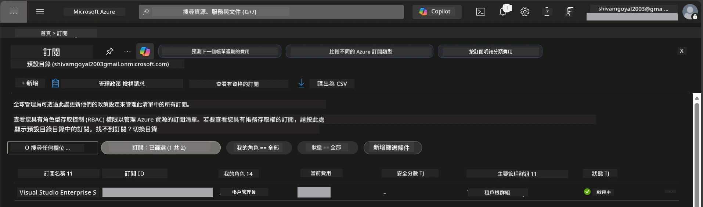

# Module 0 - 先決條件

在開始講習會之前，請確認您已準備好以下工具、權限及環境。請依序完成每個步驟，切勿跳過。

---

## 1. Azure 帳戶與訂閱

### 1.1 建立或確認您的 Azure 訂閱

1. 打開瀏覽器，前往 [https://azure.microsoft.com/free/](https://azure.microsoft.com/free/)。
2. 如果您沒有 Azure 帳戶，請點選 **Start free** 並依指示完成註冊流程。您需要一個 Microsoft 帳戶（或建立一個）以及信用卡以進行身份驗證。
3. 如果您已有帳戶，請在 [https://portal.azure.com](https://portal.azure.com) 登入。
4. 在入口網站左側導覽中，點選 **Subscriptions** 面板（或在頂部搜尋欄輸入「Subscriptions」進行搜尋）。
5. 確認您看到至少一個 **Active** 訂閱。請記下 **Subscription ID**，後續需要用到。



### 1.2 了解所需的 RBAC 角色

部署[Hosted Agent](https://learn.microsoft.com/azure/foundry/agents/concepts/hosted-agents) 需要<strong>資料操作</strong>權限，而標準的 Azure `Owner` 和 `Contributor` 角色<strong>不包含</strong>這些權限。您需要具備以下[角色組合](https://learn.microsoft.com/azure/foundry/concepts/rbac-foundry#built-in-roles)之一：

| 情境 | 所需角色 | 指定位置 |
|----------|---------------|----------------------|
| 建立新的 Foundry 專案 | Foundry 資源上的 **Azure AI Owner** | Azure 入口網站 Foundry 資源 |
| 部署到既有專案（新增資源） | 訂閱上的 **Azure AI Owner** + **Contributor** | 訂閱 + Foundry 資源 |
| 部署到已完整設定的專案 | 帳戶上的 **Reader** + 專案上的 **Azure AI User** | Azure 入口網站的帳戶 + 專案 |

> **重點提示:** Azure `Owner` 和 `Contributor` 角色只涵蓋<em>管理</em>權限（ARM 操作）。您需要[**Azure AI User**](https://learn.microsoft.com/azure/foundry/concepts/rbac-foundry#built-in-roles)（或更高）權限來執行 `agents/write` 等<em>資料操作</em>，這是建立及部署 Agent 時所必須的。這些角色將在[Module 2](02-create-foundry-project.md)中分配。

---

## 2. 安裝本機工具

請安裝下列每個工具。安裝完成後，執行檢查命令以確保工具可用。

### 2.1 Visual Studio Code

1. 前往 [https://code.visualstudio.com/](https://code.visualstudio.com/)。
2. 下載適用於您的作業系統（Windows/macOS/Linux）的安裝程式。
3. 以預設設定執行安裝程式。
4. 開啟 VS Code，確認能成功啟動。

### 2.2 Python 3.10+

1. 前往 [https://www.python.org/downloads/](https://www.python.org/downloads/)。
2. 下載 Python 3.10 或更高版本（建議 3.12+）。
3. **Windows:** 安裝過程中第一個畫面勾選 **"Add Python to PATH"**。
4. 開啟終端機並確認版本：

   ```powershell
   python --version
   ```

   預期輸出：`Python 3.10.x` 或以上版本。

### 2.3 Azure CLI

1. 前往 [https://learn.microsoft.com/cli/azure/install-azure-cli](https://learn.microsoft.com/cli/azure/install-azure-cli)。
2. 按照您作業系統的安裝說明完成安裝。
3. 確認版本：

   ```powershell
   az --version
   ```

   預期：`azure-cli 2.80.0` 或以上版本。

4. 登入：

   ```powershell
   az login
   ```

### 2.4 Azure Developer CLI (azd)

1. 前往 [https://learn.microsoft.com/azure/developer/azure-developer-cli/install-azd](https://learn.microsoft.com/azure/developer/azure-developer-cli/install-azd)。
2. 按照您作業系統的安裝說明進行。Windows 使用者：

   ```powershell
   winget install microsoft.azd
   ```

3. 確認版本：

   ```powershell
   azd version
   ```

   預期：`azd version 1.x.x` 或以上版本。

4. 登入：

   ```powershell
   azd auth login
   ```

### 2.5 Docker Desktop（選用）

只有在您想要在本機建置並測試容器映像檔，才需要安裝 Docker。Foundry 擴充功能會在部署過程自動處理容器建置。

1. 前往 [https://docs.docker.com/get-docker/](https://docs.docker.com/get-docker/)。
2. 下載並安裝適用於您的作業系統的 Docker Desktop。
3. **Windows:** 安裝時確認選擇 WSL 2 作為後端。
4. 啟動 Docker Desktop，等待系統列圖示顯示 **"Docker Desktop is running"**。
5. 開啟終端機並確認：

   ```powershell
   docker info
   ```

   預期列印 Docker 系統資訊且無錯誤。若看到 `Cannot connect to the Docker daemon`，請再等幾秒讓 Docker 完全啟動。

---

## 3. 安裝 VS Code 擴充功能

您需要安裝三個擴充功能，請在講習會開始前安裝。

### 3.1 Microsoft Foundry for VS Code

1. 開啟 VS Code。
2. 按 `Ctrl+Shift+X` 開啟擴充功能面板。
3. 在搜尋框中輸入 **"Microsoft Foundry"**。
4. 找到 **Microsoft Foundry for Visual Studio Code**（發行者：Microsoft，ID：`TeamsDevApp.vscode-ai-foundry`）。
5. 點選 **Install**。
6. 安裝完成後，您應該會在活動列（左側側邊欄）看到 **Microsoft Foundry** 圖示。

### 3.2 Foundry Toolkit

1. 在擴充功能面板 (`Ctrl+Shift+X`) 中，搜尋 **"Foundry Toolkit"**。
2. 找到 **Foundry Toolkit**（發行者：Microsoft，ID：`ms-windows-ai-studio.windows-ai-studio`）。
3. 點選 **Install**。
4. 您應該會在活動列看到 **Foundry Toolkit** 圖示。

### 3.3 Python

1. 在擴充功能面板中搜尋 **"Python"**。
2. 找到 **Python**（發行者：Microsoft，ID：`ms-python.python`）。
3. 點選 **Install**。

---

## 4. 從 VS Code 登入 Azure

[Microsoft Agent Framework](https://learn.microsoft.com/agent-framework/overview/) 使用 [`DefaultAzureCredential`](https://learn.microsoft.com/azure/developer/python/sdk/authentication/credential-chains#defaultazurecredential-overview) 來認證，您必須在 VS Code 登入 Azure。

### 4.1 透過 VS Code 登入

1. 觀察 VS Code 左下角，點選 **Accounts** 圖示（個人輪廓）。
2. 點選 **Sign in to use Microsoft Foundry**（或 **Sign in with Azure**）。
3. 瀏覽器會開啟，請使用具訂閱存取權限的 Azure 帳戶登入。
4. 回到 VS Code，您應該會在左下角看到您的帳戶名稱。

### 4.2（選用）透過 Azure CLI 登入

若您有安裝 Azure CLI 且偏好 CLI 認證：

```powershell
az login
```

這會開啟瀏覽器進行登入。完成後，設定正確訂閱：

```powershell
az account set --subscription "<your-subscription-id>"
```

確認：

```powershell
az account show --query "{name:name, id:id, state:state}" --output table
```

您應該會看到您的訂閱名稱、ID 及狀態為 `Enabled`。

### 4.3（替代方案）服務主體認證

在 CI/CD 或共用環境中，您可以改用設定以下環境變數：

```powershell
$env:AZURE_TENANT_ID = "<your-tenant-id>"
$env:AZURE_CLIENT_ID = "<your-client-id>"
$env:AZURE_CLIENT_SECRET = "<your-client-secret>"
```

---

## 5. 預覽限制

開始之前，請注意現階段的限制：

- [**Hosted Agents**](https://learn.microsoft.com/azure/foundry/agents/concepts/hosted-agents) 目前處於<strong>公開預覽</strong>階段，不建議用於生產工作負載。
- <strong>支援區域有限制</strong> — 請在建立資源前查看[區域可用性](https://learn.microsoft.com/azure/foundry/agents/concepts/hosted-agents#region-availability)。若選擇不支援的區域，部署會失敗。
- `azure-ai-agentserver-agentframework` 套件為預發行版本（`1.0.0b16`），API 可能會變動。
- 縮放限制：Hosted Agents 支援 0-5 個副本（包含縮放至零）。

---

## 6. 預備檢查清單

請逐項檢查以下列表。若任何步驟未通過，請先修正再繼續。

- [ ] VS Code 可正常開啟且無錯誤
- [ ] Python 3.10+ 已加到 PATH（執行 `python --version` 顯示 `3.10.x` 或更高）
- [ ] 已安裝 Azure CLI（執行 `az --version` 顯示 `2.80.0` 或以上）
- [ ] 已安裝 Azure Developer CLI（執行 `azd version` 顯示版本資訊）
- [ ] Microsoft Foundry 擴充功能已安裝（活動列有圖示）
- [ ] Foundry Toolkit 擴充功能已安裝（活動列有圖示）
- [ ] Python 擴充功能已安裝
- [ ] 已在 VS Code 中登入 Azure（檢查左下角帳戶圖示）
- [ ] `az account show` 回傳您的訂閱
- [ ] （選用）Docker Desktop 正在執行（`docker info` 顯示系統資訊且無錯誤）

### 檢查點

開啟 VS Code 活動列，確認您可以看到 **Foundry Toolkit** 和 **Microsoft Foundry** 兩個側邊檢視。點開每個以確保其正常載入且無錯誤。

---

**下一步：** [01 - Install Foundry Toolkit & Foundry Extension →](01-install-foundry-toolkit.md)

---

<!-- CO-OP TRANSLATOR DISCLAIMER START -->
**免責聲明**：  
本文件使用 AI 翻譯服務 [Co-op Translator](https://github.com/Azure/co-op-translator) 進行翻譯。雖然我們力求準確，但請注意自動翻譯可能包含錯誤或不準確之處。原始語言文件應視為權威來源。對於關鍵資訊，建議採用專業人工翻譯。我們對因使用此翻譯所造成的任何誤解或誤譯不承擔任何責任。
<!-- CO-OP TRANSLATOR DISCLAIMER END -->