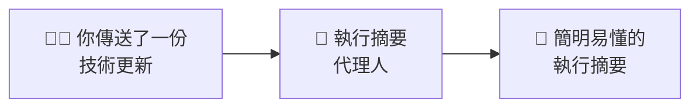

# 模組 0 - 介紹

⏱️ 約 10 分鐘

> [!WARNING]
> **預覽與限制：** [託管代理](https://learn.microsoft.com/azure/foundry/agents/concepts/hosted-agents) 目前處於 <strong>公開預覽</strong> 階段，不建議用於生產工作負載。請注意以下事項：
> - <strong>支援的區域有限</strong> - 在建立資源前請先檢查 [區域可用性](https://learn.microsoft.com/azure/foundry/agents/concepts/hosted-agents#region-availability)。若選擇不支援的區域，部署將失敗。
> - `azure-ai-agentserver-agentframework` 套件為預發布版本 - API 可能會在各版本間變動。
> - 縮放限制：託管代理支援 0–5 個副本（包含縮放至零）。
> - 本工作坊中展示的某些功能隨服務邁向 GA 可能會變更。

## 你將會構建什麼

在本工作坊中，你將建立一個 **「用執行長能理解的方式解釋」** 代理 — 一個託管的 AI 代理，可以將複雜技術更新重寫為以簡潔英文撰寫的執行摘要。

```mermaid
flowchart LR
    A["🧑‍💻 你傳送了一份\n技術更新"] --> B["🤖 執行摘要\n代理人"]
    B --> C["📝 簡明易懂的\n執行摘要"]
```

**該代理使用了：**
- **Microsoft Agent Framework** — 代理的邏輯與結構
- **Foundry 工具套件 for VS Code** — 進行骨架搭建、本地測試與部署
- **AI 模型**（例如 `gpt-4.1-mini/gpt-5-mini`） — 用以產生摘要

完成本實驗後，你將擁有一個可運作的代理，能透過代理檢視器（Agent Inspector）於本地測試，並可選擇部署至雲端。

---

## 什麼是託管代理？

<strong>託管代理</strong> 是在 Microsoft Foundry 上作為受管服務執行的 AI 代理。你無需管理自己的基礎設施，只要將代理程式碼打包成容器，Foundry 即會負責縮放、託管及透過標準 HTTP 端點來暴露它。

| 概念 | 含意 |
|---------|--------------|
| <strong>代理</strong> | 你的 Python 程式碼，接收使用者訊息、呼叫 AI 模型，並回傳結構化回應 |
| <strong>託管</strong> | Foundry 代為執行你的容器 — 無需虛擬機、無需 Kubernetes、無需管理基礎設施 |
| <strong>回應協定</strong> | 標準 HTTP API（`POST /responses`），任何客戶端皆可呼叫與代理互動 |
| <strong>代理檢視器</strong> | 本地測試介面（整合在 Foundry 工具套件中），可讓你在部署前與代理對話 |

在本工作坊中，你將從零開始建置一個完整的託管代理，或選擇停在本地測試階段。

---

## 選擇你的路徑

> ⚠️ **請先選擇一個路徑繼續。** 你的選擇決定了要安裝的工具和要使用的模組。未來如果取得訂閱可以從路徑 B 轉到路徑 A。

<strong>🅰️ 路徑 A - Azure 雲端（需要 Azure 訂閱）</strong>

| | 詳細資訊 |
|---|---|
| **適用對象？** | 你擁有有效的 Azure 訂閱，且能建立 Foundry 資源 |
| <strong>模型</strong> | 透過 Foundry 使用 Azure OpenAI（例如 `gpt-4.1-mini/gpt-5-mini`） |
| <strong>涵蓋模組</strong> | 全部模組（00–07） |
| **雲端部署？** | ✅ 是 — 完整端對端部署 |

<strong>🅱️ 路徑 B - 本地 / 免費層（不需要 Azure 訂閱）</strong>

| | 詳細資訊 |
|---|---|
| **適用對象？** | MVP、學生或無法使用 Azure 的任何人 |
| <strong>模型</strong> | **Foundry Local**（免費，在你的機器上執行） |
| <strong>涵蓋模組</strong> | 模組 00–04（跳過部署與雲端驗證） |
| **雲端部署？** | ❌ 否 — 只能透過代理檢視器本地測試 |

---

## 所有路徑：必備工具

安裝以下各工具。安裝完成後，用檢查命令確認其運作正常。

| # | 工具 | 版本 | 安裝 | 驗證（預期輸出） |
|---|------|---------|---------|---------------------------|
| 1 | **Visual Studio Code** | 最新版 | [code.visualstudio.com](https://code.visualstudio.com/) | 可順利開啟且無錯誤 |
| 2 | **Python** | 3.12 或更新版本 | [python.org/downloads](https://www.python.org/downloads/) | `python --version` $\rightarrow$ `Python 3.12.x` |
| 3 | **Foundry Toolkit for VS Code** | 最新版 | 套件 ID：`ms-windows-ai-studio.windows-ai-studio` | 活動列顯示 Foundry 圖示 |
| 4 | **Python 擴充套件 for VS Code** | 最新版 | 套件 ID：`ms-python.python` | 在擴充套件面板已安裝 |

> [!TIP]
> **安裝秘訣：**
> - **Windows Python 路徑設定：** 在 Python 安裝程式第一頁，務必勾選「Add Python to PATH」。未勾選時，終端機無法識別 `python` 指令。
> - **多版本 Python 共存：** 若同時有 Python 3.10 和 3.12，使用 `python3.12 -m venv .venv` 可確保虛擬環境使用正確版本。
> - **Docker WSL 2（Windows）：** 安裝 Docker Desktop 時，請選擇 **WSL 2 後端**。Docker 使用 Hyper-V 會較慢，且可能影響 Foundry 容器建置。
> - **Docker 無法啟動？** 啟動 Docker Desktop 後等候 30–60 秒。執行 `docker info`，若看到「Cannot connect to the Docker daemon」，表示 Docker 還在初始化中。
> - **VS Code 擴充無法載入？** 安裝擴充後，按 `Ctrl+Shift+P` 執行 `Developer: Reload Window` 重載視窗。

> **Windows 使用者**：Python 安裝時請務必勾選「Add Python to PATH」。

**接下來：** [01 - 設定 →](01-setup.md)

---

<!-- CO-OP TRANSLATOR DISCLAIMER START -->
**免責聲明**：
此文件已使用 AI 翻譯服務 [Co-op Translator](https://github.com/Azure/co-op-translator) 進行翻譯。雖然我們努力追求準確性，但請注意自動翻譯可能包含錯誤或不準確之處。原始文件的母語版本應視為權威來源。對於關鍵資訊，建議採用專業人工翻譯。我們不對因使用此翻譯所產生的任何誤解或誤譯承擔責任。
<!-- CO-OP TRANSLATOR DISCLAIMER END -->