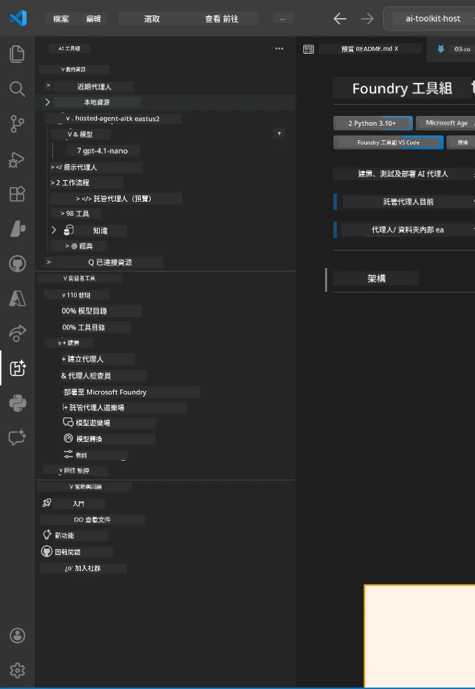
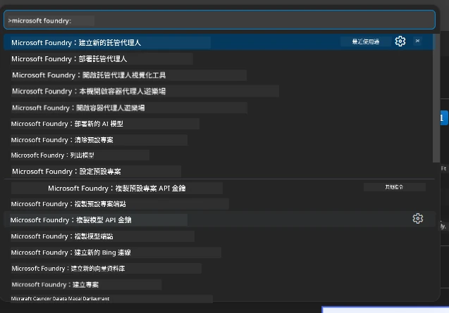

# Module 1 - 安裝 Foundry 工具包與 Foundry 擴充功能

本模組將引導您安裝並驗證此工作坊所需的兩個主要 VS Code 擴充功能。如果您已在 [Module 0](00-prerequisites.md) 中安裝過，請使用本模組來確保它們運作正常。

---

## 第 1 步：安裝 Microsoft Foundry 擴充功能

**Microsoft Foundry for VS Code** 擴充功能是您創建 Foundry 專案、部署模型、搭建託管代理，及直接從 VS Code 部署的主要工具。

1. 開啟 VS Code。
2. 按下 `Ctrl+Shift+X` 以開啟 <strong>擴充功能</strong> 面板。
3. 在上方的搜尋框輸入：**Microsoft Foundry**
4. 尋找標題為 **Microsoft Foundry for Visual Studio Code** 的結果。
   - 發行者：**Microsoft**
   - 擴充功能 ID：`TeamsDevApp.vscode-ai-foundry`
5. 點擊 <strong>安裝</strong> 按鈕。
6. 等待安裝完成（您會看到一個小的進度指示器）。
7. 安裝完成後，查看 <strong>活動列</strong>（VS Code 左側的垂直圖示列），應該會看到新的 **Microsoft Foundry** 圖示（看起來像鑽石/AI 圖標）。
8. 點擊 **Microsoft Foundry** 圖標開啟側邊欄，您應該會看到以下區塊：
   - <strong>資源</strong>（或專案）
   - <strong>代理</strong>
   - <strong>模型</strong>

> **如果圖示未出現：** 請嘗試重新載入 VS Code（`Ctrl+Shift+P` → 輸入 `Developer: Reload Window`）。

---

## 第 2 步：安裝 Foundry Toolkit 擴充功能

**Foundry Toolkit** 擴充功能提供 [**Agent Inspector**](https://learn.microsoft.com/azure/foundry/agents/how-to/vs-code-agents-workflow-pro-code) — 一個用於本地測試和除錯代理的視覺化介面，此外還有遊樂場、模型管理與評估工具。

1. 在擴充功能面板（`Ctrl+Shift+X`），清除搜尋框並輸入：**Foundry Toolkit**
2. 尋找結果中的 **Foundry Toolkit**。
   - 發行者：**Microsoft**
   - 擴充功能 ID：`ms-windows-ai-studio.windows-ai-studio`
3. 點擊 <strong>安裝</strong>。
4. 安裝完成後，**Foundry Toolkit** 圖示會出現在活動列（看起來像機器人/閃耀圖示）。
5. 點擊 **Foundry Toolkit** 圖示打開側邊欄，您會看到 Foundry Toolkit 歡迎畫面，並有以下選項：
   - <strong>模型</strong>
   - <strong>遊樂場</strong>
   - <strong>代理</strong>

---

## 第 3 步：驗證兩個擴充功能是否正常運作

### 3.1 驗證 Microsoft Foundry 擴充功能

1. 點擊活動列上的 **Microsoft Foundry** 圖示。
2. 如果您已登入 Azure（來源於 Module 0），應該會看到 <strong>資源</strong> 下列出的專案。
3. 若系統提示要登入，請點擊 <strong>登入</strong> 並完成驗證流程。
4. 確認側邊欄可正確顯示且無錯誤。

### 3.2 驗證 Foundry Toolkit 擴充功能

1. 點擊活動列上的 **Foundry Toolkit** 圖示。
2. 確認歡迎畫面或主要面板順利載入且無錯誤。
3. 您尚不需設定任何東西 — 我們會在 [Module 5](05-test-locally.md) 使用 Agent Inspector。

### 3.3 透過命令面板驗證

1. 按 `Ctrl+Shift+P` 開啟命令面板。
2. 輸入 **"Microsoft Foundry"** — 您應該會看到如下指令：
   - `Microsoft Foundry: Create a New Hosted Agent`
   - `Microsoft Foundry: Deploy Hosted Agent`
   - `Microsoft Foundry: Open Model Catalog`
3. 按 `Escape` 來關閉命令面板。
4. 再次開啟命令面板，輸入 **"Foundry Toolkit"** — 您應該會看到指令：
   - `Foundry Toolkit: Open Agent Inspector`

> 如果您看不到這些指令，可能是擴充功能未正確安裝。請嘗試卸載後重新安裝。

---

## 這些擴充功能在此工作坊的用途

| 擴充功能 | 功能說明 | 使用時機 |
|-----------|-------------|-------------------|
| **Microsoft Foundry for VS Code** | 創建 Foundry 專案、部署模型、**搭建 [託管代理](https://learn.microsoft.com/azure/foundry/agents/concepts/hosted-agents)**（自動生成 `agent.yaml`、`main.py`、`Dockerfile`、`requirements.txt`），並部署到 [Foundry Agent Service](https://learn.microsoft.com/azure/foundry/agents/overview) | Modules 2、3、6、7 |
| **Foundry Toolkit** | 本地測試/除錯的 Agent Inspector、遊樂場界面、模型管理功能 | Modules 5、7 |

> **Foundry 擴充功能是此工作坊最關鍵的工具。** 它負責端對端生命週期：搭建 → 配置 → 部署 → 驗證。Foundry Toolkit 則搭配提供本地測試的視覺 Agent Inspector。

---

### 檢查點

- [ ] 活動列中看到 Microsoft Foundry 圖示
- [ ] 點擊後側邊欄可正常開啟且無錯誤
- [ ] 活動列中看到 Foundry Toolkit 圖示
- [ ] 點擊後側邊欄可正常開啟且無錯誤
- [ ] `Ctrl+Shift+P` → 輸入 "Microsoft Foundry" 顯示可用指令
- [ ] `Ctrl+Shift+P` → 輸入 "Foundry Toolkit" 顯示可用指令

---

**上一章節：** [00 - 先決條件](00-prerequisites.md) · **下一章節：** [02 - 創建 Foundry 專案 →](02-create-foundry-project.md)

---

<!-- CO-OP TRANSLATOR DISCLAIMER START -->
**免責聲明**：  
本文件係使用 AI 翻譯服務 [Co-op Translator](https://github.com/Azure/co-op-translator) 所翻譯。雖然我們努力追求準確性，但請注意，自動翻譯可能包含錯誤或不準確之處。原始文件之母語版本應視為權威來源。對於關鍵資訊，建議採用專業人工翻譯。我們對因使用本翻譯所產生之任何誤解或誤譯不負任何責任。
<!-- CO-OP TRANSLATOR DISCLAIMER END -->