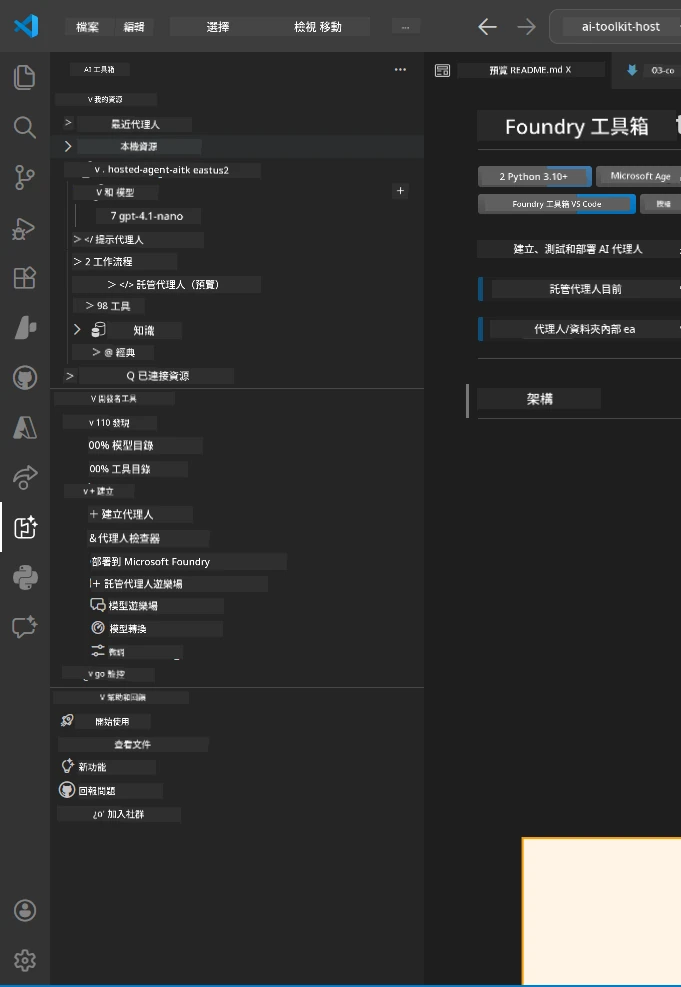
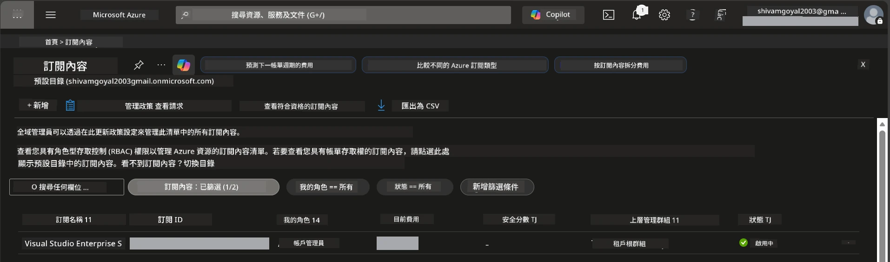
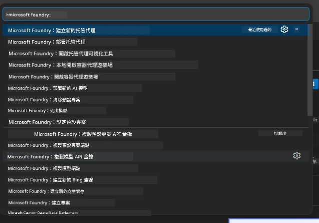
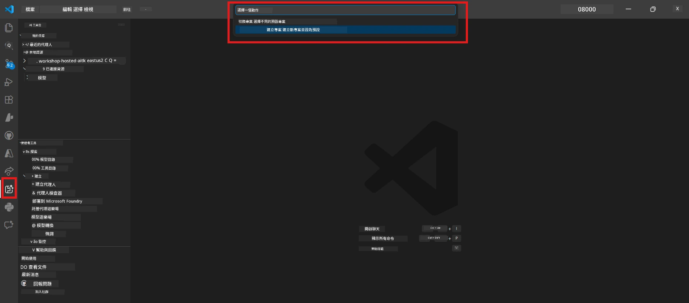
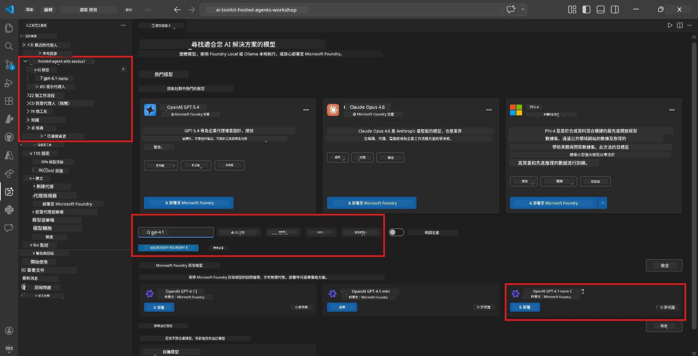
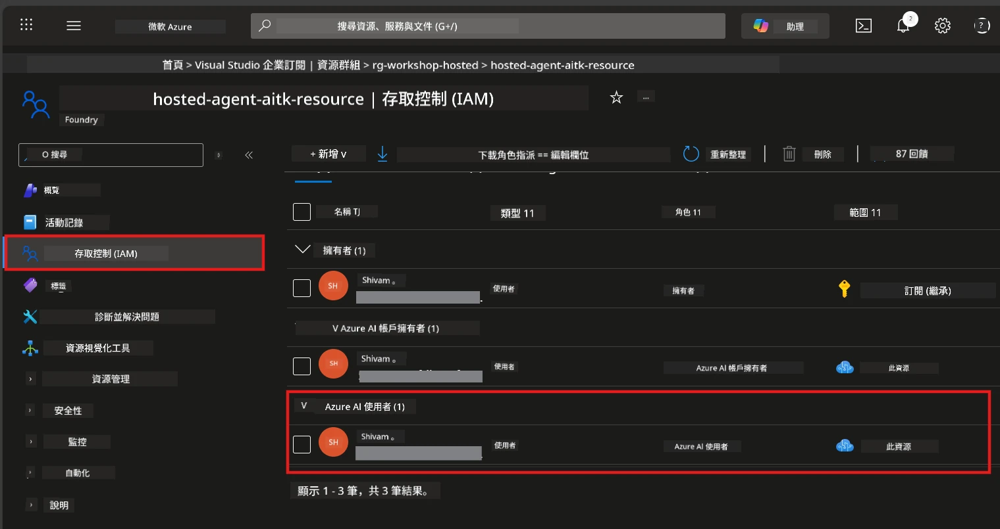

# 設定：擴充套件、專案與模型

⏱️ 約 15 分鐘

在此模組中，您將安裝並驗證 Foundry Toolkit 擴充套件，建立（或連接）Foundry 專案，並部署代理人將使用的模型。

## 步驟 1：安裝 Foundry Toolkit

**Foundry Toolkit for VS Code** 是本工作坊的主要擴充套件。它提供專案建立、模型部署、代理人骨架模板、本機測試（Agent Inspector）及雲端部署等功能 —— 全部在 VS Code 中完成。

1. 開啟 VS Code，然後按 `Ctrl+Shift+X` 開啟 <strong>擴充套件</strong> 面板。
2. 搜尋 **Foundry Toolkit**。
3. 安裝 **Foundry Toolkit for VS Code**（發行者：Microsoft，ID: `ms-windows-ai-studio.windows-ai-studio`）。
4. 安裝完成後，**Foundry Toolkit** 圖示會出現在活動列（左側邊欄）。

> *備註：舊版擴充套件中的活動列可能顯示「AI TOOLKIT」。功能上是相同的。*



## 步驟 2：依存取權限設定

> **選擇您的路徑：** 展開下方符合您設定的區段。您只需完成 <strong>一條</strong> 路徑。

<details>
<summary><strong>🅰️ 路徑 A - Azure 雲端（需 Azure 訂閱）</strong></summary>

### Azure CLI

1. 從 [learn.microsoft.com/cli/azure/install-azure-cli](https://learn.microsoft.com/cli/azure/install-azure-cli) 安裝。
2. 驗證：`az --version`（期望為 2.80.0 以上版本）。
3. 登入：`az login`

### 驗證選項

[Microsoft Agent Framework](https://learn.microsoft.com/agent-framework/overview/) 使用 [`DefaultAzureCredential`](https://learn.microsoft.com/azure/developer/python/sdk/authentication/credential-chains#defaultazurecredential-overview)，會依序嘗試多種驗證方法。請選擇適合您環境的方式：

#### 選項 1：VS Code 帳戶（工作坊推薦）
1. 點選 VS Code 左下角的 <strong>帳戶</strong> 圖示（人形輪廓）。
2. 選擇 **登入以使用 Microsoft Foundry**（或 **使用 Azure 登入**）。
3. 將開啟瀏覽器，使用有訂閱權限的 Azure 帳戶登入。
4. 回到 VS Code。左下角應會顯示您的帳戶名稱。

#### 選項 2：Azure CLI
```bash
az login
az account set --subscription "<your-subscription-id>"
```

#### 選項 3：服務主體（企業/CI）
對於受限環境或 CI/CD 管線，請在 `.env` 檔案中設定這些環境變數：
```env
AZURE_TENANT_ID=<your-tenant-id>
AZURE_CLIENT_ID=<your-client-id>
AZURE_CLIENT_SECRET=<your-client-secret>
```

> **`DefaultAzureCredential` 運作方式：** 它會先嘗試環境變數，再是受管身分（managed identity）、接著是 VS Code 登入，最後是 Azure CLI，並採用第一個成功的。詳見[認證鏈文件](https://learn.microsoft.com/azure/developer/python/sdk/authentication/credential-chains#defaultazurecredential-overview)。

### Azure Developer CLI (azd)

1. 安裝：`winget install microsoft.azd`（Windows），或參考[安裝文件](https://learn.microsoft.com/azure/developer/azure-developer-cli/install-azd)。
2. 驗證：`azd version`
3. 登入：`azd auth login`

### Docker Desktop（選用）

若您想在本機建置容器才需要 Docker。Foundry 擴充套件會在部署時自動處理建置。

1. 從 [docs.docker.com/get-docker](https://docs.docker.com/get-docker/) 安裝。
2. 驗證：`docker info`

### Azure 訂閱與角色型存取控制（RBAC）

1. 登入 [portal.azure.com](https://portal.azure.com)。
2. 導覽至 <strong>訂閱</strong>，確認至少一項為 <strong>啟用中</strong>。
3. 記下您的 **訂閱 ID** — 在模組 01 中需要使用。



#### RBAC 場景表

[Hosted Agent](https://learn.microsoft.com/azure/foundry/agents/concepts/hosted-agents) 部署需要標準 Azure 的 `Owner` 和 `Contributor` 角色中沒有的 <strong>資料操作</strong> 權限。請使用下表判斷您需要的角色：

| 場景 | 所需角色 | 指派位置 |
|------|----------|--------|
| 建立新 Foundry 專案 | Foundry 資源的 **Azure AI Owner** | Azure 入口網站中的 Foundry 資源 |
| 部署到現有專案（新資源） | 訂閱的 **Azure AI Owner** + **Contributor** | 訂閱 + Foundry 資源 |
| 部署到已完全設定的專案 | 帳戶的 **Reader** + 專案的 **Azure AI User** | Azure 入口網站中的帳戶 + 專案 |
| 僅本地測試（無部署） | 專案的 **Azure AI User** | Azure 入口網站中的專案 |

> **關鍵點：** Azure `Owner` 和 `Contributor` 角色僅包含 <em>管理</em> 權限（ARM 操作）。您需要 [**Azure AI User**](https://learn.microsoft.com/azure/foundry/concepts/rbac-foundry#built-in-roles)（或更高）以執行建立和部署代理人所需的 <em>資料操作</em>，如 `agents/write`。

## 連接或建立 Foundry 專案



1. 按 `Ctrl+Shift+P` → 輸入 **Foundry Toolkit: Create Project** → 選擇命令。
2. 從下拉選單中選擇您的 **Azure 訂閱**。
3. 選擇或建立一個 <strong>資源群組</strong>（例如 `rg-hosted-agents-workshop`）。
4. 選擇支援 hosted agents 的 <strong>區域</strong>：`East US`、`West US 2` 或 `Sweden Central`。參考[區域可用性](https://learn.microsoft.com/azure/foundry/agents/concepts/hosted-agents#region-availability)。
5. 輸入專案名稱（例如 `workshop-agents`）。
6. 等待 2–5 分鐘進行部署。VS Code 會顯示進度通知。
7. 部署完成後，您的專案會出現在 **Foundry Toolkit** 側邊欄的 **MY RESOURCES** 下。



## 部署模型並指派 RBAC

您的 hosted agent 需要一個 AI 模型來生成回應。

#### 模型選擇矩陣
根據需求，您可以選擇不同模型等級：

| 模型 | 適用場景 | 費用 | 備註 |
|------|----------|------|-------|
| `gpt-4.1` | 高品質、細緻回應 | 較高 | 最佳結果，建議用於最終測試 |
| `gpt-4.1-mini/gpt-5-mini` | 快速迭代、費用較低 | 較低 | 適合工作坊開發與快速測試 |
| `gpt-4.1-nano` | 輕量級任務 | 最低 | 最具成本效益，但回應較簡單 |

1. 按 `Ctrl+Shift+P` → **Foundry Toolkit: Open Model Catalog**（或在側邊欄 DEVELOPER TOOLS 下點選 **Model Catalog**）。
2. 在目錄搜尋 **gpt-4.1**。
3. 找到 **OpenAI GPT-4.1-mini**（或較佳品質的 `gpt-5-mini`）並點選 **Deploy**。



4. 在部署設定中：
   - **部署名稱：** 保留預設或輸入自訂名稱。**請記住此名稱。**
   - **目標：** 選擇 **Deploy to Foundry Toolkit** → 選擇您的專案。
5. 點選 **Deploy** 並等待 1–3 分鐘。

> **建議：** 工作坊中使用 `gpt-4.1-mini/gpt-5-mini`，快速、經濟，且成效良好。

### 記下您的值

部署完成後，請記下這兩個值（模組 03 中將會用到）：

| 值 | 取得方式 |
|----|----------|
| <strong>專案端點</strong> | 在側邊欄點選專案 → 詳細資訊會顯示 URL（例如 `https://<account>.services.ai.azure.com/api/projects/<project>`） |
| <strong>模型部署名稱</strong> | 展開專案 → **Models** → 您已部署模型旁的名稱（如 `gpt-4.1-mini/gpt-5-mini`） |

### 指派 RBAC 角色

> ⚠️ **這是最常忽略的步驟。** 沒有正確的角色，模組 05 的部署將失敗。

#### 我要哪個角色？
根據您的場景，您需要以下角色組合：

| 場景 | 所需角色 | 指派位置 |
|------|----------|--------|
| 建立新 Foundry 專案 | Foundry 資源的 **Azure AI Owner** | Azure 入口網站中的 Foundry 資源 |
| 部署到現有專案（新增資源） | 訂閱的 **Azure AI Owner** + **Contributor** | 訂閱 + Foundry 資源 |
| 部署到已完全設定的專案 | 帳戶的 **Reader** + 專案的 **Azure AI User** | Azure 入口網站中的帳戶 + 專案 |

**關鍵點：** Azure 的 `Owner` 和 `Contributor` 角色僅包含 <em>管理</em> 權限。您需要 **Azure AI User**（或更高）以進行建立和部署代理人所需的 `agents/write` 資料操作。

1. 開啟 [portal.azure.com](https://portal.azure.com)。
2. 搜尋您的 **Foundry 專案** 名稱 → 點選類型為 **「Foundry Toolkit project」** 的結果（非上層帳戶）。
3. 在左側選單點選 **存取控制 (IAM)**。
4. 點選 **+ 新增** → <strong>新增角色指派</strong>。
5. **角色分頁：** 搜尋 **Azure AI User**，選擇後點 <strong>下一步</strong>。
6. **成員分頁：** 選擇 **使用者、群組或服務主體** → 點 **+ 選擇成員** → 找到並選擇您自己 → 點 <strong>選擇</strong>。
7. 點擊 **檢閱 + 指派** → 再點一次 **檢閱 + 指派**。
8. **等待 1–2 分鐘** 以完成權限傳播。

> **為何使用此角色？** Azure 的 `Owner`/`Contributor` 僅授予管理權限。**Azure AI User** 角色賦予建立及部署代理人所需的 `agents/write` 資料操作。詳見[Foundry RBAC 文件](https://learn.microsoft.com/azure/foundry/concepts/rbac-foundry#built-in-roles)。



</details>

<details>
<summary><strong>🅱️ 路徑 B - 本機 / 免費方案（不需要 Azure 訂閱）</strong></summary>

### Foundry Local

Foundry Local 讓您在自己機器上執行 AI 模型，不需雲端帳戶。您可以透過 Foundry Toolkit 使用模型目錄存取 Foundry Local 模型，步驟如下：

1. 開啟 Foundry Toolkit 擴充套件。
2. 在 Foundry Toolkit 導覽中，前往 **Developer Tools** > 選擇 **Model Catalog**
3. 在新視窗中，從導覽列選擇 **local**。
4. 捲動至 **Phi 4 Mini**，點選 <strong>新增按鈕</strong>，會跳出下載模型的提示。
5. 模型下載完成後，即可進行下一步。

</details>

### ✅ 檢查點


- [ ] 按 `Ctrl+Shift+P` → 輸入「Foundry Toolkit」看到可用命令
- [ ] 已安裝 Foundry Toolkit 擴充套件且側邊欄無錯誤載入
- [ ] VS Code 能正常開啟與執行
- [ ] `python --version` 顯示 3.10 以上版本
- [ ] Foundry Toolkit 圖示在 VS Code 活動列可見
- [ ] **路徑 A：** `az login` 成功，訂閱狀態為啟用
- [ ] **路徑 B：** Foundry Local 正在執行（`foundry local status`）
- [ ] **路徑 A：** Foundry 專案可見於側邊欄，模型已部署，且指派 Azure AI User 角色
- [ ] **路徑 B：** Foundry Local 執行並含模型
- [ ] 您已記下您的 <strong>端點</strong> 及 <strong>模型部署名稱</strong>


**上一節：** [00 - 先決條件](00-prerequisites.md) · **下一節：** [02 - 建立 Hosted Agent →](02-create-hosted-agent.md)

---

<!-- CO-OP TRANSLATOR DISCLAIMER START -->
**免責聲明**：
此文件已使用 AI 翻譯服務 [Co-op Translator](https://github.com/Azure/co-op-translator) 進行翻譯。雖然我們努力追求準確性，但請注意自動翻譯可能包含錯誤或不準確之處。原始文件的母語版本應視為權威來源。對於關鍵資訊，建議採用專業人工翻譯。我們不對因使用此翻譯所產生的任何誤解或誤譯承擔責任。
<!-- CO-OP TRANSLATOR DISCLAIMER END -->