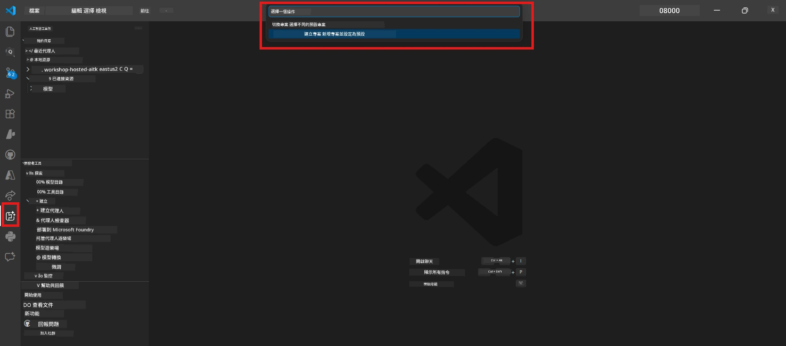
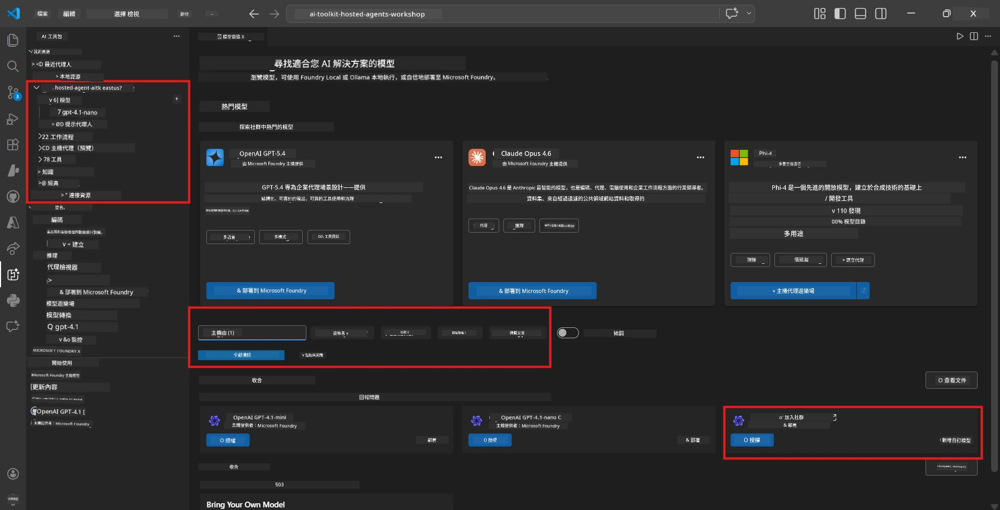
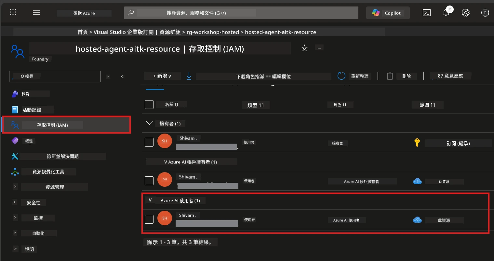

# Module 2 - 建立 Foundry 專案並部署模型

在此模組中，您將建立（或選擇）一個 Microsoft Foundry 專案並部署代理人將使用的模型。每個步驟均有明確說明，請依序進行。

> 如果您已有部署模型的 Foundry 專案，請直接跳至 [模組 3](03-create-hosted-agent.md)。

---

## 步驟 1：從 VS Code 建立 Foundry 專案

您將使用 Microsoft Foundry 擴充功能，在不離開 VS Code 的情況下建立專案。

1. 按下 `Ctrl+Shift+P` 開啟 <strong>命令面板</strong>。
2. 輸入：**Microsoft Foundry: Create Project**，並選取它。
3. 會出現下拉選單，請從列表中選擇您的 **Azure 訂閱**。
4. 系統要求您選擇或建立一個 <strong>資源群組</strong>：
   - 建立新群組：輸入名稱（例如 `rg-hosted-agents-workshop`），然後按 Enter。
   - 使用現有群組：從下拉選單選擇。
5. 選擇一個 <strong>區域</strong>。**重要：** 選擇支援託管代理的區域。請查看 [區域可用性](https://learn.microsoft.com/azure/foundry/agents/concepts/hosted-agents#region-availability) — 常見選項有 `East US`、`West US 2` 或 `Sweden Central`。
6. 輸入 Foundry 專案的 <strong>名稱</strong>（例如 `workshop-agents`）。
7. 按 Enter 並等待佈建完成。

> **佈建會花費 2 到 5 分鐘。** 您會在 VS Code 的右下角看到進度通知。佈建期間請勿關閉 VS Code。

8. 完成後，**Microsoft Foundry** 側邊欄會在 <strong>資源</strong> 下顯示您的新專案。
9. 點擊專案名稱展開，確認顯示類似 **Models + endpoints** 和 **Agents** 的區段。



### 替代方案：透過 Foundry 入口網站建立

如果您偏好使用瀏覽器：

1. 開啟 [https://ai.azure.com](https://ai.azure.com) 並登入。
2. 在首頁按下 **Create project** 。
3. 輸入專案名稱，選擇您的訂閱、資源群組與區域。
4. 按 **Create** 並等待佈建完成。
5. 建立完成後，回到 VS Code，重新整理 Foundry 側邊欄（點擊重新整理圖示），專案應會出現。

---

## 步驟 2：部署模型

您的 [託管代理](https://learn.microsoft.com/azure/foundry/agents/concepts/hosted-agents) 需要 Azure OpenAI 模型來產生回應。您將 [立即部署一個](https://learn.microsoft.com/azure/ai-foundry/openai/how-to/create-resource#deploy-a-model)。

1. 按下 `Ctrl+Shift+P` 開啟 <strong>命令面板</strong>。
2. 輸入：**Microsoft Foundry: Open [Model Catalog](https://learn.microsoft.com/azure/ai-foundry/openai/concepts/models)**，並選取它。
3. VS Code 會開啟模型目錄視圖。瀏覽或使用搜尋列尋找 **gpt-4.1**。
4. 點選 **gpt-4.1** 模型卡（若想節省成本，也可以選擇 `gpt-4.1-mini`）。
5. 按下 **Deploy**。


6. 在部署設定中：
   - **Deployment name**：保留預設（例如 `gpt-4.1`）或輸入自訂名稱。<strong>請記下此名稱</strong>，模組 4 將會用得到。
   - **Target**：選擇 **Deploy to Microsoft Foundry**，並挑選剛建立的專案。
7. 點擊 **Deploy** 並等待部署完成（1-3 分鐘）。

### 模型選擇

| 模型 | 適用情境 | 成本 | 備註 |
|-------|----------|------|-------|
| `gpt-4.1` | 高品質且細緻回應 | 較高 | 最佳結果，建議用於最終測試 |
| `gpt-4.1-mini` | 快速迭代、較低成本 | 較低 | 適合工作坊開發與快速測試 |
| `gpt-4.1-nano` | 輕量任務 | 最低 | 成本最低，但回應較簡單 |

> **本工作坊推薦：** 使用 `gpt-4.1-mini` 進行開發與測試。快速、便宜且能產生良好結果。

### 驗證模型部署

1. 在 **Microsoft Foundry** 側邊欄展開您專案。
2. 查看 **Models + endpoints**（或類似區段）。
3. 您應該會看到已部署的模型（例如 `gpt-4.1-mini`），狀態為 **Succeeded** 或 **Active**。
4. 點擊模型部署可查看詳細資料。
5. <strong>請記下</strong>以下兩項資訊，模組 4 將會用到：

   | 設定 | 位置 | 範例值 |
   |---------|---------|---------|
   | <strong>專案端點</strong> | 在 Foundry 側邊欄點選專案名稱，詳細資料視圖會顯示端點 URL。 | `https://<account>.services.ai.azure.com/api/projects/<project>` |
   | <strong>模型部署名稱</strong> | 部署模型旁所顯示的名稱。 | `gpt-4.1-mini` |

---

## 步驟 3：指派必要的 RBAC 角色

這是 <strong>最常被忽略的步驟</strong>。若沒有正確角色，模組 6 的部署會因權限錯誤而失敗。

### 3.1 為自己指派 Azure AI User 角色

1. 開啟瀏覽器並前往 [https://portal.azure.com](https://portal.azure.com)。
2. 在頂端搜尋欄輸入您的 **Foundry 專案** 名稱，並在結果中點選它。
   - **重要：** 請務必進入 <strong>專案</strong> 資源（類型為「Microsoft Foundry project」），而非上層帳戶或總管資源。
3. 在專案左側導覽點選 **Access control (IAM)**。
4. 點選上方的 **+ 新增** → 選擇 <strong>新增角色指派</strong>。
5. 在 <strong>角色</strong> 頁籤搜尋 [**Azure AI User**](https://learn.microsoft.com/azure/foundry/concepts/rbac-foundry#built-in-roles) 並選擇它。點擊 <strong>下一步</strong>。
6. 在 <strong>成員</strong> 頁籤：
   - 選擇 **使用者、群組或服務主體**。
   - 點擊 **+ 選取成員**。
   - 搜尋您的姓名或電子郵件，選取自己，然後點擊 <strong>選取</strong>。
7. 點擊 **檢閱 + 指派** → 再點一次 **檢閱 + 指派** 確認。



### 3.2（選擇性）指派 Azure AI Developer 角色

如果您需要在專案內建立額外資源或以程式化方式管理部署：

1. 重複上述步驟，但在步驟 5 選擇 **Azure AI Developer**。
2. 請在 **Foundry 資源（帳戶）** 級別指派此角色，而不僅限於專案層級。

### 3.3 驗證角色指派

1. 在專案的 **Access control (IAM)** 頁面，點選 <strong>角色指派</strong> 標籤。
2. 搜尋您的姓名。
3. 您應該看到至少有 **Azure AI User** 角色在專案範圍內。

> **為何重要：** [`Azure AI User`](https://learn.microsoft.com/azure/foundry/concepts/rbac-foundry#built-in-roles) 角色允許 `Microsoft.CognitiveServices/accounts/AIServices/agents/write` 資料操作。若缺少此權限，部署時會出現錯誤：
>
> ```
> Error: lacks the required data action 
> Microsoft.CognitiveServices/accounts/AIServices/agents/write 
> to perform POST /api/projects/{projectName}/assistants operation.
> ```
>
> 詳情請見 [模組 8 - 疑難排解](08-troubleshooting.md)。

---

### 檢查點

- [ ] 在 VS Code Microsoft Foundry 側邊欄中可見 Foundry 專案
- [ ] 至少部署一個模型（例如 `gpt-4.1-mini`），狀態為 **Succeeded**
- [ ] 已記錄 <strong>專案端點</strong> URL 與 <strong>模型部署名稱</strong>
- [ ] 確認已於 <strong>專案</strong> 層級指派 **Azure AI User** 角色（請在 Azure Portal → IAM → 角色指派中確認）
- [ ] 專案位於支援託管代理的 [區域](https://learn.microsoft.com/azure/foundry/agents/concepts/hosted-agents#region-availability)

---

**上一節：** [01 - 安裝 Foundry 工具包](01-install-foundry-toolkit.md) · **下一節：** [03 - 建立託管代理 →](03-create-hosted-agent.md)

---

<!-- CO-OP TRANSLATOR DISCLAIMER START -->
**免責聲明**：  
本文件已使用 AI 翻譯服務 [Co-op Translator](https://github.com/Azure/co-op-translator) 進行翻譯。雖我們致力於準確性，但請注意，自動翻譯可能包含錯誤或不準確之處。原文件的母語版本應被視為權威來源。對於重要資訊，建議採用專業人工翻譯。我們不對因使用此翻譯而產生的任何誤解或誤釋負責。
<!-- CO-OP TRANSLATOR DISCLAIMER END -->