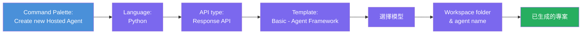
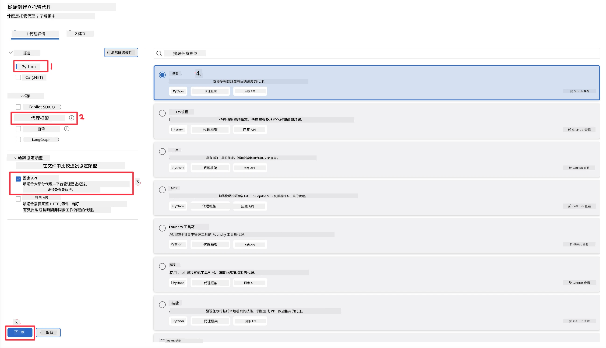
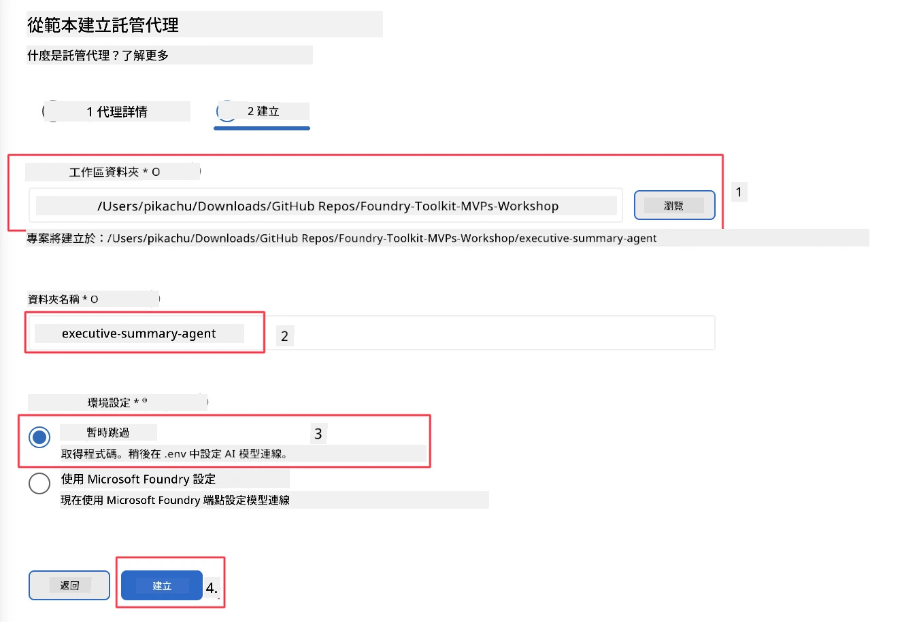

# 模組 2 - 建立新的託管代理程式

⏱️ 約 5 分鐘

在本模組中，您將使用 Foundry Toolkit <strong>架構一個託管代理程式專案</strong>。此架構會產生完整的專案結構 - `agent.yaml`、`main.py`、`Dockerfile`、`requirements.txt` 和 VS Code 除錯設定 - 讓您能專注於自訂代理程式的行為。

> **關鍵概念：** 本實驗中的 `agent/` 資料夾是 Foundry Toolkit 產生的範例。您不需要從零撰寫這些文件。

### 架構精靈流程



---

## 第 1 步：開啟建立託管代理程式精靈

1. 按 `Ctrl+Shift+P` 開啟 <strong>命令面板</strong>。
2. 輸入：**Foundry Toolkit: Create new Hosted Agent** 並選取它。

> **另一種方式：透過 Foundry Portal 建立**
> 若您偏好瀏覽器，可從 [https://ai.azure.com](https://ai.azure.com) 建立專案。專案建置完成後，回到 VS Code 並利用 **Foundry Toolkit** 側邊欄連線。

> **另一種方式：** 點選 Foundry Toolkit 側邊欄 **Hosted Agents (Preview)** 旁邊的 **+** 圖示。

## 第 2 步：選擇設定



1. 在左側導覽/選項區域選擇以下項目：

| 選單 | 選擇 | 備註 |
|--------|-----------|-------|
| <strong>語言</strong> | Python | 同時支援 C# |
| <strong>框架</strong> | Agent Framework | 以 Agent Framework SDK 為基礎的簡易起點 |
| **API 類型** | Response API | `POST /responses` - 對話式，平台管理歷史紀錄 |
| <strong>範本</strong> | Basic | 以 Agent Framework SDK 為基礎的簡易起點 |

2. 選取完成後，點擊 **Next**



3. 在下一個視窗選擇以下項目：

| 選單 | 選擇 | 備註 |
|--------|-----------|-------|
| <strong>工作區資料夾</strong> | 選擇目標資料夾 | 例如 `/workspace/Foundry_Toolkit_for_VSCode_Lab/` 或此 repo 下子資料夾 |
| <strong>代理程式名稱</strong> | 輸入名稱 | 例如 `executive-summary-agent` |
| <strong>環境設定</strong> | 暫時跳過設定 |  |

點擊 **create** 建立代理程式。系統會建立一個新資料夾，名稱為託管代理程式名稱。

## 第 3 步：檢視產生的專案

架構完成後，請確認在檔案總管（`Ctrl+Shift+E`）中看到以下檔案：

```
📂 my-agent/
├── .env                ← Environment variables (placeholders)
├── .vscode/
│   ├── launch.json     ← Debug config (F5 → run + Agent Inspector)
│   └── tasks.json      ← VS Code task definitions
├── agent.yaml          ← Agent definition (kind: hosted)
├── Dockerfile          ← Container config for deployment
├── main.py             ← Agent entry point (your main code)
└── requirements.txt    ← Python dependencies
```

### 重要檔案說明

| 檔案 | 目的 |
|------|---------|
| `agent.yaml` | 宣告代理程式為 `kind: hosted`，對應環境變數，定義 `/responses` 協議 |
| `main.py` | 建立 `FoundryChatClient` → 包裹成帶指令的 `Agent` → 透過埠號 8088 的 `ResponsesHostServer` 提供服務 |
| `Dockerfile` | 使用 `python:3.12-slim`，安裝相依性，開放 8088 埠，執行 `main.py` |
| `requirements.txt` | 包含 `agent-framework-foundry`、`agent-framework-foundry-hosting`、`mcp`、`debugpy` |

> **重要提醒：** 請直接在 VS Code 打開產生的代理程式資料夾（即 `agent/` 資料夾本身），以確保 `.vscode/launch.json` 及 `tasks.json` 正確支援 F5 除錯。

---

### ✅ 檢查點

- [ ] 已建立架構專案，且所有預期檔案完整
- [ ] `agent.yaml` 顯示 `kind: hosted` 與 `protocol: responses`
- [ ] `main.py` 有匯入 `Agent`、`FoundryChatClient`、`ResponsesHostServer`
- [ ] 代理程式資料夾已在 VS Code 開啟為工作區根目錄

---

**上一節：** [01 - 設定](01-setup.md) · **下一節：** [03 - 設定與程式碼 →](03-configure-and-code.md)

---

<!-- CO-OP TRANSLATOR DISCLAIMER START -->
**免責聲明**：
此文件已使用 AI 翻譯服務 [Co-op Translator](https://github.com/Azure/co-op-translator) 進行翻譯。雖然我們努力追求準確性，但請注意自動翻譯可能包含錯誤或不準確之處。原始文件的母語版本應視為權威來源。對於關鍵資訊，建議採用專業人工翻譯。我們不對因使用此翻譯所產生的任何誤解或誤譯承擔責任。
<!-- CO-OP TRANSLATOR DISCLAIMER END -->