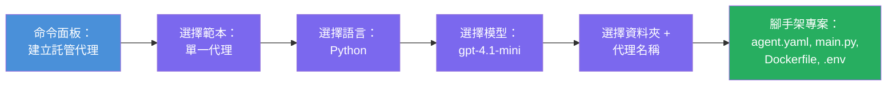

# 模組 3 - 建立新的託管代理 (由 Foundry 擴充功能自動搭建)

在本模組中，您將使用 Microsoft Foundry 擴充功能來 **搭建一個新的 [託管代理](https://learn.microsoft.com/azure/foundry/agents/concepts/hosted-agents) 專案**。該擴充功能會為您產生整個專案結構，包括 `agent.yaml`、`main.py`、`Dockerfile`、`requirements.txt`、一個 `.env` 檔案，以及 VS Code 的除錯設定。完成搭建後，您可以依照代理的指示、工具和設定來自訂這些檔案。

> **關鍵概念：** 此實驗中的 `agent/` 資料夾是 Foundry 擴充功能執行 scaffold 命令時產生的示例。您不需從零手動撰寫這些檔案—擴充功能會幫您建立，再由您修改。

### 搭建精靈流程


---

## 第 1 步：開啟建立託管代理精靈

1. 按下 `Ctrl+Shift+P` 開啟 <strong>指令選擇器</strong>。
2. 輸入：**Microsoft Foundry: Create a New Hosted Agent** 並選擇它。
3. 託管代理建立精靈會開啟。

> **替代途徑：** 您也可以從 Microsoft Foundry 側邊欄 → 點擊 **Agents** 旁的 **+** 圖示，或右鍵選擇 **Create New Hosted Agent** 來打開此精靈。

---

## 第 2 步：選擇範本

精靈會請您選擇一個範本。您會看到如下選項：

| 範本 | 說明 | 適用時機 |
|----------|-------------|-------------|
| **Single Agent** | 單一代理，擁有自己的模型、指示與可選工具 | 本工作坊 (Lab 01) |
| **Multi-Agent Workflow** | 多個代理順序協作 | Lab 02 |

1. 選擇 **Single Agent**。
2. 點擊 <strong>下一步</strong>（或自動進入下一步）。

---

## 第 3 步：選擇程式語言

1. 選擇 **Python**（本工作坊推薦）。
2. 點擊 <strong>下一步</strong>。

> **C# 也受支援**，適合偏好 .NET 的使用者。搭建結構類似（使用 `Program.cs` 取代 `main.py`）。

---

## 第 4 步：選擇模型

1. 精靈會顯示您在 Foundry 專案中部署的模型（來自第 2 模組）。
2. 選擇您部署的模型，例如 **gpt-4.1-mini**。
3. 點擊 <strong>下一步</strong>。

> 若沒看到任何模型，請先回到 [第 2 模組](02-create-foundry-project.md) 部署一個模型。

---

## 第 5 步：選擇資料夾位置與代理名稱

1. 會彈出檔案對話框，選擇建立專案的 <strong>目標資料夾</strong>。本工作坊建議：
   - 新建專案：任選資料夾（例如 `C:\Projects\my-agent`）
   - 在工作坊倉庫內操作：於 `workshop/lab01-single-agent/agent/` 下創建子資料夾
2. 輸入託管代理的 <strong>名稱</strong>（例如 `executive-summary-agent` 或 `my-first-agent`）。
3. 點擊 <strong>建立</strong>（或按 Enter）。

---

## 第 6 步：等待搭建完成

1. VS Code 會開啟一個搭建好的專案 <strong>新視窗</strong>。
2. 稍等數秒以完成專案載入。
3. 您應該會在檔案總管面板（`Ctrl+Shift+E`）看見以下檔案：

```
📂 my-first-agent/
├── .env                ← Environment variables (auto-generated with placeholders)
├── .vscode/
│   └── launch.json     ← Debug configuration (F5 to run + Agent Inspector)
├── agent.yaml          ← Agent definition (kind: hosted)
├── Dockerfile          ← Container configuration for deployment
├── main.py             ← Agent entry point (your main code file)
└── requirements.txt    ← Python dependencies
```

> **這與本實驗中的 `agent/` 資料夾結構相同。** Foundry 擴充功能自動產生這些檔案，您不需手動建立。

> **工作坊說明：** 在本工作坊倉庫中，`.vscode/` 資料夾位於 <strong>工作區根目錄</strong>（非每個專案內），包含共用的 `launch.json` 及 `tasks.json`，裡面有兩個除錯配置 - **"Lab01 - Single Agent"** 與 **"Lab02 - Multi-Agent"**，指向正確的實驗工作目錄。按 F5 時，請從下拉選單選擇符合您正在執行實驗的配置。

---

## 第 7 步：瞭解每個產生的檔案

花點時間檢視搭建精靈產生的每個檔案。理解這些對於第 4 模組（客製化）很重要。

### 7.1 `agent.yaml` - 代理定義檔

開啟 `agent.yaml`。內容類似：

```yaml
# yaml-language-server: $schema=https://raw.githubusercontent.com/microsoft/AgentSchema/refs/heads/main/schemas/v1.0/ContainerAgent.yaml

kind: hosted
name: my-first-agent
description: >
  A hosted agent deployed to Microsoft Foundry Agent Service.
metadata:
  authors:
    - Microsoft
  tags:
    - Azure AI AgentServer
    - Microsoft Agent Framework
    - Hosted Agent
protocols:
  - protocol: responses
    version: v1
environment_variables:
  - name: AZURE_AI_PROJECT_ENDPOINT
    value: ${PROJECT_ENDPOINT}
  - name: AZURE_AI_MODEL_DEPLOYMENT_NAME
    value: ${MODEL_DEPLOYMENT_NAME}
dockerfile_path: Dockerfile
resources:
  cpu: '0.25'
  memory: 0.5Gi
```

**關鍵欄位：**

| 欄位 | 目的 |
|-------|---------|
| `kind: hosted` | 宣告這是一個託管代理（容器化，部署於 [Foundry Agent Service](https://learn.microsoft.com/azure/foundry/agents/overview)） |
| `protocols: responses v1` | 代理對外開放相容 OpenAI 的 `/responses` HTTP 端點 |
| `environment_variables` | 部署時，將 `.env` 內容對應映射到容器環境變數 |
| `dockerfile_path` | 指向用於構建容器映像的 Dockerfile 路徑 |
| `resources` | 容器的 CPU 與記憶體配置（0.25 CPU, 0.5Gi 記憶體） |

### 7.2 `main.py` - 代理入口程式

開啟 `main.py`。這是代理邏輯的主要 Python 檔案。搭建產生包含：

```python
from agent_framework.azure import AzureAIAgentClient
from azure.ai.agentserver.agentframework import from_agent_framework
from azure.identity.aio import DefaultAzureCredential
```

**主要匯入：**

| 匯入 | 目的 |
|--------|--------|
| `AzureAIAgentClient` | 連接 Foundry 專案並透過 `.as_agent()` 建立代理 |
| [`DefaultAzureCredential`](https://learn.microsoft.com/azure/developer/python/sdk/authentication/credential-chains#defaultazurecredential-overview) | 處理驗證（Azure CLI、VS Code 登入、管理身份或服務主體） |
| `from_agent_framework` | 將代理封裝為對外提供 `/responses` 端點的 HTTP 伺服器 |

主流程為：
1. 建立認證 → 建立客戶端 → 呼叫 `.as_agent()` 取得代理（非同步上下文管理器）→ 封裝為伺服器 → 運行

### 7.3 `Dockerfile` - 容器映像檔

```dockerfile
FROM python:3.14-slim

WORKDIR /app

COPY ./ .

RUN pip install --upgrade pip && \
    if [ -f requirements.txt ]; then \
        pip install -r requirements.txt; \
    else \
        echo "No requirements.txt found" >&2; exit 1; \
    fi

EXPOSE 8088

CMD ["python", "main.py"]
```

**關鍵細節：**
- 以 `python:3.14-slim` 作為基底映像。
- 複製所有專案檔案到 `/app`。
- 升級 `pip`，根據 `requirements.txt` 安裝依賴，若缺失則快速失敗。
- **開放 8088 埠口** – 這是託管代理必須使用的埠口，請勿變更。
- 使用 `python main.py` 啟動代理。

### 7.4 `requirements.txt` - 相依套件

```
agent-framework-azure-ai==1.0.0rc3
agent-framework-core==1.0.0rc3
azure-ai-agentserver-agentframework==1.0.0b16
azure-ai-agentserver-core==1.0.0b16
debugpy
agent-dev-cli
```

| 套件 | 目的 |
|---------|---------|
| `agent-framework-azure-ai` | Microsoft 代理框架的 Azure AI 整合 |
| `agent-framework-core` | 建立代理的核心執行時（包含 `python-dotenv`） |
| `azure-ai-agentserver-agentframework` | 用於 Foundry Agent Service 的託管代理伺服器執行時 |
| `azure-ai-agentserver-core` | 核心代理伺服器抽象層 |
| `debugpy` | Python 除錯支援（允許在 VS Code 使用 F5 除錯） |
| `agent-dev-cli` | 本地代理開發命令列工具（由除錯/執行組態呼叫） |

---

## 理解代理通訊協定

託管代理透過 **OpenAI Responses API** 協定通訊。無論是在本地或雲端執行，代理皆對外開放一個 HTTP 端點：

```
POST http://localhost:8088/responses
Content-Type: application/json

{
  "input": "Your prompt here",
  "stream": false
}
```

Foundry Agent Service 會呼叫此端點來傳送用戶提示並取得代理回應。此協定與 OpenAI API 相同，令代理能與任何支援 OpenAI Responses 格式的客戶端相容。

---

### 檢查點

- [ ] 搭建精靈成功完成，並開啟了 **新的 VS Code 視窗**
- [ ] 可看到所有 5 個檔案：`agent.yaml`、`main.py`、`Dockerfile`、`requirements.txt`、`.env`
- [ ] `.vscode/launch.json` 檔案存在（支援 F5 除錯，本工作坊中位於工作區根目錄，包含與實驗相關的配置）
- [ ] 您已詳細檢視且理解每個檔案的用途
- [ ] 您知道必須使用埠號 `8088`，且 `/responses` 為通訊協定的端點

---

**上一篇：** [02 - 建立 Foundry 專案](02-create-foundry-project.md) · **下一篇：** [04 - 配置與程式設計 →](04-configure-and-code.md)

---

<!-- CO-OP TRANSLATOR DISCLAIMER START -->
**免責聲明**：  
本文件係使用 AI 翻譯服務 [Co-op Translator](https://github.com/Azure/co-op-translator) 進行翻譯。儘管我們力求準確，但請注意，自動翻譯可能包含錯誤或不準確之處。原始文件的母語版本應被視為權威來源。對於重要資訊，建議採用專業人工翻譯。我們不對因使用本翻譯而產生的任何誤解或誤譯負責。
<!-- CO-OP TRANSLATOR DISCLAIMER END -->