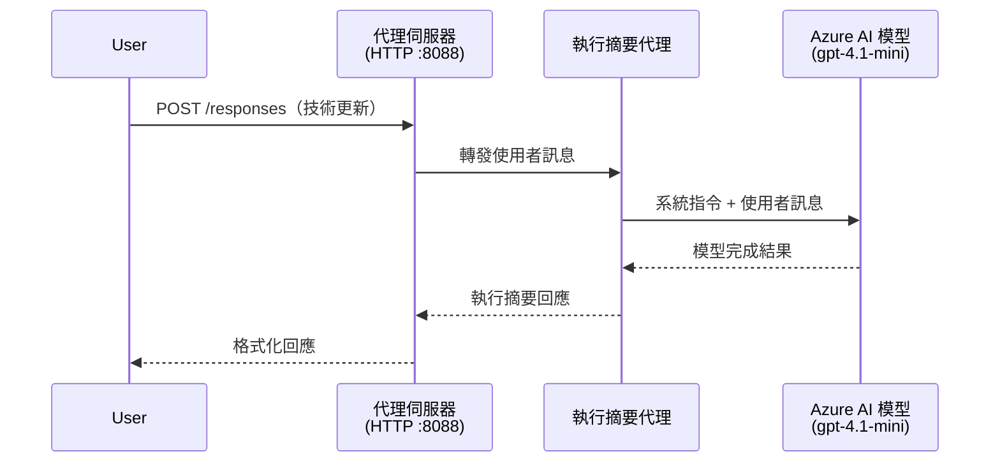
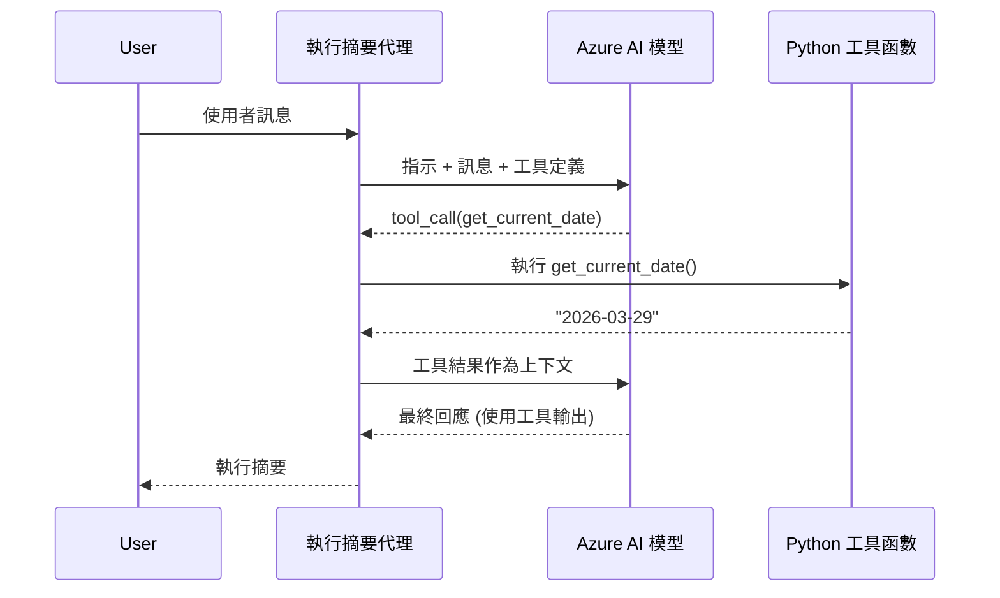

# Module 4 - 配置指令、環境與安裝相依性

在本模組中，您將自訂第 3 模組中自動產生的代理檔案。這裡是將通用腳手架轉變為<strong>您的</strong>代理—透過撰寫指令、設定環境變數、選擇性新增工具，以及安裝相依性。

> **提醒：** Foundry 擴充套件會自動產生您的專案檔案。現在您可以修改它們。請參閱 [`agent/`](../../../../../workshop/lab01-single-agent/agent) 資料夾，裡面有一個完整可運作的自訂代理範例。

---

## 元件如何組合在一起

### 請求生命週期（單一代理）


> **使用工具時：** 如果代理註冊了工具，模型可能會回傳工具呼叫而非直接完成結果。框架會在本地執行工具，將結果回饋給模型，然後模型產生最終回應。


---

## 步驟 1：配置環境變數

腳手架已建立 `.env` 檔案，裡面有佔位符值。您需要從第 2 模組填入真實值。

1. 在您產生的專案中，打開 **`.env`** 檔案（位於專案根目錄）。
2. 使用您的真實 Foundry 專案資訊取代佔位符值：

   ```env
   PROJECT_ENDPOINT=https://<your-account>.services.ai.azure.com/api/projects/<your-project>
   MODEL_DEPLOYMENT_NAME=gpt-4.1-mini
   ```

3. 儲存檔案。

### 這些值在哪裡找

| 值 | 如何找到 |
|-------|---------------|
| <strong>專案端點</strong> | 在 VS Code 中開啟 **Microsoft Foundry** 側邊欄 → 點選您的專案 → 詳細檢視會顯示端點 URL，看起來像 `https://<account-name>.services.ai.azure.com/api/projects/<project-name>` |
| <strong>模型部署名稱</strong> | 在 Foundry 側邊欄展開專案 → 查看 **Models + endpoints** → 部署模型旁邊會列出名稱（例如 `gpt-4.1-mini`） |

> **安全性注意：** 千萬不要將 `.env` 檔案提交到版本控制。檔案已預設加入 `.gitignore`。如果沒有，請手動加入：
> ```
> .env
> ```

### 環境變數的流向

映射鏈為：`.env` → `main.py`（透過 `os.getenv` 讀取）→ `agent.yaml`（在部署時映射到容器環境變數）。

在 `main.py` 中，腳手架是這樣讀取這些值的：

```python
PROJECT_ENDPOINT = os.getenv("AZURE_AI_PROJECT_ENDPOINT") or os.getenv("PROJECT_ENDPOINT")
MODEL_DEPLOYMENT_NAME = os.getenv("AZURE_AI_MODEL_DEPLOYMENT_NAME", os.getenv("MODEL_DEPLOYMENT_NAME", "gpt-4.1-mini"))
```

`AZURE_AI_PROJECT_ENDPOINT` 和 `PROJECT_ENDPOINT` 都接受（`agent.yaml` 使用 `AZURE_AI_*` 前綴）。

---

## 步驟 2：撰寫代理指令

這是最重要的自訂步驟。指令定義代理的個性、行為、輸出格式和安全限制。

1. 打開專案中的 `main.py`。
2. 找到指令字串（腳手架內含預設／通用指令）。
3. 用詳細且結構化的指令取代它。

### 優秀指令應包含

| 元件 | 目的 | 範例 |
|-----------|---------|---------|
| <strong>角色</strong> | 代理是什麼以及做什麼 |「您是資深總結代理」 |
| <strong>對象</strong> | 回應對象是誰 |「僅限具有限技術背景的高階主管」 |
| <strong>輸入定義</strong> | 處理哪類提示 |「技術事件報告、運營更新」 |
| <strong>輸出格式</strong> | 回應的確切結構 |「執行摘要：- 發生什麼事：... - 商業影響：... - 下一步：...」 |
| <strong>規則</strong> | 限制與拒絕條件 |「切勿加入未提供的資訊」 |
| <strong>安全性</strong> | 防止濫用與幻覺 |「若輸入不清楚，請詢問澄清」 |
| <strong>範例</strong> | 以輸入／輸出範例引導行為 | 包含 2-3 組不同輸入的範例 |

### 範例：執行摘要代理指令

這是工作坊 [`agent/main.py`](../../../../../workshop/lab01-single-agent/agent/main.py) 中使用的指令：

```python
AGENT_INSTRUCTIONS = """You are an "Explain Like I'm an Executive" agent.

Purpose:
Your job is to translate complex technical or operational information into
clear, concise, and outcome-focused summaries that can be easily understood
by non-technical executives.

Audience:
Senior leaders with limited technical background who care about impact,
risk, and what happens next.

What you must do:
- Rephrase the input so it is understandable to a non-technical audience
- Prioritize clarity, brevity, and outcomes over technical accuracy
- Remove technical jargon, logs, metrics, stack traces, and deep root-cause details
- Translate technical causes into simple cause-and-effect statements
- Explicitly call out business impact
- Always include a clear next step or action
- Maintain a neutral, factual, and calm executive tone
- Do NOT add new facts or speculate beyond the input

Standard Output Structure (always use this wording):

Executive Summary:
- What happened: <plain-language description>
- Business impact: <clear, non-technical impact>
- Next step: <clear action or mitigation>

Rules:
- Keep responses under 100 words
- Do NOT add facts beyond the input
- If input is unclear, ask for clarification
"""
```

4. 用您自訂的指令取代 `main.py` 中現有的指令字串。
5. 儲存檔案。

---

## 步驟 3：（選擇性）新增自訂工具

託管代理能執行 **本地 Python 函式** 作為[工具](https://learn.microsoft.com/azure/foundry/agents/concepts/tool-catalog)。這是基於程式碼的託管代理相較於僅提示代理的一大優勢— 您的代理可以執行任意伺服器端邏輯。

### 3.1 定義工具函式

在 `main.py` 新增一個工具函式：

```python
from agent_framework import tool

@tool
def get_current_date() -> str:
    """Returns the current date in YYYY-MM-DD format."""
    from datetime import date
    return str(date.today())
```

`@tool` 裝飾器將標準 Python 函式轉為代理工具。函式說明字串成為模型看到的工具描述。

### 3.2 在代理中註冊該工具

使用 `.as_agent()` 上下文管理器建立代理時，在 `tools` 參數中傳入該工具：

```python
async with AzureAIAgentClient(
    project_endpoint=PROJECT_ENDPOINT,
    model_deployment_name=MODEL_DEPLOYMENT_NAME,
    credential=credential,
).as_agent(
    name="my-agent",
    instructions=AGENT_INSTRUCTIONS,
    tools=[get_current_date],
) as agent:
    server = from_agent_framework(agent)
    await server.run_async()
```

### 3.3 工具呼叫如何運作

1. 使用者發送提示。
2. 模型根據提示、指令和工具描述判斷是否需要工具。
3. 若需要，框架在本地（容器內）呼叫您的 Python 函式。
4. 工具回傳值會作為上下文送回模型。
5. 模型產生最終回應。

> <strong>工具在伺服器端執行</strong>—它們在您的容器內運行，不會在使用者瀏覽器或模型內執行。這表示您可以存取資料庫、API、檔案系統或任何 Python 函式庫。

---

## 步驟 4：建立並啟動虛擬環境

安裝相依性前，請建立獨立的 Python 環境。

### 4.1 建立虛擬環境

在 VS Code 開啟終端機（`` Ctrl+` ``），執行：

```powershell
python -m venv .venv
```

這會在專案目錄下建立 `.venv` 資料夾。

### 4.2 啟用虛擬環境

**PowerShell (Windows)：**

```powershell
.\.venv\Scripts\Activate.ps1
```

**Command Prompt (Windows)：**

```cmd
.venv\Scripts\activate.bat
```

**macOS/Linux (Bash)：**

```bash
source .venv/bin/activate
```

終端機提示字元前應顯示 `(.venv)`，表示虛擬環境已啟動。

### 4.3 安裝相依性

在虛擬環境啟動狀態下，安裝需要的套件：

```powershell
pip install -r requirements.txt
```

安裝項目如下：

| 套件 | 用途 |
|---------|---------|
| `agent-framework-azure-ai==1.0.0rc3` | Azure AI 與 [Microsoft Agent Framework](https://learn.microsoft.com/agent-framework/overview/) 整合 |
| `agent-framework-core==1.0.0rc3` | 建立代理的核心執行環境（包含 `python-dotenv`） |
| `azure-ai-agentserver-agentframework==1.0.0b16` | 針對 [Foundry Agent Service](https://learn.microsoft.com/azure/foundry/agents/overview) 的託管代理伺服器執行環境 |
| `azure-ai-agentserver-core==1.0.0b16` | 核心代理伺服器抽象層 |
| `debugpy` | Python 除錯工具（可在 VS Code 執行 F5 除錯） |
| `agent-dev-cli` | 本地開發 CLI，用於測試代理 |

### 4.4 驗證安裝

```powershell
pip list | Select-String "agent-framework|agentserver"
```

預期輸出：
```
agent-framework-azure-ai   1.0.0rc3
agent-framework-core       1.0.0rc3
azure-ai-agentserver-agentframework 1.0.0b16
azure-ai-agentserver-core  1.0.0b16
```

---

## 步驟 5：驗證驗證機制

代理使用 [`DefaultAzureCredential`](https://learn.microsoft.com/azure/developer/python/sdk/authentication/credential-chains#defaultazurecredential-overview)，會按以下順序嘗試多種驗證方式：

1. <strong>環境變數</strong> — `AZURE_CLIENT_ID`、`AZURE_TENANT_ID`、`AZURE_CLIENT_SECRET`（服務主體）
2. **Azure CLI** — 使用您透過 `az login` 登入的帳號
3. **VS Code** — 使用您登入 VS Code 的帳號
4. <strong>受管身分識別</strong> — 部署時在 Azure 環境中使用

### 5.1 本地開發驗證

以下任一種方法應該可用：

**方案 A：Azure CLI（推薦）**

```powershell
az account show --query "{name:name, id:id}" --output table
```

預期：顯示您的訂閱名稱和 ID。

**方案 B：VS Code 登入**

1. 查看 VS Code 左下角的 **Accounts** 圖示。
2. 若看到您的帳號名稱，代表已驗證。
3. 若否，點圖示 → **Sign in to use Microsoft Foundry**。

**方案 C：服務主體（CI/CD 使用）**

```powershell
$env:AZURE_TENANT_ID = "<your-tenant-id>"
$env:AZURE_CLIENT_ID = "<your-client-id>"
$env:AZURE_CLIENT_SECRET = "<your-client-secret>"
```

### 5.2 常見驗證問題

若您登入多個 Azure 帳號，請確保選用正確的訂閱：

```powershell
az account set --subscription "<your-subscription-id>"
```

---

### 檢查清單

- [ ] `.env` 檔案內的 `PROJECT_ENDPOINT` 和 `MODEL_DEPLOYMENT_NAME` 已填入有效值（非佔位符）
- [ ] 在 `main.py` 中自訂代理指令，定義角色、對象、輸出格式、規則和安全限制
- [ ] （選擇性）已定義並註冊自訂工具
- [ ] 虛擬環境已建立並啟用（終端機提示顯示 `(.venv)`）
- [ ] 執行 `pip install -r requirements.txt` 成功完成且無錯誤
- [ ] `pip list | Select-String "azure-ai-agentserver"` 顯示套件已安裝
- [ ] 驗證成功—`az account show` 回傳訂閱資訊或您已登入 VS Code

---

**上一節：** [03 - 建立託管代理](03-create-hosted-agent.md) · **下一節：** [05 - 本地測試 →](05-test-locally.md)

---

<!-- CO-OP TRANSLATOR DISCLAIMER START -->
**免責聲明**：  
本文件係使用 AI 翻譯服務 [Co-op Translator](https://github.com/Azure/co-op-translator) 進行翻譯。雖然我們努力追求準確性，但請注意，自動翻譯可能包含錯誤或不準確之處。原文文件的母語版本應視為權威來源。對於重要資訊，建議採用專業人工翻譯。對於因使用本翻譯而產生的任何誤解或曲解，我們概不負責。
<!-- CO-OP TRANSLATOR DISCLAIMER END -->