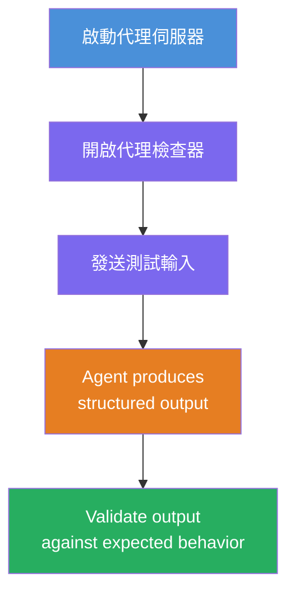
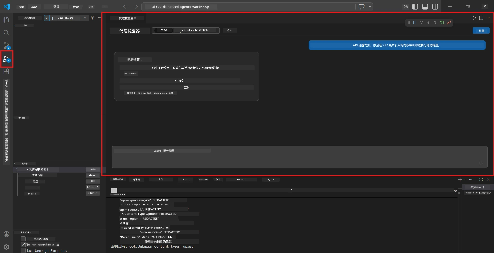
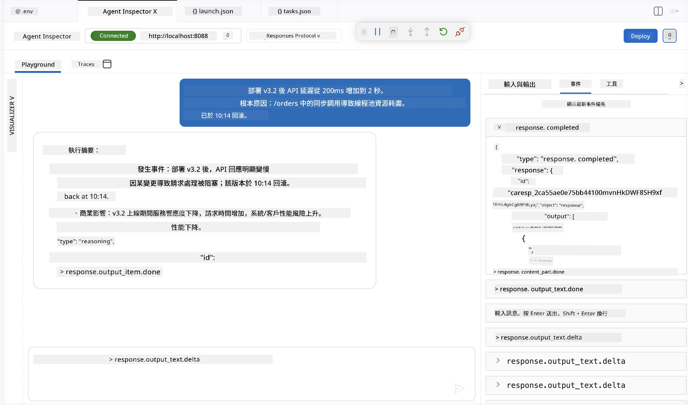

# 模組 4 - 本地測試

⏱️ 約 10 分鐘

在本模組中，您將在本地執行代理並使用 <strong>順利路徑功能測試</strong> 驗證其運作是否正確。您將使用 Agent Inspector（視覺化介面）或直接 HTTP 呼叫來確認代理產生結構化且準確的回應。

### 本地測試流程



---

## 選項 1：按 F5 - 使用 Agent Inspector 除錯（推薦）

### 啟動除錯器

1. 直接在 VS Code 中開啟 **executive-summary-agent/** 資料夾（`檔案 → 開啟資料夾`）。
2. 開啟 <strong>執行與除錯</strong> 面板（`Ctrl+Shift+D`）。
3. 從下拉選單選擇 **Debug Local Agent Server**。
4. 按 **F5**（或點擊 ▶ 啟動除錯）。

> ⚠️ **重要：請選擇您的 Python 直譯器**
> 若出現 "ModuleNotFoundError" 或除錯器無法啟動，您必須告訴 VS Code 使用您的虛擬環境：
  > 1. 按 `Ctrl+Shift+P` $\rightarrow$ 輸入 **Python: Select Interpreter**。
  > 2. 選擇位於您專案 `.venv` 資料夾的直譯器（例如 Windows 上的 `.\.venv\Scripts\python.exe`）。
  > 3. 重新啟動除錯工作階段。
> 如仍有錯誤，請手動更新您的 `tasks.json` 檔案如下：
  > 1. 前往 `.vscode/tasks.json` 檔案
  > 2. 尋找標記為 `Run Agent/Workflow HTTP Server` 的命令
  > 3. 將命令值更新為 `"value": "${workspaceFolder}/.venv/bin/python",`

### 會發生什麼事

1. HTTP 伺服器會在 `http://localhost:8088/responses` 啟動。
2. **Agent Inspector** 面板會自動開啟 - 這是一個用於測試的視覺聊天介面。
3. 在 `main.py` 中啟用斷點。

請注意終端機輸出：
```
Starting executive summary hosted agent
Executive agent server running on http://localhost:8088
```

> **如果 Agent Inspector 未自動開啟：** 按 `Ctrl+Shift+P` → **Foundry Toolkit: Open Agent Inspector**。



> *截圖可能顯示先前版本擴充套件中的舊 'AI TOOLKIT' 品牌。*

---

## 選項 2：透過終端機測試（替代方案）

在一個終端機啟動代理，從另一個終端機發送請求：

```bash
# 終端 1：啟動代理程式
cd executive-summary-agent/
source .venv/bin/activate
python main.py
```

```bash
# 終端 2：發送測試（curl）
curl -sS -X POST http://localhost:8088/responses \
  -H "Content-Type: application/json" \
  -d '{"input": "The API latency increased due to thread pool exhaustion caused by sync calls in v3.2.", "stream": false}'
```

---

## 場景測試：順利路徑功能驗證

執行下面 <strong>全部三個</strong> 場景。這些測試將驗證您的代理是否能針對真實輸入產生正確且結構化的輸出。



### 場景 1：IT 事件 - API 延遲峰值

**輸入：**
```
The API latency increased from 200ms to 2s after deploying v3.2.
Root cause: thread pool starvation from synchronous calls in /orders.
Rolled back at 10:14.
```

**預期行為：**
- ✅ 遵循「執行摘要」結構（發生了什麼 / 商業影響 / 下一步）
- ✅ 無技術術語（不使用「thread pool」、「/orders」、「v3.2」等）
- ✅ 清楚陳述商業影響（例如，使用者經歷延遲）
- ✅ 包含下一步行動（例如，部署修復，設置監控）

---

### 場景 2：資料管線 - ETL 失敗

**輸入：**
```
The nightly ETL job failed because the upstream schema changed. APAC dashboards show missing data.
```

**預期行為：**
- ✅ 使用簡單語言總結資料刷新失敗
- ✅ 提及亞太區儀表板的影響
- ✅ 包含補救的下一步行動
- ✅ 不提及「ETL」、「schema」或其他技術術語

---

### 場景 3：安全 - 憑證外洩

**輸入：**
```
Static analysis flagged a hardcoded secret in the repository.
The secret may have been exposed in commit history.
```

**預期行為：**
- ✅ 以行政主管友善的語言描述憑證或安全問題
- ✅ 指出潛在風險（未授權存取）
- ✅ 陳述補救行動（憑證輪替，稽核）
- ✅ 不包含「static analysis」、「commit history」或「hardcoded」等術語

---

## 驗證標準

對每個場景，請檢查：

| # | 標準 | 通過條件 |
|---|----------|---------------|
| 1 | <strong>結構</strong> | 回應使用含 3 項重點的「執行摘要」格式 |
| 2 | <strong>簡潔語言</strong> | 無行政主管無法理解的技術術語 |
| 3 | <strong>準確性</strong> | 摘要符合輸入內容 - 無虛構細節 |
| 4 | <strong>簡短</strong> | 回應字數少於 100 字 |
| 5 | <strong>下一步</strong> | 清楚表明行動或緩解措施 |

---

## 除錯提示

| 問題 | 解決方法 |
|-------|-----|
| 代理無法啟動 | 檢查 `.env` 參數，確認虛擬環境已啟動，執行 `pip install -r requirements.txt` |
| 回應為空或泛泛而談 | 查看 `main.py` 中的指示 - 確保指定輸出格式 |
| 回應包含術語 | 強化「移除技術術語」的指令 |
| Agent Inspector 無法開啟 | `Ctrl+Shift+P` → **Foundry Toolkit: Open Agent Inspector** |
| 終端機中模型錯誤 | 確認 `AZURE_AI_MODEL_DEPLOYMENT_NAME` 精確匹配（大小寫敏感） |

---

### ✅ 檢查點

- [ ] 代理本地啟動無錯誤
- [ ] Agent Inspector 開啟並顯示聊天介面（如果使用 F5）
- [ ] **場景 1**（IT 事件）- 結構化執行摘要，無術語
- [ ] **場景 2**（資料管線）- 相關摘要帶有商業影響
- [ ] **場景 3**（安全告警）- 適切的風險溝通
- [ ] 所有回應皆遵守定義的輸出結構

> <strong>請保存您的回應</strong>（複製或截圖） - 後續模組 06 中您將與雲端結果比較。

---

**上一步：** [03 - 設定與撰寫程式碼](03-configure-and-code.md) · **下一步：** [05 - 部署至 Foundry →](05-deploy-to-foundry.md)

---

<!-- CO-OP TRANSLATOR DISCLAIMER START -->
**免責聲明**：
此文件已使用 AI 翻譯服務 [Co-op Translator](https://github.com/Azure/co-op-translator) 進行翻譯。雖然我們努力追求準確性，但請注意自動翻譯可能包含錯誤或不準確之處。原始文件的母語版本應視為權威來源。對於關鍵資訊，建議採用專業人工翻譯。我們不對因使用此翻譯所產生的任何誤解或誤譯承擔責任。
<!-- CO-OP TRANSLATOR DISCLAIMER END -->