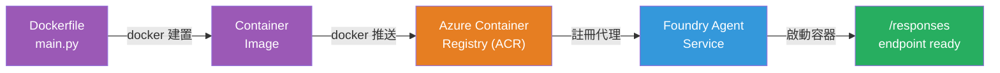
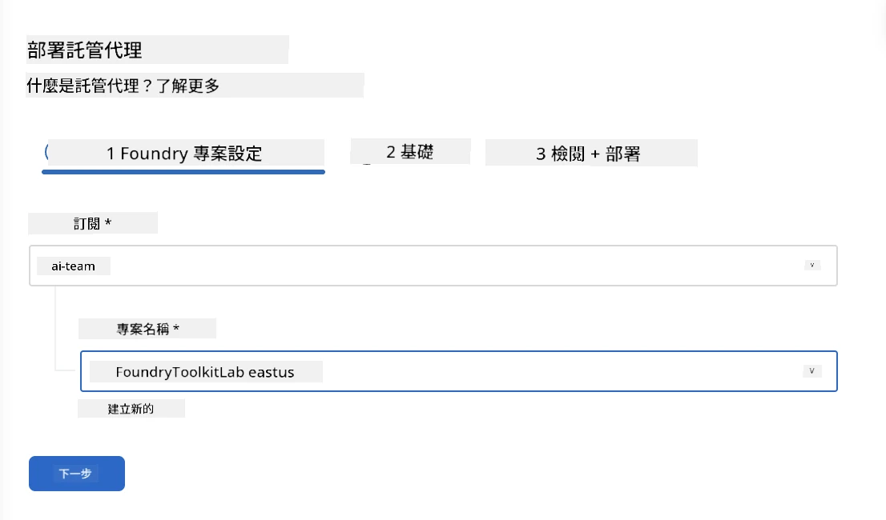
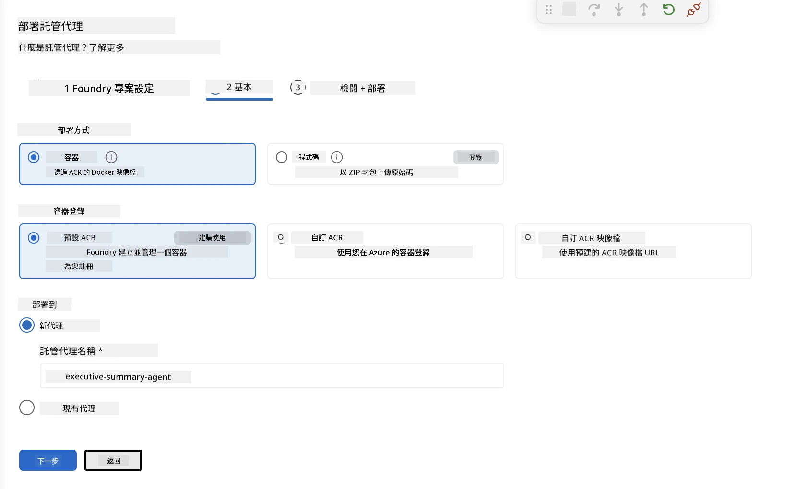
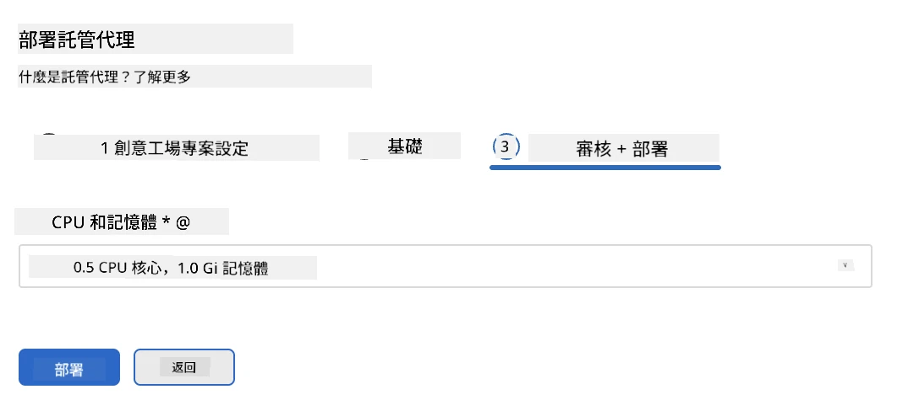
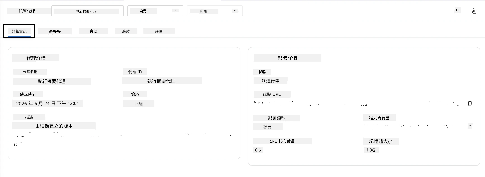

# 模組 5 - 部署至 Foundry Agent 服務

⏱️ 約 10 分鐘

> ⚠️ **路徑 B 使用者：** 本模組需要 Foundry 訂閱。如果您正在使用 Foundry Local，請跳至 [模組 07 - 摘要](07-summary.md)。您已成功完成本地開發流程！

在本模組中，您將部署本地測試完成的代理至 Microsoft Foundry，作為 <strong>託管代理</strong>。部署過程會建立容器映像，推送至 Azure 容器註冊表，並在 Foundry 管理基礎架構中啟動代理。

### 部署流程

---

## 前置條件檢查

部署前請確認：

- [ ] 代理通過所有來自 [模組 04](04-test-locally.md) 的 3 個本地情境測試
- [ ] 您在專案層級擁有 **Azure AI 使用者** 角色 ([模組 01，指派 RBAC](01-setup.md#deploy-a-model--assign-rbac))
- [ ] 您已在 VS Code 登入 Azure（帳戶圖示顯示您的名稱）

---

## 步驟 1：開始部署

### 選項 A：從 Agent Inspector 部署（推薦）

若 Agent Inspector 已開啟（從測試階段）：
1. 點擊右上角的 <strong>部署</strong> 按鈕（雲端圖示 ↑）。

### 選項 B：從命令面板部署

1. 按 `Ctrl+Shift+P` → **Foundry Toolkit：部署託管代理**。

---

## 步驟 2：設定部署

巡覽向導會詢問您：

| 提示 | 選項 |
|--------|-----------|
| <strong>訂閱</strong> | 您的 Azure 訂閱 |
| <strong>目標專案</strong> | 您的 Foundry 專案（例如 `workshop-agents`） |

點擊 <strong>下一步</strong> 以設定您的代理。

| 提示 | 選項 |
|--------|-----------|
| <strong>部署方法</strong> | 容器 |
| <strong>容器註冊表</strong> | **預設 ACR**（Microsoft Foundry 為您建立並管理） |
| <strong>部署至</strong> | 新代理（名稱，`executive-summary-agent`） |

點擊 <strong>下一步</strong> 檢查並部署您的代理。

| 提示 | 選項 |
|--------|-----------|
| **CPU 與記憶體** | **0.25 核心 CPU，0.5 Gi 記憶體**（足夠執行工作坊） |

---

## 步驟 3：部署並監控

1. 點擊 <strong>部署</strong>。
2. 觀察 <strong>輸出</strong> 面板（從下拉選單選擇 **Microsoft Foundry**）。
3. 部署會經過這些階段：
   - **Docker 建置** - 從您的 Dockerfile 建置容器
   - **Docker 推送** - 推送映像到 ACR（首次部署約 1–3 分鐘）
   - <strong>代理註冊</strong> - 在 Foundry 中建立託管代理
   - <strong>容器啟動</strong> - 使用系統管理身份啟動

4. 完成後會出現通知：
   > **my-agent 已成功部署。** `查看日誌` `執行代理`

5. 點擊 <strong>執行代理</strong> 開啟代理遊樂場。

### 部署狀態值

| 狀態 | 含義 |
|--------|---------|
| <strong>運行中</strong> | 容器已準備好，代理在回應 |
| <strong>等待中</strong> | 容器啟動中 - 請等待 30–60 秒 |
| <strong>失敗</strong> | 請檢查日誌（見下方除錯指南） |

---

## 常見部署錯誤

| 錯誤 | 根本原因 | 解決方法 |
|-------|-----------|-----|
| `agents/write` 權限拒絕 | 專案層級缺少 **Azure AI 使用者** 角色 | [模組 01，指派 RBAC](01-setup.md#deploy-a-model--assign-rbac) |
| Docker 未運行 | Docker Desktop 尚未啟動 | 啟動 Docker Desktop → 驗證 `docker info` |
| ACR 授權問題 | 託管身份無法拉取映像 | 請參閱 [模組 08 - 除錯](08-troubleshooting.md) |

---

### ✅ 檢查點

- [ ] 部署完成且無錯誤
- [ ] 代理顯示於 Foundry 側邊欄的 **託管代理（預覽）** 下
- [ ] 容器狀態顯示 <strong>運行中</strong>
- [ ] 已打開代理遊樂場分頁，顯示代理詳細資訊與端點 URL

---

**上一節：** [04 - 本地測試](04-test-locally.md) · **下一節：** [06 - 在 Playground 驗證 →](06-verify-in-playground.md)

---

<!-- CO-OP TRANSLATOR DISCLAIMER START -->
**免責聲明**：
此文件已使用 AI 翻譯服務 [Co-op Translator](https://github.com/Azure/co-op-translator) 進行翻譯。雖然我們努力追求準確性，但請注意自動翻譯可能包含錯誤或不準確之處。原始文件的母語版本應視為權威來源。對於關鍵資訊，建議採用專業人工翻譯。我們不對因使用此翻譯所產生的任何誤解或誤譯承擔責任。
<!-- CO-OP TRANSLATOR DISCLAIMER END -->