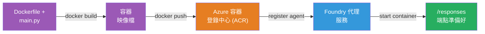
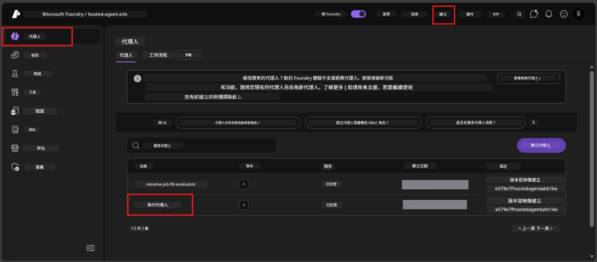

# Module 6 - 部署到 Foundry 代理服務

在本模組中，您將已在本地測試的代理部署到 Microsoft Foundry，作為 [**Hosted Agent**](https://learn.microsoft.com/azure/foundry/agents/concepts/hosted-agents)。部署流程會從您的專案建立 Docker 容器映像，推送到 [Azure Container Registry (ACR)](https://learn.microsoft.com/azure/container-registry/container-registry-intro)，並在 [Foundry Agent Service](https://learn.microsoft.com/azure/foundry/agents/overview) 中建立一個託管代理版本。

### 部署管線


---

## 先決條件檢查

在部署前，請確認以下每項。跳過這些是部署失敗的最常見原因。

1. **代理通過本地煙火測試：**
   - 您已完成 [Module 5](05-test-locally.md) 中的全部 4 項測試，且代理回應正確。

2. **您擁有 [Azure AI User](https://learn.microsoft.com/azure/foundry/concepts/rbac-foundry#built-in-roles) 角色：**
   - 此角色於 [Module 2, Step 3](02-create-foundry-project.md) 中分配。若不確定，現在確認：
   - Azure 入口網站 → 您的 Foundry <strong>專案</strong> 資源 → **存取控制 (IAM)** → <strong>角色指派</strong> 頁籤 → 搜尋您的名字 → 確認列有 **Azure AI User**。

3. **您已在 VS Code 中登入 Azure：**
   - 檢查 VS Code 左下角的帳戶圖示，應可見您的帳號名稱。

4. **（可選）Docker Desktop 正在執行：**
   - Docker 只在 Foundry 擴充套件提示您進行本地建立時才需要。大多數情況下，擴充套件會在部署自動處理容器建立。
   - 若您安裝了 Docker，請確認它正在運行：`docker info`

---

## 第 1 步：開始部署

您有兩種部署方式 - 結果皆相同。

### 選項 A：從代理檢視器部署 (建議)

如果您正以除錯模式 (F5) 執行代理，且代理檢視器開啟：

1. 查看代理檢視器面板右上角。
2. 點擊 **Deploy** 按鈕（雲端圖示，向上箭頭 ↑）。
3. 部署精靈會開啟。

### 選項 B：從命令面板部署

1. 按 `Ctrl+Shift+P` 開啟 <strong>命令面板</strong>。
2. 輸入：**Microsoft Foundry: Deploy Hosted Agent** 並選擇它。
3. 部署精靈會開啟。

---

## 第 2 步：設定部署

部署精靈會引導您完成設定。請填寫每個提示：

### 2.1 選擇目標專案

1. 下拉選單會顯示您的 Foundry 專案。
2. 選擇您在 Module 2 建立的專案（例如 `workshop-agents`）。

### 2.2 選擇容器代理檔案

1. 會要求您選擇代理進入點。
2. 選擇 **`main.py`** (Python) - 此檔案將被用來識別您的代理專案。

### 2.3 設定資源

| 設定 | 推薦值 | 備註 |
|---------|------------------|-------|
| **CPU** | `0.25` | 預設，足夠用於工作坊。正式工作負載請提高 |
| **Memory** | `0.5Gi` | 預設，足夠用於工作坊 |

這些值與 `agent.yaml` 相符，您可接受預設值。

---

## 第 3 步：確認並部署

1. 精靈會顯示部署摘要，包括：
   - 目標專案名稱
   - 代理名稱（來自 `agent.yaml`）
   - 容器檔案與資源
2. 檢視摘要後，點擊 **Confirm and Deploy**（或 **Deploy**）。
3. 在 VS Code 觀看進度。

### 部署過程詳解（逐步）

部署是一個多步驟流程。請在 VS Code 的 <strong>輸出</strong> 面板（從下拉選單選擇 "Microsoft Foundry"）中追蹤：

1. **Docker 建置** - VS Code 從您的 `Dockerfile` 建立 Docker 容器映像。您會看到 Docker 層訊息：
   ```
   Step 1/6 : FROM python:<version>-slim
   Step 2/6 : WORKDIR /app
   ...
   Successfully built abc123def456
   ```

2. **Docker 推送** - 映像將推送到與您 Foundry 專案關聯的 **Azure Container Registry (ACR)**。首次部署可能需 1-3 分鐘（基底映像超過 100MB）。

3. <strong>代理註冊</strong> - Foundry Agent Service 建立新的託管代理版本（若代理已存在則建立新版本）。使用 `agent.yaml` 的代理元資料。

4. <strong>容器啟動</strong> - 容器於 Foundry 管理基礎架構啟動，平台指派 [系統管理的身份](https://learn.microsoft.com/azure/foundry/agents/concepts/agent-identity) 並公開 `/responses` 端點。

> <strong>首次部署較慢</strong>（Docker 需推送所有層）。連續部署較快，因為 Docker 會快取未變更的層。

---

## 第 4 步：確認部署狀態

部署命令完成後：

1. 按一下活動列中的 Foundry 圖示，開啟 **Microsoft Foundry** 側邊欄。
2. 展開您專案下的 **Hosted Agents (Preview)** 區段。
3. 您應會看見代理名稱（例如 `ExecutiveAgent` 或 `agent.yaml` 的名稱）。
4. <strong>點擊代理名稱</strong> 展開它。
5. 您會看見一個或多個 <strong>版本</strong>（例如 `v1`）。
6. 點擊版本以檢視 <strong>容器詳細資料</strong>。
7. 查看 <strong>狀態</strong> 欄位：

   | 狀態 | 意義 |
   |--------|---------|
   | **Started** 或 **Running** | 容器已執行且代理就緒 |
   | **Pending** | 容器正在啟動（等待 30-60 秒） |
   | **Failed** | 容器啟動失敗（檢查日誌 - 請參考下面故障排除） |



> **如果看到 "Pending" 超過 2 分鐘：** 可能容器正在拉取基底映像。請稍候。如持續為 Pending，請檢查容器日誌。

---

## 常見部署錯誤及修正

### 錯誤 1：權限被拒 - `agents/write`

```
Error: lacks the required data action 
Microsoft.CognitiveServices/accounts/AIServices/agents/write 
to perform POST /api/projects/{projectName}/assistants operation.
```

**根本原因：** 您在 <strong>專案</strong> 層級未取得 `Azure AI User` 角色。

**修正步驟：**

1. 開啟 [https://portal.azure.com](https://portal.azure.com)。
2. 在搜尋列輸入您的 Foundry <strong>專案</strong> 名稱並點擊。
   - **重要：** 請確認您進入的是 <strong>專案</strong> 資源（類型為 "Microsoft Foundry project"），而非上層帳戶/中樞資源。
3. 左側導覽點選 **存取控制 (IAM)**。
4. 點選 **+ 新增** → <strong>新增角色指派</strong>。
5. 在 <strong>角色</strong> 標籤，搜尋並選擇 [**Azure AI User**](https://learn.microsoft.com/azure/foundry/concepts/rbac-foundry#built-in-roles)，點擊 <strong>下一步</strong>。
6. 在 <strong>成員</strong> 標籤，選擇 **使用者、群組或服務主體**。
7. 點選 **+ 選擇成員**，搜尋您的名稱/電子郵件，選擇自己，點擊 <strong>選擇</strong>。
8. 點擊 **審核 + 指派** → 再次點擊 **審核 + 指派**。
9. 等待 1-2 分鐘讓角色指派生效。
10. **重新執行第 1 步的部署。**

> 角色必須在 <strong>專案</strong> 範圍設定，而非帳戶範圍。這是部署失敗的最常見原因第一名。

### 錯誤 2：Docker 未執行

```
Error: Docker build failed / Cannot connect to Docker daemon
```

**修正：**
1. 啟動 Docker Desktop（從開始功能表或系統匣中尋找）。
2. 等待顯示「Docker Desktop is running」（約 30-60 秒）。
3. 在終端機執行 `docker info` 確認。
4. **Windows 專屬：** 確認 Docker Desktop 設定中的 WSL 2 後端已啟用 → <strong>一般</strong> → **使用 WSL 2 基礎引擎**。
5. 重新嘗試部署。

### 錯誤 3：ACR 授權失敗 - `AcrPullUnauthorized`

```
Error: AcrPullUnauthorized
```

**根本原因：** Foundry 專案管理身份未擁有容器註冊表的拉取權限。

**修正：**
1. 在 Azure 入口網站，轉至您的 **[Container Registry](https://learn.microsoft.com/azure/container-registry/container-registry-intro)**（與 Foundry 專案同資源群組）。
2. 前往 **存取控制 (IAM)** → <strong>新增</strong> → <strong>新增角色指派</strong>。
3. 選擇 **[AcrPull](https://learn.microsoft.com/azure/container-registry/container-registry-roles)** 角色。
4. 在成員處選擇 <strong>管理身份</strong> → 找出 Foundry 專案的管理身份。
5. **審核 + 指派**。

> 通常由 Foundry 擴充套件自動設定。如果發生此錯誤，可能是自動設定失敗。

### 錯誤 4：容器平台不匹配 (Apple Silicon)

若從 Apple Silicon Mac (M1/M2/M3) 部署，容器必須建置為 `linux/amd64`：

```bash
docker build --platform linux/amd64 -t myagent:v1 .
```

> Foundry 擴充套件會自動為大多數用戶處理此事項。

---

### 檢查點

- [ ] 部署指令在 VS Code 中完成且無錯誤
- [ ] 代理出現在 Foundry 側邊欄的 **Hosted Agents (Preview)** 下
- [ ] 已點擊代理 → 選擇一個版本 → 瀏覽 **Container Details**
- [ ] 容器狀態為 **Started** 或 **Running**
- [ ] （如有錯誤）已確認錯誤、套用修正並成功重新部署

---

**上一頁：** [05 - 本地測試](05-test-locally.md) · **下一頁：** [07 - 在 Playground 驗證 →](07-verify-in-playground.md)

---

<!-- CO-OP TRANSLATOR DISCLAIMER START -->
**免責聲明**：  
本文件使用 AI 翻譯服務 [Co-op Translator](https://github.com/Azure/co-op-translator) 進行翻譯。雖然我們力求準確，但請注意自動翻譯可能包含錯誤或不準確之處。原始文件的母語版本應視為權威來源。對於重要資訊，建議採用專業人工翻譯。對於因使用本翻譯所產生的任何誤解或誤譯，我們不承擔任何責任。
<!-- CO-OP TRANSLATOR DISCLAIMER END -->