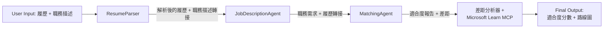

# PersonalCareerCopilot - 履歷 → 工作匹配評估器

一個以工作流程為核心的多代理應用，評估履歷與工作說明的匹配度，然後生成個人化的學習路線圖以彌補差距。

---

## 代理

| 代理 | 角色 | 工具 |
|-------|------|-------|
| **ResumeParser** | 從履歷文本中提取結構化技能、經驗、證書 | - |
| **JobDescriptionAgent** | 從工作說明中提取必要/偏好技能、經驗、證書 | - |
| **MatchingAgent** | 比較個人檔案與需求 → 匹配分數 (0-100) + 匹配/缺少技能 | - |
| **GapAnalyzer** | 使用 Microsoft Learn 資源建立個人化學習路線圖 | `search_microsoft_learn_for_plan` (MCP) |

## 工作流程



---

## 快速開始

### 1. 設定環境

此資料夾是基於工作流程的 Lab 02 骨架的參考實作。其 `main.py` 使用現有的提示區塊與 `WorkflowBuilder` 將四個代理串接在一起。

```powershell
cd workshop\lab02-multi-agent\PersonalCareerCopilot
python -m venv .venv
.\.venv\Scripts\Activate.ps1          # Windows PowerShell
# source .venv/bin/activate            # macOS / Linux
pip install -r requirements.txt
```

### 2. 設定認證

在此資料夾建立 `.env` 檔案：

```powershell
copy .env .env.bak 2>$null; echo $null > .env
```

編輯 `.env`：

```env
FOUNDRY_PROJECT_ENDPOINT=https://<your-account>.services.ai.azure.com/api/projects/<your-project>
AZURE_AI_MODEL_DEPLOYMENT_NAME=gpt-4.1-mini
```

| 值 | 取得位置 |
|-------|------------------|
| `FOUNDRY_PROJECT_ENDPOINT` | Foundry 工具側邊欄 → 右鍵點選專案 → <strong>複製專案端點</strong> |
| `AZURE_AI_MODEL_DEPLOYMENT_NAME` | Foundry 側邊欄 → 展開專案 → **模型 + 端點** → 部署名稱 |

### 3. 本地執行

```powershell
python -m debugpy --listen 127.0.0.1:5679 main.py --port 8088
```

或使用 VS Code 的任務：`Ctrl+Shift+P` → **Tasks: Run Task** → **Run Agent HTTP Server**。

若要 F5 偵錯，請使用 **Debug Local Agent HTTP Server**。

### 4. 使用 Agent Inspector 測試

開啟 Agent Inspector：`Ctrl+Shift+P` → **Foundry Toolkit: Open Agent Inspector**。

貼上此測試提示：

```
Resume:
Jane Doe
Senior Software Engineer with 5 years of experience in Python, Django, and AWS.
Built microservices handling 10K+ requests/second. Led a team of 4 developers.
Certifications: AWS Solutions Architect Associate.
Education: B.S. Computer Science, State University.

Job Description:
Senior Cloud Engineer at Contoso Ltd.
Required: Python, Azure, Kubernetes, Terraform, CI/CD pipelines.
Preferred: Go, monitoring (Prometheus/Grafana), cost optimization.
Experience: 5+ years in cloud infrastructure.
Certifications: Azure Solutions Architect Expert preferred.
```

**預期結果：** 一個匹配分數 (0-100)、匹配/缺少技能，以及帶有 Microsoft Learn 網址的個人化學習路線圖。

### 5. 部署至 Foundry

`Ctrl+Shift+P` → **Foundry Toolkit: Deploy Hosted Agent** → 選擇你的專案 → 確認。

---

## 專案結構

```
PersonalCareerCopilot/
├── .env                ← Your credentials (git-ignored)
├── agent.yaml          ← Hosted agent definition (name, resources, env vars)
├── Dockerfile          ← Container image for Foundry deployment
├── main.py             ← 4-agent workflow (instructions, MCP tool, WorkflowBuilder)
└── requirements.txt    ← Python dependencies
```

## 主要檔案

### `agent.yaml`

定義 Foundry 代理服務的託管代理：
- `kind: hosted` - 以受管理容器方式運行
- `protocols` - 使用 `responses` 協議，版本 `1.0.0`，公開 `/responses` HTTP 端點
- `environment_variables` - 定義了 `AZURE_AI_MODEL_DEPLOYMENT_NAME`；`FOUNDRY_PROJECT_ENDPOINT` 在部署時自動注入

### `main.py`

包含：
- <strong>代理指令</strong> - 四個每個代理對應的 `*_INSTRUCTIONS` 常數
- **MCP 工具** - `search_microsoft_learn_for_plan()` 透過 Streamable HTTP 呼叫 `https://learn.microsoft.com/api/mcp`
- <strong>代理建立</strong> - 四個 `Agent()` + `AgentExecutor()` 實例，共用一個 `FoundryChatClient`
- <strong>工作流程圖</strong> - `WorkflowBuilder` 將代理串接為順序流程：ResumeParser → JD Agent → MatchingAgent → GapAnalyzer
- <strong>伺服器啟動</strong> - `ResponsesHostServer` 運行於 8088 埠

### `requirements.txt`

| 套件 | 用途 |
|---------|----------|
| `agent-framework-foundry` | 核心執行期：提供 `Agent`、`AgentExecutor`、`WorkflowBuilder`、`@tool`、`FoundryChatClient` |
| `agent-framework-foundry-hosting` | `ResponsesHostServer` 與 Foundry 託管整合 |
| `mcp<2,>=1.24.0` | GapAnalyzer 的 MCP 客戶端（`streamable_http_client`） |
| `debugpy` | Python 偵錯工具 (VS Code F5) |

---

## 疑難排解

| 問題 | 解決方法 |
|-------|-----|
| `KeyError: 'FOUNDRY_PROJECT_ENDPOINT'` 或 `KeyError: 'AZURE_AI_MODEL_DEPLOYMENT_NAME'` | 建立 `.env` 並設定 `FOUNDRY_PROJECT_ENDPOINT` 與 `AZURE_AI_MODEL_DEPLOYMENT_NAME` |
| `ModuleNotFoundError: No module named 'agent_framework'` | 啟動虛擬環境並執行 `pip install -r requirements.txt` |
| 輸出中無 Microsoft Learn 網址 | 確認網路連線至 `https://learn.microsoft.com/api/mcp` |
| 只有一張缺口卡片（被截斷） | 確認 `GAP_ANALYZER_INSTRUCTIONS` 包含 `CRITICAL:` 區塊 |
| 8088 埠被佔用 | 停止其他伺服器：`netstat -ano \| findstr :8088` |

詳細疑難排解指南請參閱 [Module 8 - Troubleshooting](../docs/08-troubleshooting.md)。

---

**完整操作指南：** [Lab 02 Docs](../docs/README.md) · **回到：** [Lab 02 README](../README.md) · [工作坊首頁](../../../README.md)

---

<!-- CO-OP TRANSLATOR DISCLAIMER START -->
**免責聲明**：
此文件已使用 AI 翻譯服務 [Co-op Translator](https://github.com/Azure/co-op-translator) 進行翻譯。雖然我們努力追求準確性，但請注意自動翻譯可能包含錯誤或不準確之處。原始文件的母語版本應視為權威來源。對於關鍵資訊，建議採用專業人工翻譯。我們不對因使用此翻譯所產生的任何誤解或誤譯承擔責任。
<!-- CO-OP TRANSLATOR DISCLAIMER END -->