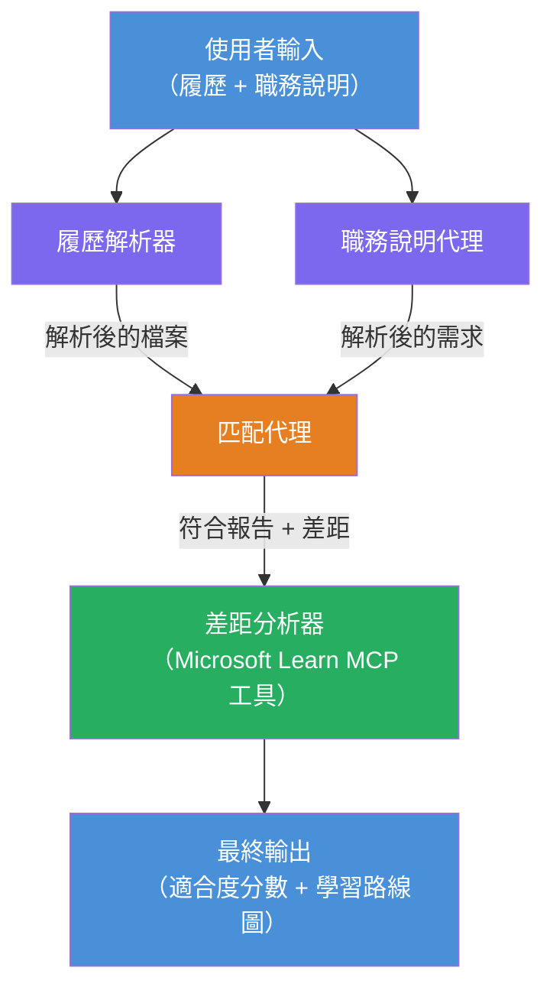

# Lab 02 - 多智能體工作流程：履歷 → 職務適配評估器

---

## 你將建構的內容

一個 **履歷 → 職務適配評估器** —— 一個多智能體工作流程，四個專業智能體協同評估應徵者的履歷與職務描述的匹配度，然後生成個人化的學習路線圖來填補差距。

### 智能體介紹

| 智能體 | 角色 |
|-------|------|
| <strong>履歷解析器</strong> | 從履歷文本中擷取結構化技能、經驗、證照 |
| <strong>職務描述智能體</strong> | 從職務說明擷取必需/優先的技能、經驗、證照 |
| <strong>匹配智能體</strong> | 比較履歷與職務需求 → 適配分數（0-100） + 匹配/缺少技能 |
| <strong>差距分析師</strong> | 建立個人化學習路線圖，包含資源、時程和快速專案 |

### 示範流程

上傳 **履歷 + 職務描述** → 獲得 **適配分數 + 缺少技能** → 收到 <strong>個人化學習路線圖</strong>。

### 工作流程架構

> 紫色 = 平行智能體 | 橘色 = 彙整點 | 綠色 = 使用工具的最終智能體。詳見 [Module 1 - Understand the Architecture](docs/01-understand-multi-agent.md) 與 [Module 4 - Orchestration Patterns](docs/04-orchestration-patterns.md) 了解詳細圖示與資料流程。

### 涵蓋主題

- 使用 **WorkflowBuilder** 建立多智能體工作流程
- 定義智能體角色與編排流程（平行 + 連續）
- 智能體間通訊模式
- 使用 Agent Inspector 進行本機測試
- 將多智能體工作流程部署至 Foundry Agent Service

---

## 前置條件

請先完成 Lab 01：

- [Lab 01 - 單一智能體](../lab01-single-agent/README.md)

---

## 開始使用

完整設定說明、程式碼導覽和測試指令請參考：

- [Lab 2 文件 - 前置條件](docs/00-prerequisites.md)
- [Lab 2 文件 - 全學習路徑](docs/README.md)
- [PersonalCareerCopilot 執行指南](PersonalCareerCopilot/README.md)

## 編排模式（智能體替代方案）

Lab 2 包含預設的 **平行 → 彙整 → 規劃** 流程，文件中也描述替代模式以展示更強智能體行為：

- **分流/匯流與加權共識**
- **審查者/評論者在最終路線圖前的審核**
- <strong>條件路由器</strong>（依適配分數及缺少技能選擇路徑）

詳見 [docs/04-orchestration-patterns.md](docs/04-orchestration-patterns.md)。

---

**上一節：** [Lab 01 - 單一智能體](../lab01-single-agent/README.md) · **回到：** [工作坊首頁](../../README.md)

---

<!-- CO-OP TRANSLATOR DISCLAIMER START -->
**免責聲明**：  
本文件由 AI 翻譯服務 [Co-op Translator](https://github.com/Azure/co-op-translator) 進行翻譯。儘管我們致力於準確性，但請注意，自動翻譯可能包含錯誤或不精確之處。原始語言文件應視為權威來源。對於重要資訊，建議採用專業人工翻譯。我們不對因使用本翻譯所引起的任何誤解或誤譯承擔責任。
<!-- CO-OP TRANSLATOR DISCLAIMER END -->