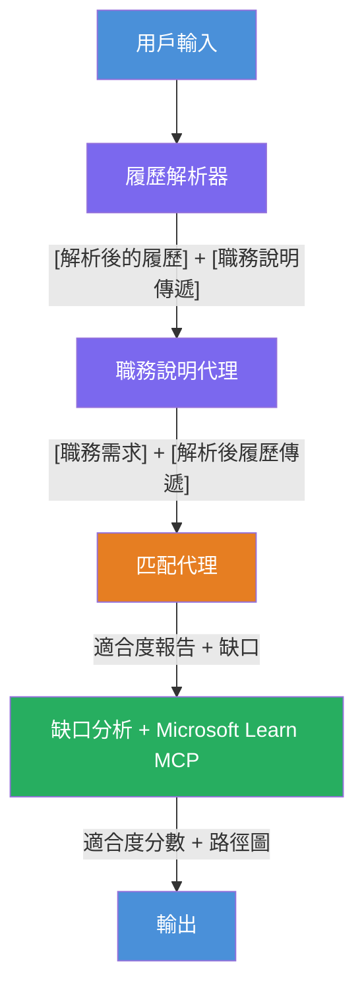

# 實驗室 02 - 多代理流程：履歷 → 工作適合度評估器

## 概述

在這個實作實驗中，您將使用 VS Code 中的 Foundry Toolkit 建立一個<strong>以工作流程為先的多代理應用程式</strong>，並將其部署到 Microsoft Foundry Agent 服務。

**您將建置的內容：** 一個履歷 → 工作適合度評估器，該工具可解析履歷和工作描述，評分匹配度，並使用 Microsoft Learn 的資源產生個人化的學習路線圖。

---

## 架構

```mermaid
flowchart TD
    A["用戶輸入"] --> B["履歷解析器"]
    B -->|"[解析後的履歷] + [職務說明傳遞]"| C["職務說明代理"]
    C -->|"[職務需求] + [解析後履歷傳遞]"| D["匹配代理"]
    D -->|適合度報告 + 缺口| E["缺口分析 + Microsoft Learn MCP"]
    E -->|適合度分數 + 路徑圖| F["輸出"]

    style A fill:#4A90D9,color:#fff
    style B fill:#7B68EE,color:#fff
    style C fill:#7B68EE,color:#fff
    style D fill:#E67E22,color:#fff
    style E fill:#27AE60,color:#fff
    style F fill:#4A90D9,color:#fff
```

**運作方式：**
1. 使用者貼上履歷和工作描述。
2. **ResumeParser** 解析履歷並將工作描述逐字複製到 `[JOB DESCRIPTION PASS-THROUGH]` 區段。
3. **JD Agent** 從傳遞內容中提取結構化需求，然後將 `[PARSED RESUME]` 進一步傳遞為 `[PARSED RESUME PASS-THROUGH]`。
4. **MatchingAgent** 比較 `[PARSED RESUME PASS-THROUGH]` 與 `[JD REQUIREMENTS]` 並產生適合度分數。
5. **GapAnalyzer** 將差距轉換為實用的路線圖，並透過 MCP 獲取真實的 Microsoft Learn 連結。

---

## 先決條件

請先完成實驗室 01：

- [實驗室 01 - 單一代理](../lab01-single-agent/README.md)

---

## 第 1 部分：按順序閱讀模組

完整學習路徑見：

- [實驗室 2 文件 - 先決條件](docs/00-prerequisites.md)
- [實驗室 2 文件 - 完整學習路徑](docs/README.md)
- [PersonalCareerCopilot 運行指南](PersonalCareerCopilot/README.md)

---

## 第 2 部分：建立及測試工作流程

1. 使用 Foundry Toolkit 精靈生成基於工作流程的專案骨架。
2. 將 `PersonalCareerCopilot/main.py` 中的提示區塊和工作流程圖複製到您的工作區。
3. 使用代理檢查員在本地執行並驗證所有四個代理及 MCP 工具。
4. 在本地測試通過後，將託管代理部署到 Foundry。

---

## 編排模式

實驗室 02 包含預設的<strong>分散 → 集中 → 序列</strong>流程，文件還描述了可供實驗的替代編排模式。

- **帶加權共識的分散/集中**
- **最終路線圖前的審閱/批評階段**
- 基於適合度分數和缺失技能的<strong>條件路由器</strong>

詳見 [docs/04-orchestration-patterns.md](docs/04-orchestration-patterns.md)。

---

**上一頁：** [實驗室 01 - 單一代理](../lab01-single-agent/README.md) · **返回：** [工作坊首頁](../../README.md)

---

<!-- CO-OP TRANSLATOR DISCLAIMER START -->
**免責聲明**：
此文件已使用 AI 翻譯服務 [Co-op Translator](https://github.com/Azure/co-op-translator) 進行翻譯。雖然我們努力追求準確性，但請注意自動翻譯可能包含錯誤或不準確之處。原始文件的母語版本應視為權威來源。對於關鍵資訊，建議採用專業人工翻譯。我們不對因使用此翻譯所產生的任何誤解或誤譯承擔責任。
<!-- CO-OP TRANSLATOR DISCLAIMER END -->