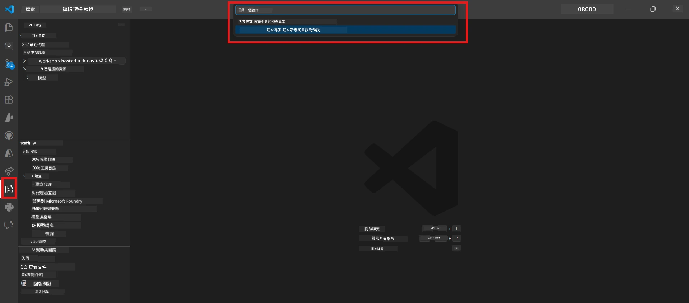

# 模組 0 - 介紹

⏱️ 約 10 分鐘

> [!WARNING]
> **預覽與限制：**[託管代理](https://learn.microsoft.com/azure/foundry/agents/concepts/hosted-agents)目前處於<strong>公開預覽</strong>階段，不建議用於生產工作負載。本工作坊中展示的部分功能隨著服務進入 GA 版本可能會有所變動。

## 你將構建的內容

在本實驗中，你將擴展實驗 01 的單代理技能，建立 <strong>多代理工作流</strong>——履歷 → 職務適配評估員。

你會貼上 <strong>履歷</strong> 和 <strong>職務描述</strong>。四個專門代理會依序處理輸入，然後回傳：
- 一個適配分數（0–100 並附分數分解）
- 技能與認證差距清單
- 針對每個差距，附有實際 Microsoft Learn 連結的個人化學習路線圖

**此工作流程使用：**
- **Microsoft Agent Framework** - 使用 `WorkflowBuilder` 進行序列化管線編排
- **Foundry Toolkit for VS Code** - 搭建範本、本地測試、部署
- **AI 模型**（例如 `gpt-4.1-mini`）- 由四個代理共用
- **Microsoft Learn MCP 伺服器** - 為每個技能差距提供真實的學習資源連結

---

## 選擇你的路徑

> ⚠️ **請繼續使用你在實驗 01 中使用的相同路徑。**

<details open>
<summary><strong>🅰️ 路徑 A - Azure 雲端（需 Azure 訂閱）</strong></summary>

| | 詳情 |
|---|---|
| <strong>適合對象</strong> | 你使用 Azure 訂閱完成了實驗 01 |
| <strong>模型</strong> | 透過 Foundry 的 Azure OpenAI（例如 `gpt-4.1-mini`） |
| <strong>涵蓋模組</strong> | 全部模組（00–09） |
| **是否部署到雲端？** | ✅ 是 - 完整端到端部署 |

</details>

<details open>
<summary><strong>🅱️ 路徑 B - Foundry Local（不需 Azure 訂閱）</strong></summary>

| | 詳情 |
|---|---|
| <strong>適合對象</strong> | 你使用 Foundry Local 完成了實驗 01 |
| <strong>模型</strong> | Foundry Local（免費，在你的機器上執行） |
| <strong>涵蓋模組</strong> | 模組 00–05（跳過 06–07 - 部署與雲端驗證） |
| **是否部署到雲端？** | ❌ 否 - 僅透過 Agent Inspector 進行本地測試 |

</details>

---

## 實驗 01 確認

實驗 02 是直接建立於實驗 01 的基礎之上。請先完成實驗 01 再從此開始。

還沒做過實驗 01？從這裡開始：[Lab 01 - Introduction](../../lab01-single-agent/docs/00-prerequisites.md)

<details open>
<summary><strong>🅰️ 路徑 A - Azure 雲端</strong></summary>

```powershell
az account show --query "{name:name, id:id}" --output table
```

如果失敗，請執行 `az login`，然後在 VS Code 中確認：

1. 按 `Ctrl+Shift+P` → 輸入 **Foundry Toolkit** → 確認命令是否出現。
2. 點擊 **Foundry Toolkit** 圖示 → 看到你的專案與已部署模型顯示為 **Succeeded**。



> **RBAC：** 你在實驗 01 中已分配 **Foundry User**。如果需要重新分配，請參閱 [Lab 01, Module 1](../../lab01-single-agent/docs/01-setup.md#deploy-a-model--assign-rbac)。該角色先前名為 **Azure AI User**，權限相同。

</details>

<details open>
<summary><strong>🅱️ 路徑 B - Foundry Local</strong></summary>

```powershell
Invoke-WebRequest -Uri "http://localhost:5273/v1/health" -UseBasicParsing | Select-Object StatusCode
```

預期回應：`StatusCode: 200`。如果不是，請從 Foundry Toolkit 側邊欄重新啟動 Foundry Local。

> 所有推理均在你的機器上執行。唯一的外呼是 MCP 工具對 `https://learn.microsoft.com/api/mcp` 的呼叫。

</details>

---

## 實驗 02 有哪些新進展

| | 實驗 01 | 實驗 02 |
|--|--------|--------|
| 代理數量 | 1 | 4（透過 WorkflowBuilder 鏈接） |
| 搭建範本 | 基礎 - 代理框架 | 工作流程 - 代理框架 |
| 新增套件 | - | `mcp` |
| 編排方式 | 單一對話代理 | 序列管線（WorkflowBuilder） |
| 新增工具 | - | `search_microsoft_learn_for_plan` (MCP) |

---

**下一步：** [01 - 了解架構 →](01-understand-multi-agent.md)

---

<!-- CO-OP TRANSLATOR DISCLAIMER START -->
**免責聲明**：
此文件已使用 AI 翻譯服務 [Co-op Translator](https://github.com/Azure/co-op-translator) 進行翻譯。雖然我們努力追求準確性，但請注意自動翻譯可能包含錯誤或不準確之處。原始文件的母語版本應視為權威來源。對於關鍵資訊，建議採用專業人工翻譯。我們不對因使用此翻譯所產生的任何誤解或誤譯承擔責任。
<!-- CO-OP TRANSLATOR DISCLAIMER END -->