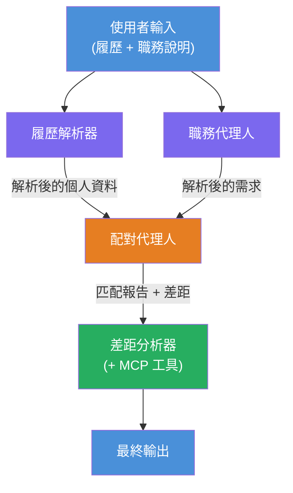
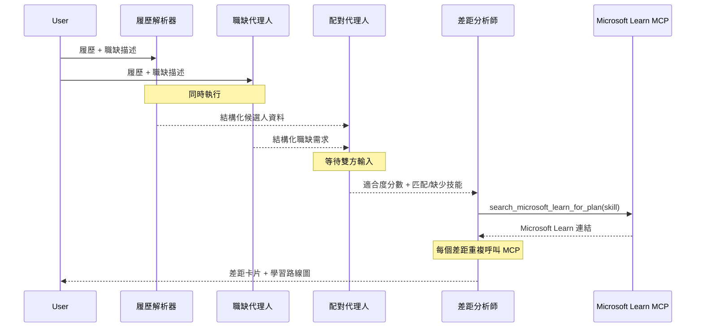
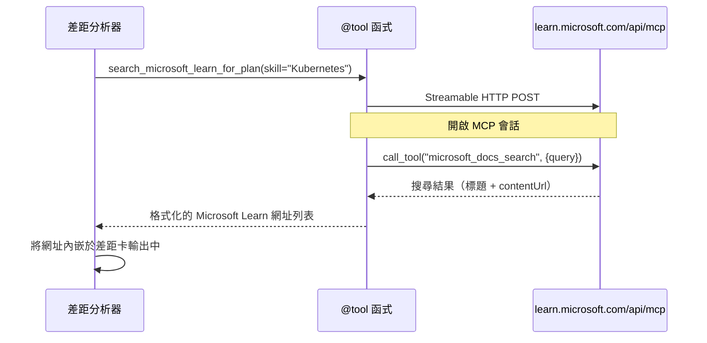

# 模組 1 - 了解多代理架構

在本模組中，您將在撰寫任何程式碼之前了解履歷 → 工作匹配評估器的架構。理解協調圖、代理角色和資料流程對於除錯和擴展[多代理工作流程](https://learn.microsoft.com/azure/architecture/ai-ml/idea/multiple-agent-workflow-automation)至關重要。

---

## 這解決的問題

將履歷與職務說明匹配涉及多項不同技能：

1. <strong>解析</strong> - 從非結構化文字（履歷）中萃取結構化資料
2. <strong>分析</strong> - 從職務說明中萃取需求
3. <strong>比較</strong> - 評分兩者的匹配程度
4. <strong>規劃</strong> - 建立學習藍圖以彌補差距

一個代理同時執行所有四項任務通常會產生：
- 不完整的萃取（為了趕快評分而匆忙解析）
- 淺層的評分（缺少有證據支撐的細節）
- 通用的學習藍圖（未針對具體差距量身訂做）

透過拆分成<strong>四個專門代理</strong>，每個代理專注於自己的任務並有專屬指令，能在每個階段產出更高品質的結果。

---

## 四個代理

每個代理皆為完整的[Microsoft Foundry](https://learn.microsoft.com/azure/foundry/agents/concepts/hosted-agents)代理，透過 `AzureAIAgentClient.as_agent()` 建立。它們共用同一個模型部署，但有不同指令及（選擇性）不同工具。

| # | 代理名稱 | 角色 | 輸入 | 輸出 |
|---|---------|------|-------|--------|
| 1 | **ResumeParser** | 從履歷文字中萃取結構化個人資料 | 原始履歷文字（來自使用者） | 候選人個人資料、技術技能、軟技能、認證、領域經驗、成就 |
| 2 | **JobDescriptionAgent** | 從職務說明中萃取結構化需求 | 原始職務說明文字（由使用者，經 ResumeParser 轉發） | 職務概述、必備技能、優先技能、經驗、認證、教育、職責 |
| 3 | **MatchingAgent** | 計算有證據依據的匹配分數 | 來自 ResumeParser + JobDescriptionAgent 的輸出 | 匹配分數（0-100 並附分解）、配對技能、缺少技能、差距 |
| 4 | **GapAnalyzer** | 建立個人化學習藍圖 | 來自 MatchingAgent 的輸出 | 差距卡（依技能）、學習順序、時間表、來自 Microsoft Learn 的資源 |

---

## 協調圖

此工作流程使用 <strong>平行分流</strong> 接著 <strong>序列聚合</strong>：


> **圖例：** 紫色 = 平行代理，橘色 = 聚合點，綠色 = 最終使用工具的代理

### 資料流如何進行


1. <strong>使用者傳送</strong>含有履歷與職務說明的訊息。
2. **ResumeParser** 接收完整使用者輸入並萃取結構化候選人個人資料。
3. **JobDescriptionAgent** 平行接收使用者輸入並萃取結構化需求。
4. **MatchingAgent** 收到來自 **ResumeParser** 與 **JobDescriptionAgent** 的輸出（框架會等兩者完成後再執行 MatchingAgent）。
5. **GapAnalyzer** 收到 MatchingAgent 的輸出，並呼叫 **Microsoft Learn MCP 工具** 取得每個差距的真實學習資源。
6. <strong>最終輸出</strong> 即是 GapAnalyzer 回應，含匹配分數、差距卡及完整學習藍圖。

### 為什麼平行分流很重要

ResumeParser 與 JobDescriptionAgent <strong>平行執行</strong>，因為兩者互不依賴。這：
- 減少總延遲（兩者同時執行而非依序）
- 自然拆分（解析履歷與職務說明是獨立任務）
- 展示常見多代理模式：**分流 → 聚合 → 行動**

---

## WorkflowBuilder 程式碼範例

以下是上圖協調圖如何映射到 `main.py` 中的 [`WorkflowBuilder`](https://learn.microsoft.com/agent-framework/workflows/agents-in-workflows) API 呼叫：

```python
from agent_framework import WorkflowBuilder

workflow = (
    WorkflowBuilder(
        name="ResumeJobFitEvaluator",
        start_executor=resume_parser,       # 首個接收使用者輸入的代理
        output_executors=[gap_analyzer],     # 輸出結果被回傳的最終代理
    )
    .add_edge(resume_parser, jd_agent)      # 履歷解析器 → 職務描述代理
    .add_edge(resume_parser, matching_agent) # 履歷解析器 → 匹配代理
    .add_edge(jd_agent, matching_agent)      # 職務描述代理 → 匹配代理
    .add_edge(matching_agent, gap_analyzer)  # 匹配代理 → 差距分析器
    .build()
)
```

**理解邊緣：**

| 邊緣 | 含意 |
|------|--------------|
| `resume_parser → jd_agent` | JD 代理收到 ResumeParser 的輸出 |
| `resume_parser → matching_agent` | MatchingAgent 收到 ResumeParser 的輸出 |
| `jd_agent → matching_agent` | MatchingAgent 也收到 JD 代理的輸出（會等待兩者） |
| `matching_agent → gap_analyzer` | GapAnalyzer 收到 MatchingAgent 輸出 |

因為 `matching_agent` 有 <strong>兩個輸入邊緣</strong>（來自 `resume_parser` 與 `jd_agent`），框架會自動等待兩者完成再執行 MatchingAgent。

---

## MCP 工具

GapAnalyzer 代理有一個工具：`search_microsoft_learn_for_plan`。這是一個<strong>[MCP 工具](https://learn.microsoft.com/agent-framework/agents/tools/hosted-mcp-tools)</strong>，會呼叫 Microsoft Learn API 取得精選學習資源。

### 運作方式

```python
@tool
async def search_microsoft_learn_for_plan(
    skill: str, role: str = "", max_results: int = 5
) -> str:
    """Search Microsoft Learn MCP and return curated official links."""
    # 透過可串流 HTTP 連接至 https://learn.microsoft.com/api/mcp
    # 在 MCP 伺服器上呼叫 'microsoft_docs_search' 工具
    # 回傳格式化的 Microsoft Learn 網址列表
```

### MCP 呼叫流程


1. GapAnalyzer 判定需要特定技能的學習資源（例如 "Kubernetes"）
2. 框架呼叫 `search_microsoft_learn_for_plan(skill="Kubernetes")`
3. 函式打開一個[可串流 HTTP](https://learn.microsoft.com/agent-framework/agents/tools/hosted-mcp-tools) 連線至 `https://learn.microsoft.com/api/mcp`
4. 呼叫 [MCP 伺服器](https://learn.microsoft.com/azure/foundry/agents/how-to/tools/model-context-protocol)上的 `microsoft_docs_search` 工具
5. MCP 伺服器回傳搜尋結果（標題 + URL）
6. 函式格式化結果並以字串返回
7. GapAnalyzer 使用回傳的 URL 作為差距卡輸出

### MCP 日誌預期

工具執行時會看到類似的日誌：

```
GET https://learn.microsoft.com/api/mcp → 405 (Method Not Allowed)
POST https://learn.microsoft.com/api/mcp → 200
DELETE https://learn.microsoft.com/api/mcp → 405 (Method Not Allowed)
```

**這是正常情況。** MCP 用戶端在初始化期間以 GET 與 DELETE 做探測，若回傳 405 是預期行為。實際工具呼叫使用 POST 且回傳 200。只有在 POST 呼叫失敗時才需擔心。

---

## 代理建立模式

每個代理皆使用 **[`AzureAIAgentClient.as_agent()`](https://learn.microsoft.com/python/api/overview/azure/ai-agents-readme) 非同步上下文管理器**建立。這是 Foundry SDK 建立代理並自動清理的模式：

```python
async with (
    get_credential() as credential,
    AzureAIAgentClient(
        project_endpoint=PROJECT_ENDPOINT,
        model_deployment_name=MODEL_DEPLOYMENT_NAME,
        credential=credential,
    ).as_agent(
        name="ResumeParser",
        instructions=RESUME_PARSER_INSTRUCTIONS,
    ) as resume_parser,
    # ... 對每個代理重複 ...
):
    # 這裡存在所有4個代理者
    workflow = create_workflow(resume_parser, jd_agent, matching_agent, gap_analyzer)
```

**重點說明：**
- 每個代理取得自己的 `AzureAIAgentClient` 實例（SDK 要求代理名稱必須限定於客戶端）
- 所有代理共用相同的 `credential`、`PROJECT_ENDPOINT` 及 `MODEL_DEPLOYMENT_NAME`
- `async with` 區塊確保伺服器關閉時所有代理會被清理
- GapAnalyzer 額外收到 `tools=[search_microsoft_learn_for_plan]`

---

## 伺服器啟動

建立代理並建構工作流程後，啟動伺服器：

```python
from azure.ai.agentserver.agentframework import from_agent_framework

agent = create_workflow(resume_parser, jd_agent, matching_agent, gap_analyzer)
await from_agent_framework(agent).run_async()
```

`from_agent_framework()` 將工作流程包裝為一個 HTTP 伺服器，在 8088 埠公開 `/responses` 端點。這與 Lab 01 使用的模式相同，但「代理」現在是整個[工作流程圖](https://learn.microsoft.com/agent-framework/workflows/as-agents)。

---

### 檢查點

- [ ] 您理解 4 個代理架構及每個代理的角色
- [ ] 您能追蹤資料流：使用者 → ResumeParser →（平行）JD 代理 + MatchingAgent → GapAnalyzer → 輸出
- [ ] 您理解為何 MatchingAgent 會等待 ResumeParser 與 JD 代理兩者（兩個輸入邊緣）
- [ ] 您理解 MCP 工具的功能、呼叫方式，以及 GET 405 日誌為正常現象
- [ ] 您理解 `AzureAIAgentClient.as_agent()` 模式及每個代理擁有自己的客戶端實例的理由
- [ ] 您能閱讀 `WorkflowBuilder` 程式碼並將其對應到視覺圖表

---

**上一節：** [00 - 前置作業](00-prerequisites.md) · **下一節：** [02 - 搭建多代理專案 →](02-scaffold-multi-agent.md)

---

<!-- CO-OP TRANSLATOR DISCLAIMER START -->
**免責聲明**：  
本文件係使用 AI 翻譯服務 [Co-op Translator](https://github.com/Azure/co-op-translator) 進行翻譯。雖然我們力求準確，但請注意自動翻譯可能包含錯誤或不準確之處。原文件之母語版本應視為權威來源。對於重要資訊，建議使用專業人工翻譯。本公司對於因使用本翻譯所導致的任何誤解或誤譯不負任何責任。
<!-- CO-OP TRANSLATOR DISCLAIMER END -->