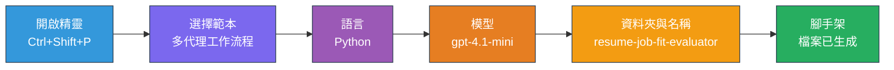
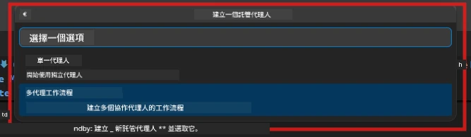

# Module 2 - 搭建多代理專案骨架

在本模組中，您將使用 [Microsoft Foundry 擴充功能](https://marketplace.visualstudio.com/items?itemName=TeamsDevApp.vscode-ai-foundry)來 <strong>搭建多代理工作流程專案的骨架</strong>。該擴充功能會生成整個專案結構——`agent.yaml`、`main.py`、`Dockerfile`、`requirements.txt`、`.env` 以及除錯配置。之後您會在模組 3 和 4 中自訂這些檔案。

> **注意：** 本實驗中的 `PersonalCareerCopilot/` 資料夾是一個完整且可運行的多代理專案自訂範例。您可以選擇自行搭建一個全新專案（建議學習使用），或直接研究現有程式碼。

---

## 步驟 1：開啟建立託管代理精靈


1. 按下 `Ctrl+Shift+P` 開啟 <strong>命令面板</strong>。
2. 輸入：**Microsoft Foundry: Create a New Hosted Agent** 並選取。
3. 託管代理建立精靈隨即開啟。

> **替代方法：** 點擊「活動列」中的 **Microsoft Foundry** 圖示 → 點擊 **Agents** 旁的 **+** 圖示 → 選擇 **Create New Hosted Agent**。

---

## 步驟 2：選擇多代理工作流程範本

精靈會要求您選擇一個範本：

| 範本 | 說明 | 適用時機 |
|--------|-------------|-------------|
| 單代理 | 一個代理，帶有指令和可選工具 | 實驗 01 |
| <strong>多代理工作流程</strong> | 多個代理透過 WorkflowBuilder 協作 | **本實驗（實驗 02）** |

1. 選擇 <strong>多代理工作流程</strong>。
2. 點擊 <strong>下一步</strong>。



---

## 步驟 3：選擇程式語言

1. 選擇 **Python**。
2. 點擊 <strong>下一步</strong>。

---

## 步驟 4：選擇您的模型

1. 精靈會顯示您在 Foundry 專案中部署的模型。
2. 選擇您在實驗 01 中使用的相同模型（例如 **gpt-4.1-mini**）。
3. 點擊 <strong>下一步</strong>。

> **提示：** [`gpt-4.1-mini`](https://learn.microsoft.com/azure/foundry/foundry-models/concepts/models-sold-directly-by-azure#gpt-41-series) 是開發推薦用的模型——速度快、費用低，且適合多代理工作流程。若想要較高品質輸出，請在最終部署時切換至 `gpt-4.1`。

---

## 步驟 5：選擇資料夾位置與代理名稱

1. 會跳出檔案對話方塊。選擇目標資料夾：
   - 如果跟著工作坊存放庫進行：導航到 `workshop/lab02-multi-agent/` 並建立新的子資料夾
   - 若從零開始：可選任意資料夾
2. 輸入託管代理的 <strong>名稱</strong>（例如 `resume-job-fit-evaluator`）。
3. 點擊 <strong>建立</strong>。

---

## 步驟 6：等待骨架建立完成

1. VS Code 會開啟新視窗（或更新目前視窗）以顯示已建立的專案骨架。
2. 您應會看到以下檔案結構：

```
resume-job-fit-evaluator/
├── .env                ← Environment variables (placeholders)
├── .vscode/
│   └── launch.json     ← Debug configuration
├── agent.yaml          ← Agent definition (kind: hosted)
├── Dockerfile          ← Container configuration
├── main.py             ← Multi-agent workflow code (scaffold)
└── requirements.txt    ← Python dependencies
```

> **工作坊提示：** 工作坊存放庫中 `.vscode/` 資料夾位於 <strong>工作區根目錄</strong>，共享 `launch.json` 與 `tasks.json`。實驗 01 與實驗 02 的除錯配置皆包含其中。按下 F5 時，請從下拉選單選擇 **"Lab02 - Multi-Agent"**。

---

## 步驟 7：了解骨架檔案（多代理專案特有）

多代理骨架與單代理骨架在幾個關鍵面向不同：

### 7.1 `agent.yaml` - 代理定義

```yaml
kind: hosted
name: resume-job-fit-evaluator
description: >
  A multi-agent workflow that evaluates resume-to-job fit.
metadata:
  authors:
    - Microsoft
  tags:
    - Multi-Agent Workflow
    - Resume Evaluator
protocols:
  - protocol: responses
    version: v1
environment_variables:
  - name: PROJECT_ENDPOINT
    value: ${PROJECT_ENDPOINT}
  - name: MODEL_DEPLOYMENT_NAME
    value: ${MODEL_DEPLOYMENT_NAME}
```

**與實驗 01 的主要差異：** `environment_variables` 區塊可能包含 MCP 端點或其他工具配置的額外變數。`name` 和 `description` 則反映多代理使用場景。

### 7.2 `main.py` - 多代理工作流程程式碼

骨架包含：
- <strong>多個代理的指令字串</strong>（每代理一個常數）
- **多個 [`AzureAIAgentClient.as_agent()`](https://learn.microsoft.com/python/api/overview/azure/ai-agents-readme) 上下文管理器**（每代理一個）
- **[`WorkflowBuilder`](https://learn.microsoft.com/agent-framework/workflows/agents-in-workflows)** 來串接代理協作
- **`from_agent_framework()`** 用於將工作流程作為 HTTP 端點提供

```python
from agent_framework import WorkflowBuilder, tool
from agent_framework.azure import AzureAIAgentClient
from azure.ai.agentserver.agentframework import from_agent_framework
```

相較於實驗 01，新增了 `WorkflowBuilder` 匯入（[`WorkflowBuilder`](https://learn.microsoft.com/agent-framework/workflows/agents-in-workflows)）。

### 7.3 `requirements.txt` - 額外相依套件

多代理專案使用與實驗 01 相同的基礎套件，另外還有 MCP 相關套件：

```
agent-framework-azure-ai==1.0.0rc3
agent-framework-core==1.0.0rc3
azure-ai-agentserver-agentframework==1.0.0b16
azure-ai-agentserver-core==1.0.0b16
debugpy
agent-dev-cli --pre
```

> **重要版本提示：** `agent-dev-cli` 套件在 `requirements.txt` 中安裝最新預覽版時需要加上 `--pre` 標誌。這是為了 Agent Inspector 能與 `agent-framework-core==1.0.0rc3` 版本兼容。詳情請參考 [模組 8 - 故障排除](08-troubleshooting.md)。

| 套件 | 版本 | 用途 |
|---------|---------|---------|
| [`agent-framework-azure-ai`](https://learn.microsoft.com/agent-framework/overview/) | `1.0.0rc3` | 微軟代理框架的 Azure AI 整合 |
| [`agent-framework-core`](https://learn.microsoft.com/agent-framework/overview/) | `1.0.0rc3` | 核心執行環境（含 WorkflowBuilder） |
| `azure-ai-agentserver-agentframework` | `1.0.0b16` | 託管代理伺服器執行環境 |
| `azure-ai-agentserver-core` | `1.0.0b16` | 代理伺服器核心抽象 |
| `debugpy` | 最新版 | Python 除錯（VS Code 中按 F5） |
| `agent-dev-cli` | `--pre` | 本地開發 CLI 與 Agent Inspector 後端 |

### 7.4 `Dockerfile` - 與實驗 01 相同

Dockerfile 與實驗 01 完全相同——複製檔案、從 `requirements.txt` 安裝相依性、開放 8088 埠口、執行 `python main.py`。

```dockerfile
FROM python:3.14-slim
WORKDIR /app
COPY ./ .
RUN pip install --upgrade pip && \
    if [ -f requirements.txt ]; then \
        pip install -r requirements.txt; \
    else \
      echo "No requirements.txt found" >&2; exit 1; \
    fi
EXPOSE 8088
CMD ["python", "main.py"]
```

---

### 檢查點

- [ ] 已完成骨架精靈建立，並見到新的專案結構
- [ ] 可見所有檔案：`agent.yaml`、`main.py`、`Dockerfile`、`requirements.txt`、`.env`
- [ ] `main.py` 中包含 `WorkflowBuilder` 匯入（確認選擇多代理範本）
- [ ] `requirements.txt` 同時包含 `agent-framework-core` 與 `agent-framework-azure-ai`
- [ ] 您了解多代理骨架與單代理骨架的差異（多個代理、WorkflowBuilder、MCP 工具）

---

**上一篇：** [01 - 理解多代理架構](01-understand-multi-agent.md) · **下一篇：** [03 - 配置代理與環境 →](03-configure-agents.md)

---

<!-- CO-OP TRANSLATOR DISCLAIMER START -->
**免責聲明**：  
本文件由 AI 翻譯服務 [Co-op Translator](https://github.com/Azure/co-op-translator) 進行翻譯。雖然我們力求準確，但請注意自動翻譯可能包含錯誤或不精確之處。原文件的母語版本應被視為權威來源。對於關鍵資訊，建議採用專業人力翻譯。我們不對因使用本翻譯而引起的任何誤解或誤釋承擔責任。
<!-- CO-OP TRANSLATOR DISCLAIMER END -->