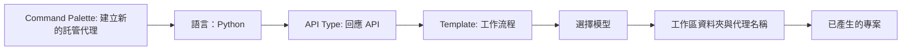
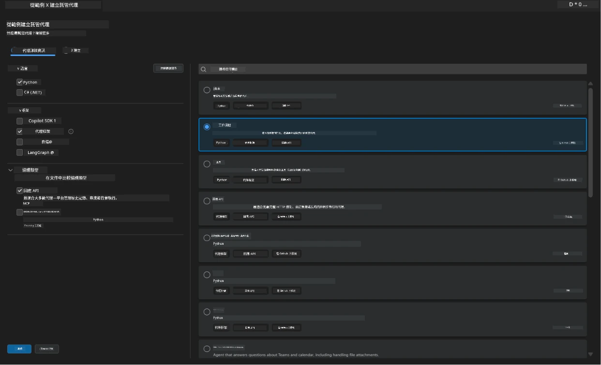
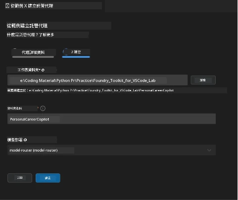

# 模組 2 - 搭建多代理專案腳手架

⏱️ 約 5 分鐘

在此模組中，您將使用 [Foundry Toolkit for VS Code](https://aka.ms/foundrytk) 來<strong>搭建多代理專案腳手架</strong>。向導會產生 `agent.yaml`、`main.py`、`Dockerfile`、`requirements.txt`、`.env` 以及 VS Code 除錯設定，讓您能專注於在模組 3 中串接四代理工作流程。

> **關鍵概念：** 此腳手架是帶有一個代理的可運行範本。您會在模組 3 中使用 `WorkflowBuilder` 圖形替換佔位邏輯。您不需要從零編寫樣板程式碼。

> **參考實作：** [`PersonalCareerCopilot/`](../../../../../workshop/lab02-multi-agent/PersonalCareerCopilot) 是一個完整可用的範例。您可以隨時用它比對您的進度。

### 腳手架向導流程


```mermaid
flowchart LR
    A[Command Palette: 建立新的託管代理] --> B[語言：Python]
    B --> C[API Type: 回應 API]
    C --> D[Template: 工作流程]
    D --> E[選擇模型]
    E --> F[工作區資料夾與代理名稱]
    F --> G[已產生的專案]
```

---

## 步驟 1：開啟建立託管代理的向導

1. 按下 `Ctrl+Shift+P` 開啟 <strong>命令面板</strong>。
2. 輸入：**Foundry Toolkit: Create a New Hosted Agent** 並選擇它。
3. 向導會在 <strong>代理詳細資料</strong> 分頁開啟。

> **替代方式：** 點擊工作列的 **Foundry Toolkit** 圖示 → 點擊 **Hosted Agents** 旁的 **+** 圖示 → **Create New Hosted Agent**。

---

## 步驟 2：選擇設定



1. 在左側導覽/選項區塊選擇：

| 選單 | 選擇 | 備註 |
|--------|-----------|-------|
| <strong>語言</strong> | Python | 亦支援 C# (.NET) |
| <strong>框架</strong> | Agent Framework | 提供 `Agent`、`AgentExecutor`、`WorkflowBuilder` |
| **API 類型** | Response API | `POST /responses` - 平台管理歷史、支援串流 |
| <strong>範本</strong> | **Workflows** | 依序透過多代理處理請求 |

2. 選取後，點擊 <strong>下一步</strong>



3. 接著在下一視窗選擇：

| 選單 | 選擇 | 備註 |
|--------|-----------|-------|
| <strong>工作區資料夾</strong> | 瀏覽到目標資料夾 | 例如本倉庫中的 `workshop/lab02-multi-agent/` |
| <strong>代理名稱</strong> | `PersonalCareerCopilot` | 會成為專案目錄名稱 |
| <strong>模型部署</strong> | 選擇您的部署模型 | 例如第 01 章中的 `gpt-4.1-mini` |

4. 點擊 <strong>建立</strong> 以搭建專案腳手架。VS Code 會產生檔案並開啟資料夾。

> **提示：** [`gpt-4.1-mini`](https://learn.microsoft.com/azure/foundry/foundry-models/concepts/models-sold-directly-by-azure#gpt-41-series) 在多代理開發中兼顧速度與品質。

---

## 步驟 3：檢查產生的專案

搭建完成後，確認您在檔案總管（`Ctrl+Shift+E`）看到以下檔案：

```
📂 <your-agent-name>/
├── .azdignore          ← Files excluded from Azure Developer CLI deployments
├── .dockerignore       ← Files excluded from Docker builds
├── .env                ← Environment variables (placeholders - fill in Module 3)
├── .vscode/
│   ├── launch.json     ← Debug config (F5 → run + Agent Inspector)
│   └── tasks.json      ← VS Code task definitions
├── agent.yaml          ← Agent definition (kind: hosted, protocol: responses)
├── Dockerfile          ← Container config for deployment
├── main.py             ← Stub agent entry point (replace with WorkflowBuilder in Module 3)
└── requirements.txt    ← Python dependencies
```

> **重要：** 請直接用 VS Code 開啟此腳手架資料夾，才能正確套用 `.vscode/launch.json` 和 `tasks.json` 以利 F5 除錯。

### 主要檔案說明

| 檔案 | 用途 |
|------|---------|
| `agent.yaml` | 宣告 `kind: hosted`，映射環境變數，定義 `/responses` 協定 |
| `main.py` | 樣板：一個 `FoundryChatClient` → `Agent` → `ResponsesHostServer`。您會在模組 3 中以四代理 + `WorkflowBuilder` 取代它 |
| `Dockerfile` | `python:3.12-slim`，安裝 `requirements.txt`，開放 8088 埠口，執行 `python main.py` |
| `requirements.txt` | `agent-framework-foundry`、`agent-framework-foundry-hosting`、`mcp<2,>=1.24.0`、`debugpy` |

> **參考：** 完整產生內容請參考 [`PersonalCareerCopilot/agent.yaml`](../../../../../workshop/lab02-multi-agent/PersonalCareerCopilot/agent.yaml) 與 [`PersonalCareerCopilot/requirements.txt`](../../../../../workshop/lab02-multi-agent/PersonalCareerCopilot/requirements.txt)。

---

### ✅ 檢查點

- [ ] 完成腳手架向導 - 新專案資料夾已在檔案總管顯示
- [ ] 所有預期檔案齊全：`agent.yaml`、`main.py`、`Dockerfile`、`requirements.txt`、`.env`
- [ ] `agent.yaml` 顯示 `kind: hosted` 和 `protocol: responses`
- [ ] `main.py` 匯入 `Agent`、`FoundryChatClient`、`ResponsesHostServer`
- [ ] 已將腳手架資料夾作為 VS Code 工作區根目錄開啟
- [ ] 了解 `main.py` 是樣板 - `WorkflowBuilder` 會在模組 3 中加入

---

**上一章節：** [01 - 理解多代理架構](01-understand-multi-agent.md) · **下一章節：** [03 - 設定代理與環境 →](03-configure-agents.md)

---

<!-- CO-OP TRANSLATOR DISCLAIMER START -->
**免責聲明**：
此文件已使用 AI 翻譯服務 [Co-op Translator](https://github.com/Azure/co-op-translator) 進行翻譯。雖然我們努力追求準確性，但請注意自動翻譯可能包含錯誤或不準確之處。原始文件的母語版本應視為權威來源。對於關鍵資訊，建議採用專業人工翻譯。我們不對因使用此翻譯所產生的任何誤解或誤譯承擔責任。
<!-- CO-OP TRANSLATOR DISCLAIMER END -->