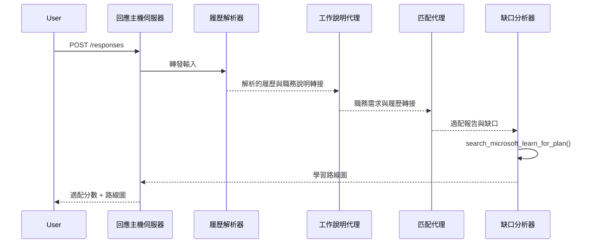

# 模組 3 - 配置指令、環境及安裝相依套件

⏱️ 約 15 分鐘

在本模組中，你將把初始的雛形轉換成<strong>你的</strong>多代理工作流程－透過設定環境變數、撰寫代理指令、加入 MCP 工具、連接工作流程圖，以及安裝相依套件。

> **參考：** 完整的可運作程式碼位於 [`PersonalCareerCopilot/main.py`](../../../../../workshop/lab02-multi-agent/PersonalCareerCopilot/main.py)。在建立你自己的工作流程圖與提示區塊時，可作為參考。

---

## 四位代理如何協同運作



---

## 步驟 1：配置環境變數

1. 開啟專案根目錄的 **`.env`** 檔案（由腳手架精靈建立）。
2. 將佔位符替換成你在實驗 01 中取得的真實數值。

<details open>
<summary><strong>🅰️ 路徑 A - Foundry 訂閱</strong></summary>

```env
FOUNDRY_PROJECT_ENDPOINT=https://<your-account>.services.ai.azure.com/api/projects/<your-project>
AZURE_AI_MODEL_DEPLOYMENT_NAME=gpt-4.1-mini
```

> **數值來源：** 請參閱 [實驗 01，模組 1](../../lab01-single-agent/docs/01-setup.md#deploy-a-model--assign-rbac)。

</details>

<details open>
<summary><strong>🅱️ 路徑 B - Foundry 本地</strong></summary>

```env
FOUNDRY_PROJECT_ENDPOINT=http://localhost:5273/v1
AZURE_AI_MODEL_DEPLOYMENT_NAME=phi-4-mini
```

> 所有推理運算皆在本機執行－資料不會傳出裝置。執行 `foundry model list` 以確認模型別名。唯一的外部請求是 MCP 工具呼叫 `https://learn.microsoft.com/api/mcp`。

> **數值來源：** 請參閱 [實驗 01，模組 1 - 本地路徑](../../lab01-single-agent/docs/01-setup.md#step-2-set-up-based-on-your-access)。

</details>

> **安全提示：** 千萬不要將 `.env` 提交至版本控制。它應已加入 `.gitignore`。

---

## 步驟 2：撰寫代理指令

指令定義每位代理的角色、輸出格式與規則。開啟 `main.py`，並定義（或替換）四個指令常數－完整字串見 [`PersonalCareerCopilot/main.py`](../../../../../workshop/lab02-multi-agent/PersonalCareerCopilot/main.py)。

### 2.1 `RESUME_PARSER_INSTRUCTIONS`
將履歷解析成結構化的求職者檔案，<strong>且</strong>逐字複製職缺說明至 `[JOB DESCRIPTION PASS-THROUGH]`。這兩個標記區段須同時出現在輸出中。

> **為何要透傳？** 設定 `context_mode="last_agent"` 時，ResumeParser 是<strong>唯一</strong>能看見原始使用者訊息的代理。若不複製職缺說明給後續代理，後續代理將無法取得該資訊。

### 2.2 `JOB_DESCRIPTION_INSTRUCTIONS`
從 ResumeParser 的輸出讀取 `[PARSED RESUME]` 和 `[JOB DESCRIPTION PASS-THROUGH]`，輸出 `[JD REQUIREMENTS]`（結構化需求）以及 `[PARSED RESUME PASS-THROUGH]`（逐字複製履歷供 MatchingAgent 使用）。

### 2.3 `MATCHING_AGENT_INSTRUCTIONS`
讀取 `[JD REQUIREMENTS]` 與 `[PARSED RESUME PASS-THROUGH]`，生成一份帶有分數（0–100）、擬合分析數學過程、匹配技能、缺乏技能及經驗對齊度的報告。

### 2.4 `GAP_ANALYZER_INSTRUCTIONS`
讀取擬合報告。對<strong>每個</strong>缺乏的技能，呼叫 `search_microsoft_learn_for_plan` 以取得 Microsoft Learn 教學資源。為每個技能產出詳細差距卡和逐週學習路線圖。

---

## 步驟 3：加入 MCP 工具

GapAnalyzer 會呼叫 [Microsoft Learn MCP 伺服器](https://learn.microsoft.com/azure/foundry/agents/how-to/tools/model-context-protocol) 以取得真實的技能差距相關學習資源。完整的 `search_microsoft_learn_for_plan` 函式在 [`PersonalCareerCopilot/main.py`](../../../../../workshop/lab02-multi-agent/PersonalCareerCopilot/main.py) 中。

在建立 GapAnalyzer 代理時，註冊此工具：

```python
gap_analyzer = Agent(
    client=client,
    instructions=GAP_ANALYZER_INSTRUCTIONS,
    name="GapAnalyzer",
    tools=[search_microsoft_learn_for_plan],
)
```

> 請參閱 [`PersonalCareerCopilot/main.py`](../../../../../workshop/lab02-multi-agent/PersonalCareerCopilot/main.py) 內含 `FoundryChatClient`、`AgentExecutor` 以及所有 `add_edge()` 呼叫的完整 `WorkflowBuilder` 圖形。

---

## 步驟 4：建立虛擬環境並安裝相依套件

> ⚠️ **請勿跳過此步驟。** 未安裝相依套件，F5 偵錯將會失敗。

### 4.1 建立虛擬環境

```powershell
python -m venv .venv
```

### 4.2 啟動它

| 作業系統 | 指令 |
|----|---------|
| **Windows (PowerShell)** | `.\.venv\Scripts\Activate.ps1` |
| **Windows (CMD)** | `.venv\Scripts\activate.bat` |
| **macOS / Linux** | `source .venv/bin/activate` |

你應該會在終端機提示字元看到 `(.venv)`。

### 4.3 安裝相依套件

```powershell
pip install -r requirements.txt
```

### 4.4 驗證

```powershell
pip list | Select-String "agent-framework|mcp|debugpy"
```

預期結果：會列出 `agent-framework-foundry`、`agent-framework-foundry-hosting`、`mcp` 和 `debugpy`。

---

## 步驟 5：驗證認證

<details open>
<summary><strong>🅰️ 路徑 A - Azure 認證</strong></summary>

```powershell
az account show --query "{name:name, id:id}" --output table
```

若失敗，請執行 [`az login`](https://learn.microsoft.com/cli/azure/authenticate-azure-cli-interactively)。

四位代理共用同一個 `FoundryChatClient` 與一個 `DefaultAzureCredential`。若一個認證成功，其他也會成功。

</details>

<details open>
<summary><strong>🅱️ 路徑 B - Foundry 本地</strong></summary>

本地測試無需認證。

</details>

---

### ✅ 檢查點

> 在未完成以下條件前，<strong>請勿</strong>前進至模組 04：**(1)** 在提示字元中看見 `(.venv)`，且 **(2)** 成功執行 `pip install -r requirements.txt`。

- [ ] `.env` 文件中有有效的端點與模型部署名稱（非佔位符）
- [ ] `main.py` 中定義完所有 4 個代理指令常數（ResumeParser、JD Agent、MatchingAgent、GapAnalyzer）
- [ ] `search_microsoft_learn_for_plan` MCP 工具已定義並在 GapAnalyzer 註冊
- [ ] `FoundryChatClient` + 4 個 `Agent` + 4 個 `AgentExecutor` 物件已於 `main()` 中建立
- [ ] `WorkflowBuilder` 正確建構出包含所有 3 個 `add_edge()` 呼叫的順序圖形
- [ ] 已建立且啟動虛擬環境（提示字元可見 `(.venv)`）
- [ ] 成功完成 `pip install -r requirements.txt` 無錯誤
- [ ] **路徑 A：** `az account show` 執行成功，或 VS Code 帳戶圖示顯示已登入帳戶

---

**上一節：** [02 - 腳手架建立多代理專案](02-scaffold-multi-agent.md) · **下一節：** [04 - 調度模式 →](04-orchestration-patterns.md)

---

<!-- CO-OP TRANSLATOR DISCLAIMER START -->
**免責聲明**：
此文件已使用 AI 翻譯服務 [Co-op Translator](https://github.com/Azure/co-op-translator) 進行翻譯。雖然我們努力追求準確性，但請注意自動翻譯可能包含錯誤或不準確之處。原始文件的母語版本應視為權威來源。對於關鍵資訊，建議採用專業人工翻譯。我們不對因使用此翻譯所產生的任何誤解或誤譯承擔責任。
<!-- CO-OP TRANSLATOR DISCLAIMER END -->