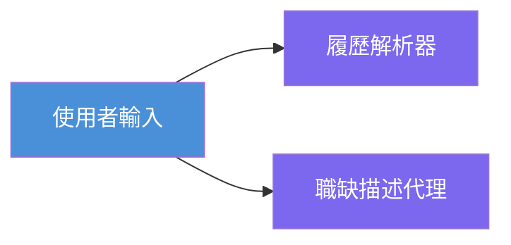
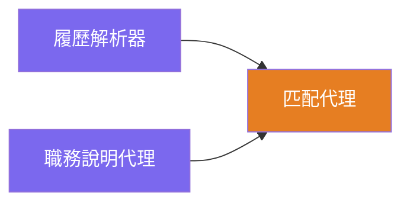
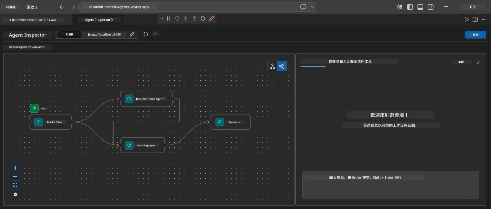
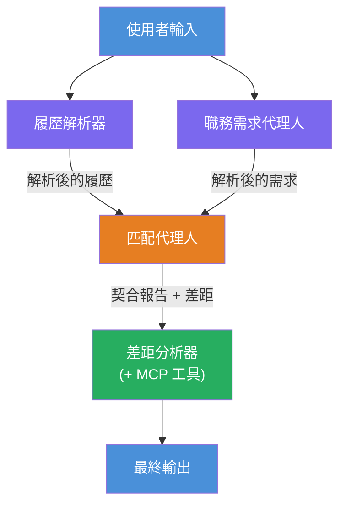
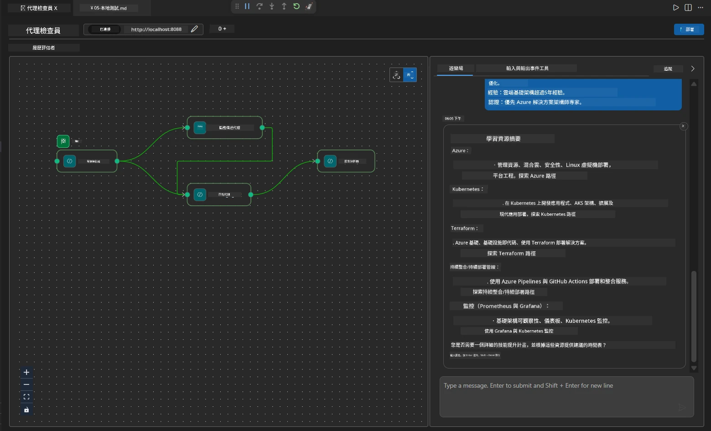

# Module 4 - 編排模式

在本模組中，您將探索履歷工作適配評估器中使用的編排模式，並學習如何閱讀、修改和擴展工作流程圖。了解這些模式對於除錯資料流問題以及建立您自己的[多代理工作流程](https://learn.microsoft.com/agent-framework/workflows/)至關重要。

---

## 模式 1：扇出 (平行拆分)

工作流程中的第一個模式是 <strong>扇出</strong> —— 單一輸入同時傳送到多個代理。


在程式碼中，這發生在 `resume_parser` 是 `start_executor` —— 它最先接收使用者訊息。然後，由於 `jd_agent` 和 `matching_agent` 皆有來自 `resume_parser` 的邊緣，框架會將 `resume_parser` 的輸出路由到兩個代理：

```python
.add_edge(resume_parser, jd_agent)         # ResumeParser 輸出 → JD 代理
.add_edge(resume_parser, matching_agent)   # ResumeParser 輸出 → MatchingAgent
```

**為什麼這樣可行：** ResumeParser 和 JD Agent 處理相同輸入的不同層面。將它們平行執行可減少總延遲，勝過依序執行。

### 何時使用扇出

| 使用案例 | 範例 |
|----------|---------|
| 獨立子任務 | 解析履歷 vs. 解析工作說明 |
| 冗餘 / 投票 | 兩個代理分析相同資料，第三個代理挑選最佳答案 |
| 多格式輸出 | 一個代理產生文字，另一個產生結構化 JSON |

---

## 模式 2：扇入 (彙總)

第二個模式是 <strong>扇入</strong> —— 收集多個代理的輸出並傳送至單一下游代理。


程式碼中：

```python
.add_edge(resume_parser, matching_agent)   # 履歷解析器輸出 → 配對代理
.add_edge(jd_agent, matching_agent)        # 職務說明代理輸出 → 配對代理
```

**關鍵行為：** 當一個代理有<strong>兩條或更多的輸入邊緣</strong>時，框架會自動等待<strong>所有</strong>上游代理完成後才執行該下游代理。MatchingAgent 只有在 ResumeParser 和 JD Agent 均完成後才開始執行。

### MatchingAgent 接收的內容

框架會將所有上游代理的輸出串接起來。MatchingAgent 的輸入如下：

```
[ResumeParser output]
---
Candidate Profile:
  Name: Jane Doe
  Technical Skills: Python, Azure, Kubernetes, ...
  ...

[JobDescriptionAgent output]
---
Role Overview: Senior Cloud Engineer
Required Skills: Python, Azure, Terraform, ...
...
```

> **注意：** 精確的串接格式依框架版本而異。代理指令應撰寫為可處理結構化及非結構化的上游輸出。



---

## 模式 3：序列鏈結

第三個模式是 <strong>序列鏈結</strong> —— 一個代理的輸出直接輸入至下一個代理。


程式碼中：

```python
.add_edge(matching_agent, gap_analyzer)    # MatchingAgent 輸出 → GapAnalyzer
```

這是最簡單的模式。GapAnalyzer 接收 MatchingAgent 的適配分數、匹配/缺失技能以及差距清單，接著針對每個差距呼叫[MCP 工具](https://learn.microsoft.com/azure/foundry/agents/how-to/tools/model-context-protocol)，以擷取 Microsoft Learn 資源。

---

## 完整圖形

結合以上三種模式便構成完整工作流程：


### 執行時間軸

```mermaid
gantt
    title 代理執行時間軸
    dateFormat X
    axisFormat %s

    section 平行
    履歷解析器       :rp, 0, 3
    職務代理          :jd, 0, 2

    section 連續
    匹配代理          :ma, 3, 5
    差距分析器        :ga, 5, 9
```


> 總牆時大約是 `max(ResumeParser, JD Agent) + MatchingAgent + GapAnalyzer`。GapAnalyzer 通常最慢，因為它針對每個差距都會呼叫多次 MCP 工具。

---

## 閱讀 WorkflowBuilder 程式碼

以下是 `main.py` 中完整的 `create_workflow()` 函數，並附註說明：

```python
def create_workflow(resume_parser, jd_agent, matching_agent, gap_analyzer):
    workflow = (
        WorkflowBuilder(
            name="ResumeJobFitEvaluator",

            # 第一個接收使用者輸入的代理
            start_executor=resume_parser,

            # 輸出成為最終回應的代理
            output_executors=[gap_analyzer],
        )
        # 分流：ResumeParser 輸出同時傳送給 JD Agent 和 MatchingAgent
        .add_edge(resume_parser, jd_agent)
        .add_edge(resume_parser, matching_agent)

        # 匯流：MatchingAgent 等待 ResumeParser 和 JD Agent 兩者完成
        .add_edge(jd_agent, matching_agent)

        # 串聯：MatchingAgent 的輸出作為 GapAnalyzer 的輸入
        .add_edge(matching_agent, gap_analyzer)

        .build()
    )
    return workflow.as_agent()
```

### 邊緣匯總表

| # | 邊緣 | 模式 | 效果 |
|---|------|---------|--------|
| 1 | `resume_parser → jd_agent` | 扇出 | JD Agent 接收 ResumeParser 的輸出（加上原始使用者輸入） |
| 2 | `resume_parser → matching_agent` | 扇出 | MatchingAgent 接收 ResumeParser 的輸出 |
| 3 | `jd_agent → matching_agent` | 扇入 | MatchingAgent 也接收 JD Agent 的輸出（等待兩方） |
| 4 | `matching_agent → gap_analyzer` | 序列 | GapAnalyzer 接收適配報告＋差距清單 |

---

## 修改圖形

### 新增代理

要新增第五個代理（例如根據差距分析生成面試題目的 **InterviewPrepAgent**）：

```python
# 1. 定義指令
INTERVIEW_PREP_INSTRUCTIONS = """\
You are the Interview Prep Agent.
Given a gap analysis and fit report, generate 10 targeted interview questions
the candidate should prepare for.
"""

# 2. 建立代理（在 async with 區塊內）
AzureAIAgentClient(
    project_endpoint=PROJECT_ENDPOINT,
    model_deployment_name=MODEL_DEPLOYMENT_NAME,
    credential=credential,
).as_agent(
    name="InterviewPrepAgent",
    instructions=INTERVIEW_PREP_INSTRUCTIONS,
) as interview_prep,

# 3. 在 create_workflow() 中新增邊緣
.add_edge(matching_agent, interview_prep)   # 接收配適報告
.add_edge(gap_analyzer, interview_prep)     # 也接收缺口卡

# 4. 更新 output_executors
output_executors=[interview_prep],  # 現在是最終代理
```

### 變更執行順序

若要讓 JD Agent <strong>在</strong> ResumeParser 之後執行（序列而非平行）：

```python
# 移除：.add_edge(resume_parser, jd_agent) ← 已存在，請保留
# 透過不讓 jd_agent 直接接收使用者輸入，移除隱含的並行
# start_executor 先傳送給 resume_parser，jd_agent 只會接收
# resume_parser 的輸出透過邊緣。這使它們變成序列執行。
```

> **重要：** `start_executor` 是唯一接收原始使用者輸入的代理。所有其他代理都接收來自其上游邊緣的輸出。如欲讓某代理同時接收原始使用者輸入，必須建立一條從 `start_executor` 到它的邊緣。

---

## 常見圖形錯誤

| 錯誤 | 症狀 | 修復 |
|---------|---------|-----|
| 缺少到 `output_executors` 的邊緣 | 代理執行，但輸出為空 | 確保從 `start_executor` 至每個 `output_executors` 代理皆有路徑 |
| 循環依賴 | 無限迴圈或逾時 | 確認沒有代理回饋給上游代理 |
| `output_executors` 代理無輸入邊緣 | 輸出為空 | 至少新增一條 `add_edge(source, that_agent)` |
| 多個 `output_executors` 無扇入 | 輸出只含一個代理的回應 | 使用單一輸出代理進行彙整，或接受多個輸出 |
| 缺少 `start_executor` | 建構時 `ValueError` | 一定要在 `WorkflowBuilder()` 指定 `start_executor` |

---

## 除錯圖形

### 使用 Agent Inspector

1. 在本機啟動代理（F5 或終端機，詳見[模組 5](05-test-locally.md)）。
2. 開啟 Agent Inspector（`Ctrl+Shift+P` → **Foundry Toolkit: Open Agent Inspector**）。
3. 發送測試訊息。
4. 在 Inspector 的回應面板中尋找 <strong>串流輸出</strong> —— 它逐序顯示每個代理的貢獻。



### 使用日誌記錄

在 `main.py` 加入日誌記錄以追蹤資料流：

```python
import logging
logger = logging.getLogger("resume-job-fit")

# 在 create_workflow() 中，建構完成後：
logger.info("Workflow graph built with edges: RP→JD, RP→MA, JD→MA, MA→GA")
```

伺服器日誌顯示代理執行順序與 MCP 工具呼叫：

```
INFO:resume-job-fit:Starting Resume -> Job Fit Evaluator HTTP server...
INFO:resume-job-fit:Server running on http://localhost:8088
INFO:agent_framework:Executing agent: ResumeParser
INFO:agent_framework:Executing agent: JobDescriptionAgent
INFO:agent_framework:Waiting for upstream agents: ResumeParser, JobDescriptionAgent
INFO:agent_framework:Executing agent: MatchingAgent
INFO:agent_framework:Executing agent: GapAnalyzer
INFO:agent_framework:Tool call: search_microsoft_learn_for_plan(skill="Kubernetes")
POST https://learn.microsoft.com/api/mcp → 200
INFO:agent_framework:Tool call: search_microsoft_learn_for_plan(skill="Terraform")
POST https://learn.microsoft.com/api/mcp → 200
```

---

### 檢查點

- [ ] 您能識別工作流程中的三種編排模式：扇出、扇入及序列鏈結
- [ ] 您理解有多條輸入邊緣的代理會等待所有上游代理完成
- [ ] 您能閱讀 `WorkflowBuilder` 程式碼並將每個 `add_edge()` 呼叫對應至視覺圖形
- [ ] 您理解執行時間軸：平行代理先執行，接著彙總，最後序列執行
- [ ] 您知道如何將新代理加入圖形（定義指令、建立代理、加入邊緣、更新輸出）
- [ ] 您可識別常見圖形錯誤及其症狀

---

**上一節：** [03 - 設定代理與環境](03-configure-agents.md) · **下一節：** [05 - 本機測試 →](05-test-locally.md)

---

<!-- CO-OP TRANSLATOR DISCLAIMER START -->
**免責聲明**：  
本文件係使用 AI 翻譯服務 [Co-op Translator](https://github.com/Azure/co-op-translator) 進行翻譯。雖我們致力於準確性，但請注意，自動翻譯可能包含錯誤或不準確之處。原始文件的母語版本應視為權威來源。對於關鍵資訊，建議採用專業人工翻譯。對於因使用本翻譯所產生的任何誤解或曲解，我們概不負責。
<!-- CO-OP TRANSLATOR DISCLAIMER END -->