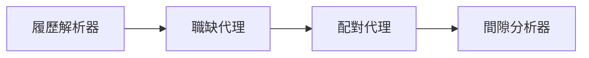
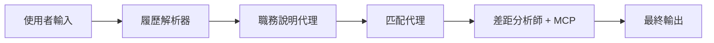

# 模組 4 - 協調模式

⏱️ ~10 分鐘

在本模組中，您將探索在履歷工作適配評估器中使用的協調模式，並學習如何閱讀、修改和擴展工作流程圖。理解這些模式對於除錯資料流問題以及建立您自己的[多代理工作流程](https://learn.microsoft.com/agent-framework/workflows/)至關重要。

---

## 模式 1：序列鏈

工作流程中的基本模式是<strong>序列鏈</strong>——每個代理的輸出直接作為下一個輸入。


```mermaid
flowchart LR
    RP[履歷解析器] --> JD[職缺代理]
    JD --> MA[配對代理]
    MA --> GA[間隙分析器]
```

在程式碼中，每一次 `add_edge()` 呼叫都建立鏈條中的一個步驟：

```python
.add_edge(resume_executor, jd_executor)       # 履歷解析器輸出 → 職缺代理
.add_edge(jd_executor, matching_executor)     # 職缺代理輸出 → 匹配代理
.add_edge(matching_executor, gap_executor)    # 匹配代理輸出 → 差距分析器
```

> **為什麼是序列，而不是扇出／扇入？** `WorkflowBuilder` 使用的是入邊的<strong>OR語義</strong>：下游執行器只要有<strong>任一</strong>前置節點完成就會觸發。如果 `matching_executor` 有兩條入邊（來自 `resume_executor` 和 `jd_executor`），它會被觸發兩次——一次是在 ResumeParser 完成時，另一次是在 JD Agent 完成時——導致 GapAnalyzer 也執行兩次並產生兩份輸出。序列流水線完全避免了這個情況。

## 模式 2：內容中繼

因為 `context_mode="last_agent"` 意味著每個執行器只能看到其<strong>直接前置節點的輸出</strong>，所以序列鏈中的代理必須明確地將下游代理所需的任何資料傳遞下去。

在此工作流程中：
- **ResumeParser** 將職務說明逐字複製到 `[JOB DESCRIPTION PASS-THROUGH]` 中（以便 JD Agent 找到它）。
- **JD Agent** 將 `[PARSED RESUME]` 逐字複製到 `[PARSED RESUME PASS-THROUGH]` 中（以便 MatchingAgent 比較兩個檔案）。

```
ResumeParser output
└─ [PARSED RESUME]               ← extracted by JD Agent
└─ [JOB DESCRIPTION PASS-THROUGH] ← extracted by JD Agent

JD Agent output
└─ [JD REQUIREMENTS]             ← extracted by MatchingAgent
└─ [PARSED RESUME PASS-THROUGH]  ← extracted by MatchingAgent
```

每個中繼段必須<strong>逐字複製</strong>——摘要或改寫會破壞依賴該資料的下游代理。

---

## 完整圖形

結合序列鏈與內容中繼模式產生完整工作流程：


```mermaid
flowchart LR
    U[使用者輸入] --> RP[履歷解析器]
    RP --> JD[職務說明代理]
    JD --> MA[匹配代理]
    MA --> GA[差距分析師 + MCP]
    GA --> O[最終輸出]
```

代理檢視器在代理本地運行時也會顯示相同的圖形結構。請參考[模組 5 - 本地測試](05-test-locally.md)中的截圖。

---

## 閱讀 WorkflowBuilder 程式碼

`create_workflow()` 函式完整程式碼位於 [`PersonalCareerCopilot/main.py`](../../../../../workshop/lab02-multi-agent/PersonalCareerCopilot/main.py)。三次 `add_edge()` 呼叫建立序列流水線：

| # | 邊 | 效果 |
|---|------|--------|
| 1 | `resume_executor → jd_executor` | JD Agent 收到 `[PARSED RESUME]` + `[JOB DESCRIPTION PASS-THROUGH]` |
| 2 | `jd_executor → matching_executor` | MatchingAgent 收到 `[JD REQUIREMENTS]` + `[PARSED RESUME PASS-THROUGH]` |
| 3 | `matching_executor → gap_executor` | GapAnalyzer 收到適配報告 + 差距清單 |

---

## 修改圖形

### 新增代理

若要新增第五個代理（例如，GapAnalyzer 之後的<strong>InterviewPrepAgent</strong>）：

1. 定義 `INTERVIEW_PREP_INSTRUCTIONS` 常數。
2. 建立 `Agent` 和 `AgentExecutor` 物件（與現有四個相同的模式）。
3. 在 `WorkflowBuilder` 裡加入 `.add_edge(gap_executor, interview_exec)`。
4. 更新 `output_executors=[interview_exec]`。

> **重要:** `start_executor` 是唯一接收原始使用者輸入的代理。其他所有代理均接收其上游邊的輸出。

---

## 常見圖形錯誤

| 錯誤 | 症狀 | 修正 |
|---------|---------|-----|
| 缺少到 `output_executors` 的邊 | 代理執行但輸出為空 | 確保 `start_executor` 可到每個 `output_executors` 代理有路徑 |
| 環路依賴 | 無限循環或逾時 | 檢查沒有代理回饋至上游代理 |
| `output_executors` 中代理無入邊 | 輸出為空 | 至少新增一條 `add_edge(source, that_agent)` |
| 多個 `output_executors` 無匯入 | 輸出只有一個代理的回應 | 使用單一輸出代理彙整，或接受多輸出 |
| 缺少 `start_executor` | 建立時產生 `ValueError` | 在 `WorkflowBuilder()` 中必須指定 `start_executor` |

---

## 除錯圖形

### 使用代理檢視器

1. 使用 F5 在本機啟動代理。
2. 開啟代理檢視器（`Ctrl+Shift+P` → **Foundry Toolkit: Open Agent Inspector**）。
3. 傳送測試訊息。
4. 在檢視器的回應面板中查看<strong>串流輸出</strong>——它依序顯示每個代理的貢獻。


### 使用日誌紀錄

對 `main.py` 加入日誌紀錄來追蹤資料流：

```python
import logging
logger = logging.getLogger("resume-job-fit")

# 在 main() 中，建立工作流程後：
logger.info("Workflow graph built with edges: RP→JD, JD→MA, MA→GA")
```

伺服器日誌顯示代理執行順序及 MCP 工具呼叫：

```
INFO:agent_framework:Executing agent: ResumeParser
INFO:agent_framework:Executing agent: JobDescriptionAgent
INFO:agent_framework:Executing agent: MatchingAgent
INFO:agent_framework:Executing agent: GapAnalyzer
INFO:agent_framework:Tool call: search_microsoft_learn_for_plan(skill="Kubernetes")
POST https://learn.microsoft.com/api/mcp → 200
INFO:agent_framework:Tool call: search_microsoft_learn_for_plan(skill="Terraform")
POST https://learn.microsoft.com/api/mcp → 200
```

---

### 檢查點

- [ ] 您能辨識工作流程中的兩個協調模式：序列鏈與內容中繼
- [ ] 您理解為何 `context_mode="last_agent"` 需要代理間明確資料中繼
- [ ] 您能閱讀 `WorkflowBuilder` 程式碼並將每次 `add_edge()` 對應至視覺圖形
- [ ] 您知道如何在流水線末端新增代理
- [ ] 您能辨識常見圖形錯誤及其症狀

---

**上一章：** [03 - 配置代理與環境](03-configure-agents.md) · **下一章：** [05 - 本地測試 →](05-test-locally.md)

---

<!-- CO-OP TRANSLATOR DISCLAIMER START -->
**免責聲明**：
此文件已使用 AI 翻譯服務 [Co-op Translator](https://github.com/Azure/co-op-translator) 進行翻譯。雖然我們努力追求準確性，但請注意自動翻譯可能包含錯誤或不準確之處。原始文件的母語版本應視為權威來源。對於關鍵資訊，建議採用專業人工翻譯。我們不對因使用此翻譯所產生的任何誤解或誤譯承擔責任。
<!-- CO-OP TRANSLATOR DISCLAIMER END -->