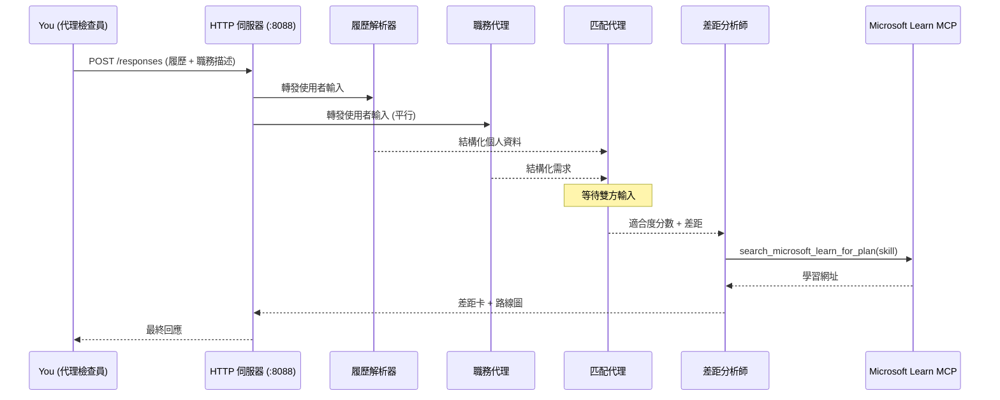
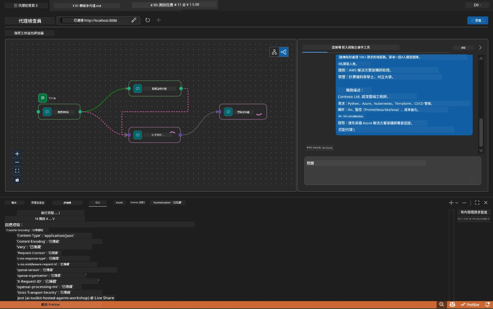

# Module 5 - 本地測試（多代理）

在本模組中，您將在本地執行多代理工作流程，使用 Agent Inspector 進行測試，並驗證四個代理和 MCP 工具皆正常運作，然後再部署到 Foundry。

### 本地測試執行時發生的事情


---

## 步驟 1：啟動代理伺服器

### 選項 A：使用 VS Code 任務（建議）

1. 按下 `Ctrl+Shift+P` → 輸入 **Tasks: Run Task** → 選擇 **Run Lab02 HTTP Server**。
2. 該任務會啟動伺服器並附加 debugpy，埠號為 `5679`，代理運作於埠號 `8088`。
3. 等待輸出顯示：

```
INFO:resume-job-fit:Starting Resume -> Job Fit Evaluator HTTP server...
INFO:resume-job-fit:Server running on http://localhost:8088
```

### 選項 B：手動使用終端機

```powershell
cd workshop\lab02-multi-agent\PersonalCareerCopilot
```

啟用虛擬環境：

**PowerShell (Windows)：**
```powershell
.\.venv\Scripts\Activate.ps1
```

**macOS/Linux：**
```bash
source .venv/bin/activate
```

啟動伺服器：

```powershell
python -m debugpy --listen 127.0.0.1:5679 -m agentdev run main.py --verbose --port 8088
```

### 選項 C：使用 F5（除錯模式）

1. 按下 `F5` 或前往 **Run and Debug** (`Ctrl+Shift+D`)。
2. 從下拉選單中選擇 **Lab02 - Multi-Agent** 啟動設定。
3. 伺服器會啟動並全面支援斷點。

> **提示：** 除錯模式可讓您在 `search_microsoft_learn_for_plan()` 內設定斷點，檢視 MCP 回應，或是在代理指令字串中查看每個代理接收到的內容。

---

## 步驟 2：開啟 Agent Inspector

1. 按下 `Ctrl+Shift+P` → 輸入 **Foundry Toolkit: Open Agent Inspector**。
2. Agent Inspector 會在瀏覽器分頁中於 `http://localhost:5679` 開啟。
3. 您應該會看到代理界面，準備接受訊息。

> **如果 Agent Inspector 無法開啟：** 請確定伺服器已完全啟動（看到「Server running」日誌）。如果埠號 5679 已被佔用，請參閱 [模組 8 - 疑難排解](08-troubleshooting.md)。

---

## 步驟 3：執行冒煙測試

依序執行以下三個測試。每個測試會逐步檢驗更多工作流程內容。

### 測試 1：基本履歷與職務說明

將以下內容貼到 Agent Inspector：

```
Resume:
Jane Doe
Senior Software Engineer with 5 years of experience in Python, Django, and AWS.
Built microservices handling 10K+ requests/second. Led a team of 4 developers.
Certifications: AWS Solutions Architect Associate.
Education: B.S. Computer Science, State University.

Job Description:
Senior Cloud Engineer at Contoso Ltd.
Required: Python, Azure, Kubernetes, Terraform, CI/CD pipelines.
Preferred: Go, monitoring (Prometheus/Grafana), cost optimization.
Experience: 5+ years in cloud infrastructure.
Certifications: Azure Solutions Architect Expert preferred.
```

**預期輸出結構：**

回應應依序包含四個代理的輸出：

1. **Resume Parser 輸出** - 依分類分組的結構化候選人簡歷資料
2. **JD Agent 輸出** - 依需求與偏好分離的結構化職務要求
3. **Matching Agent 輸出** - 配合度評分（0-100），包括明細、匹配技能、缺失技能、差距
4. **Gap Analyzer 輸出** - 每個缺失技能的個別差距卡片，各含有 Microsoft Learn 的網址



### 測試 1 驗證項目

| 檢查項目 | 預期結果 | 通過？ |
|---------|----------|-------|
| 回應包含配合度評分 | 介於 0-100 的數字且有明細說明 | |
| 列出匹配技能 | Python、CI/CD（部分）、等 | |
| 列出缺失技能 | Azure、Kubernetes、Terraform、等 | |
| 每個缺失技能有差距卡片 | 每一技能一張卡片 | |
| 差距卡片含 Microsoft Learn URL | 連結指向真實的 `learn.microsoft.com` | |
| 回應無錯誤訊息 | 清晰結構化輸出 | |

### 測試 2：驗證 MCP 工具執行

在測試 1 執行時，檢查<strong>伺服器終端機</strong>中的 MCP 日誌條目：

```
GET https://learn.microsoft.com/api/mcp → 405 (Method Not Allowed)
POST https://learn.microsoft.com/api/mcp → 200
DELETE https://learn.microsoft.com/api/mcp → 405 (Method Not Allowed)
```

| 日誌項目 | 意義 | 預期？ |
|----------|-------|-------|
| `GET ... → 405` | MCP 用戶端啟動時以 GET 探測 | 是 - 正常 |
| `POST ... → 200` | 實際呼叫 Microsoft Learn MCP 伺服器 | 是 - 真正呼叫 |
| `DELETE ... → 405` | MCP 用戶端清理時以 DELETE 探測 | 是 - 正常 |
| `POST ... → 4xx/5xx` | 工具呼叫失敗 | 否 - 請參閱 [疑難排解](08-troubleshooting.md) |

> **關鍵點：** `GET 405` 與 `DELETE 405` 行為是<strong>預期現象</strong>。只有 `POST` 回傳非 200 狀態碼時才需擔心。

### 測試 3：極端案例 - 高配合度候選人

貼上一份與職務說明高度吻合的履歷，驗證 GapAnalyzer 對高配合度情境的處理：

```
Resume:
Alex Chen
Senior Cloud Engineer with 7 years of experience.
Skills: Python, Azure (AKS, Functions, DevOps), Kubernetes, Terraform, CI/CD (GitHub Actions, Azure Pipelines), Go, Prometheus, Grafana, cost optimization.
Certifications: Azure Solutions Architect Expert, Azure DevOps Engineer Expert.
Led infrastructure migration to Azure for 3 enterprise clients.
Education: M.S. Computer Science, Tech University.

Job Description:
Senior Cloud Engineer at Contoso Ltd.
Required: Python, Azure, Kubernetes, Terraform, CI/CD pipelines.
Preferred: Go, monitoring (Prometheus/Grafana), cost optimization.
Experience: 5+ years in cloud infrastructure.
Certifications: Azure Solutions Architect Expert preferred.
```

**預期行為：**
- 配合度評分應為<strong>80 以上</strong>（大多數技能匹配）
- 差距卡片著重於潤飾／面試準備，而非基礎學習
- GapAnalyzer 指令中說明：「如果配合度 >= 80，重點在潤飾／面試準備」

---

## 步驟 4：驗證輸出完整性

執行測試後，請確認輸出符合以下標準：

### 輸出結構清單

| 區塊 | 代理 | 是否出現？ |
|-------|-------|-----------|
| 候選人基本資料 | Resume Parser | |
| 技術技能（分組） | Resume Parser | |
| 角色概述 | JD Agent | |
| 必要與偏好技能 | JD Agent | |
| 配合度評分與明細 | Matching Agent | |
| 匹配／缺失／部分技能 | Matching Agent | |
| 每缺失技能一張差距卡 | Gap Analyzer | |
| 差距卡片含 Microsoft Learn URL | Gap Analyzer (MCP) | |
| 學習順序（編號） | Gap Analyzer | |
| 時程摘要 | Gap Analyzer | |

### 此階段常見問題

| 問題 | 原因 | 修正方式 |
|-------|---------|---------|
| 只出現一張差距卡（其餘被截斷） | GapAnalyzer 指令缺失重要區塊 | 在 `GAP_ANALYZER_INSTRUCTIONS` 中新增 `CRITICAL:` 段落 - 參考 [模組 3](03-configure-agents.md) |
| 沒有 Microsoft Learn URL | MCP 端點無法連線 | 檢查網路連線。確定 `.env` 中 `MICROSOFT_LEARN_MCP_ENDPOINT` 為 `https://learn.microsoft.com/api/mcp` |
| 回應為空 | 未設定 `PROJECT_ENDPOINT` 或 `MODEL_DEPLOYMENT_NAME` | 檢查 `.env` 變數。終端機執行 `echo $env:PROJECT_ENDPOINT` 確認 |
| 配合度為 0 或缺失 | MatchingAgent 沒有接收到上游資料 | 確認 `create_workflow()` 有執行 `add_edge(resume_parser, matching_agent)` 和 `add_edge(jd_agent, matching_agent)` |
| 代理啟動後立即退出 | 匯入錯誤或缺少依賴檔 | 重新執行 `pip install -r requirements.txt`，並檢查終端機的錯誤追蹤 |
| `validate_configuration` 錯誤 | 缺少環境變數 | 建立 `.env` 並設定 `PROJECT_ENDPOINT=<your-endpoint>` 和 `MODEL_DEPLOYMENT_NAME=<your-model>` |

---

## 步驟 5：用自己的資料測試（選用）

嘗試貼上自己的履歷與真實的職務說明。這有助於驗證：

- 代理是否能處理不同的履歷格式（時間性、職能性、混合型）
- JD Agent 能否處理不同風格的職務說明（點列、段落、結構化）
- MCP 工具是否能回傳真實技能相關的資源
- 差距卡片是否根據您個人背景做出客製化

> **隱私注意事項：** 本地測試時，您的資料只保留在本機，且僅發送到您的 Azure OpenAI 部署，不會被工作坊基礎建設記錄或儲存。若偏好，可使用假名（例如用「Jane Doe」替代真實姓名）。

---

### 檢查點

- [ ] 伺服器成功於埠號 `8088` 啟動（日誌顯示「Server running」）
- [ ] Agent Inspector 已開啟並連線至代理
- [ ] 測試 1：完整回應包含配合度、匹配／缺失技能、差距卡片及 Microsoft Learn 連結
- [ ] 測試 2：MCP 日誌有 `POST ... → 200`（工具呼叫成功）
- [ ] 測試 3：高配合度候選人配分 80+，並有潤飾聚焦建議
- [ ] 所有差距卡完整呈現（每缺失技能一張，無截斷）
- [ ] 伺服器終端無錯誤或堆疊追蹤

---

**上一章節：** [04 - 編排模式](04-orchestration-patterns.md) · **下一章節：** [06 - 部署至 Foundry →](06-deploy-to-foundry.md)

---

<!-- CO-OP TRANSLATOR DISCLAIMER START -->
**免責聲明**：  
本文件係使用 AI 翻譯服務 [Co-op Translator](https://github.com/Azure/co-op-translator) 進行翻譯。雖然我們致力於準確性，但請注意，自動翻譯可能包含錯誤或不準確之處。原始文件之母語版本應視為權威來源。對於重要資訊，建議採用專業人工翻譯。本公司不對因使用本翻譯而產生的任何誤解或誤釋承擔責任。
<!-- CO-OP TRANSLATOR DISCLAIMER END -->