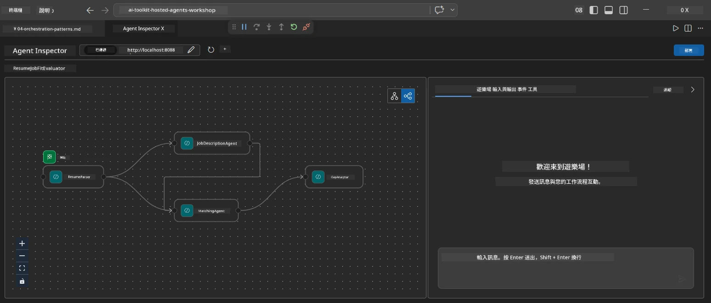
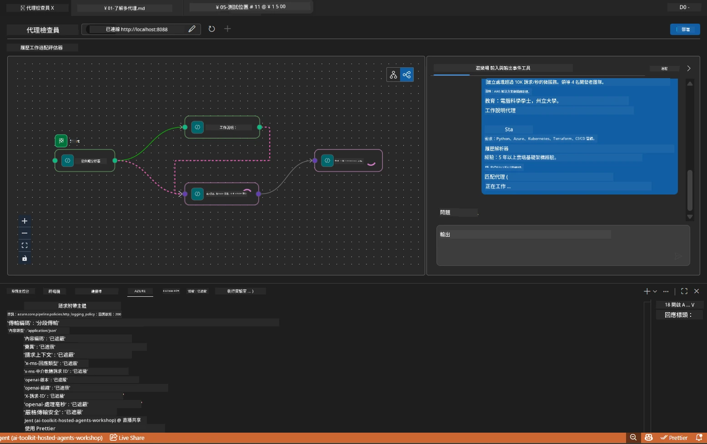
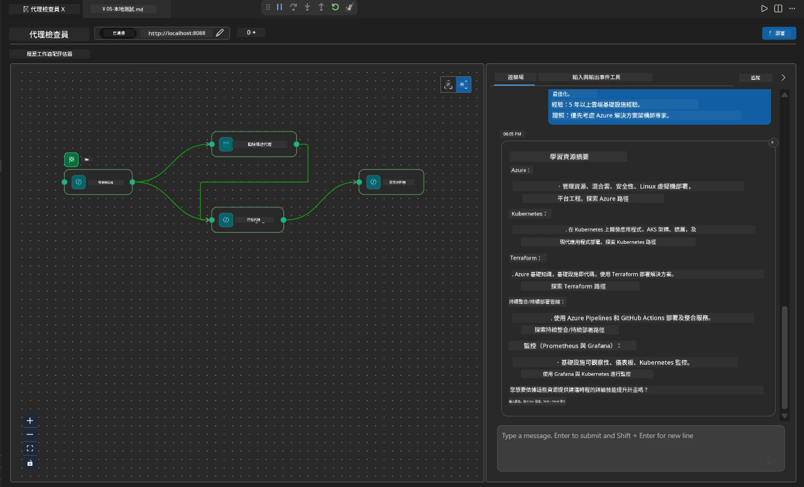

# 模組 5 - 本地測試

⏱️ 約 15 分鐘

在本模組中，您將在本地執行多代理工作流程，使用 Agent Inspector 測試，並在部署之前驗證所有四個代理及 MCP 工具是否正常運作。

---

## 步驟 1：啟動代理伺服器

### 選項 A：使用 VS Code 任務（推薦）

1. 打開 `workshop/lab02-multi-agent/PersonalCareerCopilot/` 作為您的 VS Code 資料夾。
2. 按下 `Ctrl+Shift+P` → 輸入 **Tasks: Run Task** → 選擇 **Run Agent HTTP Server**。
3. 該任務會啟動伺服器並附加 debugpy，Debug 埠為 `5679`，代理埠為 `8088`。
4. 等待輸出顯示：

```
INFO:resume-job-fit:Starting Resume -> Job Fit Evaluator HTTP server...
INFO:resume-job-fit:Server running on http://localhost:8088
```

### 選項 B：使用 F5（除錯模式）

1. 按下 `F5` → 選擇 **Debug Local Agent HTTP Server**。
2. 伺服器將啟動並完全支援斷點，方便檢查 MCP 回應或代理輸出。

---

## 步驟 2：打開 Agent Inspector

1. 按下 `Ctrl+Shift+P` → 輸入 **Foundry Toolkit: Open Agent Inspector**。
2. Agent Inspector 會在 VS Code 面板中打開並連接至 `http://localhost:8088`。
3. 您應該會看到代理界面準備接受訊息。



> **如果 Agent Inspector 無法打開：** 請確認伺服器已完全啟動（您能看到「Server running」日誌）。如果埠號 5679 被佔用，請參閱[模組 8 - 疑難排解](08-troubleshooting.md)。

---

## 步驟 2b：（可選）打開工作流程視覺化工具

Foundry Toolkit 包含一個即時的 <strong>工作流程視覺化工具</strong>，會顯示代理在圖形執行過程中的互動。這對於多代理除錯特別有用。

1. 按下 `Ctrl+Shift+P` → 輸入 **Foundry Toolkit: Open Visualizer for Hosted Agents**。
2. 會在 VS Code 新分頁中開啟即時執行圖。
3. 當您在 Agent Inspector 發送訊息時，視覺化工具會自動更新—綠色節點表示完成的代理，動畫邊緣顯示資料流動。

> **埠衝突：** 若視覺化工具埠已被使用，請至 VS Code 設定 → <strong>擴充功能</strong> → **Microsoft Foundry Configuration** → **Hosted Agents: Visualizer Port** 變更埠號。

---

## 步驟 3：執行冒煙測試

按順序執行以下三個測試。每項測試會逐步涵蓋更多工作流程功能。

### 測試 1：基本履歷 + 工作描述

將以下內容貼入 Agent Inspector：

```
Resume:
Jane Doe
Senior Software Engineer with 5 years of experience in Python, Django, and AWS.
Built microservices handling 10K+ requests/second. Led a team of 4 developers.
Certifications: AWS Solutions Architect Associate.
Education: B.S. Computer Science, State University.

Job Description:
Senior Cloud Engineer at Contoso Ltd.
Required: Python, Azure, Kubernetes, Terraform, CI/CD pipelines.
Preferred: Go, monitoring (Prometheus/Grafana), cost optimization.
Experience: 5+ years in cloud infrastructure.
Certifications: Azure Solutions Architect Expert preferred.
```

**期望的輸出結構：**

回應應包含所有四個代理的輸出，且按序列呈現：

1. <strong>履歷解析器輸出</strong> - 兩個標記區段：「[PARSED RESUME]」（候選人檔案及分組技能）和「[JOB DESCRIPTION PASS-THROUGH]」（逐字的工作描述文本，提供給 JD 代理）
2. **JD 代理輸出** - 結構化需求，區分必需和偏好技能
3. <strong>匹配代理輸出</strong> - 合適度分數 (0-100)，含分數明細、匹配技能、缺少技能及缺口分析
4. <strong>缺口分析器輸出</strong> - 每個缺少技能的缺口卡片，附帶 Microsoft Learn 網址





### 測試 1 的驗證項目

| 項目 | 預期內容 | 是否通過？ |
|-------|----------|-------|
| 回應包含合適度分數 | 介於 0-100 之間且有分數明細 | |
| 列出匹配技能 | 例如 Python、CI/CD（部分匹配）等 | |
| 列出缺少技能 | 例如 Azure、Kubernetes、Terraform 等 | |
| 每個缺少技能都有缺口卡片 | 每個技能一張卡片 | |
| 附帶 Microsoft Learn 網址 | 真實 `learn.microsoft.com` 連結 | |
| 無錯誤訊息 | 結構化輸出乾淨無錯誤 | |

### 測試 2：邊界案例 - 高合適度候選人

貼入一份與 JD 高度匹配的履歷，以驗證 GapAnalyzer 是否能處理高合適度情況：

```
Resume:
Alex Chen
Senior Cloud Engineer with 7 years of experience.
Skills: Python, Azure (AKS, Functions, DevOps), Kubernetes, Terraform, CI/CD (GitHub Actions, Azure Pipelines), Go, Prometheus, Grafana, cost optimization.
Certifications: Azure Solutions Architect Expert, Azure DevOps Engineer Expert.
Led infrastructure migration to Azure for 3 enterprise clients.
Education: M.S. Computer Science, Tech University.

Job Description:
Senior Cloud Engineer at Contoso Ltd.
Required: Python, Azure, Kubernetes, Terraform, CI/CD pipelines.
Preferred: Go, monitoring (Prometheus/Grafana), cost optimization.
Experience: 5+ years in cloud infrastructure.
Certifications: Azure Solutions Architect Expert preferred.
```

**預期行為：**
- 合適度分數應為 **80 以上**（大部分技能匹配）
- 缺口卡片應著重於潤飾／面試準備，而非基礎學習
- GapAnalyzer 指示說明：「如果合適度 >= 80，請注重潤飾和面試準備」

---

## 步驟 4：使用您自己的資料測試（可選）

嘗試貼入您自己的履歷和真實的工作描述，以驗證：

- 代理能處理不同履歷格式（時間軸型、功能型、混合型）
- JD 代理可以處理不同的工作描述風格（條列、段落、結構化）
- MCP 工具會回傳相關的技能資源
- 缺口卡片會針對您的具體背景個性化

> **隱私 - 路徑 A（Foundry 雲端）：** 履歷和 JD 文本會送至您的 Azure OpenAI 部署做推論。這些資料不會被工作坊架構記錄或儲存。您可以使用佔位名稱（例如「Jane Doe」）。
>
> **隱私 - 路徑 B（Foundry 本地）：** 所有四個代理的推論完全在您的裝置上執行。您的履歷和工作描述文本<strong>絕不會離開您的機器</strong>。唯一的對外呼叫是 MCP 工具從 `https://learn.microsoft.com/api/mcp` 擷取資源；該查詢只包含技能名稱，不含個人資料。

---

### 檢查點

- [ ] 伺服器成功啟動於埠號 `8088`（日誌顯示「Server running」）
- [ ] 開啟 Agent Inspector 並連接至代理
- [ ] 測試 1：完整回應含合適度分數、匹配／缺少技能、缺口卡片及 Microsoft Learn 連結
- [ ] 測試 2：高合適度候選人取得 80+ 分並給出潤飾建議
- [ ] 所有缺口卡片均存在（每個缺少技能一張，無截斷）
- [ ] 伺服器終端無錯誤或堆疊追蹤

---

**上一節：** [04 - 編排模式](04-orchestration-patterns.md) · **下一節：** [06 - 部署到 Foundry →](06-deploy-to-foundry.md)

---

<!-- CO-OP TRANSLATOR DISCLAIMER START -->
**免責聲明**：
此文件已使用 AI 翻譯服務 [Co-op Translator](https://github.com/Azure/co-op-translator) 進行翻譯。雖然我們努力追求準確性，但請注意自動翻譯可能包含錯誤或不準確之處。原始文件的母語版本應視為權威來源。對於關鍵資訊，建議採用專業人工翻譯。我們不對因使用此翻譯所產生的任何誤解或誤譯承擔責任。
<!-- CO-OP TRANSLATOR DISCLAIMER END -->