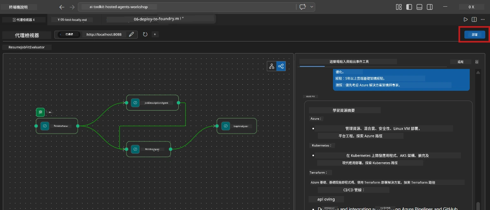
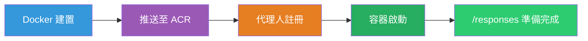
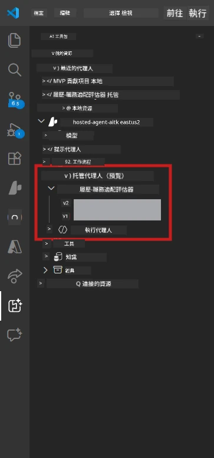

# Module 6 - 部署到 Foundry 代理服務

在本模組中，您將把本地測試過的多代理工作流程部署到 [Microsoft Foundry](https://learn.microsoft.com/azure/foundry/agents/concepts/hosted-agents) 作為 <strong>託管代理</strong>。部署過程會建立 Docker 容器映像，推送到 [Azure Container Registry (ACR)](https://learn.microsoft.com/azure/container-registry/container-registry-intro)，並在 [Foundry 代理服務](https://learn.microsoft.com/azure/foundry/agents/how-to/publish-agent) 中建立託管代理版本。

> **與 Lab 01 的主要差異：** 部署過程相同。Foundry 將您的多代理工作流程視為單一託管代理——複雜度在容器內，但部署介面是相同的 `/responses` 端點。

---

## 前置條件檢查

在部署之前，請確認以下每一項：

1. **代理通過本地煙霧測試：**
   - 您已完成 [Module 5](05-test-locally.md) 中的所有 3 項測試，且工作流程產生完整輸出，含 Gap 卡片和 Microsoft Learn URL。

2. **您擁有 [Azure AI 使用者](https://learn.microsoft.com/azure/foundry/concepts/rbac-foundry) 角色：**
   - 於 [Lab 01, Module 2](../../lab01-single-agent/docs/02-create-foundry-project.md) 中指派。驗證方式：
   - [Azure 入口網站](https://portal.azure.com) → 您的 Foundry <strong>專案</strong> 資源 → **存取控制 (IAM)** → <strong>角色指派</strong> → 確認您的帳號列出 **[Azure AI 使用者](https://aka.ms/foundry-ext-project-role)**。

3. **您已在 VS Code 登入 Azure：**
   - 檢查 VS Code 左下角的帳號圖示，應可看到您的帳號名稱。

4. **`agent.yaml` 有正確值：**
   - 開啟 `PersonalCareerCopilot/agent.yaml` 並確認：
     ```yaml
     environment_variables:
       - name: PROJECT_ENDPOINT
         value: ${PROJECT_ENDPOINT}
       - name: MODEL_DEPLOYMENT_NAME
         value: ${MODEL_DEPLOYMENT_NAME}
     ```
   - 這些必須與您的 `main.py` 讀取的環境變數相符。

5. **`requirements.txt` 版本正確：**
   ```
   agent-framework-azure-ai==1.0.0rc3
   agent-framework-core==1.0.0rc3
   azure-ai-agentserver-agentframework==1.0.0b16
   azure-ai-agentserver-core==1.0.0b16
   debugpy
   agent-dev-cli --pre
   ```

---

## 步驟 1：開始部署

### 選項 A：從代理檢查器部署（建議）

若代理已透過 F5 執行並開啟代理檢查器：

1. 查看代理檢查器面板的 <strong>右上角</strong>。
2. 點選 **Deploy** 按鈕（雲朵圖示帶上箭頭 ↑）。
3. 部署精靈會打開。



### 選項 B：從命令面板部署

1. 按 `Ctrl+Shift+P` 開啟 <strong>命令面板</strong>。
2. 輸入：**Microsoft Foundry: Deploy Hosted Agent**，並選擇它。
3. 部署精靈會打開。

---

## 步驟 2：配置部署

### 2.1 選擇目標專案

1. 下拉選單會顯示您的 Foundry 專案。
2. 選擇您在整個工作坊中使用的專案（例如 `workshop-agents`）。

### 2.2 選擇容器代理檔案

1. 系統會請您選擇代理的進入點。
2. 導航至 `workshop/lab02-multi-agent/PersonalCareerCopilot/`，選擇 **`main.py`**。

### 2.3 配置資源

| 設定 | 建議值 | 備註 |
|---------|------------------|-------|
| **CPU** | `0.25` | 預設。多代理工作流程不需要更多 CPU，因為模型呼叫為 I/O 綁定 |
| <strong>記憶體</strong> | `0.5Gi` | 預設。若增加大型資料處理工具，考慮提高到 `1Gi` |

---

## 步驟 3：確認並部署

1. 精靈會顯示部署摘要。
2. 審核後點選 **Confirm and Deploy**。
3. 在 VS Code 中觀看進度。

### 部署期間發生什麼事

請查看 VS Code 的 <strong>輸出</strong> 面板（選擇 "Microsoft Foundry" 下拉）：


1. **Docker 建置** - 從您的 `Dockerfile` 建置容器：
   ```
   Step 1/6 : FROM python:3.14-slim
   Step 2/6 : WORKDIR /app
   ...
   Successfully built abc123def456
   ```

2. **Docker 推送** - 將映像推到 ACR（首次部署約 1-3 分鐘）。

3. <strong>代理註冊</strong> - Foundry 使用 `agent.yaml` 元資料建立託管代理。代理名稱為 `resume-job-fit-evaluator`。

4. <strong>容器啟動</strong> - 容器在 Foundry 託管基礎結構中啟動，使用系統管理的身分識別。

> <strong>首次部署較慢</strong>（Docker 會推送所有層）。後續部署會重用快取層，提高速度。

### 多代理特別說明

- **所有四個代理都在同一個容器內。** Foundry 視為單一託管代理。WorkflowBuilder 圖形在容器內部執行。
- **MCP 呼叫為外發。** 容器需要網際網路存取以連接 `https://learn.microsoft.com/api/mcp`。Foundry 的託管基礎結構預設提供此功能。
- **[管理身分識別](https://learn.microsoft.com/python/api/overview/azure/identity-readme#managed-identity-support)。** 在託管環境中，`main.py` 中的 `get_credential()` 返回 `ManagedIdentityCredential()`（因為設定了 `MSI_ENDPOINT`），此為自動行為。

---

## 步驟 4：確認部署狀態

1. 打開 **Microsoft Foundry** 側邊欄（點擊活動列的 Foundry 圖示）。
2. 展開專案下的 **Hosted Agents (Preview)**。
3. 找到 **resume-job-fit-evaluator**（或您的代理名稱）。
4. 點選代理名稱 → 展開版本（例如 `v1`）。
5. 點選版本 → 查看 **Container Details** → <strong>狀態</strong>：



| 狀態 | 意義 |
|--------|---------|
| **Started** / **Running** | 容器正在執行，代理已就緒 |
| **Pending** | 容器正在啟動（請等待 30-60 秒） |
| **Failed** | 容器啟動失敗（檢查日誌 - 如下所述） |

> <strong>多代理啟動時間較長</strong>，因容器啟動時會建立 4 個代理實例。狀態「Pending」持續 2 分鐘以內屬正常。

---

## 常見部署錯誤與修正

### 錯誤 1：權限拒絕 - `agents/write`

```
Error: lacks the required data action 
Microsoft.CognitiveServices/accounts/AIServices/agents/write
```

**修正：** 在 <strong>專案</strong> 級別指派 **[Azure AI 使用者](https://learn.microsoft.com/azure/foundry/concepts/rbac-foundry)** 角色。參考 [Module 8 - 疑難排解](08-troubleshooting.md) 的逐步說明。

### 錯誤 2：Docker 未執行

```
Error: Docker build failed / Cannot connect to Docker daemon
```

**修正：**
1. 啟動 Docker Desktop。
2. 等待顯示「Docker Desktop is running」。
3. 驗證：`docker info`
4. **Windows：** 確認 Docker Desktop 設定啟用 WSL 2 後端。
5. 重試。

### 錯誤 3：pip install 在 Docker build 過程失敗

```
Error: Could not find a version that satisfies the requirement agent-dev-cli
```

**修正：** `requirements.txt` 中的 `--pre` 參數在 Docker 中處理不同。確保您的 `requirements.txt` 是：
```
agent-dev-cli --pre
```

若 Docker 仍失敗，請建立 `pip.conf` 或以建置參數傳入 `--pre`。詳見 [Module 8](08-troubleshooting.md)。

### 錯誤 4：MCP 工具在託管代理中失敗

若 Gap Analyzer 在部署後停止產生 Microsoft Learn URL：

**根本原因：** 容器的網路政策可能阻擋外發 HTTPS。

**修正：**
1. Foundry 預設配置通常不會有此問題。
2. 若發生，請檢查 Foundry 專案的虛擬網路是否有 NSG 阻擋外發 HTTPS。
3. MCP 工具具備內建備援 URL，代理仍會產生輸出（但無法即時 URL）。

---

### 檢查點

- [ ] 部署命令在 VS Code 中完成且無錯誤
- [ ] 代理出現在 Foundry 側邊欄的 **Hosted Agents (Preview)** 中
- [ ] 代理名稱為 `resume-job-fit-evaluator`（或您的自選名稱）
- [ ] 容器狀態顯示 **Started** 或 **Running**
- [ ] （若發生錯誤）您已識別錯誤、應用修正並成功重新部署

---

**上一步：** [05 - 本地測試](05-test-locally.md) · **下一步：** [07 - 在遊樂場驗證 →](07-verify-in-playground.md)

---

<!-- CO-OP TRANSLATOR DISCLAIMER START -->
**免責聲明**：  
本文件係使用 AI 翻譯服務 [Co-op Translator](https://github.com/Azure/co-op-translator) 進行翻譯。雖然我們努力確保準確性，但請注意，自動翻譯可能包含錯誤或不準確之處。原始文件的母語版本應視為權威來源。對於重要資訊，建議尋求專業人工翻譯。我們不對因使用本翻譯而產生的任何誤解或誤譯承擔責任。
<!-- CO-OP TRANSLATOR DISCLAIMER END -->