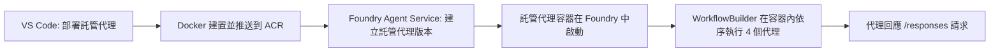
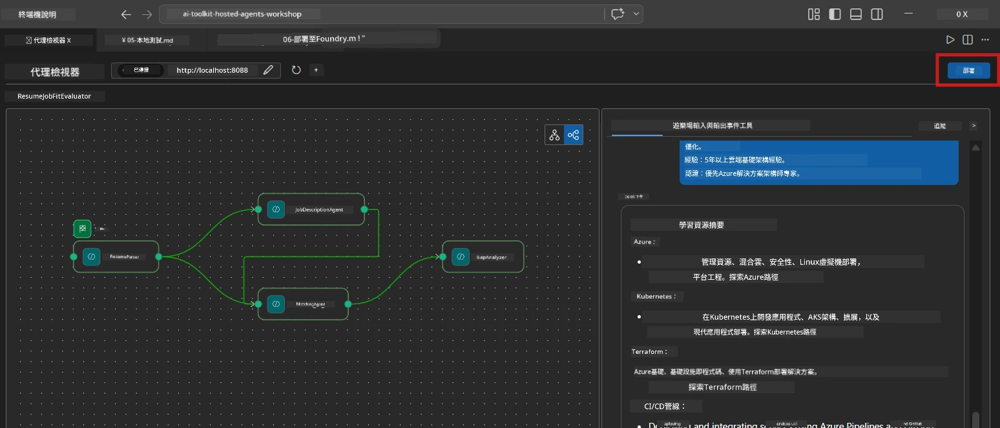
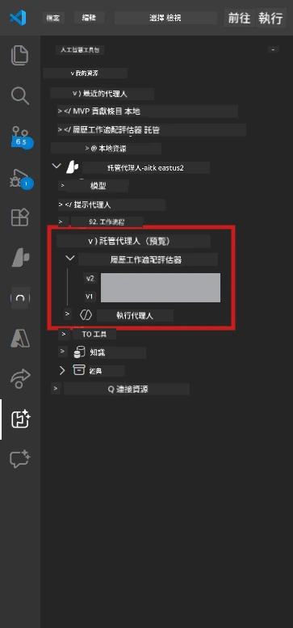

# 模組 6 - 部署至 Foundry Agent 服務

⏱️ 約 10 分鐘

在本模組中，您將本地測試的多代理工作流程部署到 [Microsoft Foundry](https://learn.microsoft.com/azure/foundry/agents/concepts/hosted-agents) 作為 <strong>託管代理</strong>。部署過程會構建一個 Docker 容器映像，將其推送到 [Azure Container Registry (ACR)](https://learn.microsoft.com/azure/container-registry/container-registry-intro)，並在 [Foundry Agent 服務](https://learn.microsoft.com/azure/foundry/agents/how-to/publish-agent) 創建一個託管代理版本。

> **與實驗室 01 的主要差異：** 部署流程相同。Foundry 將您的多代理工作流程視為單一託管代理－複雜度在容器內部，但部署表面是相同的 `/responses` 端點。

### 部署流程


```mermaid
flowchart LR
    A[VS Code: 部署託管代理] --> B[Docker 建置並推送到 ACR]
    B --> C[Foundry Agent Service: 建立託管代理版本]
    C --> D[託管代理容器在 Foundry 中啟動]
    D --> E[WorkflowBuilder 在容器內依序執行 4 個代理]
    E --> F[代理回應 /responses 請求]
```

---

## 前置條件檢查

在部署前，請確認以下每個項目：

1. **代理通過本地煙霧測試：**
   - 您已完成 [模組 5](05-test-locally.md) 中的所有 3 項測試，且工作流程產生了包含 gap 卡片和 Microsoft Learn URL 的完整輸出。

2. **您擁有 [Foundry User](https://learn.microsoft.com/azure/foundry/concepts/rbac-foundry) 角色**（部署至少需在專案範圍內擁有 **Foundry Project Manager**）：

   > **注意：** Foundry RBAC 角色最近重新命名－**Foundry User**、**Foundry Owner** 和 **Foundry Project Manager** 分別是原本的 Azure AI User、Azure AI Owner 及 Azure AI Project Manager，角色 ID 和權限未更改。

   - 在 [Azure 入口網站](https://portal.azure.com) → 您的 Foundry <strong>專案</strong> 資源 → **存取控制 (IAM)** → <strong>角色指派</strong> → 確認您的帳號列出了 **Foundry User**（或更高）。

3. **您已在 VS Code 登入 Azure：**
   - 查看 VS Code 左下角的帳戶圖示，應可見您的帳戶名稱。

4. **`agent.yaml` 有正確的值：**
   - 開啟 `PersonalCareerCopilot/agent.yaml` 並確認：
     ```yaml
     environment_variables:
       - name: AZURE_AI_MODEL_DEPLOYMENT_NAME
         value: ${AZURE_AI_MODEL_DEPLOYMENT_NAME}
     ```
   - `FOUNDRY_PROJECT_ENDPOINT` 並不需在此宣告，Foundry 在運行時會注入。只有 `AZURE_AI_MODEL_DEPLOYMENT_NAME` 需要宣告。

5. **`requirements.txt` 版本正確：**
   ```
   agent-framework-foundry
   agent-framework-foundry-hosting
   mcp<2,>=1.24.0
   debugpy
   ```

---

## 步驟 1：開始部署

### 選項 A：從 Agent Inspector 部署（推薦）

如果代理是透過 F5 啟動且 Agent Inspector 開啟：

1. 查看 Agent Inspector 面板的 <strong>右上角</strong>。
2. 點擊 **Deploy** 按鈕（帶向上箭頭的雲端圖示 ↑）。
3. 部署精靈將會開啟。



### 選項 B：從命令面板部署

1. 按 `Ctrl+Shift+P` 開啟 <strong>命令面板</strong>。
2. 輸入：**Foundry Toolkit: Deploy Hosted Agent** 然後點選。
3. 部署精靈將會開啟。

---

## 步驟 2：配置部署

### 2.1 選擇目標專案

1. 下拉選單會顯示您的 Foundry 專案。
2. 選擇您在整個工作坊中使用的專案（例如 `workshop-agents`）。

### 2.2 選擇容器代理檔案

1. 系統會要求選擇代理進入點。
2. 導覽到 `workshop/lab02-multi-agent/PersonalCareerCopilot/` 並選擇 **`main.py`**。

### 2.3 配置資源

| 設定 | 推薦值 | 備註 |
|---------|------------------|-------|
| <strong>部署方式</strong> | <strong>容器</strong>（推薦）或 <strong>程式碼</strong> | 容器構建 Docker 映像；程式碼以上傳 ZIP 原始碼（預覽版） |
| <strong>容器註冊表</strong> | **預設 ACR** | Foundry 會為您建立並管理 |
| **CPU** | `0.25` | 預設。多代理工作流程不需更多 CPU，因模型呼叫是 I/O 密集 |
| <strong>記憶體</strong> | `0.5Gi` | 預設。若加入大型資料處理工具，請增至 `1Gi` |

---

## 步驟 3：確認並部署

1. 精靈會顯示部署摘要。
2. 檢查後點擊 <strong>確認並部署</strong>。
3. 在 VS Code 觀察部署進度。

### 部署期間會發生什麼

查看 VS Code <strong>輸出</strong> 面板（選擇 "Microsoft Foundry" 下拉選單）：

1. **Docker build** - 依據您的 `Dockerfile` 構建容器
   ```
   Step 1/6 : FROM python:3.12-slim
   Step 2/6 : WORKDIR /app
   ...
   Successfully built abc123def456
   ```

2. **Docker push** - 將映像推送到 ACR（首次部署約 1-3 分鐘）。

3. <strong>代理註冊</strong> - Foundry 使用 `agent.yaml` 元資料建立一個託管代理。代理名稱為 `resume-job-fit-evaluator`。

4. <strong>容器啟動</strong> - 容器在 Foundry 管理的基礎架構中啟動，並使用系統管理身份。

> <strong>首次部署較慢</strong>（Docker 會推送所有層）。後續部署會重用快取層，速度較快。

### 多代理專屬注意事項

- **四個代理皆在同一容器內。** Foundry 在外部看作是單一託管代理。WorkflowBuilder 圖形在容器內部運行。
- **MCP 呼叫向外發出。** 容器需能連上 `https://learn.microsoft.com/api/mcp`，Foundry 管理基礎架構預設提供此連線。
- **[管理身份](https://learn.microsoft.com/azure/foundry/agents/concepts/agent-identity)。** Foundry 在部署時自動為每個託管代理建立專屬的 Entra 身份。在託管環境中，`DefaultAzureCredential` 會自動解析為此代理身份，無需手動設定管理身份。

---

## 步驟 4：確認部署狀態

1. 開啟 **Microsoft Foundry** 側邊欄（點擊活動列中的 Foundry 圖示）。
2. 展開專案下的 **Hosted Agents (Preview)**。
3. 找到 **resume-job-fit-evaluator**（或您的代理名稱）。
4. 點擊代理名稱 → 展開版本（例如 `v1`）。
5. 點擊版本 → 檢查 <strong>容器詳細資訊</strong> → <strong>狀態</strong>：



| 狀態 | 意義 |
|--------|---------|
| **active** | 代理正在運行且準備接受請求 |
| **creating** | 容器正在啟動中（請等待 30–60 秒） |
| **failed** | 容器啟動失敗（檢查日誌－如下） |

> **注意：** VS Code 側邊欄可能顯示「Running」或「Started」，而底層 API 狀態使用 `active`/`creating`，兩者表示相同狀態。

> <strong>多代理啟動時間較長</strong>，因為容器啟動時會建立 4 個代理實例。`creating` 狀態持續約 2 分鐘內為正常。

---

## 常見部署錯誤與修正

### 錯誤 1：權限拒絕 - `agents/write`

```
Error: lacks the required data action 
Microsoft.CognitiveServices/accounts/AIServices/agents/write
```

**修正：** 在 <strong>專案</strong> 層級指派 **[Foundry User](https://learn.microsoft.com/azure/foundry/concepts/rbac-foundry)** 角色（之前稱為 **Azure AI User**）。請參考 [模組 8 - 疑難排解](08-troubleshooting.md) 查看逐步操作說明。

### 錯誤 2：Docker 未啟動

```
Error: Docker build failed / Cannot connect to Docker daemon
```

**修正：**
1. 啟動 Docker Desktop。
2. 等待顯示「Docker Desktop is running」。
3. 驗證：`docker info`
4. **Windows 使用者：** 確認 Docker Desktop 設定中啟用了 WSL 2 後端。
5. 重試部署。

### 錯誤 3：Docker 建置期間 pip install 失敗

```
Error: Could not find a version that satisfies the requirement agent-framework-foundry
```

**修正：** 確認您的 `requirements.txt` 如下：
```
agent-framework-foundry
agent-framework-foundry-hosting
mcp<2,>=1.24.0
debugpy
```

若建置仍失敗，可能是 Docker 網路阻擋 PyPI。檢查 `docker info` 中的代理設定。

### 錯誤 4：託管代理中 MCP 工具失敗

若部署後 Gap Analyzer 不再產生 Microsoft Learn URL：

**根本原因：** 網路政策可能阻擋容器對外 HTTPS。

**修正：**
1. 此狀況通常不會在 Foundry 預設設定中發生。
2. 若發生，請確認 Foundry 專案的虛擬網路是否有 NSG 阻擋對外 HTTPS。
3. MCP 工具有內建的備用 URL，代理仍會產生輸出（不含即時 URL）。

---

### 檢查點

- [ ] 在 VS Code 中部署指令無錯誤完成
- [ ] 代理已出現在 Foundry 側邊欄的 **Hosted Agents (Preview)** 下
- [ ] 代理名稱為 `resume-job-fit-evaluator`（或您的指定名稱）
- [ ] 容器狀態顯示 **Started** 或 **Running**
- [ ] （若有錯誤）已確定錯誤、套用修正並成功重新部署

---

**上一節：** [05 - 本地測試](05-test-locally.md) · **下一節：** [07 - Playground 驗證 →](07-verify-in-playground.md)

---

<!-- CO-OP TRANSLATOR DISCLAIMER START -->
**免責聲明**：
此文件已使用 AI 翻譯服務 [Co-op Translator](https://github.com/Azure/co-op-translator) 進行翻譯。雖然我們努力追求準確性，但請注意自動翻譯可能包含錯誤或不準確之處。原始文件的母語版本應視為權威來源。對於關鍵資訊，建議採用專業人工翻譯。我們不對因使用此翻譯所產生的任何誤解或誤譯承擔責任。
<!-- CO-OP TRANSLATOR DISCLAIMER END -->