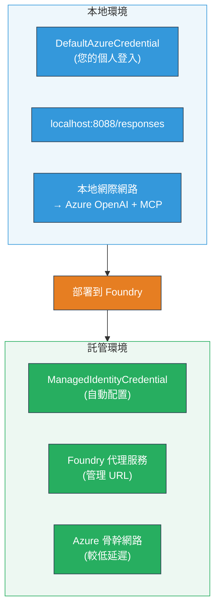

# 模組 7 - 在 Playground 中驗證

在本模組中，您將在 **VS Code** 和 **[Foundry Portal](https://ai.azure.com)** 兩個環境中測試已部署的多代理工作流程，確認代理的行為與本地測試一致。

---

## 為什麼部署後還要驗證？

您的多代理工作流程在本地運行得非常順利，那為什麼還要再測試一次？主機環境在多個方面與本地不同：


| 差異 | 本地 | 主機環境 |
|-----------|-------|--------|
| <strong>身分驗證</strong> | [`DefaultAzureCredential`](https://learn.microsoft.com/azure/developer/python/sdk/authentication/credential-chains#defaultazurecredential-overview)（您的個人登入） | [`ManagedIdentityCredential`](https://learn.microsoft.com/python/api/overview/azure/identity-readme#managed-identity-support)（自動配置） |
| <strong>端點</strong> | `http://localhost:8088/responses` | [Foundry Agent Service](https://learn.microsoft.com/azure/foundry/agents/concepts/hosted-agents) 端點（受管理的 URL） |
| <strong>網路</strong> | 本地機器 → Azure OpenAI + MCP 外送 | Azure 骨幹網路（服務間延遲較低） |
| **MCP 連線** | 本地網路→ `learn.microsoft.com/api/mcp` | 容器外送 → `learn.microsoft.com/api/mcp` |

若有任何環境變數設定錯誤、RBAC 權限不同或 MCP 出站被阻擋，您都會在這裡發現。

---

## 選項 A：在 VS Code Playground 中測試（建議先使用）

[Foundry 延伸套件](https://marketplace.visualstudio.com/items?itemName=TeamsDevApp.vscode-ai-foundry)內建有一個 Playground，可讓您在不離開 VS Code 的情況下與已部署的代理對話。

### 步驟 1：導覽到您已託管的代理

1. 點擊 VS Code <strong>活動列</strong>（左側側邊欄）的 **Microsoft Foundry** 圖示開啟 Foundry 面板。
2. 展開已連線的專案（例如 `workshop-agents`）。
3. 展開 **Hosted Agents (Preview)**。
4. 您應該可以看到您的代理名稱（例如 `resume-job-fit-evaluator`）。

### 步驟 2：選擇一個版本

1. 點擊代理名稱以展開版本列表。
2. 點擊您已部署的版本（例如 `v1`）。
3. 會開啟一個 <strong>詳細面板</strong>，顯示容器詳情。
4. 確認狀態為 **Started** 或 **Running**。

### 步驟 3：開啟 Playground

1. 在詳細面板中，點擊 **Playground** 按鈕（或右鍵版本 → **Open in Playground**）。
2. 在 VS Code 分頁中會開啟聊天介面。

### 步驟 4：執行冒煙測試

使用 [模組 5](05-test-locally.md) 中相同的 3 個測試。在 Playground 輸入框中輸入每則訊息，按下 **Send**（或 **Enter**）。

#### 測試 1 - 完整履歷 + JD（標準流程）

貼上模組 5，測試 1 的完整履歷與 JD 提示（Jane Doe + Contoso Ltd 高級雲端工程師）。

**預期結果:**
- 配適分數與數學拆解（100 分制）
- 匹配技能清單
- 缺少技能清單
- <strong>每個缺技能會有一張差距卡片</strong>，包含 Microsoft Learn 連結
- 學習路線圖與時程表

#### 測試 2 - 快速簡短測試（最小輸入）

```
RESUME: 3 years Python developer, knows Django and PostgreSQL, no cloud experience.

JOB: Cloud DevOps Engineer requiring AWS, Kubernetes, Terraform, CI/CD. 5 years needed.
```

**預期結果:**
- 配適分數較低（< 40）
- 誠實評估與分階段學習路徑
- 多張差距卡（AWS、Kubernetes、Terraform、CI/CD、經驗差距）

#### 測試 3 - 高度配適候選人

```
RESUME:
10 years Azure Cloud Architect. AZ-305 certified. Expert in AKS, Terraform, Azure DevOps, 
Azure Functions, Helm, Prometheus, Grafana, Python, Go. Led platform team of 8.

JOB:
Senior Cloud Engineer. Required: AKS, Terraform, Azure DevOps, Python. Preferred: Helm, Go.
5+ years experience. AZ-305 preferred.
```

**預期結果:**
- 高配適分數（≥ 80）
- 著重面試準備與提升
- 少量或無差距卡
- 短期且專注於準備的時程

### 步驟 5：與本地結果比對

開啟您於模組 5 儲存本地回應的筆記或瀏覽器分頁。針對每個測試：

- 回應是否有<strong>相同的結構</strong>（配適分數、差距卡、路線圖）？
- 是否遵循<strong>相同的評分規範</strong>（100 分拆解）？
- 差距卡中的 **Microsoft Learn URL** 是否仍保留？
- 是否為<strong>每個缺技能一張差距卡</strong>（沒有合併或截斷）？

> <strong>略微的措辭差異是正常的</strong> - 模型非決定性。請專注於結構、評分一致性及 MCP 工具使用。

---

## 選項 B：在 Foundry Portal 中測試

[Foundry Portal](https://ai.azure.com) 提供基於網頁的 playground，方便與團隊或利益關係人分享。

### 步驟 1：開啟 Foundry Portal

1. 打開瀏覽器並導覽至 [https://ai.azure.com](https://ai.azure.com)。
2. 使用您整個工作坊期間使用的相同 Azure 帳號登入。

### 步驟 2：導覽到您的專案

1. 在主頁左側邊欄尋找 <strong>近期專案</strong>。
2. 點擊您的專案名稱（例如 `workshop-agents`）。
3. 如果沒看到，點 <strong>所有專案</strong> 並搜尋。

### 步驟 3：找到已部署的代理

1. 在專案左側導覽列中，點擊 <strong>建置</strong> → <strong>代理</strong>（或尋找 <strong>代理</strong> 區段）。
2. 您應看到代理列表。找到您已部署的代理（例如 `resume-job-fit-evaluator`）。
3. 點擊代理名稱開啟詳細頁面。

### 步驟 4：開啟 Playground

1. 在代理詳細頁上方工具列尋找。
2. 點擊 **Open in playground**（或 **Try in playground**）。
3. 會開啟聊天介面。

### 步驟 5：執行相同的冒煙測試

重覆 VS Code Playground 區段中所有 3 項測試。將每個回應與本地結果（模組 5）與 VS Code Playground 結果（上述選項 A）比較。

---

## 多代理特定驗證

除了基本正確性外，請驗證以下多代理特有行為：

### MCP 工具執行

| 檢查項目 | 如何驗證 | 通過條件 |
|-------|---------------|----------------|
| MCP 呼叫成功 | 差距卡含有 `learn.microsoft.com` 連結 | 真實 URL，非回退訊息 |
| 多次 MCP 呼叫 | 每個高/中優先差距都有資源 | 不只有第一張差距卡 |
| MCP 回退機制有效 | 若 URL 缺失，檢查回退文字 | 代理仍產生差距卡（有無 URL 均可） |

### 代理協調

| 檢查項目 | 如何驗證 | 通過條件 |
|-------|---------------|----------------|
| 4 個代理均執行 | 輸出含配適分及差距卡 | 配適分來自 MatchingAgent，卡片來自 GapAnalyzer |
| 平行分支執行 | 回應時間合理（< 2 分） | > 3 分表示平行不正常 |
| 資料流完整 | 差距卡引用配對報告中的技能 | 無不存在 JD 的幻覺技能 |

---

## 驗證評分標準

使用此評分標準來評估多代理工作流程的主機行為：

| # | 評估項目 | 通過條件 | 通過？ |
|---|----------|---------------|-------|
| 1 | <strong>功能正確性</strong> | 代理回應履歷 + JD，包含配適分與差距分析 | |
| 2 | <strong>評分一致性</strong> | 配適分採 100 分制並有拆解數學 | |
| 3 | <strong>差距卡完整性</strong> | 每個缺技能有卡片（不截斷或合併） | |
| 4 | **MCP 工具整合度** | 差距卡含真實 Microsoft Learn URL | |
| 5 | <strong>結構一致性</strong> | 本地與主機輸出結構相符 | |
| 6 | <strong>回應時間</strong> | 主機代理回應完整評估不超過 2 分鐘 | |
| 7 | <strong>無錯誤</strong> | 無 HTTP 500、逾時或空回應 | |

> 「通過」意指三個冒煙測試中，至少在一個 Playground（VS Code 或 Portal）中符合所有 7 項條件。

---

## Playground 問題排除

| 症狀 | 可能原因 | 解決方法 |
|---------|-------------|-----|
| Playground 無法載入 | 容器狀態非「Started」 | 回到 [模組 6](06-deploy-to-foundry.md)，確認部署狀態。若「Pending」請稍待 |
| 代理回傳空回應 | 模型部署名稱錯誤 | 檢查 `agent.yaml` → `environment_variables` → `MODEL_DEPLOYMENT_NAME` 是否與部署模型一致 |
| 代理回傳錯誤訊息 | 欠缺 [RBAC](https://learn.microsoft.com/azure/foundry/concepts/rbac-foundry) 權限 | 在專案範圍指派 **[Azure AI User](https://aka.ms/foundry-ext-project-role)** 角色 |
| 差距卡無 Microsoft Learn URL | MCP 出站被封鎖或 MCP 伺服器不可用 | 檢查容器是否能連至 `learn.microsoft.com`。詳見 [模組 8](08-troubleshooting.md) |
| 只有一張差距卡（被截斷） | GapAnalyzer 說明缺少「CRITICAL」區塊 | 複習 [模組 3，步驟 2.4](03-configure-agents.md) |
| 配適分與本地大相逕庭 | 部署了不同模型或指令 | 比對 `agent.yaml` env 變數與本地 `.env` 檔。必要時重新部署 |
| Portal 顯示「找不到代理」 | 部署尚在傳播或失敗 | 等待 2 分鐘並重新整理。仍找不到則從 [模組 6](06-deploy-to-foundry.md) 重新部署 |

---

### 核對點

- [ ] 已在 VS Code Playground 測試代理 - 三個冒煙測試皆通過
- [ ] 已在 [Foundry Portal](https://ai.azure.com) Playground 測試代理 - 三個冒煙測試皆通過
- [ ] 回應結構與本地測試一致（配適分、差距卡、路線圖）
- [ ] 差距卡含 Microsoft Learn URL（MCP 工具於主機環境正常運作）
- [ ] 每個缺技能都有一張差距卡（無截斷）
- [ ] 測試期間無錯誤或逾時
- [ ] 完成驗證評分標準（所有 7 項條件均通過）

---

**上一章：** [06 - Deploy to Foundry](06-deploy-to-foundry.md) · **下一章：** [08 - Troubleshooting →](08-troubleshooting.md)

---

<!-- CO-OP TRANSLATOR DISCLAIMER START -->
**免責聲明**：
本文件使用 AI 翻譯服務 [Co-op Translator](https://github.com/Azure/co-op-translator) 進行翻譯。雖然我們力求準確，但請注意自動翻譯可能包含錯誤或不準確之處。原始文件的母語版本應被視為權威來源。對於關鍵資訊，建議尋求專業人工翻譯。我們不對因使用此翻譯而產生的任何誤解或誤譯負責。
<!-- CO-OP TRANSLATOR DISCLAIMER END -->