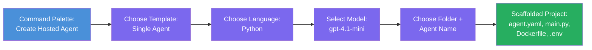

# Module 3 - Create a New Hosted Agent (Auto-Scaffolded by Foundry Extension)

In this module, you use the Microsoft Foundry extension to **scaffold a new [hosted agent](https://learn.microsoft.com/azure/foundry/agents/concepts/hosted-agents) project**. The extension generates the entire project structure for you - including `agent.yaml`, `main.py`, `Dockerfile`, `requirements.txt`, a `.env` file, and a VS Code debug configuration. After scaffolding, you customize these files with your agent's instructions, tools, and configuration.

> **Key concept:** The `agent/` folder in this lab is an example of what the Foundry extension generates when you run this scaffold command. You don't write these files from scratch - the extension creates them, and then you modify them.

### Scaffold wizard flow



---

## Step 1: Open the Create Hosted Agent wizard

1. Press `Ctrl+Shift+P` to open the **Command Palette**.
2. Type: **Microsoft Foundry: Create a New Hosted Agent** and select it.
3. The hosted agent creation wizard opens.

> **Alternative path:** You can also reach this wizard from the Microsoft Foundry sidebar → click the **+** icon next to **Agents** or right-click and select **Create New Hosted Agent**.

---

## Step 2: Choose your template

The wizard asks you to select a template. You'll see options like:

| Template | Description | When to use |
|----------|-------------|-------------|
| **Single Agent** | One agent with its own model, instructions, and optional tools | This workshop (Lab 01) |
| **Multi-Agent Workflow** | Multiple agents that collaborate in sequence | Lab 02 |

1. Select **Single Agent**.
2. Click **Next** (or the selection proceeds automatically).

---

## Step 3: Choose programming language

1. Select **Python** (recommended for this workshop).
2. Click **Next**.

> **C# is also supported** if you prefer .NET. The scaffold structure is similar (uses `Program.cs` instead of `main.py`).

---

## Step 4: Select your model

1. The wizard shows the models deployed in your Foundry project (from Module 2).
2. Select the model you deployed - e.g., **gpt-4.1-mini**.
3. Click **Next**.

> If you don't see any models, go back to [Module 2](02-create-foundry-project.md) and deploy one first.

---

## Step 5: Choose folder location and agent name

1. A file dialog opens - choose a **target folder** where the project will be created. For this workshop:
   - If starting fresh: choose any folder (e.g., `C:\Projects\my-agent`)
   - If working within the workshop repo: create a new subfolder under `workshop/lab01-single-agent/agent/`
2. Enter a **name** for the hosted agent (e.g., `executive-summary-agent` or `my-first-agent`).
3. Click **Create** (or press Enter).

---

## Step 6: Wait for scaffolding to complete

1. VS Code opens a **new window** with the scaffolded project.
2. Wait a few seconds for the project to fully load.
3. You should see the following files in the Explorer panel (`Ctrl+Shift+E`):

```
📂 my-first-agent/
├── .env                ← Environment variables (auto-generated with placeholders)
├── .vscode/
│   └── launch.json     ← Debug configuration (F5 to run + Agent Inspector)
├── agent.yaml          ← Agent definition (kind: hosted)
├── Dockerfile          ← Container configuration for deployment
├── main.py             ← Agent entry point (your main code file)
└── requirements.txt    ← Python dependencies
```

> **This is the same structure as the `agent/` folder** in this lab. The Foundry extension generates these files automatically - you don't need to create them manually.

> **Workshop note:** In this workshop repository, the `.vscode/` folder is at the **workspace root** (not inside each project). It contains a shared `launch.json` and `tasks.json` with two debug configurations - **"Lab01 - Single Agent"** and **"Lab02 - Multi-Agent"** - each pointing to the correct lab's `cwd`. When you press F5, select the configuration matching the lab you're working on from the dropdown.

---

## Step 7: Understand each generated file

Take a moment to inspect each file the wizard created. Understanding them is important for Module 4 (customization).

### 7.1 `agent.yaml` - Agent definition

Open `agent.yaml`. It looks like this:

```yaml
# yaml-language-server: $schema=https://raw.githubusercontent.com/microsoft/AgentSchema/refs/heads/main/schemas/v1.0/ContainerAgent.yaml

kind: hosted
name: my-first-agent
description: >
  A hosted agent deployed to Microsoft Foundry Agent Service.
metadata:
  authors:
    - Microsoft
  tags:
    - Azure AI AgentServer
    - Microsoft Agent Framework
    - Hosted Agent
protocols:
  - protocol: responses
    version: v1
environment_variables:
  - name: AZURE_AI_PROJECT_ENDPOINT
    value: ${PROJECT_ENDPOINT}
  - name: AZURE_AI_MODEL_DEPLOYMENT_NAME
    value: ${MODEL_DEPLOYMENT_NAME}
dockerfile_path: Dockerfile
resources:
  cpu: '0.25'
  memory: 0.5Gi
```

**Key fields:**

| Field | Purpose |
|-------|---------|
| `kind: hosted` | Declares this is a hosted agent (container-based, deployed to [Foundry Agent Service](https://learn.microsoft.com/azure/foundry/agents/overview)) |
| `protocols: responses v1` | The agent exposes the OpenAI-compatible `/responses` HTTP endpoint |
| `environment_variables` | Maps `.env` values to container env vars at deployment time |
| `dockerfile_path` | Points to the Dockerfile used to build the container image |
| `resources` | CPU and memory allocation for the container (0.25 CPU, 0.5Gi memory) |

### 7.2 `main.py` - Agent entry point

Open `main.py`. This is the main Python file where your agent logic lives. The scaffold includes:

```python
from agent_framework.azure import AzureAIAgentClient
from azure.ai.agentserver.agentframework import from_agent_framework
from azure.identity.aio import DefaultAzureCredential
```

**Key imports:**

| Import | Purpose |
|--------|--------|
| `AzureAIAgentClient` | Connects to your Foundry project and creates agents via `.as_agent()` |
| [`DefaultAzureCredential`](https://learn.microsoft.com/azure/developer/python/sdk/authentication/credential-chains#defaultazurecredential-overview) | Handles authentication (Azure CLI, VS Code sign-in, managed identity, or service principal) |
| `from_agent_framework` | Wraps the agent as an HTTP server exposing the `/responses` endpoint |

The main flow is:
1. Create a credential → create a client → call `.as_agent()` to get an agent (async context manager) → wrap it as a server → run

### 7.3 `Dockerfile` - Container image

```dockerfile
FROM python:3.14-slim

WORKDIR /app

COPY ./ .

RUN pip install --upgrade pip && \
    if [ -f requirements.txt ]; then \
        pip install -r requirements.txt; \
    else \
        echo "No requirements.txt found" >&2; exit 1; \
    fi

EXPOSE 8088

CMD ["python", "main.py"]
```

**Key details:**
- Uses `python:3.14-slim` as the base image.
- Copies all project files into `/app`.
- Upgrades `pip`, installs dependencies from `requirements.txt`, and fails fast if that file is missing.
- **Exposes port 8088** - this is the required port for hosted agents. Do not change it.
- Starts the agent with `python main.py`.

### 7.4 `requirements.txt` - Dependencies

```
agent-framework-azure-ai==1.0.0rc3
agent-framework-core==1.0.0rc3
azure-ai-agentserver-agentframework==1.0.0b16
azure-ai-agentserver-core==1.0.0b16
debugpy
agent-dev-cli
```

| Package | Purpose |
|---------|---------|
| `agent-framework-azure-ai` | Azure AI integration for the Microsoft Agent Framework |
| `agent-framework-core` | Core runtime for building agents (includes `python-dotenv`) |
| `azure-ai-agentserver-agentframework` | Hosted agent server runtime for Foundry Agent Service |
| `azure-ai-agentserver-core` | Core agent server abstractions |
| `debugpy` | Python debugging support (allows F5 debugging in VS Code) |
| `agent-dev-cli` | Local development CLI for testing agents (used by the debug/run configuration) |

---

## Understanding the agent protocol

Hosted agents communicate via the **OpenAI Responses API** protocol. When running (locally or in the cloud), the agent exposes a single HTTP endpoint:

```
POST http://localhost:8088/responses
Content-Type: application/json

{
  "input": "Your prompt here",
  "stream": false
}
```

The Foundry Agent Service calls this endpoint to send user prompts and receive agent responses. This is the same protocol used by the OpenAI API, so your agent is compatible with any client that speaks the OpenAI Responses format.

---

### Checkpoint

- [ ] The scaffold wizard completed successfully and a **new VS Code window** opened
- [ ] You can see all 5 files: `agent.yaml`, `main.py`, `Dockerfile`, `requirements.txt`, `.env`
- [ ] The `.vscode/launch.json` file exists (enables F5 debugging - in this workshop it's at the workspace root with lab-specific configs)
- [ ] You've read through each file and understand its purpose
- [ ] You understand that port `8088` is required and the `/responses` endpoint is the protocol

---

**Previous:** [02 - Create Foundry Project](02-create-foundry-project.md) · **Next:** [04 - Configure & Code →](04-configure-and-code.md)
