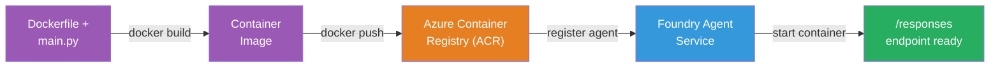
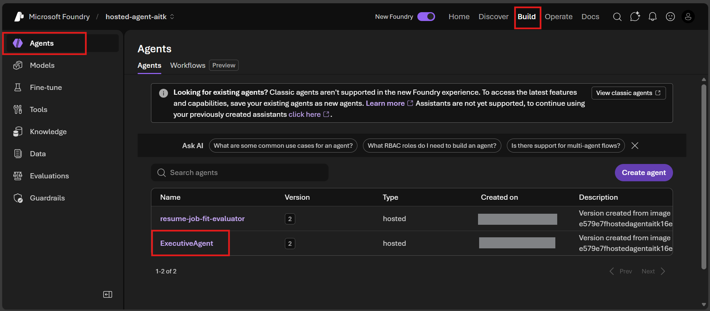

# Module 6 - Deploy to Foundry Agent Service

In this module, you deploy your locally-tested agent to Microsoft Foundry as a [**Hosted Agent**](https://learn.microsoft.com/azure/foundry/agents/concepts/hosted-agents). The deployment process builds a Docker container image from your project, pushes it to [Azure Container Registry (ACR)](https://learn.microsoft.com/azure/container-registry/container-registry-intro), and creates a hosted agent version in [Foundry Agent Service](https://learn.microsoft.com/azure/foundry/agents/overview).

### Deployment pipeline



---

## Prerequisites check

Before deploying, verify every item below. Skipping these is the most common cause of deployment failures.

1. **Agent passes local smoke tests:**
   - You completed all 4 tests in [Module 5](05-test-locally.md) and the agent responded correctly.

2. **You have [Azure AI User](https://learn.microsoft.com/azure/foundry/concepts/rbac-foundry#built-in-roles) role:**
   - This was assigned in [Module 2, Step 3](02-create-foundry-project.md). If you're unsure, verify now:
   - Azure Portal → your Foundry **project** resource → **Access control (IAM)** → **Role assignments** tab → search for your name → confirm **Azure AI User** is listed.

3. **You're signed into Azure in VS Code:**
   - Check the Accounts icon in the bottom-left of VS Code. Your account name should be visible.

4. **(Optional) Docker Desktop is running:**
   - Docker is only needed if the Foundry extension prompts you for a local build. In most cases, the extension handles container builds automatically during deployment.
   - If you have Docker installed, verify it's running: `docker info`

---

## Step 1: Start the deployment

You have two ways to deploy - both lead to the same result.

### Option A: Deploy from the Agent Inspector (recommended)

If you're running the agent with the debugger (F5) and the Agent Inspector is open:

1. Look at the **top-right corner** of the Agent Inspector panel.
2. Click the **Deploy** button (cloud icon with an up arrow ↑).
3. The deployment wizard opens.

### Option B: Deploy from the Command Palette

1. Press `Ctrl+Shift+P` to open the **Command Palette**.
2. Type: **Microsoft Foundry: Deploy Hosted Agent** and select it.
3. The deployment wizard opens.

---

## Step 2: Configure the deployment

The deployment wizard walks you through configuration. Fill in each prompt:

### 2.1 Select the target project

1. A dropdown shows your Foundry projects.
2. Select the project you created in Module 2 (e.g., `workshop-agents`).

### 2.2 Select the container agent file

1. You'll be asked to select the agent entry point.
2. Choose **`main.py`** (Python) - this is the file the wizard uses to identify your agent project.

### 2.3 Configure resources

| Setting | Recommended value | Notes |
|---------|------------------|-------|
| **CPU** | `0.25` | Default, sufficient for workshop. Increase for production workloads |
| **Memory** | `0.5Gi` | Default, sufficient for workshop |

These match the values in `agent.yaml`. You can accept the defaults.

---

## Step 3: Confirm and deploy

1. The wizard shows a deployment summary with:
   - Target project name
   - Agent name (from `agent.yaml`)
   - Container file and resources
2. Review the summary and click **Confirm and Deploy** (or **Deploy**).
3. Watch the progress in VS Code.

### What happens during deployment (step by step)

The deployment is a multi-step process. Watch the VS Code **Output** panel (select "Microsoft Foundry" from the dropdown) to follow along:

1. **Docker build** - VS Code builds a Docker container image from your `Dockerfile`. You'll see Docker layer messages:
   ```
   Step 1/6 : FROM python:<version>-slim
   Step 2/6 : WORKDIR /app
   ...
   Successfully built abc123def456
   ```

2. **Docker push** - The image is pushed to the **Azure Container Registry (ACR)** associated with your Foundry project. This may take 1-3 minutes on the first deploy (the base image is >100MB).

3. **Agent registration** - Foundry Agent Service creates a new hosted agent (or a new version if the agent already exists). The agent metadata from `agent.yaml` is used.

4. **Container start** - The container starts in Foundry's managed infrastructure. The platform assigns a [system-managed identity](https://learn.microsoft.com/azure/foundry/agents/concepts/agent-identity) and exposes the `/responses` endpoint.

> **First deployment is slower** (Docker needs to push all layers). Subsequent deployments are faster because Docker caches unchanged layers.

---

## Step 4: Verify the deployment status

After the deployment command completes:

1. Open the **Microsoft Foundry** sidebar by clicking the Foundry icon in the Activity Bar.
2. Expand the **Hosted Agents (Preview)** section under your project.
3. You should see your agent name (e.g., `ExecutiveAgent` or the name from `agent.yaml`).
4. **Click on the agent name** to expand it.
5. You'll see one or more **versions** (e.g., `v1`).
6. Click on the version to see **Container Details**.
7. Check the **Status** field:

   | Status | Meaning |
   |--------|---------|
   | **Started** or **Running** | The container is running and the agent is ready |
   | **Pending** | Container is starting up (wait 30-60 seconds) |
   | **Failed** | Container failed to start (check logs - see troubleshooting below) |



> **If you see "Pending" for more than 2 minutes:** The container may be pulling the base image. Wait a bit longer. If it stays pending, check the container logs.

---

## Common deployment errors and fixes

### Error 1: Permission denied - `agents/write`

```
Error: lacks the required data action 
Microsoft.CognitiveServices/accounts/AIServices/agents/write 
to perform POST /api/projects/{projectName}/assistants operation.
```

**Root cause:** You don't have the `Azure AI User` role at the **project** level.

**Fix step by step:**

1. Open [https://portal.azure.com](https://portal.azure.com).
2. In the search bar, type your Foundry **project** name and click on it.
   - **Critical:** Make sure you navigate to the **project** resource (type: "Microsoft Foundry project"), NOT the parent account/hub resource.
3. In the left navigation, click **Access control (IAM)**.
4. Click **+ Add** → **Add role assignment**.
5. In the **Role** tab, search for [**Azure AI User**](https://learn.microsoft.com/azure/foundry/concepts/rbac-foundry#built-in-roles) and select it. Click **Next**.
6. In the **Members** tab, select **User, group, or service principal**.
7. Click **+ Select members**, search for your name/email, select yourself, click **Select**.
8. Click **Review + assign** → **Review + assign** again.
9. Wait 1-2 minutes for the role assignment to propagate.
10. **Retry the deployment** from Step 1.

> The role must be at the **project** scope, not just the account scope. This is the #1 most common cause of deployment failures.

### Error 2: Docker not running

```
Error: Docker build failed / Cannot connect to Docker daemon
```

**Fix:**
1. Start Docker Desktop (find it in your Start menu or system tray).
2. Wait for it to show "Docker Desktop is running" (30-60 seconds).
3. Verify: `docker info` in a terminal.
4. **Windows specific:** Ensure WSL 2 backend is enabled in Docker Desktop settings → **General** → **Use the WSL 2 based engine**.
5. Retry the deployment.

### Error 3: ACR authorization - `AcrPullUnauthorized`

```
Error: AcrPullUnauthorized
```

**Root cause:** The Foundry project's managed identity doesn't have pull access to the container registry.

**Fix:**
1. In Azure Portal, navigate to your **[Container Registry](https://learn.microsoft.com/azure/container-registry/container-registry-intro)** (it's in the same resource group as your Foundry project).
2. Go to **Access control (IAM)** → **Add** → **Add role assignment**.
3. Select **[AcrPull](https://learn.microsoft.com/azure/container-registry/container-registry-roles)** role.
4. Under Members, select **Managed identity** → find the Foundry project's managed identity.
5. **Review + assign**.

> This is usually set up automatically by the Foundry extension. If you see this error, it may indicate the automatic setup failed.

### Error 4: Container platform mismatch (Apple Silicon)

If deploying from an Apple Silicon Mac (M1/M2/M3), the container must be built for `linux/amd64`:

```bash
docker build --platform linux/amd64 -t myagent:v1 .
```

> The Foundry extension handles this automatically for most users.

---

### Checkpoint

- [ ] Deployment command completed without errors in VS Code
- [ ] Agent appears under **Hosted Agents (Preview)** in the Foundry sidebar
- [ ] You clicked on the agent → selected a version → saw **Container Details**
- [ ] Container status shows **Started** or **Running**
- [ ] (If errors occurred) You identified the error, applied the fix, and redeployed successfully

---

**Previous:** [05 - Test Locally](05-test-locally.md) · **Next:** [07 - Verify in Playground →](07-verify-in-playground.md)
