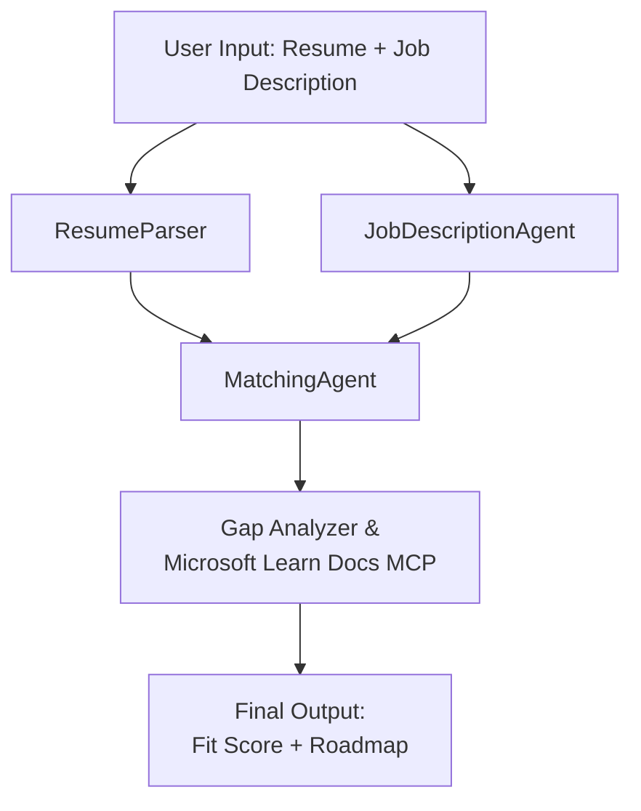

# PersonalCareerCopilot - Resume → Job Fit Evaluator

A multi-agent workflow that evaluates how well a resume matches a job description, then generates a personalized learning roadmap to close the gaps.

---

## Agents

| Agent | Role | Tools |
|-------|------|-------|
| **ResumeParser** | Extracts structured skills, experience, certifications from resume text | - |
| **JobDescriptionAgent** | Extracts required/preferred skills, experience, certifications from a JD | - |
| **MatchingAgent** | Compares profile vs requirements → fit score (0-100) + matched/missing skills | - |
| **GapAnalyzer** | Builds a personalized learning roadmap with Microsoft Learn resources | `search_microsoft_learn_for_plan` (MCP) |

## Workflow



---

## Quick start

### 1. Set up environment

```powershell
cd workshop\lab02-multi-agent\PersonalCareerCopilot
python -m venv .venv
.\.venv\Scripts\Activate.ps1          # Windows PowerShell
# source .venv/bin/activate            # macOS / Linux
pip install -r requirements.txt
```

### 2. Configure credentials

Copy the example env file and fill in your Foundry project details:

```powershell
cp .env.example .env
```

Edit `.env`:

```env
PROJECT_ENDPOINT=https://<your-account>.services.ai.azure.com/api/projects/<your-project>
MODEL_DEPLOYMENT_NAME=gpt-4.1-mini
```

| Value | Where to find it |
|-------|-----------------|
| `PROJECT_ENDPOINT` | Microsoft Foundry sidebar in VS Code → right-click your project → **Copy Project Endpoint** |
| `MODEL_DEPLOYMENT_NAME` | Foundry sidebar → expand project → **Models + endpoints** → deployment name |

### 3. Run locally

```powershell
python -m debugpy --listen 127.0.0.1:5679 -m agentdev run main.py --verbose --port 8088
```

Or use the VS Code task: `Ctrl+Shift+P` → **Tasks: Run Task** → **Run Lab02 HTTP Server**.

### 4. Test with Agent Inspector

Open Agent Inspector: `Ctrl+Shift+P` → **Foundry Toolkit: Open Agent Inspector**.

Paste this test prompt:

```
Resume:
Jane Doe
Senior Software Engineer with 5 years of experience in Python, Django, and AWS.
Built microservices handling 10K+ requests/second. Led a team of 4 developers.
Certifications: AWS Solutions Architect Associate.
Education: B.S. Computer Science, State University.

Job Description:
Senior Cloud Engineer at Contoso Ltd.
Required: Python, Azure, Kubernetes, Terraform, CI/CD pipelines.
Preferred: Go, monitoring (Prometheus/Grafana), cost optimization.
Experience: 5+ years in cloud infrastructure.
Certifications: Azure Solutions Architect Expert preferred.
```

**Expected:** A fit score (0-100), matched/missing skills, and a personalized learning roadmap with Microsoft Learn URLs.

### 5. Deploy to Foundry

`Ctrl+Shift+P` → **Microsoft Foundry: Deploy Hosted Agent** → select your project → confirm.

---

## Project structure

```
PersonalCareerCopilot/
├── .env.example        ← Template for environment variables
├── .env                ← Your credentials (git-ignored)
├── agent.yaml          ← Hosted agent definition (name, resources, env vars)
├── Dockerfile          ← Container image for Foundry deployment
├── main.py             ← 4-agent workflow (instructions, MCP tool, WorkflowBuilder)
└── requirements.txt    ← Python dependencies
```

## Key files

### `agent.yaml`

Defines the hosted agent for Foundry Agent Service:
- `kind: hosted` - runs as a managed container
- `protocols: [responses v1]` - exposes the `/responses` HTTP endpoint
- `environment_variables` - `PROJECT_ENDPOINT` and `MODEL_DEPLOYMENT_NAME` are injected at deploy time

### `main.py`

Contains:
- **Agent instructions** - four `*_INSTRUCTIONS` constants, one per agent
- **MCP tool** - `search_microsoft_learn_for_plan()` calls `https://learn.microsoft.com/api/mcp` via Streamable HTTP
- **Agent creation** - `create_agents()` context manager using `AzureAIAgentClient.as_agent()`
- **Workflow graph** - `create_workflow()` uses `WorkflowBuilder` to wire agents with fan-out/fan-in/sequential patterns
- **Server startup** - `from_agent_framework(agent).run_async()` on port 8088

### `requirements.txt`

| Package | Version | Purpose |
|---------|---------|---------|
| `agent-framework-azure-ai` | `1.0.0rc3` | Azure AI integration for Microsoft Agent Framework |
| `agent-framework-core` | `1.0.0rc3` | Core runtime (includes WorkflowBuilder) |
| `azure-ai-agentserver-agentframework` | `1.0.0b16` | Hosted agent server runtime |
| `azure-ai-agentserver-core` | `1.0.0b16` | Core agent server abstractions |
| `debugpy` | latest | Python debugging (F5 in VS Code) |
| `agent-dev-cli` | `--pre` | Local dev CLI + Agent Inspector backend |

---

## Troubleshooting

| Issue | Fix |
|-------|-----|
| `RuntimeError: Missing required environment variable(s)` | Create `.env` with `PROJECT_ENDPOINT` and `MODEL_DEPLOYMENT_NAME` |
| `ModuleNotFoundError: No module named 'agent_framework'` | Activate venv and run `pip install -r requirements.txt` |
| No Microsoft Learn URLs in output | Check internet connectivity to `https://learn.microsoft.com/api/mcp` |
| Only 1 gap card (truncated) | Verify `GAP_ANALYZER_INSTRUCTIONS` includes the `CRITICAL:` block |
| Port 8088 in use | Stop other servers: `netstat -ano \| findstr :8088` |

For detailed troubleshooting, see [Module 8 - Troubleshooting](../docs/08-troubleshooting.md).

---

**Full walkthrough:** [Lab 02 Docs](../docs/README.md) · **Back to:** [Lab 02 README](../README.md) · [Workshop Home](../../../README.md)
