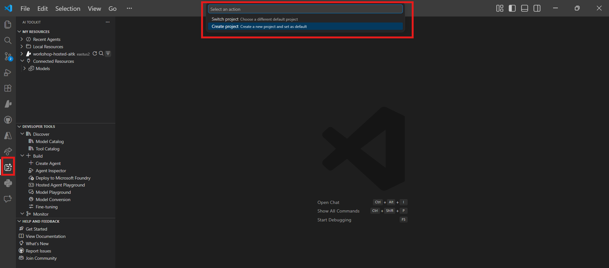

# Module 0 - Prerequisites

Before starting Lab 02, confirm you have the following completed. This lab builds directly on Lab 01 - do not skip it.

---

## 1. Complete Lab 01

Lab 02 assumes you have already:

- [x] Completed all 8 modules of [Lab 01 - Single Agent](../../lab01-single-agent/README.md)
- [x] Successfully deployed a single agent to Foundry Agent Service
- [x] Verified the agent works in both local Agent Inspector and Foundry Playground

If you haven't completed Lab 01, go back and finish it now: [Lab 01 Docs](../../lab01-single-agent/docs/00-prerequisites.md)

---

## 2. Verify existing setup

All tools from Lab 01 should still be installed and working. Run these quick checks:

### 2.1 Azure CLI

```powershell
az account show --query "{name:name, id:id}" --output table
```

Expected: Shows your subscription name and ID. If this fails, run [`az login`](https://learn.microsoft.com/cli/azure/authenticate-azure-cli-interactively).

### 2.2 VS Code extensions

1. Press `Ctrl+Shift+P` → type **"Microsoft Foundry"** → confirm you see commands (e.g., `Microsoft Foundry: Create a New Hosted Agent`).
2. Press `Ctrl+Shift+P` → type **"Foundry Toolkit"** → confirm you see commands (e.g., `Foundry Toolkit: Open Agent Inspector`).

### 2.3 Foundry project & model

1. Click the **Microsoft Foundry** icon in the VS Code Activity Bar.
2. Confirm your project is listed (e.g., `workshop-agents`).
3. Expand the project → verify a deployed model exists (e.g., `gpt-4.1-mini`) with status **Succeeded**.

> **If your model deployment expired:** Some free-tier deployments auto-expire. Redeploy from the [Model Catalog](https://learn.microsoft.com/azure/foundry/foundry-models/concepts/models-sold-directly-by-azure) (`Ctrl+Shift+P` → **Microsoft Foundry: Open Model Catalog**).



### 2.4 RBAC roles

Verify you have **Azure AI User** on your Foundry project:

1. [Azure Portal](https://portal.azure.com) → your Foundry **project** resource → **Access control (IAM)** → **[Role assignments](https://learn.microsoft.com/azure/foundry/concepts/rbac-foundry)** tab.
2. Search for your name → confirm **[Azure AI User](https://aka.ms/foundry-ext-project-role)** is listed.

---

## 3. Understand multi-agent concepts (new for Lab 02)

Lab 02 introduces concepts not covered in Lab 01. Read through these before proceeding:

### 3.1 What is a multi-agent workflow?

Instead of one agent handling everything, a **multi-agent workflow** splits work across multiple specialized agents. Each agent has:

- Its own **instructions** (system prompt)
- Its own **role** (what it's responsible for)
- Optional **tools** (functions it can call)

The agents communicate through an **orchestration graph** that defines how data flows between them.

### 3.2 WorkflowBuilder

The [`WorkflowBuilder`](https://learn.microsoft.com/agent-framework/workflows/agents-in-workflows) class from `agent_framework` is the SDK component that wires agents together:

```python
from agent_framework import WorkflowBuilder

workflow = (
    WorkflowBuilder(
        name="MyWorkflow",
        start_executor=agent_a,
        output_executors=[agent_d],
    )
    .add_edge(agent_a, agent_b)
    .add_edge(agent_a, agent_c)
    .add_edge(agent_b, agent_d)
    .add_edge(agent_c, agent_d)
    .build()
)
```

- **`start_executor`** - The first agent that receives user input
- **`output_executors`** - The agent(s) whose output becomes the final response
- **`add_edge(source, target)`** - Defines that `target` receives `source`'s output

### 3.3 MCP (Model Context Protocol) tools

Lab 02 uses an **MCP tool** that calls the Microsoft Learn API to fetch learning resources. [MCP (Model Context Protocol)](https://modelcontextprotocol.io/introduction) is a standardized protocol for connecting AI models to external data sources and tools.

| Term | Definition |
|------|-----------|
| **MCP server** | A service that exposes tools/resources via the [MCP protocol](https://learn.microsoft.com/azure/foundry/agents/how-to/tools/model-context-protocol) |
| **MCP client** | Your agent code that connects to an MCP server and calls its tools |
| **[Streamable HTTP](https://learn.microsoft.com/agent-framework/agents/tools/hosted-mcp-tools)** | The transport method used to communicate with the MCP server |

### 3.4 How Lab 02 differs from Lab 01

| Aspect | Lab 01 (Single Agent) | Lab 02 (Multi-Agent) |
|--------|----------------------|---------------------|
| Agents | 1 | 4 (specialized roles) |
| Orchestration | None | WorkflowBuilder (parallel + sequential) |
| Tools | Optional `@tool` function | MCP tool (external API call) |
| Complexity | Simple prompt → response | Resume + JD → fit score → roadmap |
| Context flow | Direct | Agent-to-agent handoff |

---

## 4. Workshop repository structure for Lab 02

Make sure you know where the Lab 02 files are:

```
workshop/
└── lab02-multi-agent/
    ├── README.md                       ← Lab overview
    ├── docs/                           ← You are here
    │   ├── README.md                   ← Learning path index
    │   ├── 00-prerequisites.md         ← This file
    │   ├── 01-understand-multi-agent.md
    │   ├── ...
    │   └── 08-troubleshooting.md
    └── PersonalCareerCopilot/          ← The agent project
        ├── agent.yaml                  ← Agent definition
        ├── main.py                     ← 4-agent workflow code
        ├── Dockerfile                  ← Container configuration
        └── requirements.txt            ← Python dependencies
```

---

### Checkpoint

- [ ] Lab 01 is fully completed (all 8 modules, agent deployed and verified)
- [ ] `az account show` returns your subscription
- [ ] Microsoft Foundry and Foundry Toolkit extensions are installed and responding
- [ ] Foundry project has a deployed model (e.g., `gpt-4.1-mini`)
- [ ] You have **Azure AI User** role on the project
- [ ] You've read the multi-agent concepts section above and understand WorkflowBuilder, MCP, and agent orchestration

---

**Next:** [01 - Understand Multi-Agent Architecture →](01-understand-multi-agent.md)
