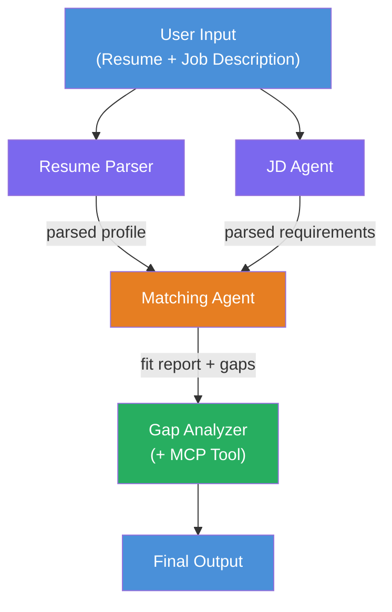
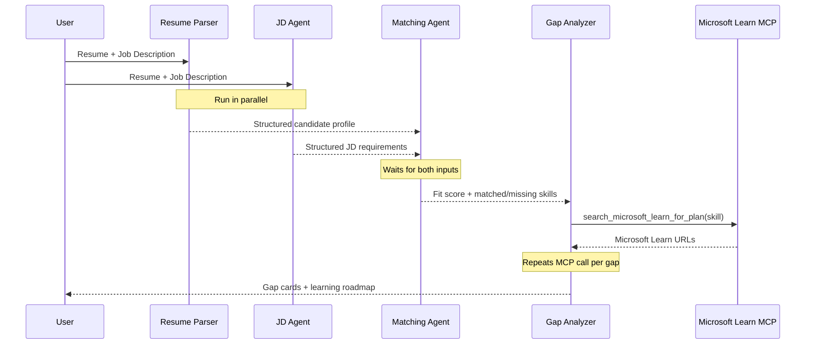
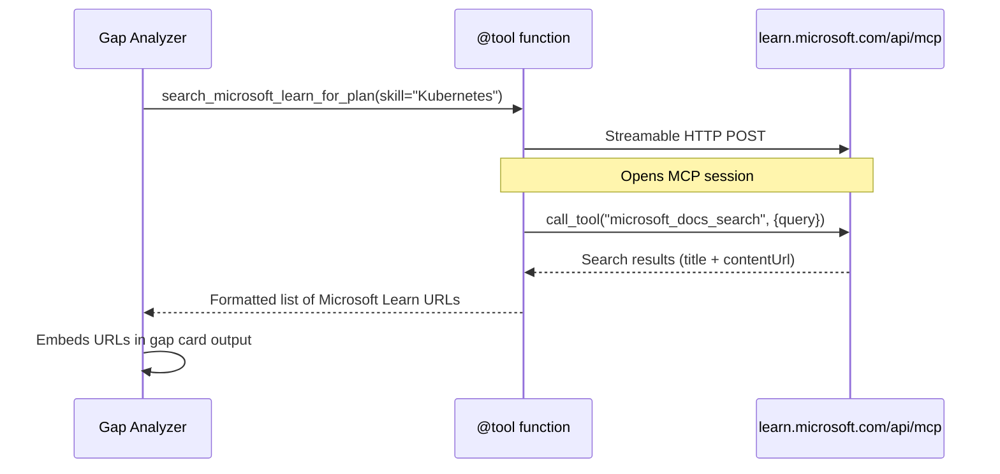

# Module 1 - Understand the Multi-Agent Architecture

In this module, you learn the architecture of the Resume → Job Fit Evaluator before writing any code. Understanding the orchestration graph, agent roles, and data flow is critical for debugging and extending [multi-agent workflows](https://learn.microsoft.com/azure/architecture/ai-ml/idea/multiple-agent-workflow-automation).

---

## The problem this solves

Matching a resume to a job description involves multiple distinct skills:

1. **Parsing** - Extract structured data from unstructured text (resume)
2. **Analysis** - Extract requirements from a job description
3. **Comparison** - Score the alignment between the two
4. **Planning** - Build a learning roadmap to close gaps

A single agent doing all four tasks in one prompt often produces:
- Incomplete extraction (it rushes through parsing to get to the score)
- Shallow scoring (no evidence-based breakdown)
- Generic roadmaps (not tailored to the specific gaps)

By splitting into **four specialized agents**, each one focuses on its task with dedicated instructions, producing higher-quality output at every stage.

---

## The four agents

Each agent is a full [Microsoft Foundry](https://learn.microsoft.com/azure/foundry/agents/concepts/hosted-agents) agent created via `AzureAIAgentClient.as_agent()`. They share the same model deployment but have different instructions and (optionally) different tools.

| # | Agent Name | Role | Input | Output |
|---|-----------|------|-------|--------|
| 1 | **ResumeParser** | Extracts structured profile from resume text | Raw resume text (from user) | Candidate Profile, Technical Skills, Soft Skills, Certifications, Domain Experience, Achievements |
| 2 | **JobDescriptionAgent** | Extracts structured requirements from a JD | Raw JD text (from user, forwarded via ResumeParser) | Role Overview, Required Skills, Preferred Skills, Experience, Certifications, Education, Responsibilities |
| 3 | **MatchingAgent** | Computes evidence-based fit score | Outputs from ResumeParser + JobDescriptionAgent | Fit Score (0-100 with breakdown), Matched Skills, Missing Skills, Gaps |
| 4 | **GapAnalyzer** | Builds personalized learning roadmap | Output from MatchingAgent | Gap cards (per skill), Learning Order, Timeline, Resources from Microsoft Learn |

---

## The orchestration graph

The workflow uses **parallel fan-out** followed by **sequential aggregation**:



> **Legend:** Purple = parallel agents, Orange = aggregation point, Green = final agent with tools

### How data flows



1. **User sends** a message containing a resume and a job description.
2. **ResumeParser** receives the full user input and extracts a structured candidate profile.
3. **JobDescriptionAgent** receives the user input in parallel and extracts structured requirements.
4. **MatchingAgent** receives outputs from **both** ResumeParser and JobDescriptionAgent (the framework waits for both to complete before running MatchingAgent).
5. **GapAnalyzer** receives MatchingAgent's output and calls the **Microsoft Learn MCP tool** to fetch real learning resources for each gap.
6. The **final output** is GapAnalyzer's response, which includes the fit score, gap cards, and a complete learning roadmap.

### Why parallel fan-out matters

ResumeParser and JobDescriptionAgent run **in parallel** because neither depends on the other. This:
- Reduces total latency (both run simultaneously instead of sequentially)
- Is a natural split (parsing resume vs. parsing JD are independent tasks)
- Demonstrates a common multi-agent pattern: **fan-out → aggregate → act**

---

## WorkflowBuilder in code

Here's how the graph above maps to [`WorkflowBuilder`](https://learn.microsoft.com/agent-framework/workflows/agents-in-workflows) API calls in `main.py`:

```python
from agent_framework import WorkflowBuilder

workflow = (
    WorkflowBuilder(
        name="ResumeJobFitEvaluator",
        start_executor=resume_parser,       # First agent to receive user input
        output_executors=[gap_analyzer],     # Final agent whose output is returned
    )
    .add_edge(resume_parser, jd_agent)      # ResumeParser → JobDescriptionAgent
    .add_edge(resume_parser, matching_agent) # ResumeParser → MatchingAgent
    .add_edge(jd_agent, matching_agent)      # JobDescriptionAgent → MatchingAgent
    .add_edge(matching_agent, gap_analyzer)  # MatchingAgent → GapAnalyzer
    .build()
)
```

**Understanding the edges:**

| Edge | What it means |
|------|--------------|
| `resume_parser → jd_agent` | JD Agent receives ResumeParser's output |
| `resume_parser → matching_agent` | MatchingAgent receives ResumeParser's output |
| `jd_agent → matching_agent` | MatchingAgent also receives JD Agent's output (it waits for both) |
| `matching_agent → gap_analyzer` | GapAnalyzer receives MatchingAgent's output |

Because `matching_agent` has **two incoming edges** (`resume_parser` and `jd_agent`), the framework automatically waits for both to complete before running the Matching Agent.

---

## The MCP tool

The GapAnalyzer agent has one tool: `search_microsoft_learn_for_plan`. This is an **[MCP tool](https://learn.microsoft.com/agent-framework/agents/tools/hosted-mcp-tools)** that calls the Microsoft Learn API to fetch curated learning resources.

### How it works

```python
@tool
async def search_microsoft_learn_for_plan(
    skill: str, role: str = "", max_results: int = 5
) -> str:
    """Search Microsoft Learn MCP and return curated official links."""
    # Connects to https://learn.microsoft.com/api/mcp via Streamable HTTP
    # Calls the 'microsoft_docs_search' tool on the MCP server
    # Returns formatted list of Microsoft Learn URLs
```

### MCP call flow



1. GapAnalyzer decides it needs learning resources for a skill (e.g., "Kubernetes")
2. The framework calls `search_microsoft_learn_for_plan(skill="Kubernetes")`
3. The function opens a [Streamable HTTP](https://learn.microsoft.com/agent-framework/agents/tools/hosted-mcp-tools) connection to `https://learn.microsoft.com/api/mcp`
4. It calls the `microsoft_docs_search` tool on the [MCP server](https://learn.microsoft.com/azure/foundry/agents/how-to/tools/model-context-protocol)
5. The MCP server returns search results (title + URL)
6. The function formats the results and returns them as a string
7. GapAnalyzer uses the returned URLs in its gap card output

### Expected MCP logs

When the tool runs, you'll see log entries like:

```
GET https://learn.microsoft.com/api/mcp → 405 (Method Not Allowed)
POST https://learn.microsoft.com/api/mcp → 200
DELETE https://learn.microsoft.com/api/mcp → 405 (Method Not Allowed)
```

**These are normal.** The MCP client probes with GET and DELETE during initialization - those returning 405 is expected behavior. The actual tool call uses POST and returns 200. Only worry if POST calls fail.

---

## Agent creation pattern

Each agent is created using the **[`AzureAIAgentClient.as_agent()`](https://learn.microsoft.com/python/api/overview/azure/ai-agents-readme) async context manager**. This is the Foundry SDK pattern for creating agents that are automatically cleaned up:

```python
async with (
    get_credential() as credential,
    AzureAIAgentClient(
        project_endpoint=PROJECT_ENDPOINT,
        model_deployment_name=MODEL_DEPLOYMENT_NAME,
        credential=credential,
    ).as_agent(
        name="ResumeParser",
        instructions=RESUME_PARSER_INSTRUCTIONS,
    ) as resume_parser,
    # ... repeat for each agent ...
):
    # All 4 agents exist here
    workflow = create_workflow(resume_parser, jd_agent, matching_agent, gap_analyzer)
```

**Key points:**
- Each agent gets its own `AzureAIAgentClient` instance (the SDK requires agent name to be scoped to the client)
- All agents share the same `credential`, `PROJECT_ENDPOINT`, and `MODEL_DEPLOYMENT_NAME`
- The `async with` block ensures all agents are cleaned up when the server shuts down
- The GapAnalyzer additionally receives `tools=[search_microsoft_learn_for_plan]`

---

## Server startup

After creating agents and building the workflow, the server starts:

```python
from azure.ai.agentserver.agentframework import from_agent_framework

agent = create_workflow(resume_parser, jd_agent, matching_agent, gap_analyzer)
await from_agent_framework(agent).run_async()
```

`from_agent_framework()` wraps the workflow as an HTTP server exposing the `/responses` endpoint on port 8088. This is the same pattern as Lab 01, but the "agent" is now the entire [workflow graph](https://learn.microsoft.com/agent-framework/workflows/as-agents).

---

### Checkpoint

- [ ] You understand the 4-agent architecture and each agent's role
- [ ] You can trace the data flow: User → ResumeParser → (parallel) JD Agent + MatchingAgent → GapAnalyzer → Output
- [ ] You understand why MatchingAgent waits for both ResumeParser and JD Agent (two incoming edges)
- [ ] You understand the MCP tool: what it does, how it's called, and that GET 405 logs are normal
- [ ] You understand the `AzureAIAgentClient.as_agent()` pattern and why each agent has its own client instance
- [ ] You can read the `WorkflowBuilder` code and map it to the visual graph

---

**Previous:** [00 - Prerequisites](00-prerequisites.md) · **Next:** [02 - Scaffold the Multi-Agent Project →](02-scaffold-multi-agent.md)
