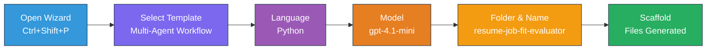
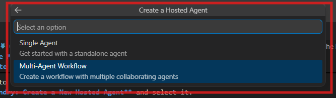

# Module 2 - Scaffold the Multi-Agent Project

In this module, you use the [Microsoft Foundry extension](https://marketplace.visualstudio.com/items?itemName=TeamsDevApp.vscode-ai-foundry) to **scaffold a multi-agent workflow project**. The extension generates the entire project structure - `agent.yaml`, `main.py`, `Dockerfile`, `requirements.txt`, `.env`, and debug configuration. You then customize these files in Modules 3 and 4.

> **Note:** The `PersonalCareerCopilot/` folder in this lab is a complete, working example of a customized multi-agent project. You can either scaffold a fresh project (recommended for learning) or study the existing code directly.

---

## Step 1: Open the Create Hosted Agent wizard



1. Press `Ctrl+Shift+P` to open the **Command Palette**.
2. Type: **Microsoft Foundry: Create a New Hosted Agent** and select it.
3. The hosted agent creation wizard opens.

> **Alternative:** Click the **Microsoft Foundry** icon in the Activity Bar → click the **+** icon next to **Agents** → **Create New Hosted Agent**.

---

## Step 2: Choose the Multi-Agent Workflow template

The wizard asks you to select a template:

| Template | Description | When to use |
|----------|-------------|-------------|
| Single Agent | One agent with instructions and optional tools | Lab 01 |
| **Multi-Agent Workflow** | Multiple agents that collaborate via WorkflowBuilder | **This lab (Lab 02)** |

1. Select **Multi-Agent Workflow**.
2. Click **Next**.



---

## Step 3: Choose programming language

1. Select **Python**.
2. Click **Next**.

---

## Step 4: Select your model

1. The wizard shows models deployed in your Foundry project.
2. Select the same model you used in Lab 01 (e.g., **gpt-4.1-mini**).
3. Click **Next**.

> **Tip:** [`gpt-4.1-mini`](https://learn.microsoft.com/azure/foundry/foundry-models/concepts/models-sold-directly-by-azure#gpt-41-series) is recommended for development - it's fast, cheap, and handles multi-agent workflows well. Switch to `gpt-4.1` for final production deployment if you want higher-quality output.

---

## Step 5: Choose folder location and agent name

1. A file dialog opens. Choose a target folder:
   - If following along with the workshop repo: navigate to `workshop/lab02-multi-agent/` and create a new subfolder
   - If starting fresh: choose any folder
2. Enter a **name** for the hosted agent (e.g., `resume-job-fit-evaluator`).
3. Click **Create**.

---

## Step 6: Wait for scaffolding to complete

1. VS Code opens a new window (or the current window updates) with the scaffolded project.
2. You should see this file structure:

```
resume-job-fit-evaluator/
├── .env                ← Environment variables (placeholders)
├── .vscode/
│   └── launch.json     ← Debug configuration
├── agent.yaml          ← Agent definition (kind: hosted)
├── Dockerfile          ← Container configuration
├── main.py             ← Multi-agent workflow code (scaffold)
└── requirements.txt    ← Python dependencies
```

> **Workshop note:** In the workshop repository, the `.vscode/` folder is at the **workspace root** with shared `launch.json` and `tasks.json`. The debug configurations for Lab 01 and Lab 02 are both included. When you press F5, select **"Lab02 - Multi-Agent"** from the dropdown.

---

## Step 7: Understand the scaffolded files (multi-agent specifics)

The multi-agent scaffold differs from the single-agent scaffold in several key ways:

### 7.1 `agent.yaml` - Agent definition

```yaml
kind: hosted
name: resume-job-fit-evaluator
description: >
  A multi-agent workflow that evaluates resume-to-job fit.
metadata:
  authors:
    - Microsoft
  tags:
    - Multi-Agent Workflow
    - Resume Evaluator
protocols:
  - protocol: responses
    version: v1
environment_variables:
  - name: PROJECT_ENDPOINT
    value: ${PROJECT_ENDPOINT}
  - name: MODEL_DEPLOYMENT_NAME
    value: ${MODEL_DEPLOYMENT_NAME}
```

**Key difference from Lab 01:** The `environment_variables` section may include additional variables for MCP endpoints or other tool configuration. The `name` and `description` reflect the multi-agent use case.

### 7.2 `main.py` - Multi-agent workflow code

The scaffold includes:
- **Multiple agent instruction strings** (one const per agent)
- **Multiple [`AzureAIAgentClient.as_agent()`](https://learn.microsoft.com/python/api/overview/azure/ai-agents-readme) context managers** (one per agent)
- **[`WorkflowBuilder`](https://learn.microsoft.com/agent-framework/workflows/agents-in-workflows)** to wire agents together
- **`from_agent_framework()`** to serve the workflow as an HTTP endpoint

```python
from agent_framework import WorkflowBuilder, tool
from agent_framework.azure import AzureAIAgentClient
from azure.ai.agentserver.agentframework import from_agent_framework
```

The extra import [`WorkflowBuilder`](https://learn.microsoft.com/agent-framework/workflows/agents-in-workflows) is new compared to Lab 01.

### 7.3 `requirements.txt` - Additional dependencies

The multi-agent project uses the same base packages as Lab 01, plus any MCP-related packages:

```
agent-framework-azure-ai==1.0.0rc3
agent-framework-core==1.0.0rc3
azure-ai-agentserver-agentframework==1.0.0b16
azure-ai-agentserver-core==1.0.0b16
debugpy
agent-dev-cli --pre
```

> **Important version note:** The `agent-dev-cli` package requires the `--pre` flag in `requirements.txt` to install the latest preview version. This is required for Agent Inspector compatibility with `agent-framework-core==1.0.0rc3`. See [Module 8 - Troubleshooting](08-troubleshooting.md) for version details.

| Package | Version | Purpose |
|---------|---------|---------|
| [`agent-framework-azure-ai`](https://learn.microsoft.com/agent-framework/overview/) | `1.0.0rc3` | Azure AI integration for [Microsoft Agent Framework](https://github.com/microsoft/agent-framework) |
| [`agent-framework-core`](https://learn.microsoft.com/agent-framework/overview/) | `1.0.0rc3` | Core runtime (includes WorkflowBuilder) |
| `azure-ai-agentserver-agentframework` | `1.0.0b16` | Hosted agent server runtime |
| `azure-ai-agentserver-core` | `1.0.0b16` | Core agent server abstractions |
| `debugpy` | latest | Python debugging (F5 in VS Code) |
| `agent-dev-cli` | `--pre` | Local dev CLI + Agent Inspector backend |

### 7.4 `Dockerfile` - Same as Lab 01

The Dockerfile is identical to Lab 01's - it copies files, installs dependencies from `requirements.txt`, exposes port 8088, and runs `python main.py`.

```dockerfile
FROM python:3.14-slim
WORKDIR /app
COPY ./ .
RUN pip install --upgrade pip && \
    if [ -f requirements.txt ]; then \
        pip install -r requirements.txt; \
    else \
      echo "No requirements.txt found" >&2; exit 1; \
    fi
EXPOSE 8088
CMD ["python", "main.py"]
```

---

### Checkpoint

- [ ] Scaffold wizard completed → new project structure is visible
- [ ] You can see all files: `agent.yaml`, `main.py`, `Dockerfile`, `requirements.txt`, `.env`
- [ ] `main.py` includes `WorkflowBuilder` import (confirms multi-agent template was selected)
- [ ] `requirements.txt` includes both `agent-framework-core` and `agent-framework-azure-ai`
- [ ] You understand how the multi-agent scaffold differs from the single-agent scaffold (multiple agents, WorkflowBuilder, MCP tools)

---

**Previous:** [01 - Understand Multi-Agent Architecture](01-understand-multi-agent.md) · **Next:** [03 - Configure Agents & Environment →](03-configure-agents.md)
