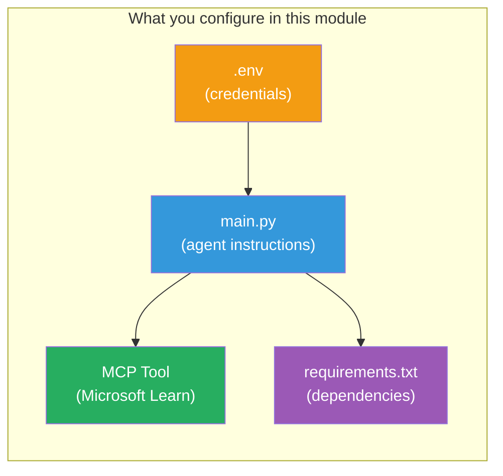

# Module 3 - Configure Agents, MCP Tool & Environment

In this module, you customize the scaffolded multi-agent project. You'll write instructions for all four agents, set up the MCP tool for Microsoft Learn, configure environment variables, and install dependencies.



> **Reference:** The complete working code is in [`PersonalCareerCopilot/main.py`](../PersonalCareerCopilot/main.py). Use it as a reference while building your own.

---

## Step 1: Configure environment variables

1. Open the **`.env`** file in your project root.
2. Fill in your Foundry project details:

   ```env
   PROJECT_ENDPOINT=https://<your-account>.services.ai.azure.com/api/projects/<your-project>
   MODEL_DEPLOYMENT_NAME=gpt-4.1-mini
   ```

3. Save the file.

### Where to find these values

| Value | How to find it |
|-------|---------------|
| **Project endpoint** | Microsoft Foundry sidebar → click your project → endpoint URL in the detail view |
| **Model deployment name** | Foundry sidebar → expand project → **Models + endpoints** → name next to deployed model |

> **Security:** Never commit `.env` to version control. Add it to `.gitignore` if not already there.

### Environment variable mapping

The multi-agent `main.py` reads both standard and workshop-specific env var names:

```python
PROJECT_ENDPOINT = os.getenv("AZURE_AI_PROJECT_ENDPOINT") or os.getenv("PROJECT_ENDPOINT")
MODEL_DEPLOYMENT_NAME = os.getenv(
    "AZURE_AI_MODEL_DEPLOYMENT_NAME",
    os.getenv("MODEL_DEPLOYMENT_NAME", "gpt-4.1-mini"),
)
MICROSOFT_LEARN_MCP_ENDPOINT = os.getenv(
    "MICROSOFT_LEARN_MCP_ENDPOINT", "https://learn.microsoft.com/api/mcp"
)
```

The MCP endpoint has a sensible default - you don't need to set it in `.env` unless you want to override it.

---

## Step 2: Write agent instructions

This is the most critical step. Each agent needs carefully crafted instructions that define its role, output format, and rules. Open `main.py` and create (or modify) the instruction constants.

### 2.1 Resume Parser Agent

```python
RESUME_PARSER_INSTRUCTIONS = """\
You are the Resume Parser.
Extract resume text into a compact, structured profile for downstream matching.

Output exactly these sections:
1) Candidate Profile
2) Technical Skills (grouped categories)
3) Soft Skills
4) Certifications & Awards
5) Domain Experience
6) Notable Achievements

Rules:
- Use only explicit or strongly implied evidence.
- Do not invent skills, titles, or experience.
- Keep concise bullets; no long paragraphs.
- If input is not a resume, return a short warning and request resume text.
"""
```

**Why these sections?** The MatchingAgent needs structured data to score against. Consistent sections make cross-agent handoff reliable.

### 2.2 Job Description Agent

```python
JOB_DESCRIPTION_INSTRUCTIONS = """\
You are the Job Description Analyst.
Extract a structured requirement profile from a JD.

Output exactly these sections:
1) Role Overview
2) Required Skills
3) Preferred Skills
4) Experience Required
5) Certifications Required
6) Education
7) Domain / Industry
8) Key Responsibilities

Rules:
- Keep required vs preferred clearly separated.
- Only use what the JD states; do not invent hidden requirements.
- Flag vague requirements briefly.
- If input is not a JD, return a short warning and request JD text.
"""
```

**Why separate required vs preferred?** The MatchingAgent uses different weights for each (Required Skills = 40 points, Preferred Skills = 10 points).

### 2.3 Matching Agent

```python
MATCHING_AGENT_INSTRUCTIONS = """\
You are the Matching Agent.
Compare parsed resume output vs JD output and produce an evidence-based fit report.

Scoring (100 total):
- Required Skills 40
- Experience 25
- Certifications 15
- Preferred Skills 10
- Domain Alignment 10

Output exactly these sections:
1) Fit Score (with breakdown math)
2) Matched Skills
3) Missing Skills
4) Partially Matched
5) Experience Alignment
6) Certification Gaps
7) Overall Assessment

Rules:
- Be objective and evidence-only.
- Keep partial vs missing separate.
- Keep Missing Skills precise; it feeds roadmap planning.
"""
```

**Why explicit scoring?** Reproducible scoring makes it possible to compare runs and debug issues. The 100-point scale is easy for end-users to interpret.

### 2.4 Gap Analyzer Agent

```python
GAP_ANALYZER_INSTRUCTIONS = """\
You are the Gap Analyzer and Roadmap Planner.
Create a practical upskilling plan from the matching report.

Microsoft Learn MCP usage (required):
- For EVERY High and Medium priority gap, call tool `search_microsoft_learn_for_plan`.
- Use returned Learn links in Suggested Resources.
- Prefer Microsoft Learn for free resources.

CRITICAL: You MUST produce a SEPARATE detailed gap card for EVERY skill listed in
the Missing Skills and Certification Gaps sections of the matching report. Do NOT
skip or combine gaps. Do NOT summarize multiple gaps into one card.

Output format:
1) Personalized Learning Roadmap for [Role Title]
2) One DETAILED card per gap (produce ALL cards, not just the first):
   - Skill
   - Priority (High/Medium/Low)
   - Current Level
   - Target Level
   - Suggested Resources (include Learn URL from tool results)
   - Estimated Time
   - Quick Win Project
3) Recommended Learning Order (numbered list)
4) Timeline Summary (week-by-week)
5) Motivational Note

Rules:
- Produce every gap card before writing the summary sections.
- Keep it specific, realistic, and actionable.
- Tailor to candidate's existing stack.
- If fit >= 80, focus on polish/interview readiness.
- If fit < 40, be honest and provide a staged path.
"""
```

**Why "CRITICAL" emphasis?** Without explicit instructions to produce ALL gap cards, the model tends to generate only 1-2 cards and summarize the rest. The "CRITICAL" block prevents this truncation.

---

## Step 3: Define the MCP tool

The GapAnalyzer uses a tool that calls the [Microsoft Learn MCP server](https://learn.microsoft.com/azure/foundry/agents/how-to/tools/model-context-protocol). Add this to `main.py`:

```python
import json
from agent_framework import tool
from mcp.client.session import ClientSession
from mcp.client.streamable_http import streamablehttp_client

@tool
async def search_microsoft_learn_for_plan(
    skill: str, role: str = "", max_results: int = 5
) -> str:
    """Search Microsoft Learn MCP and return curated official links for roadmap planning."""
    query = " ".join(part for part in [skill, role, "learning path module"] if part).strip()
    query = query or "job skills learning path"

    try:
        async with streamablehttp_client(MICROSOFT_LEARN_MCP_ENDPOINT) as (
            read_stream, write_stream, _,
        ):
            async with ClientSession(read_stream, write_stream) as session:
                await session.initialize()
                result = await session.call_tool(
                    "microsoft_docs_search", {"query": query}
                )

        if not result.content:
            return (
                "No results returned from Microsoft Learn MCP. "
                "Fallback: https://learn.microsoft.com/training/support/catalog-api"
            )

        payload_text = getattr(result.content[0], "text", "")
        data = json.loads(payload_text) if payload_text else {}
        items = data.get("results", [])[:max(1, min(max_results, 10))]

        if not items:
            return f"No direct Microsoft Learn results found for '{skill}'."

        lines = [f"Microsoft Learn resources for '{skill}':"]
        for i, item in enumerate(items, start=1):
            title = item.get("title") or item.get("url") or "Microsoft Learn Resource"
            url = item.get("url") or item.get("link") or ""
            lines.append(f"{i}. {title} - {url}".rstrip(" -"))
        return "\n".join(lines)
    except Exception as ex:
        return (
            f"Microsoft Learn MCP lookup unavailable. Reason: {ex}. "
            "Fallbacks: https://learn.microsoft.com/api/mcp"
        )
```

### How the tool works

| Step | What happens |
|------|-------------|
| 1 | GapAnalyzer decides it needs resources for a skill (e.g., "Kubernetes") |
| 2 | Framework calls `search_microsoft_learn_for_plan(skill="Kubernetes")` |
| 3 | Function opens [Streamable HTTP](https://learn.microsoft.com/agent-framework/agents/tools/hosted-mcp-tools) connection to `https://learn.microsoft.com/api/mcp` |
| 4 | Calls `microsoft_docs_search` on the [MCP server](https://learn.microsoft.com/azure/foundry/agents/how-to/tools/model-context-protocol) |
| 5 | MCP server returns search results (title + URL) |
| 6 | Function formats results as a numbered list |
| 7 | GapAnalyzer incorporates the URLs into the gap card |

### MCP dependencies

The MCP client libraries are included transitively via [`agent-framework-core`](https://learn.microsoft.com/agent-framework/overview/). You do **not** need to add them to `requirements.txt` separately. If you get import errors, verify:

```powershell
pip list | Select-String "mcp"
```

Expected: `mcp` package is installed (version 1.x or later).

---

## Step 4: Wire the agents and workflow

### 4.1 Create agents with context managers

```python
from contextlib import asynccontextmanager

@asynccontextmanager
async def create_agents():
    async with (
        get_credential() as credential,
        AzureAIAgentClient(
            project_endpoint=PROJECT_ENDPOINT,
            model_deployment_name=MODEL_DEPLOYMENT_NAME,
            credential=credential,
        ).as_agent(
            name="ResumeParser",
            instructions=RESUME_PARSER_INSTRUCTIONS,
        ) as resume_parser,
        AzureAIAgentClient(
            project_endpoint=PROJECT_ENDPOINT,
            model_deployment_name=MODEL_DEPLOYMENT_NAME,
            credential=credential,
        ).as_agent(
            name="JobDescriptionAgent",
            instructions=JOB_DESCRIPTION_INSTRUCTIONS,
        ) as jd_agent,
        AzureAIAgentClient(
            project_endpoint=PROJECT_ENDPOINT,
            model_deployment_name=MODEL_DEPLOYMENT_NAME,
            credential=credential,
        ).as_agent(
            name="MatchingAgent",
            instructions=MATCHING_AGENT_INSTRUCTIONS,
        ) as matching_agent,
        AzureAIAgentClient(
            project_endpoint=PROJECT_ENDPOINT,
            model_deployment_name=MODEL_DEPLOYMENT_NAME,
            credential=credential,
        ).as_agent(
            name="GapAnalyzer",
            instructions=GAP_ANALYZER_INSTRUCTIONS,
            tools=[search_microsoft_learn_for_plan],
        ) as gap_analyzer,
    ):
        yield resume_parser, jd_agent, matching_agent, gap_analyzer
```

**Key points:**
- Each agent has its **own** `AzureAIAgentClient` instance
- Only GapAnalyzer gets `tools=[search_microsoft_learn_for_plan]`
- `get_credential()` returns [`ManagedIdentityCredential`](https://learn.microsoft.com/python/api/overview/azure/identity-readme#managed-identity-support) in Azure, [`DefaultAzureCredential`](https://learn.microsoft.com/azure/developer/python/sdk/authentication/credential-chains#defaultazurecredential-overview) locally

### 4.2 Build the workflow graph

```python
def create_workflow(resume_parser, jd_agent, matching_agent, gap_analyzer):
    workflow = (
        WorkflowBuilder(
            name="ResumeJobFitEvaluator",
            start_executor=resume_parser,
            output_executors=[gap_analyzer],
        )
        .add_edge(resume_parser, jd_agent)
        .add_edge(resume_parser, matching_agent)
        .add_edge(jd_agent, matching_agent)
        .add_edge(matching_agent, gap_analyzer)
        .build()
    )
    return workflow.as_agent()
```

> See [Workflows as Agents](https://learn.microsoft.com/agent-framework/workflows/as-agents) to understand the `.as_agent()` pattern.

### 4.3 Start the server

```python
async def main() -> None:
    validate_configuration()
    async with create_agents() as (resume_parser, jd_agent, matching_agent, gap_analyzer):
        agent = create_workflow(resume_parser, jd_agent, matching_agent, gap_analyzer)
        from azure.ai.agentserver.agentframework import from_agent_framework
        await from_agent_framework(agent).run_async()

if __name__ == "__main__":
    asyncio.run(main())
```

---

## Step 5: Create and activate the virtual environment

### 5.1 Create the environment

```powershell
cd workshop\lab02-multi-agent\PersonalCareerCopilot
python -m venv .venv
```

### 5.2 Activate it

**PowerShell (Windows):**
```powershell
.\.venv\Scripts\Activate.ps1
```

**macOS/Linux:**
```bash
source .venv/bin/activate
```

### 5.3 Install dependencies

```powershell
pip install -r requirements.txt
```

> **Note:** The `agent-dev-cli --pre` line in `requirements.txt` ensures the latest preview version is installed. This is required for compatibility with `agent-framework-core==1.0.0rc3`.

### 5.4 Verify installation

```powershell
pip list | Select-String "agent-framework|agentserver|agent-dev"
```

Expected output:
```
agent-dev-cli                  0.0.1b260316
agent-framework-azure-ai       1.0.0rc3
agent-framework-core            1.0.0rc3
azure-ai-agentserver-agentframework 1.0.0b16
azure-ai-agentserver-core      1.0.0b16
```

> **If `agent-dev-cli` shows an older version** (e.g., `0.0.1b260119`), the Agent Inspector will fail with 403/404 errors. Upgrade: `pip install agent-dev-cli --pre --upgrade`

---

## Step 6: Verify authentication

Run the same auth check from Lab 01:

```powershell
az account show --query "{name:name, id:id}" --output table
```

If this fails, run [`az login`](https://learn.microsoft.com/cli/azure/authenticate-azure-cli-interactively).

For multi-agent workflows, all four agents share the same credential. If authentication works for one, it works for all.

---

### Checkpoint

- [ ] `.env` has valid `PROJECT_ENDPOINT` and `MODEL_DEPLOYMENT_NAME` values
- [ ] All 4 agent instruction constants are defined in `main.py` (ResumeParser, JD Agent, MatchingAgent, GapAnalyzer)
- [ ] The `search_microsoft_learn_for_plan` MCP tool is defined and registered with GapAnalyzer
- [ ] `create_agents()` creates all 4 agents with individual `AzureAIAgentClient` instances
- [ ] `create_workflow()` builds the correct graph with `WorkflowBuilder`
- [ ] Virtual environment is created and activated (`(.venv)` visible)
- [ ] `pip install -r requirements.txt` completes without errors
- [ ] `pip list` shows all expected packages at the correct versions (rc3 / b16)
- [ ] `az account show` returns your subscription

---

**Previous:** [02 - Scaffold Multi-Agent Project](02-scaffold-multi-agent.md) · **Next:** [04 - Orchestration Patterns →](04-orchestration-patterns.md)
