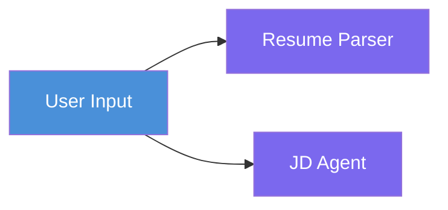
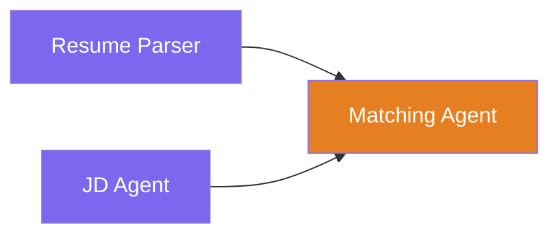
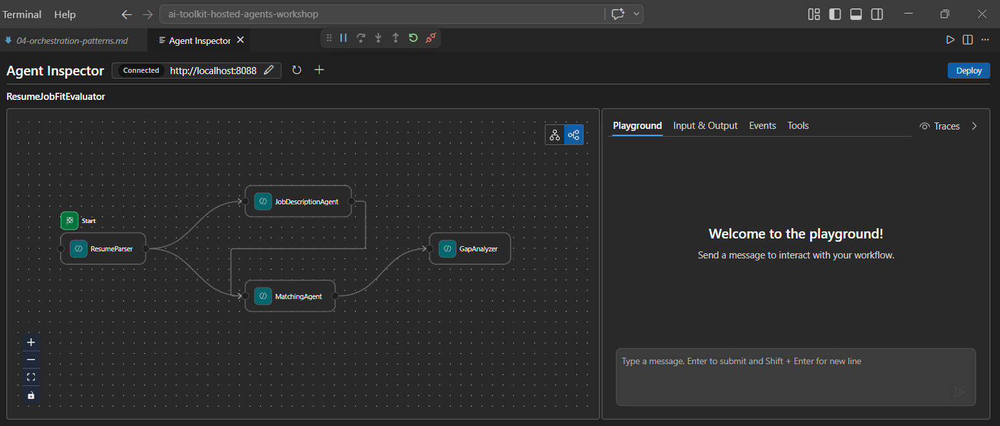
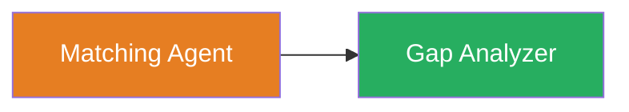
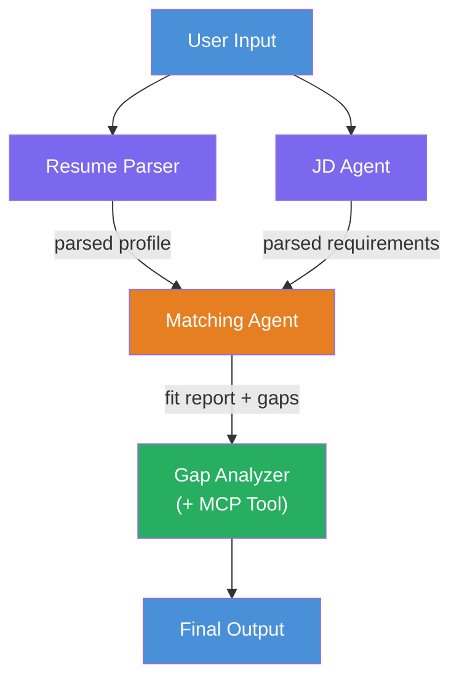
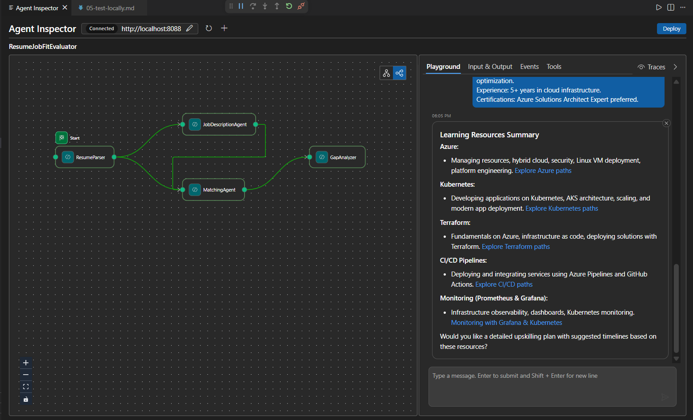

# Module 4 - Orchestration Patterns

In this module, you explore the orchestration patterns used in the Resume Job Fit Evaluator and learn how to read, modify, and extend the workflow graph. Understanding these patterns is essential for debugging data flow issues and building your own [multi-agent workflows](https://learn.microsoft.com/agent-framework/workflows/).

---

## Pattern 1: Fan-out (parallel split)

The first pattern in the workflow is **fan-out** - a single input is sent to multiple agents simultaneously.



In code, this happens because `resume_parser` is the `start_executor` - it receives the user message first. Then, because both `jd_agent` and `matching_agent` have edges from `resume_parser`, the framework routes `resume_parser`'s output to both agents:

```python
.add_edge(resume_parser, jd_agent)         # ResumeParser output → JD Agent
.add_edge(resume_parser, matching_agent)   # ResumeParser output → MatchingAgent
```

**Why this works:** ResumeParser and JD Agent process different aspects of the same input. Running them in parallel reduces total latency compared to running them sequentially.

### When to use fan-out

| Use case | Example |
|----------|---------|
| Independent subtasks | Parsing resume vs. parsing JD |
| Redundancy / voting | Two agents analyze the same data, a third picks the best answer |
| Multi-format output | One agent generates text, another generates structured JSON |

---

## Pattern 2: Fan-in (aggregation)

The second pattern is **fan-in** - multiple agent outputs are collected and sent to a single downstream agent.



In code:

```python
.add_edge(resume_parser, matching_agent)   # ResumeParser output → MatchingAgent
.add_edge(jd_agent, matching_agent)        # JD Agent output → MatchingAgent
```

**Key behavior:** When an agent has **two or more incoming edges**, the framework automatically waits for **all** upstream agents to complete before running the downstream agent. MatchingAgent does not start until both ResumeParser and JD Agent have finished.

### What MatchingAgent receives

The framework concatenates the outputs from all upstream agents. MatchingAgent's input looks like:

```
[ResumeParser output]
---
Candidate Profile:
  Name: Jane Doe
  Technical Skills: Python, Azure, Kubernetes, ...
  ...

[JobDescriptionAgent output]
---
Role Overview: Senior Cloud Engineer
Required Skills: Python, Azure, Terraform, ...
...
```

> **Note:** The exact concatenation format depends on the framework version. The agent's instructions should be written to handle both structured and unstructured upstream output.



---

## Pattern 3: Sequential chain

The third pattern is **sequential chaining** - one agent's output feeds directly into the next.



In code:

```python
.add_edge(matching_agent, gap_analyzer)    # MatchingAgent output → GapAnalyzer
```

This is the simplest pattern. GapAnalyzer receives MatchingAgent's fit score, matched/missing skills, and gaps. It then calls the [MCP tool](https://learn.microsoft.com/azure/foundry/agents/how-to/tools/model-context-protocol) for each gap to fetch Microsoft Learn resources.

---

## The complete graph

Combining all three patterns produces the full workflow:



### Execution timeline

```mermaid
gantt
    title Agent Execution Timeline
    dateFormat X
    axisFormat %s

    section Parallel
    Resume Parser       :rp, 0, 3
    JD Agent            :jd, 0, 2

    section Sequential
    Matching Agent      :ma, 3, 5
    Gap Analyzer        :ga, 5, 9
```



> The total wall-clock time is approximately `max(ResumeParser, JD Agent) + MatchingAgent + GapAnalyzer`. GapAnalyzer is typically the slowest because it makes multiple MCP tool calls (one per gap).

---

## Reading the WorkflowBuilder code

Here is the complete `create_workflow()` function from `main.py`, annotated:

```python
def create_workflow(resume_parser, jd_agent, matching_agent, gap_analyzer):
    workflow = (
        WorkflowBuilder(
            name="ResumeJobFitEvaluator",

            # The first agent to receive user input
            start_executor=resume_parser,

            # The agent(s) whose output becomes the final response
            output_executors=[gap_analyzer],
        )
        # Fan-out: ResumeParser output goes to both JD Agent and MatchingAgent
        .add_edge(resume_parser, jd_agent)
        .add_edge(resume_parser, matching_agent)

        # Fan-in: MatchingAgent waits for both ResumeParser and JD Agent
        .add_edge(jd_agent, matching_agent)

        # Sequential: MatchingAgent output feeds GapAnalyzer
        .add_edge(matching_agent, gap_analyzer)

        .build()
    )
    return workflow.as_agent()
```

### Edge summary table

| # | Edge | Pattern | Effect |
|---|------|---------|--------|
| 1 | `resume_parser → jd_agent` | Fan-out | JD Agent receives ResumeParser's output (plus the original user input) |
| 2 | `resume_parser → matching_agent` | Fan-out | MatchingAgent receives ResumeParser's output |
| 3 | `jd_agent → matching_agent` | Fan-in | MatchingAgent also receives JD Agent's output (waits for both) |
| 4 | `matching_agent → gap_analyzer` | Sequential | GapAnalyzer receives fit report + gap list |

---

## Modifying the graph

### Adding a new agent

To add a fifth agent (e.g., an **InterviewPrepAgent** that generates interview questions based on the gap analysis):

```python
# 1. Define instructions
INTERVIEW_PREP_INSTRUCTIONS = """\
You are the Interview Prep Agent.
Given a gap analysis and fit report, generate 10 targeted interview questions
the candidate should prepare for.
"""

# 2. Create the agent (inside the async with block)
AzureAIAgentClient(
    project_endpoint=PROJECT_ENDPOINT,
    model_deployment_name=MODEL_DEPLOYMENT_NAME,
    credential=credential,
).as_agent(
    name="InterviewPrepAgent",
    instructions=INTERVIEW_PREP_INSTRUCTIONS,
) as interview_prep,

# 3. Add edges in create_workflow()
.add_edge(matching_agent, interview_prep)   # receives fit report
.add_edge(gap_analyzer, interview_prep)     # also receives gap cards

# 4. Update output_executors
output_executors=[interview_prep],  # now the final agent
```

### Changing execution order

To make JD Agent run **after** ResumeParser (sequential instead of parallel):

```python
# Remove: .add_edge(resume_parser, jd_agent)  ← already exists, keep it
# Remove the implicit parallel by NOT having jd_agent receive user input directly
# The start_executor sends to resume_parser first, and jd_agent only gets
# resume_parser's output via the edge. This makes them sequential.
```

> **Important:** The `start_executor` is the only agent that receives the raw user input. All other agents receive output from their upstream edges. If you want an agent to also receive the raw user input, it must have an edge from the `start_executor`.

---

## Common graph mistakes

| Mistake | Symptom | Fix |
|---------|---------|-----|
| Missing edge to `output_executors` | Agent runs but output is empty | Ensure there's a path from `start_executor` to every agent in `output_executors` |
| Circular dependency | Infinite loop or timeout | Check that no agent feeds back into an upstream agent |
| Agent in `output_executors` with no incoming edge | Empty output | Add at least one `add_edge(source, that_agent)` |
| Multiple `output_executors` without fan-in | Output contains only one agent's response | Use a single output agent that aggregates, or accept multiple outputs |
| Missing `start_executor` | `ValueError` at build time | Always specify `start_executor` in `WorkflowBuilder()` |

---

## Debugging the graph

### Using Agent Inspector

1. Start the agent locally (F5 or terminal - see [Module 5](05-test-locally.md)).
2. Open Agent Inspector (`Ctrl+Shift+P` → **Foundry Toolkit: Open Agent Inspector**).
3. Send a test message.
4. In the Inspector's response panel, look for the **streaming output** - it shows each agent's contribution in sequence.



### Using logging

Add logging to `main.py` to trace data flow:

```python
import logging
logger = logging.getLogger("resume-job-fit")

# In create_workflow(), after building:
logger.info("Workflow graph built with edges: RP→JD, RP→MA, JD→MA, MA→GA")
```

The server logs show agent execution order and MCP tool calls:

```
INFO:resume-job-fit:Starting Resume -> Job Fit Evaluator HTTP server...
INFO:resume-job-fit:Server running on http://localhost:8088
INFO:agent_framework:Executing agent: ResumeParser
INFO:agent_framework:Executing agent: JobDescriptionAgent
INFO:agent_framework:Waiting for upstream agents: ResumeParser, JobDescriptionAgent
INFO:agent_framework:Executing agent: MatchingAgent
INFO:agent_framework:Executing agent: GapAnalyzer
INFO:agent_framework:Tool call: search_microsoft_learn_for_plan(skill="Kubernetes")
POST https://learn.microsoft.com/api/mcp → 200
INFO:agent_framework:Tool call: search_microsoft_learn_for_plan(skill="Terraform")
POST https://learn.microsoft.com/api/mcp → 200
```

---

### Checkpoint

- [ ] You can identify the three orchestration patterns in the workflow: fan-out, fan-in, and sequential chain
- [ ] You understand that agents with multiple incoming edges wait for all upstream agents to complete
- [ ] You can read the `WorkflowBuilder` code and map each `add_edge()` call to the visual graph
- [ ] You understand the execution timeline: parallel agents run first, then aggregation, then sequential
- [ ] You know how to add a new agent to the graph (define instructions, create agent, add edges, update output)
- [ ] You can identify common graph mistakes and their symptoms

---

**Previous:** [03 - Configure Agents & Environment](03-configure-agents.md) · **Next:** [05 - Test Locally →](05-test-locally.md)
