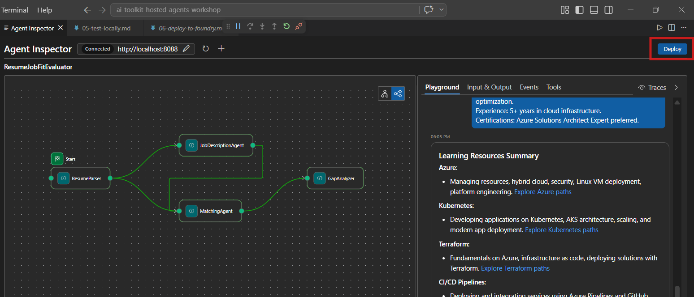
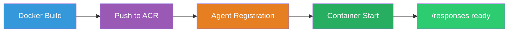
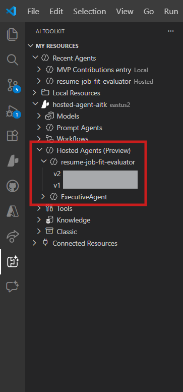

# Module 6 - Deploy to Foundry Agent Service

In this module, you deploy your locally-tested multi-agent workflow to [Microsoft Foundry](https://learn.microsoft.com/azure/foundry/agents/concepts/hosted-agents) as a **Hosted Agent**. The deployment process builds a Docker container image, pushes it to [Azure Container Registry (ACR)](https://learn.microsoft.com/azure/container-registry/container-registry-intro), and creates a hosted agent version in [Foundry Agent Service](https://learn.microsoft.com/azure/foundry/agents/how-to/publish-agent).

> **Key difference from Lab 01:** The deployment process is identical. Foundry treats your multi-agent workflow as a single hosted agent - the complexity is inside the container, but the deployment surface is the same `/responses` endpoint.

---

## Prerequisites check

Before deploying, verify every item below:

1. **Agent passes local smoke tests:**
   - You completed all 3 tests in [Module 5](05-test-locally.md) and the workflow produced complete output with gap cards and Microsoft Learn URLs.

2. **You have [Azure AI User](https://learn.microsoft.com/azure/foundry/concepts/rbac-foundry) role:**
   - Assigned in [Lab 01, Module 2](../../lab01-single-agent/docs/02-create-foundry-project.md). Verify:
   - [Azure Portal](https://portal.azure.com) → your Foundry **project** resource → **Access control (IAM)** → **Role assignments** → confirm **[Azure AI User](https://aka.ms/foundry-ext-project-role)** is listed for your account.

3. **You're signed into Azure in VS Code:**
   - Check the Accounts icon in the bottom-left of VS Code. Your account name should be visible.

4. **`agent.yaml` has correct values:**
   - Open `PersonalCareerCopilot/agent.yaml` and verify:
     ```yaml
     environment_variables:
       - name: PROJECT_ENDPOINT
         value: ${PROJECT_ENDPOINT}
       - name: MODEL_DEPLOYMENT_NAME
         value: ${MODEL_DEPLOYMENT_NAME}
     ```
   - These must match the env vars your `main.py` reads.

5. **`requirements.txt` has correct versions:**
   ```
   agent-framework-azure-ai==1.0.0rc3
   agent-framework-core==1.0.0rc3
   azure-ai-agentserver-agentframework==1.0.0b16
   azure-ai-agentserver-core==1.0.0b16
   debugpy
   agent-dev-cli --pre
   ```

---

## Step 1: Start the deployment

### Option A: Deploy from the Agent Inspector (recommended)

If the agent is running via F5 with the Agent Inspector open:

1. Look at the **top-right corner** of the Agent Inspector panel.
2. Click the **Deploy** button (cloud icon with an up arrow ↑).
3. The deployment wizard opens.



### Option B: Deploy from the Command Palette

1. Press `Ctrl+Shift+P` to open the **Command Palette**.
2. Type: **Microsoft Foundry: Deploy Hosted Agent** and select it.
3. The deployment wizard opens.

---

## Step 2: Configure the deployment

### 2.1 Select the target project

1. A dropdown shows your Foundry projects.
2. Select the project you used throughout the workshop (e.g., `workshop-agents`).

### 2.2 Select the container agent file

1. You'll be asked to select the agent entry point.
2. Navigate to `workshop/lab02-multi-agent/PersonalCareerCopilot/` and choose **`main.py`**.

### 2.3 Configure resources

| Setting | Recommended value | Notes |
|---------|------------------|-------|
| **CPU** | `0.25` | Default. Multi-agent workflows don't need more CPU because model calls are I/O-bound |
| **Memory** | `0.5Gi` | Default. Increase to `1Gi` if you add large data processing tools |

---

## Step 3: Confirm and deploy

1. The wizard shows a deployment summary.
2. Review and click **Confirm and Deploy**.
3. Watch the progress in VS Code.

### What happens during deployment

Watch the VS Code **Output** panel (select "Microsoft Foundry" dropdown):



1. **Docker build** - Builds the container from your `Dockerfile`:
   ```
   Step 1/6 : FROM python:3.14-slim
   Step 2/6 : WORKDIR /app
   ...
   Successfully built abc123def456
   ```

2. **Docker push** - Pushes the image to ACR (1-3 minutes on first deploy).

3. **Agent registration** - Foundry creates a hosted agent using `agent.yaml` metadata. The agent name is `resume-job-fit-evaluator`.

4. **Container start** - The container starts in Foundry's managed infrastructure with a system-managed identity.

> **First deployment is slower** (Docker pushes all layers). Subsequent deployments reuse cached layers and are faster.

### Multi-agent specific notes

- **All four agents are inside one container.** Foundry sees a single hosted agent. The WorkflowBuilder graph runs internally.
- **MCP calls go outbound.** The container needs internet access to reach `https://learn.microsoft.com/api/mcp`. Foundry's managed infrastructure provides this by default.
- **[Managed Identity](https://learn.microsoft.com/python/api/overview/azure/identity-readme#managed-identity-support).** In the hosted environment, `get_credential()` in `main.py` returns `ManagedIdentityCredential()` (because `MSI_ENDPOINT` is set). This is automatic.

---

## Step 4: Verify the deployment status

1. Open the **Microsoft Foundry** sidebar (click the Foundry icon in the Activity Bar).
2. Expand **Hosted Agents (Preview)** under your project.
3. Find **resume-job-fit-evaluator** (or your agent name).
4. Click on the agent name → expand versions (e.g., `v1`).
5. Click on the version → check **Container Details** → **Status**:



| Status | Meaning |
|--------|---------|
| **Started** / **Running** | Container is running, agent is ready |
| **Pending** | Container is starting (wait 30-60 seconds) |
| **Failed** | Container failed to start (check logs - see below) |

> **Multi-agent startup takes longer** than single-agent because the container creates 4 agent instances on startup. "Pending" for up to 2 minutes is normal.

---

## Common deployment errors and fixes

### Error 1: Permission denied - `agents/write`

```
Error: lacks the required data action 
Microsoft.CognitiveServices/accounts/AIServices/agents/write
```

**Fix:** Assign **[Azure AI User](https://learn.microsoft.com/azure/foundry/concepts/rbac-foundry)** role at the **project** level. See [Module 8 - Troubleshooting](08-troubleshooting.md) for step-by-step instructions.

### Error 2: Docker not running

```
Error: Docker build failed / Cannot connect to Docker daemon
```

**Fix:**
1. Start Docker Desktop.
2. Wait for "Docker Desktop is running".
3. Verify: `docker info`
4. **Windows:** Ensure WSL 2 backend is enabled in Docker Desktop settings.
5. Retry.

### Error 3: pip install fails during Docker build

```
Error: Could not find a version that satisfies the requirement agent-dev-cli
```

**Fix:** The `--pre` flag in `requirements.txt` is handled differently in Docker. Ensure your `requirements.txt` has:
```
agent-dev-cli --pre
```

If Docker still fails, create a `pip.conf` or pass `--pre` via a build argument. See [Module 8](08-troubleshooting.md).

### Error 4: MCP tool fails in hosted agent

If the Gap Analyzer stops producing Microsoft Learn URLs after deployment:

**Root cause:** Network policy may block outbound HTTPS from the container.

**Fix:**
1. This is usually not an issue with Foundry's default configuration.
2. If it occurs, check if the Foundry project's virtual network has an NSG blocking outbound HTTPS.
3. The MCP tool has built-in fallback URLs, so the agent will still produce output (without live URLs).

---

### Checkpoint

- [ ] Deployment command completed without errors in VS Code
- [ ] Agent appears under **Hosted Agents (Preview)** in the Foundry sidebar
- [ ] Agent name is `resume-job-fit-evaluator` (or your chosen name)
- [ ] Container status shows **Started** or **Running**
- [ ] (If errors) You identified the error, applied the fix, and redeployed successfully

---

**Previous:** [05 - Test Locally](05-test-locally.md) · **Next:** [07 - Verify in Playground →](07-verify-in-playground.md)
